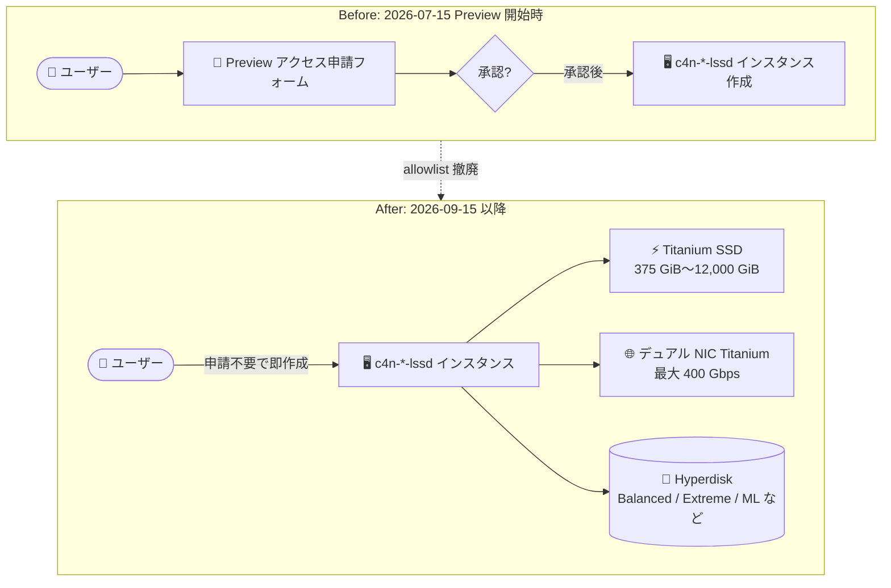

# Compute Engine: ネットワーク最適化 C4N マシンタイプ (Titanium SSD 375GiB〜12,000GiB 搭載) が Preview で利用可能

**リリース日**: 2026-09-15

**サービス**: Compute Engine

**機能**: ネットワーク最適化 C4N マシンタイプ (Titanium SSD 375GiB〜12,000GiB 搭載)

**ステータス**: Preview

📊 [このアップデートのインフォグラフィックを見る](https://takech9203.github.io/google-cloud-news-summary/20260915-compute-engine-c4n-titanium-ssd.html)

## 概要

ネットワーク最適化マシンシリーズ C4N において、375 GiB から 12,000 GiB の Titanium SSD を搭載したマシンタイプ (`-lssd` 系) が Public Preview として利用可能になりました。今回のアップデートにより、**許可リスト (allowlist) の承認申請が不要**となり、すべてのユーザーがすぐに C4N + Titanium SSD インスタンスを作成できます。

C4N は第 5 世代 Intel Xeon スケーラブルプロセッサ (Emerald Rapids) と高周波数 DDR5 メモリ、デュアル NIC の Titanium オフロードアーキテクチャを採用したマシンシリーズです。最大 400 Gbps の VM 間ネットワーク帯域幅、最大 95 MPPS のパケット処理性能を実現しており、ネットワーク I/O が性能を左右するワークロード向けに設計されています。ここに Titanium SSD による超低レイテンシのローカルストレージが加わることで、高性能データベース、大規模データ分析、分散ファイルシステムなど、ネットワークとストレージの両方に高い性能を要求するワークロードに適した選択肢となります。

対象ユーザーは、ネットワークアプライアンス、高性能データベース、Telco 5G UPF、大規模データ分析、分散ファイルシステムなどの I/O バウンドなワークロードを運用するエンジニア・アーキテクトです。

**アップデート前の課題**

- 2026 年 7 月 15 日の Preview 開始時点では、C4N マシンタイプで Titanium SSD (Local SSD) を利用するには、フォームから Preview アクセスをリクエストし承認を得る必要があった
- 承認待ちにより、検証や PoC をすぐに開始できなかった
- C4N でローカルストレージが必要な場合、承認が下りるまで C4/C4D など他シリーズの `-lssd` マシンタイプで代替する必要があった

**アップデート後の改善**

- 許可リストの承認申請が不要になり、すべてのプロジェクトで即座に C4N の `-lssd` マシンタイプを作成できるようになった
- `c4n-standard-*-lssd` および `c4n-highmem-*-lssd` として、375 GiB (1 x 375 GiB) から 12,000 GiB (32 x 375 GiB) までの Titanium SSD 構成を選択可能になった
- 最大 400 Gbps のネットワーク帯域幅と Titanium SSD の高 IOPS・低レイテンシストレージを 1 台のインスタンスで組み合わせられるようになった

## アーキテクチャ図



Preview 開始当初はフォームからのアクセス申請と承認が必要でしたが、今回のアップデートで申請なしに Titanium SSD 搭載 C4N インスタンスを作成できるようになりました。

## サービスアップデートの詳細

### 主要機能

1. **Titanium SSD 搭載の `-lssd` マシンタイプ**
   - `c4n-standard-4-lssd` 〜 `c4n-standard-192-lssd`、`c4n-highmem-4-lssd` 〜 `c4n-highmem-192-lssd` が利用可能
   - 375 GiB 単位の Titanium SSD がマシンタイプに応じて 1〜32 台自動的にアタッチされる (合計 375 GiB〜12,000 GiB)
   - Titanium SSD は Titanium I/O オフロード処理を利用し、従来世代の Local SSD より高い IOPS・スループットと低レイテンシを提供

2. **許可リスト承認の撤廃**
   - 2026 年 7 月の Preview 開始時に必要だったアクセス申請 (フォーム経由) が不要に
   - Preview ステータスのまま、すべてのユーザーが利用可能

3. **C4N シリーズのネットワーク性能との組み合わせ**
   - VM 間ネットワーク帯域幅は最大 400 Gbps (192 vCPU、2 物理 NIC 構成時)
   - インターネット Egress は最大 200 Gbps、パケット処理性能は最大 95 MPPS (DPDK Pktgen 測定)
   - Tier_1 ネットワーキングなどのプレミアムアドオンなしでこの性能を利用可能

## 技術仕様

### C4N `-lssd` マシンタイプ一覧 (standard / highmem 共通の SSD 構成)

| マシンタイプ | vCPU | メモリ (standard / highmem) | Titanium SSD | 最大内部帯域幅 |
|------|------|------|------|------|
| c4n-*-4-lssd | 4 | 15 / 31 GB | 375 GiB (1 x 375 GiB) | 最大 30 Gbps |
| c4n-*-8-lssd | 8 | 30 / 62 GB | 375 GiB (1 x 375 GiB) | 最大 40 Gbps |
| c4n-*-16-lssd | 16 | 60 / 124 GB | 750 GiB (2 x 375 GiB) | 最大 50 Gbps |
| c4n-*-24-lssd | 24 | 90 / 186 GB | 1,500 GiB (4 x 375 GiB) | 50 Gbps |
| c4n-*-48-lssd | 48 | 180 / 372 GB | 3,000 GiB (8 x 375 GiB) | 100 Gbps |
| c4n-*-96-lssd | 96 | 360 / 744 GB | 6,000 GiB (16 x 375 GiB) | 200 Gbps |
| c4n-*-192-lssd | 192 | 720 / 1,488 GB | 12,000 GiB (32 x 375 GiB) | 400 Gbps |

※ 192 vCPU タイプでフルネットワークスループットを得るには、2 つ以上の vNIC をそれぞれ別の物理 NIC にアタッチする構成が必要です。

### Titanium SSD の性能上限 (C4N、375 GiB ディスク使用時)

| SSD 台数 | 合計容量 | 読み取り IOPS | 書き込み IOPS | 読み取りスループット | 書き込みスループット |
|------|------|------|------|------|------|
| 1 | 375 GiB | 150,000 | 75,000 | 625 MiB/s | 330 MiB/s |
| 4 | 1,500 GiB | 600,000 | 300,000 | 2,500 MiB/s | 1,320 MiB/s |
| 8 | 3,000 GiB | 1,200,000 | 600,000 | 5,000 MiB/s | 2,640 MiB/s |
| 16 | 6,000 GiB | 2,400,000 | 1,200,000 | 10,000 MiB/s | 5,280 MiB/s |
| 32 | 12,000 GiB | 4,800,000 | 2,400,000 | 20,000 MiB/s | 10,560 MiB/s |

### サポートされるディスクタイプ

C4N インスタンスは NVMe ディスクインターフェイスのみをサポートし、以下のブロックストレージを利用できます。

- Hyperdisk Balanced / Hyperdisk Balanced High Availability
- Hyperdisk Throughput / Hyperdisk Extreme / Hyperdisk ML
- Titanium SSD (Preview)

## 設定方法

### 前提条件

1. C4N マシンシリーズが利用可能なリージョン・ゾーンを選択していること
2. Preview 機能であることを理解した上で利用すること (Pre-GA Offerings Terms が適用される)

### 手順

#### ステップ 1: `-lssd` マシンタイプでインスタンスを作成

```bash
gcloud compute instances create my-c4n-instance \
    --zone=us-central1-a \
    --machine-type=c4n-standard-16-lssd \
    --image-family=debian-12 \
    --image-project=debian-cloud
```

`-lssd` マシンタイプを指定すると、マシンタイプに応じた台数の Titanium SSD が自動的にアタッチされます (この例では 2 x 375 GiB)。

#### ステップ 2: Titanium SSD のフォーマットとマウント

```bash
# NVMe デバイスの確認
lsblk

# フォーマット (例: 単一ディスクの場合)
sudo mkfs.ext4 -F /dev/nvme0n1
sudo mkdir -p /mnt/disks/local-ssd
sudo mount /dev/nvme0n1 /mnt/disks/local-ssd
```

Titanium SSD はインスタンス作成後に追加できないため、必要な容量のマシンタイプを最初に選択してください。

## メリット

### ビジネス面

- **導入リードタイムの短縮**: 許可リスト申請と承認待ちが不要になり、検証・本番導入をすぐに開始できる
- **コスト効率**: Tier_1 ネットワーキングのようなプレミアムアドオンなしで最高クラスのネットワーク性能とローカルストレージ性能を利用でき、CUD (確約利用割引)、Spot VM などの割引オプションにも対応

### 技術面

- **ネットワークとストレージの両立**: 最大 400 Gbps のネットワーク帯域幅と最大 480 万読み取り IOPS の Titanium SSD を 1 インスタンスで組み合わせ可能
- **Titanium オフロード**: ネットワーク・ストレージ管理を Titanium アダプタにオフロードすることで、アプリケーションが CPU リソースを最大限利用できる
- **CUD との親和性**: C4N の Titanium SSD をリソースベース CUD に含める場合、予約 (Reservation) のアタッチが不要

## デメリット・制約事項

### 制限事項

- Titanium SSD 搭載 C4N マシンタイプは Preview であり、GA の SLA は適用されない
- Titanium SSD はローカル (一時) ストレージであり、インスタンスの停止・終了時にデータが失われる。スナップショットやイメージによるバックアップも不可
- Local SSD データ保持機能 (停止・一時停止時のデータ保持、Preview) は Titanium SSD を使用するマシンタイプでは利用不可
- C4N は事前定義マシンタイプのみでカスタムマシンタイプは利用不可、GPU も利用不可
- SSD 容量はマシンタイプに固定で紐づくため、vCPU 数と独立に容量を選択できない

### 考慮すべき点

- 永続化が必要なデータは Hyperdisk に保存し、Titanium SSD はキャッシュ・スクラッチ・一時データ用途に限定する設計が必要
- インスタンス作成後に Titanium SSD を追加できないため、容量計画を事前に行う必要がある

## ユースケース

### ユースケース 1: ディスク常駐データ中心の高性能データベース

**シナリオ**: MySQL などの OLTP データベースで、データがメモリに収まらずディスク I/O がボトルネックになっている。レプリケーショントラフィックも大きく、ネットワーク帯域も必要。

**実装例**:
```bash
gcloud compute instances create mysql-primary \
    --zone=us-central1-a \
    --machine-type=c4n-highmem-48-lssd \
    --image-family=debian-12 \
    --image-project=debian-cloud
# Titanium SSD (8 x 375 GiB) を tempdir / キャッシュに、Hyperdisk をデータ永続化に使用
```

**効果**: 同サイズの C4 と比較して、データが主にディスク上にある場合の MySQL クエリ性能 (QPS) が 45% 向上 (Google 公表値)。

### ユースケース 2: 大規模データ分析・分散ファイルシステムのスクラッチ領域

**シナリオ**: 分散ファイルシステムや大規模データ分析基盤で、ノード間の大量データシャッフルと高速な一時ストレージが同時に必要。

**効果**: 最大 400 Gbps の VM 間帯域幅と最大 20 GiB/s の Titanium SSD 読み取りスループットにより、シャッフル・中間データ処理のボトルネックを解消。

## 料金

Titanium SSD の料金は、アタッチ先マシンシリーズの料金として VM インスタンス料金ページ (ネットワーク最適化) に掲載されます。Titanium SSD はアタッチしたインスタンスの稼働期間中、ディスクの総容量に対して課金されます。

C4N は以下の割引・消費オプションに対応しています。

- リソースベース確約利用割引 (CUD) / Flexible CUD
- Spot VM (Titanium SSD も Spot 割引価格が適用。起動後 1 分以内のプリエンプションでは SSD 課金なし)
- 予約 (Reservations)、単一テナンシー、プレイスメントポリシー

具体的な単価は [ネットワーク最適化 VM の料金ページ](https://cloud.google.com/products/compute/pricing/network-optimized) を参照してください。

## 利用可能リージョン

利用可能なリージョン・ゾーンは公式ドキュメントの [C4N machine series](https://docs.cloud.google.com/compute/docs/network-optimized-machines#c4n_series) および [リージョンとゾーン](https://docs.cloud.google.com/compute/docs/regions-zones) を参照してください。

## 関連サービス・機能

- **Google Cloud Hyperdisk**: C4N の永続ブロックストレージ。Hyperdisk Extreme との組み合わせで最大 25 GiB/s・約 100 万 IOPS のブロックストレージ性能を実現
- **Titanium**: Google 独自の I/O オフロード基盤。C4N のデュアル 200G NIC とTitanium SSD の性能・セキュリティを支える
- **C4 / C4A / C4D / Z3 / H4D マシンシリーズ**: 同じく Titanium SSD をサポートするマシンシリーズ。ネットワーク性能要件が低い場合の代替候補
- **確約利用割引 (CUD)**: C4N の Titanium SSD は予約アタッチなしでリソースベース CUD に含められる

## 参考リンク

- 📊 [インフォグラフィック](https://takech9203.github.io/google-cloud-news-summary/20260915-compute-engine-c4n-titanium-ssd.html)
- [公式リリースノート](https://docs.cloud.google.com/release-notes#September_15_2026)
- [C4N machine series ドキュメント](https://docs.cloud.google.com/compute/docs/network-optimized-machines#c4n_series)
- [Local SSD (Titanium SSD) ドキュメント](https://docs.cloud.google.com/compute/docs/disks/local-ssd)
- [料金ページ (ネットワーク最適化 VM)](https://cloud.google.com/products/compute/pricing/network-optimized)

## まとめ

C4N マシンシリーズの Titanium SSD 搭載マシンタイプが許可リスト不要の Public Preview となり、最大 400 Gbps のネットワーク帯域幅と最大 12,000 GiB・480 万 IOPS のローカルストレージを誰でもすぐに組み合わせて利用できるようになりました。ディスク I/O とネットワーク I/O の両方がボトルネックになる高性能データベースや大規模データ分析基盤を運用している場合は、`c4n-*-lssd` マシンタイプでの性能検証を開始することを推奨します。Preview 機能のため、本番導入時は SLA 適用外である点とローカル SSD の揮発性に留意してください。

---

**タグ**: Compute Engine, C4N, Titanium SSD, Local SSD, ネットワーク最適化, Preview, Hyperdisk, インフラストラクチャ
