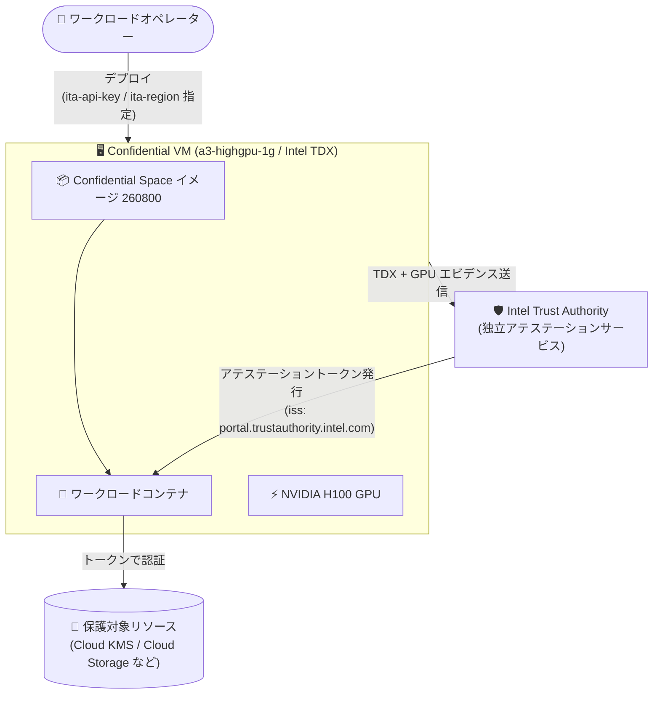

# Confidential Space: H100 GPU (a3-highgpu-1g) での Intel Trust Authority (ITA) アテステーションが GA

**リリース日**: 2026-09-15

**サービス**: Confidential Space

**機能**: H100 GPU (a3-highgpu-1g マシンファミリー) での Intel Trust Authority (ITA) アテステーション対応

**ステータス**: GA (一般提供)

📊 [このアップデートのインフォグラフィックを見る](https://takech9203.github.io/google-cloud-news-summary/20260915-confidential-space-h100-ita-attestation-ga.html)

## 概要

新しい Confidential Space イメージ (260800) がリリースされ、NVIDIA H100 GPU を搭載した `a3-highgpu-1g` マシンファミリー上の Confidential Space で、Intel Trust Authority (ITA) をアテステーション (構成証明) サービスとして利用する構成が一般提供 (GA) となりました。

Confidential Space は、複数の組織が互いにデータを開示することなく機密データを共同処理できる TEE (Trusted Execution Environment) です。ワークロード (コンテナ)、アテステーションサービス、保護対象リソースの 3 つのコンポーネントで構成され、アテステーションプロセスによって「承認されたワークロードだけ」が機密リソースにアクセスできることを保証します。今回の GA により、H100 GPU を使った機密 AI/ML ワークロードにおいて、Google Cloud Attestation に加えて、Google から独立した第三者検証サービスである Intel Trust Authority で環境の完全性を検証できるようになりました。ITA は Intel TDX ベースの VM を検証対象とし、H100 GPU が接続されている場合は GPU のエビデンス (ドライバー、VBIOS など) も併せて検証します。

Google (クラウド事業者) 自身を信頼の根拠から切り離した独立検証を必要とする、金融・医療・公共分野などの高い規制要件を持つ組織が、GPU を用いた機密コンピューティングを本番運用できるようになる点が本アップデートの価値です。

**アップデート前の課題**

- H100 GPU 対応の Confidential Space (2026 年 4 月 29 日にイメージ 260400 で GA) では、アテステーションサービスとして Google Cloud Attestation を利用する構成が中心だった
- Intel Trust Authority 対応は 2026 年 5 月 20 日のイメージ 260500 で導入されたが、H100 GPU との組み合わせは GA ではなく、本番ワークロードでの利用には制約があった
- クラウド事業者 (Google) から独立した第三者による GPU 環境の検証を本番要件とする組織は、GPU 付き Confidential Space の採用が難しかった

**アップデート後の改善**

- H100 GPU 搭載の `a3-highgpu-1g` 上の Confidential Space で、ITA アテステーションが GA となり、本番ワークロードで利用可能になった
- ITA が Intel TDX (CPU 側) のエビデンスに加えて、接続された H100 GPU のエビデンスも検証するため、CPU から GPU までのエンドツーエンドの環境検証が独立した検証者によって可能になった
- 新イメージ 260800 の提供により、最新の Confidential Space 環境で本構成を利用できる

## アーキテクチャ図



H100 GPU 付き Confidential VM 上で動作するワークロードのエビデンス (Intel TDX と GPU の状態) を Intel Trust Authority が検証し、発行されたアテステーショントークンを使ってワークロードが保護対象リソースにアクセスするフローです。

## サービスアップデートの詳細

### 主要機能

1. **H100 GPU + ITA アテステーションの GA**
   - `a3-highgpu-1g` マシンファミリー (NVIDIA H100 GPU、Intel TDX) 上の Confidential Space で、Intel Trust Authority による構成証明が一般提供に
   - ITA は Confidential Space 環境のアイデンティティ、ハードウェア状態、ソフトウェア状態を Google から独立して検証する

2. **GPU エビデンスの検証**
   - ITA は Intel TDX VM インスタンスを検証対象とし、H100 GPU が接続されている場合は GPU のエビデンスも併せて検証する
   - アテステーショントークンには `nvidia_gpu` クレーム (GPU の Confidential Computing モード、ドライバーバージョン、VBIOS バージョンなど) が含まれる

3. **新しい Confidential Space イメージ (260800)**
   - 本構成をサポートする最新の Confidential Space イメージが利用可能

### アテステーションサービスの選択肢

| アテステーションサービス | 対応技術 | 実行リージョン |
|------|------|------|
| Google Cloud Attestation | AMD SEV / Intel TDX | ワークロードと同じリージョン |
| Intel Trust Authority | Intel TDX (H100 GPU はオプション) | ユーザーが指定する ITA リージョン (US / Europe) |

## 技術仕様

### ITA 利用時のメタデータ変数

Confidential Space で ITA をアテステーションサービスとして使う場合、VM 作成時に以下のメタデータ変数を指定します。

| メタデータ変数 | 説明 |
|------|------|
| `ita-api-key` | ITA 利用時に必須。Intel Trust Authority の API キーを設定する (Intel のポータルで作成) |
| `ita-region` | ITA 利用時に必須。ITA を実行するリージョン。US: `https://api.trustauthority.intel.com`、Europe: `https://api.eu.trustauthority.intel.com` |
| `tee-image-reference` | 必須。ワークロードコンテナイメージの場所 |

### アテステーショントークンの主なクレーム

ITA が発行するトークンの発行者 (`iss`) は `https://portal.trustauthority.intel.com` です (Google Cloud Attestation の場合は `https://confidentialcomputing.googleapis.com`)。

GPU 関連の `nvidia_gpu` クレームには以下が含まれます。

| クレーム | 説明 |
|------|------|
| `cc_feature` | GPU がサポートする Confidential Computing 方式。Confidential Space ではシングル GPU パススルー (SPT) のみサポートのため常に `SPT` |
| `cc_mode` | GPU の Confidential Computing 状態 (`ON` / `OFF` / `DEVTOOLS`)。`ON` は H100 のハードウェア・ファームウェア・ソフトウェアで機密コンピューティング機能が完全に有効 |
| `gpus[].hwmodel` | GPU アーキテクチャ。H100 のみサポートのため常に `GCP_NVIDIA_H100` |
| `gpus[].driver_version` | Confidential VM 上で動作する NVIDIA ドライバーバージョン |
| `gpus[].vbios_version` | 検証済みの GPU VBIOS バージョン |

### 保護対象リソース側のアサーション例

データ協力者は、WIF (Workload Identity Federation) の属性条件などで GPU の状態を検証できます。

```
# GPU の Confidential Computing モードが有効であることを検証
assertion.submods.nvidia_gpu.cc_mode == "ON"

# H100 GPU 上で動作していることを検証
assertion.submods.nvidia_gpu.gpus[0].hwmodel == "GCP_NVIDIA_H100"

# Intel TDX 上で動作していることを検証
assertion.hwmodel == "INTEL_TDX"
```

### a3-highgpu-1g の Confidential VM としての仕様

| 項目 | 詳細 |
|------|------|
| マシンタイプ | `a3-highgpu-1g` (A3 High) |
| GPU | NVIDIA H100 |
| Confidential Computing 技術 | Intel TDX |
| プロビジョニングモデル | Spot / Flex-start (Confidential VM with GPU のドキュメントに記載) |

## 設定方法

### 前提条件

1. Intel Trust Authority の API キーを作成しておく (Intel のドキュメントに手順が記載)
2. ワークロードコンテナイメージを Artifact Registry などに用意する
3. 十分な GPU クォータを確保する

### 手順 (メタデータ変数の指定例)

Confidential Space の VM 作成時に、ITA 用のメタデータ変数を指定します。

```bash
# ITA をアテステーションサービスとして使う場合のメタデータ例
--metadata="^~^tee-image-reference=us-docker.pkg.dev/PROJECT_ID/REPOSITORY/WORKLOAD:latest\
~ita-api-key=YOUR_ITA_API_KEY\
~ita-region=https://api.trustauthority.intel.com"
```

詳細な手順は [ワークロードのデプロイに関するドキュメント](https://docs.cloud.google.com/confidential-computing/confidential-space/docs/deploy-workloads) を参照してください。

## メリット

### ビジネス面

- **独立した第三者検証による信頼性向上**: クラウド事業者 (Google) から独立した Intel のアテステーションサービスで環境を検証できるため、「クラウド事業者自身を検証者に含めない」ことを求める規制・監査要件に対応しやすい
- **機密 AI ワークロードの本番採用**: GPU 環境 + 独立検証の組み合わせが GA となったことで、PII・PHI・ML モデルなどの機密データを扱う AI/ML の共同処理を本番環境で構築できる

### 技術面

- **CPU から GPU までのエンドツーエンド検証**: Intel TDX のエビデンスに加え、H100 GPU のドライバー・VBIOS などのエビデンスも ITA が検証する
- **アテステーション結果に基づくアクセス制御**: `nvidia_gpu.cc_mode == "ON"` などのアサーションにより、GPU の機密コンピューティング機能が有効な環境にのみ機密リソースへのアクセスを許可できる

## デメリット・制約事項

### 制限事項

- ITA がサポートするのは Intel TDX VM インスタンスのみ (AMD SEV ベースの環境は Google Cloud Attestation を使用)
- Confidential Space の GPU サポートはシングル GPU パススルー (SPT) モードのみで、対応 GPU は NVIDIA H100 のみ (`a3-highgpu-1g` は GPU 1 基構成)
- ITA のリージョンは US と Europe の 2 つから選択する

### 考慮すべき点

- ITA の利用には Intel Trust Authority の API キーが必要で、Intel 側でのアカウント・キー管理が発生する
- Google Cloud Attestation はワークロードと同一リージョンで実行されるのに対し、ITA はユーザーが指定した ITA リージョンで実行されるため、検証トラフィックの経路・所在が異なる点を設計時に考慮する
- 過去の既知の問題として、H100 GPU 接続時に GPU ドライバーインストールエラーが発生するケースが報告されていた (2026 年 5 月 4 日のリリースノート。回避策は Confidential VM の再起動)

## ユースケース

### ユースケース 1: 複数組織による機密データでの AI モデル推論・学習

**シナリオ**: 金融機関や医療機関など複数の組織が、互いに生データを開示することなく、H100 GPU 上で共同の ML 推論・学習ワークロードを実行する。各データ所有者は、Google から独立した ITA の検証結果に基づいてのみ自組織のデータ復号キー (Cloud KMS) へのアクセスを許可したい。

**実装例**:
```
# データ所有者側の WIF 属性条件 (イメージ + GPU 状態 + 検証者を確認)
assertion.submods.container.image_reference == "us-docker.pkg.dev/.../workload:latest" &&
assertion.submods.nvidia_gpu.cc_mode == "ON" &&
assertion.submods.nvidia_gpu.gpus[0].hwmodel == "GCP_NVIDIA_H100"
```

**効果**: 承認済みワークロードが、機密コンピューティング機能が有効な H100 GPU 環境で動作していることを独立検証者経由で確認したうえで、機密データの処理を許可できる。

### ユースケース 2: クラウド事業者非依存の検証を求める規制対応

**シナリオ**: 規制業種の企業が、機密 AI ワークロードの実行環境の完全性検証を「クラウド事業者自身に依存しない形」で行うことをセキュリティポリシーで義務付けている。

**効果**: Intel Trust Authority という Google から独立した検証サービスを利用することで、クラウド事業者を信頼のルートから分離した構成でポリシー要件を満たしつつ、Google Cloud 上の H100 GPU を活用できる。

## 料金

Confidential Space 自体のイメージに追加料金はなく、基盤となる Confidential VM (a3-highgpu-1g) の利用料金が発生します。詳細は公式の料金ページを参照してください。

- [Confidential VM の料金](https://docs.cloud.google.com/confidential-computing/confidential-vm/pricing)

なお、Intel Trust Authority は Intel が提供するサービスであり、利用には Intel Trust Authority の API キーが必要です。

## 関連サービス・機能

- **Confidential VM**: Confidential Space の基盤。`a3-highgpu-1g` は Intel TDX + NVIDIA H100 の構成で、ハードウェア分離とリモートアテステーションを提供する
- **Google Cloud Attestation**: Google が提供するアテステーションサービス。AMD SEV / Intel TDX に対応し、ITA の代替として利用できる
- **Cloud KMS / Cloud Storage**: 保護対象リソースの代表例。アテステーショントークンの検証結果に基づいてワークロードにアクセスを許可する
- **Workload Identity Federation (IAM)**: アテステーションのアサーション (イメージ、GPU 状態など) を属性条件として、機密リソースへのアクセスを制御する

## 参考リンク

- 📊 [インフォグラフィック](https://takech9203.github.io/google-cloud-news-summary/20260915-confidential-space-h100-ita-attestation-ga.html)
- [公式リリースノート](https://docs.cloud.google.com/release-notes#September_15_2026)
- [Confidential Space リリースノート](https://docs.cloud.google.com/confidential-computing/confidential-space/docs/release-notes)
- [Confidential Space の概要](https://docs.cloud.google.com/confidential-computing/confidential-space/docs/confidential-space-overview)
- [ワークロードのデプロイ (メタデータ変数)](https://docs.cloud.google.com/confidential-computing/confidential-space/docs/deploy-workloads)
- [アテステーショントークンのクレーム](https://docs.cloud.google.com/confidential-computing/confidential-space/docs/reference/token-claims)
- [アテステーションのアサーション](https://docs.cloud.google.com/confidential-computing/confidential-space/docs/reference/attestation-assertions)
- [GPU 付き Confidential VM インスタンスの作成](https://docs.cloud.google.com/confidential-computing/confidential-vm/docs/create-a-confidential-vm-instance-with-gpu)
- [料金ページ](https://docs.cloud.google.com/confidential-computing/confidential-vm/pricing)

## まとめ

H100 GPU 搭載の Confidential Space で Intel Trust Authority による独立アテステーションが GA となり、CPU (Intel TDX) から GPU までをクラウド事業者に依存しない第三者が検証する機密 AI 基盤を本番運用できるようになりました。規制要件により独立検証が必要な組織や、複数組織での機密データ共同処理に GPU を使いたい組織は、最新イメージ 260800 と ITA メタデータ変数 (`ita-api-key`、`ita-region`) を用いた構成の検証を始めることを推奨します。

---

**タグ**: Confidential Space, Confidential Computing, Intel Trust Authority, Intel TDX, NVIDIA H100, a3-highgpu-1g, アテステーション, GA, セキュリティ
