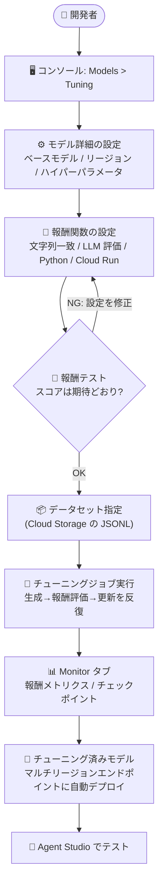

# Gemini Enterprise Agent Platform: Google Cloud コンソールでの強化学習ファインチューニング (Preview)

**リリース日**: 2026-09-15

**サービス**: Gemini Enterprise Agent Platform

**機能**: Google Cloud コンソールでの強化学習ファインチューニング (Reinforcement Learning Fine-Tuning)

**ステータス**: Preview

📊 [このアップデートのインフォグラフィックを見る](https://takech9203.github.io/google-cloud-news-summary/20260915-gemini-enterprise-rl-fine-tuning-console.html)

## 概要

Gemini Enterprise Agent Platform で、Gemini モデルの強化学習ファインチューニング (RL Fine-Tuning) ジョブを Google Cloud コンソールから作成・監視・テストできるようになりました (Preview)。コンソールの **Models > Tuning** ページから、Python コードベースまたはモデルベース (LLM 自動評価) の報酬関数を GUI で設定し、ジョブ起動前にサンプルプロンプトに対して報酬ロジックをテストし、トレーニング/評価メトリクスをリアルタイムに追跡できます。チューニング済みチェックポイントは Agent Studio でそのままテスト可能です。

強化学習ファインチューニングは、ユーザー定義の報酬関数が返すスコアを最大化するようにモデルの挙動を調整する手法で、正解ラベルが一意に定まらないタスク (複雑な指示追従、創造的なコンテンツ生成、推論タスクなど) に適しています。今回のアップデートにより、これまで API 中心だった RL ファインチューニングのワークフロー全体 (設定 → 報酬テスト → 実行 → 監視 → 推論テスト) がコンソール上で完結するようになり、ML エンジニアだけでなく、エージェント開発に携わる幅広いユーザーがモデルカスタマイズに取り組みやすくなりました。

**アップデート前の課題**

- 強化学習ファインチューニングジョブの作成は、`tuningJobs.create` REST API (v1beta1) への JSON リクエスト送信が中心で、報酬関数やハイパーパラメータの構造を理解して手書きする必要があった
- 報酬関数のロジックが正しく動作するかを、実際にチューニングジョブを起動する前に手軽に検証する手段がなく、設定ミスに気づくのがジョブ実行後になりがちだった
- 数時間〜数日かかりうるトレーニングの進捗やメトリクスを確認するための統合的な GUI 操作フローが整備されていなかった

**アップデート後の改善**

- コンソールの Models > Tuning ページから、ウィザード形式でベースモデル選択・ハイパーパラメータ・報酬関数・データセットを設定してジョブを作成できるようになった
- 「Test reward」セクションで、サンプルの学習例とモデル応答 (ベースモデルによる生成も可能) に対して報酬ロジックを事前にテストし、スコアや複合報酬の内訳を確認してからジョブを起動できるようになった
- Monitor タブで平均報酬 (`/train_mean_reward`、`/eval_mean_reward`)、生成トークン長、報酬レイテンシなどのメトリクスチャートをリアルタイムに追跡でき、チェックポイントがタイムライン上に注釈表示されるようになった
- チューニング済みチェックポイントを Agent Studio でテストできるようになった

## アーキテクチャ図



コンソール上で完結する RL ファインチューニングのワークフローです。ジョブ起動前に報酬ロジックをテストできる点が特徴で、失敗コストの高い長時間ジョブの手戻りを減らせます。

## サービスアップデートの詳細

### 主要機能

1. **ウィザード形式のチューニングジョブ作成**
   - Models > Tuning ページの「Create tuned model」から、チューニング方法として「Reinforcement learning fine tuning」を選択して作成
   - ベースモデル (例: `gemini-3.5-flash`)、リージョン、チューニング済みモデル名を指定
   - Advanced options でエポック数、学習率係数、アダプタサイズ、プロンプトあたりのサンプル数 (samples per prompt)、思考レベル (Thinking level)、バッチサイズ、チェックポイント間隔、最大出力トークン、評価間隔などのハイパーパラメータをカスタマイズ可能

2. **4 種類の報酬関数タイプと複合報酬**
   - **String match reward**: 完全一致または正規表現で生成テキストを参照値と照合
   - **LLM based reward**: Gemini モデルを自動評価者 (autorater) として評価プロンプトに基づきスコアリング
   - **Python function based reward**: セキュアなサンドボックスでカスタム Python コードを実行して評価
   - **Fully customizable reward via Cloud Run**: Cloud Run 上の外部 HTTP エンドポイントを呼び出して評価
   - 最大 16 個の報酬関数を組み合わせ、それぞれに相対的な重みを設定した複合報酬を定義可能

3. **ジョブ起動前の報酬テスト**
   - サンプルの学習例 (`contents` と `references` を含む JSON) とモデル応答を入力して報酬ロジックを検証
   - 「Generate from Training Example」でベースモデルによるサンプル応答の生成も可能
   - 複合報酬の場合は報酬ごとのスコア内訳を確認できる

4. **リアルタイムのメトリクス監視**
   - Monitor タブで、平均報酬・生成トークン長・思考トークン長・サンプリングレイテンシ・報酬レイテンシなどのチャートを表示
   - 検証データセットを指定した場合、トレーニング曲線と検証曲線 (`/train_mean_reward` と `/eval_mean_reward` など) を同一チャートに重ねて表示
   - 中間チェックポイントがチャート上のタイムラインに注釈表示され、チェックポイントテーブルでステップ番号とメトリクス値を一覧できる
   - Dataset タブ (データセット詳細・サンプル会話)、Details タブ (ジョブ構成・報酬構成) も提供

5. **チューニング済みモデルの自動デプロイと Agent Studio でのテスト**
   - ジョブ成功後、最終チェックポイントに基づくチューニング済みモデルがプロジェクト内のエンドポイントに自動デプロイされる
   - チューニング済みチェックポイントは Agent Studio でテスト可能

## 技術仕様

### サポート対象モデルとリージョン

| 項目 | 詳細 |
|------|------|
| 対応モデル | Gemini 3.5 Flash、Gemini 3.1 Flash-Lite |
| チューニングリージョン | `us-central1`、`europe-west4` |
| チューニング済みモデルの提供 | `us-central1` でチューニング → us マルチリージョンエンドポイント (`aiplatform.us.rep.googleapis.com`)、`europe-west4` → eu マルチリージョンエンドポイント (`aiplatform.eu.rep.googleapis.com`) |
| API バージョン | v1beta1 のみ |
| 対応モダリティ | テキスト、音声、画像、動画 (動画は Gemini 3.5 Flash のみ) |
| 継続チューニング | SFT → RL、RL → RL のパターンをサポート |
| データセット形式 | Cloud Storage 上の JSONL ファイル (トレーニング用・検証用) |
| トレーニング時間 | 設定により数時間〜数日 (データセットサイズ、samplesPerPrompt、バッチサイズ、エポック数などに依存) |

### API での同等操作 (参考)

コンソールと同じジョブは `tuningJobs.create` API でも作成できます。

```json
{
  "tunedModelDisplayName": "my-rl-tuned-model",
  "baseModel": "gemini-3.5-flash",
  "reinforcementTuningSpec": {
    "trainingDatasetUri": "gs://path/to/my/training_dataset.jsonl",
    "validationDatasetUri": "gs://path/to/my/eval_dataset.jsonl",
    "hyperParameters": {
      "epochCount": 15,
      "learningRateMultiplier": 1.0,
      "samplesPerPrompt": 16,
      "adapterSize": "ADAPTER_SIZE_SIXTEEN",
      "maxOutputTokens": 32768,
      "batchSize": 32,
      "evaluateInterval": 5,
      "checkpointInterval": 5,
      "thinkingLevel": "HIGH"
    },
    "singleRewardConfig": {
      "rewardName": "my_reward_function_name",
      "parseResponseConfig": { "parseType": "IDENTITY" },
      "cloudRunRewardScorer": { "cloudRunUri": "https://my.cloud.run.uri" }
    }
  }
}
```

## 設定方法

### 前提条件

1. Google Cloud プロジェクトで Gemini Enterprise Agent Platform が利用可能であること
2. トレーニング/検証データセット (JSONL) を Cloud Storage に配置済みであること
3. Cloud Run ベースの報酬を使う場合は、評価用 HTTP エンドポイントをデプロイ済みであること

### 手順

#### ステップ 1: チューニングジョブの作成を開始

Google Cloud コンソールで **Models > Tuning** ページに移動し、**Create tuned model** をクリックします。Tuning method で **Reinforcement learning fine tuning** を選択し、モデル名・ベースモデル (例: `gemini-3.5-flash`)・リージョン (例: `us-central1`) を指定します。必要に応じて Advanced options でハイパーパラメータを調整します。

#### ステップ 2: 報酬関数を設定

Reward configuration セクションで、報酬名を入力し、報酬タイプ (String match / LLM based / Python function based / Cloud Run) を選択して各設定を行います。複合報酬にする場合は **+ Add another reward** で最大 16 個まで追加し、それぞれに重みを設定します。

#### ステップ 3: 報酬ロジックをテスト (任意・推奨)

Test reward セクションで、`contents` と `references` を含むサンプル JSON と、モデル応答 (手入力またはベースモデルで生成) を指定して **Test** をクリックします。評価が成功し、期待どおりのスコアが計算されることを確認します。

#### ステップ 4: データセットを指定してジョブを開始

Tuning dataset セクションで、トレーニングデータセットと検証データセットの Cloud Storage URI (例: `gs://path/to/my/training_dataset.jsonl`) を入力し、**Start tuning** をクリックします。

#### ステップ 5: 進捗の監視とチューニング済みモデルのテスト

Models > Tuning ページのジョブ一覧からモデル名をクリックし、Monitor タブで報酬メトリクスやチェックポイントを確認します。ジョブ完了後、チューニング済みモデルはマルチリージョンエンドポイントにデプロイされ、Agent Studio でテストできます。

## メリット

### ビジネス面

- **モデルカスタマイズの民主化**: API の JSON スキーマを習熟していなくても、GUI から強化学習ファインチューニングを実施でき、エージェント開発チーム全体でモデル改善サイクルを回しやすくなる
- **手戻りコストの削減**: 数時間〜数日かかりうるチューニングジョブを起動する前に報酬ロジックを検証できるため、設定ミスによる時間・コストの浪費を防げる

### 技術面

- **報酬設計の柔軟性**: 文字列一致、LLM 自動評価、サンドボックス実行の Python コード、Cloud Run 外部エンドポイントという 4 タイプを最大 16 個まで重み付きで組み合わせられる
- **統合された可観測性**: トレーニング/検証の報酬曲線の重ね合わせ表示、チェックポイント注釈、メトリクスのフィルタリングなど、ジョブの品質を判断するための情報がコンソールに集約される
- **継続チューニングとの連携**: SFT → RL、RL → RL のパイプラインが組めるため、既存のチューニング資産を土台に段階的な改善が可能

## デメリット・制約事項

### 制限事項

- Preview (Pre-GA) 機能であり、機密データ・専有データでの利用は不可。本番・商用目的での利用も不可 (テスト・評価目的に限定)
- 対応モデルは Gemini 3.5 Flash と Gemini 3.1 Flash-Lite のみ
- チューニングリージョンは `us-central1` と `europe-west4` の 2 リージョンのみ
- API は v1beta1 のみのサポート
- 動画モダリティは Gemini 3.5 Flash でのみサポート

### 考慮すべき点

- 報酬関数の設計品質がチューニング結果を大きく左右するため、Test reward による事前検証と検証データセットでの評価を組み合わせることが重要
- ジョブはデータセットサイズやハイパーパラメータ (samplesPerPrompt、バッチサイズ、エポック数など) によって数時間〜数日かかるため、トークン課金への影響を見積もっておく必要がある
- Gemini 3 以降、チューニング済みモデルエンドポイントの推論価格はベースモデルの 1.5 倍となる点をコスト設計に織り込む必要がある

## ユースケース

### ユースケース 1: 複雑な業務ルールに従うエージェント応答の最適化

**シナリオ**: 社内規定に沿った回答フォーマット (必須項目の網羅、禁止表現の回避など) を要求されるカスタマーサポートエージェントで、正解が一意に定まらないため教師ありファインチューニングでは品質が頭打ちになっている。

**実装例**:
```
1. ルール準拠をチェックする Python function based reward を定義
   (必須項目の有無、禁止語の検出をコードでスコアリング)
2. 回答の丁寧さ・有用性を評価する LLM based reward を追加し、
   重み付きの複合報酬を構成
3. Test reward で代表的な問い合わせと応答例に対しスコアを検証
4. Cloud Storage のトレーニング/検証データセットを指定してジョブを起動
5. Monitor タブで /train_mean_reward と /eval_mean_reward の推移を確認
```

**効果**: ルール準拠と応答品質の両方を報酬として明示的に最適化でき、ジョブ起動前の報酬テストにより試行錯誤のサイクルを短縮できる。

### ユースケース 2: 推論タスク (数理・パズル) の正答率向上

**シナリオ**: 数学的な問題解決を行うエージェントで、最終回答の正誤は機械的に判定できるが、正答に至る推論パターンをモデルに学習させたい。

**効果**: String match reward (正規表現で最終回答を抽出して照合) と Thinking level HIGH の組み合わせにより、モデルが多様な思考シーケンスを探索し、正答に至る推論パターンを強化できる。チェックポイントごとのメトリクスから最良のチェックポイントを選択できる。

## 料金

強化学習ファインチューニングでは、サンプリングフェーズとトレーニングフェーズの 2 段階でトークンが生成されます。トレーニングフェーズで生成されたトークンは、Gemini Enterprise Agent Platform 料金ページの「Model Tuning」セクションに従って課金されます。

- **チューニング**: トレーニングフェーズの生成トークンに対して課金
- **推論**: チューニング済みモデルの推論コストは引き続き発生。Gemini 3 以降のモデルでは、チューニング済みモデルエンドポイントの予測価格はベースモデルの 1.5 倍
- **評価**: チューニング中に Gen AI evaluation service を自動実行するよう構成した場合、評価はバッチ予測ジョブとして課金

詳細は [Gemini Enterprise Agent Platform の料金ページ](https://cloud.google.com/gemini-enterprise-agent-platform/generative-ai/pricing) を参照してください。

## 利用可能リージョン

| 用途 | リージョン / エンドポイント |
|------|---------------------------|
| チューニング | `us-central1`、`europe-west4` |
| チューニング済みモデルの提供 | us マルチリージョンエンドポイント (`us-central1` でチューニングした場合)、eu マルチリージョンエンドポイント (`europe-west4` でチューニングした場合) |

## 関連サービス・機能

- **Agent Studio**: チューニング済みチェックポイントの動作をテストする統合環境
- **Cloud Run**: Fully customizable reward の評価エンドポイントをホストするサーバーレス実行環境
- **Cloud Storage**: トレーニング/検証データセット (JSONL) の保存先
- **Gen AI evaluation service**: チューニング中の自動評価に利用可能 (バッチ予測ジョブとして課金)
- **教師ありファインチューニング (SFT)**: 継続チューニングにより SFT の出力を RL ファインチューニングのベースとして利用可能

## 参考リンク

- 📊 [インフォグラフィック](https://takech9203.github.io/google-cloud-news-summary/20260915-gemini-enterprise-rl-fine-tuning-console.html)
- [公式リリースノート](https://docs.cloud.google.com/release-notes#September_15_2026)
- [クイックスタート: コンソールでの強化学習ファインチューニング](https://docs.cloud.google.com/gemini-enterprise-agent-platform/models/tuning/reinforcement-tuning/quick-start-console)
- [強化学習ファインチューニングについて](https://docs.cloud.google.com/gemini-enterprise-agent-platform/models/tuning/reinforcement-tuning)
- [API クイックスタート](https://docs.cloud.google.com/gemini-enterprise-agent-platform/models/tuning/reinforcement-tuning/quick-start)
- [料金ページ](https://cloud.google.com/gemini-enterprise-agent-platform/generative-ai/pricing)

## まとめ

Gemini モデルの強化学習ファインチューニングが、報酬関数の設定・事前テストからジョブ監視、Agent Studio でのチェックポイント検証まで Google Cloud コンソール上で完結するようになりました。正解ラベルが一意に定まらないタスクでモデル品質を高めたいチームは、まず Preview の制約 (非本番用途、対応モデル・リージョンの限定) を確認のうえ、小規模なデータセットと Test reward 機能を使って報酬設計の検証から始めることを推奨します。

---

**タグ**: #GeminiEnterpriseAgentPlatform #ReinforcementLearning #FineTuning #Gemini #Preview #GoogleCloudConsole #AgentStudio
