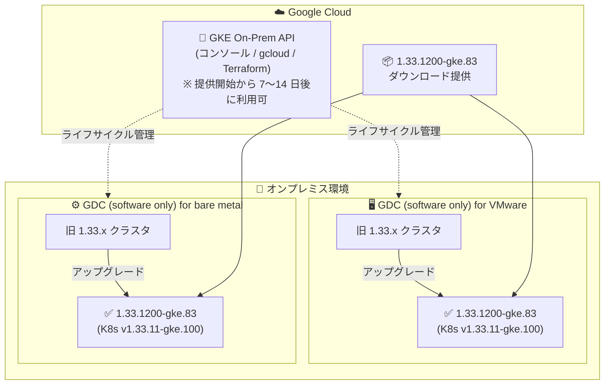

# Google Distributed Cloud (software only): 1.33.1200-gke.83 リリース (Kubernetes v1.33.11-gke.100)

**リリース日**: 2026-09-15

**サービス**: Google Distributed Cloud (software only) for VMware / for bare metal

**機能**: バージョン 1.33.1200-gke.83 リリース (パッチリリース / 脆弱性修正)

**ステータス**: GA (ダウンロード提供開始)

📊 [このアップデートのインフォグラフィックを見る](https://takech9203.github.io/google-cloud-news-summary/20260915-google-distributed-cloud-1-33-1200.html)

## 概要

Google Distributed Cloud (software only) の新しいパッチバージョン **1.33.1200-gke.83** が、**for VMware** と **for bare metal** の両プラットフォーム向けに同時にダウンロード提供開始されました。本バージョンは **Kubernetes v1.33.11-gke.100** 上で動作します。

今回のリリースはパッチリリースであり、主な内容は脆弱性の修正です。修正された脆弱性の詳細は、各プラットフォームの Vulnerability fixes ページ ([VMware 版](https://docs.cloud.google.com/kubernetes-engine/distributed-cloud/vmware/docs/vulnerabilities) / [bare metal 版](https://docs.cloud.google.com/kubernetes-engine/distributed-cloud/bare-metal/docs/vulnerabilities)) に公開されています。オンプレミス環境で GDC (software only) の 1.33 系クラスタを運用しているユーザーは、セキュリティ維持の観点から本バージョンへのアップグレードを計画することが推奨されます。

なお、リリース後、GKE On-Prem API クライアント (Google Cloud コンソール、gcloud CLI、Terraform) でこのバージョンが利用可能になるまでには約 7〜14 日かかります。また、サードパーティのストレージベンダーを利用している場合は、[認定済みストレージパートナーの一覧](https://docs.cloud.google.com/kubernetes-engine/enterprise/docs/resources/partner-storage)で本リリースの認定状況を確認する必要があります。

**アップデート前の課題**

- 従来の 1.33 系パッチバージョン (例: 1.33.600-gke.40 など) には、その後発見された既知の脆弱性が未修正のまま残っていた
- VMware 版と bare metal 版で最新のセキュリティ修正を適用するには、新しいパッチリリースの提供を待つ必要があった

**アップデート後の改善**

- 1.33.1200-gke.83 へのアップグレードにより、Vulnerability fixes ページに記載された脆弱性が修正され、セキュリティ体制が強化された
- VMware 版・bare metal 版の両方で同一バージョン番号 (1.33.1200-gke.83) が同時提供され、マルチプラットフォーム環境でもバージョンを揃えた運用が可能
- Kubernetes v1.33.11-gke.100 ベースとなり、上流 Kubernetes のパッチ修正も取り込まれた

## アーキテクチャ図



VMware 版・bare metal 版の両プラットフォームに同一バージョン 1.33.1200-gke.83 が提供され、いずれも Kubernetes v1.33.11-gke.100 上で動作します。GKE On-Prem API クライアントからの利用はリリース後 7〜14 日で可能になります。

## サービスアップデートの詳細

### 主要機能

1. **バージョン 1.33.1200-gke.83 の提供開始 (VMware / bare metal 共通)**
   - Google Distributed Cloud (software only) の 1.33 系最新パッチバージョン
   - Kubernetes v1.33.11-gke.100 上で動作
   - 両プラットフォームで同時リリースされ、混在環境でのバージョン統一が容易

2. **脆弱性の修正**
   - Vulnerability fixes ページに記載された脆弱性を修正
   - VMware 版: [Vulnerability fixes (VMware)](https://docs.cloud.google.com/kubernetes-engine/distributed-cloud/vmware/docs/vulnerabilities)
   - bare metal 版: [Vulnerability fixes (bare metal)](https://docs.cloud.google.com/kubernetes-engine/distributed-cloud/bare-metal/docs/vulnerabilities)

3. **GKE On-Prem API クライアントへの段階的提供**
   - Google Cloud コンソール、gcloud CLI、Terraform でのインストール / アップグレードは、リリースから約 7〜14 日後に利用可能

## 技術仕様

### バージョン情報

| 項目 | 詳細 |
|------|------|
| GDC (software only) バージョン | 1.33.1200-gke.83 |
| Kubernetes バージョン | v1.33.11-gke.100 |
| 対象プラットフォーム | VMware (vSphere) / bare metal |
| リリース種別 | パッチリリース (脆弱性修正) |
| GKE On-Prem API クライアント対応 | リリース後 約 7〜14 日 |

### 1.33 系に関する補足

- バージョン 1.33 では、1.32 からのアップグレード時にクラスタが自動的に [advanced clusters](https://docs.cloud.google.com/kubernetes-engine/distributed-cloud/vmware/docs/concepts/advanced-clusters) アーキテクチャに変換されます (VMware 版。非 advanced のまま維持するオプションもあり)
- VMware 版 1.33 には cert-manager 1.18 がバンドルされます

## 設定方法

### 前提条件

1. 既存の GDC (software only) クラスタが 1.32 系または 1.33 系の旧パッチバージョンであること (バージョンスキュールールに従う)
2. サードパーティストレージベンダーを利用している場合、[認定済みストレージパートナー](https://docs.cloud.google.com/kubernetes-engine/enterprise/docs/resources/partner-storage)で本リリースの認定を確認していること
3. アップグレード前にドキュメントの手順・既知の問題を確認していること

### 手順

#### ステップ 1: アップグレード手順の確認

- VMware 版: [Upgrade clusters (VMware)](https://docs.cloud.google.com/kubernetes-engine/distributed-cloud/vmware/docs/how-to/upgrading)
- bare metal 版: [Upgrade clusters (bare metal)](https://docs.cloud.google.com/kubernetes-engine/distributed-cloud/bare-metal/docs/how-to/upgrade)

#### ステップ 2: クラスタのアップグレード実行

```bash
# 例: VMware 版 (gkectl を使用する場合)
# gkectl のバージョンをターゲットバージョンに合わせてから実行
gkectl upgrade admin --kubeconfig ADMIN_CLUSTER_KUBECONFIG --config ADMIN_CLUSTER_CONFIG
gkectl upgrade cluster --kubeconfig ADMIN_CLUSTER_KUBECONFIG --config USER_CLUSTER_CONFIG

# 例: bare metal 版 (bmctl を使用する場合)
bmctl upgrade cluster -c CLUSTER_NAME --kubeconfig ADMIN_KUBECONFIG
```

管理クラスタを先にアップグレードしてからユーザークラスタをアップグレードする、というバージョンルールに従います。GKE On-Prem API クライアント (コンソール / gcloud / Terraform) を使用する場合は、本バージョンが利用可能になる 7〜14 日後以降に実行します。

## メリット

### ビジネス面

- **セキュリティリスクの低減**: 既知の脆弱性が修正され、オンプレミス Kubernetes 環境のコンプライアンス・セキュリティ要件への対応が容易になる
- **運用の統一**: VMware / bare metal の両環境で同一バージョンに揃えられるため、ハイブリッド構成での運用管理・バージョン管理がシンプルになる

### 技術面

- **最新の Kubernetes パッチ**: Kubernetes v1.33.11-gke.100 ベースとなり、上流のバグ修正・セキュリティ修正を享受できる
- **パッチアップグレードの低リスク性**: 同一マイナーバージョン (1.33 系) 内のパッチアップグレードのため、機能面の破壊的変更リスクが小さい

## デメリット・制約事項

### 制限事項

- GKE On-Prem API クライアント (Google Cloud コンソール、gcloud CLI、Terraform) での利用はリリース後約 7〜14 日待つ必要がある
- サードパーティストレージベンダー利用時は、本リリースに対するベンダーの認定完了を確認する必要がある

### 考慮すべき点

- アップグレードにはノードのドレイン・再作成が伴うため、メンテナンスウィンドウの計画が必要
- 1.32 系から 1.33 系へのアップグレードの場合は、advanced clusters への自動変換 (VMware 版) など、パッチアップグレード以上の考慮事項があるためアップグレードガイドを事前に確認すること

## ユースケース

### ユースケース 1: セキュリティパッチの定期適用

**シナリオ**: 金融・製造業などの規制業種で、オンプレミスの GDC クラスタに対して脆弱性修正を定期的に適用する運用を行っている。

**効果**: 1.33.1200-gke.83 への計画的なアップグレードにより、Vulnerability fixes に記載された脆弱性を解消し、セキュリティ監査要件を満たせる。

### ユースケース 2: VMware / bare metal 混在環境のバージョン統一

**シナリオ**: データセンターでは bare metal 版、支社では VMware 版を運用しており、両環境のバージョンを揃えて運用負荷を下げたい。

**効果**: 両プラットフォームで同一バージョン 1.33.1200-gke.83 が同時提供されるため、検証・展開を一度のサイクルで統一的に実施できる。

## 料金

本リリースによる料金体系の変更はありません。Google Distributed Cloud (software only) の料金は vCPU ベースの課金です。詳細は[料金ページ](https://cloud.google.com/distributed-cloud/pricing)を参照してください。

## 利用可能リージョン

オンプレミス環境 (VMware vSphere / bare metal) で稼働するソフトウェアのため、リージョンの制約はありません。

## 関連サービス・機能

- **GKE On-Prem API**: Google Cloud コンソール、gcloud CLI、Terraform からのクラスタライフサイクル管理を提供 (本バージョンは 7〜14 日後に利用可)
- **GKE Enterprise (フリート管理)**: オンプレミスクラスタを Google Cloud から一元管理
- **Cloud Logging / Cloud Monitoring**: GDC クラスタのログ・メトリクスを Google Cloud 側で収集・監視

## 参考リンク

- 📊 [インフォグラフィック](https://takech9203.github.io/google-cloud-news-summary/20260915-google-distributed-cloud-1-33-1200.html)
- [公式リリースノート](https://docs.cloud.google.com/release-notes#September_15_2026)
- [アップグレードガイド (VMware)](https://docs.cloud.google.com/kubernetes-engine/distributed-cloud/vmware/docs/how-to/upgrading)
- [アップグレードガイド (bare metal)](https://docs.cloud.google.com/kubernetes-engine/distributed-cloud/bare-metal/docs/how-to/upgrade)
- [Vulnerability fixes (VMware)](https://docs.cloud.google.com/kubernetes-engine/distributed-cloud/vmware/docs/vulnerabilities)
- [Vulnerability fixes (bare metal)](https://docs.cloud.google.com/kubernetes-engine/distributed-cloud/bare-metal/docs/vulnerabilities)
- [認定済みストレージパートナー](https://docs.cloud.google.com/kubernetes-engine/enterprise/docs/resources/partner-storage)
- [料金ページ](https://cloud.google.com/distributed-cloud/pricing)

## まとめ

Google Distributed Cloud (software only) 1.33.1200-gke.83 は、VMware 版・bare metal 版の両方に脆弱性修正を提供するセキュリティ重視のパッチリリースです。1.33 系を運用中のクラスタは、Vulnerability fixes ページで修正内容を確認のうえ、メンテナンスウィンドウ内での早期アップグレードを推奨します。サードパーティストレージ利用環境では、事前にパートナー認定状況の確認を忘れないようにしてください。

---

**タグ**: Google Distributed Cloud, GDC, VMware, bare metal, Kubernetes, パッチリリース, セキュリティ, 脆弱性修正, オンプレミス, ハイブリッドクラウド
