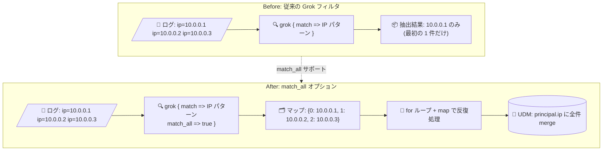

# Google SecOps SIEM: パーサー構文の Grok フィルタで match_all オプションをサポート

**リリース日**: 2026-09-15

**サービス**: Google SecOps SIEM

**機能**: Grok フィルタの match_all オプション

**ステータス**: Feature (一般提供)

📊 [このアップデートのインフォグラフィックを見る](https://takech9203.github.io/google-cloud-news-summary/20260915-google-secops-siem-grok-match-all.html)

## 概要

Google SecOps (旧 Chronicle) SIEM のパーサー構文がアップデートされ、Grok フィルタ内で `match_all` オプションがサポートされました。このオプションを `true` に設定すると、フィールド内でパターンに一致する **すべての重複しない (non-overlapping) 出現箇所** を抽出できるようになります。従来の Grok フィルタは最初に一致した 1 件のみを返す仕様であったため、これは大きな機能強化です。

抽出された値はマップ構造に集約され、キーはマッチのインデックス (`"0"` から開始) の文字列表現になります。このマップは `for` ループと `map` キーワードを使って反復処理でき、抽出したすべての値を UDM (Unified Data Model) の繰り返しフィールド (例: `principal.ip`) にマッピングできます。

このアップデートは、カスタムパーサーやパーサー拡張 (code snippet) を作成・保守する SOC エンジニア、Detection エンジニア、セキュリティデータエンジニアが主な対象です。1 つのログメッセージに複数の IP アドレス、ホスト名、ハッシュ値などが含まれるログソースの正規化が大幅に簡素化されます。

**アップデート前の課題**

- Grok フィルタはフィールド内で最初に成功したパターンマッチ 1 件しか抽出できず、同一フィールド内の 2 件目以降の値を取得できなかった
- 複数の値 (複数の IP アドレスなど) を抽出するには、出現数を想定した複雑な正規表現を書くか、複数の Grok ステートメントや別のフィルタを組み合わせる回避策が必要だった
- 値の出現数が可変のログでは、パーサーが取りこぼしを起こしやすく、UDM イベントに一部の値しか反映されないリスクがあった

**アップデート後の改善**

- `match_all => true` を設定するだけで、フィールド内のすべての重複しないパターン一致を一括抽出できるようになった
- 抽出結果はインデックスをキーとするマップ構造に集約され、`for` ループ + `map` キーワードで反復処理して UDM の繰り返しフィールドに `merge` できるようになった
- 出現数が可変のログでもシンプルな Grok パターン 1 つで網羅的に値を取得でき、パーサーの可読性・保守性が向上した

## アーキテクチャ図



従来はフィールド内の最初のマッチ 1 件しか抽出できませんでしたが、`match_all` により全マッチがマップに集約され、for ループで UDM の繰り返しフィールドへ漏れなくマッピングできます。

## サービスアップデートの詳細

### 主要機能

1. **match_all オプションによる全件抽出**
   - Grok フィルタに `match_all => true` を指定すると、フィールド内の重複しないすべてのパターン一致を抽出する
   - デフォルト (未指定) では従来どおり最初の 1 件のみを抽出するため、既存パーサーの動作に影響はない

2. **マップ構造への集約**
   - 抽出された値は、マッチのインデックス (`"0"` から開始) の文字列をキーとするマップ構造に集約される
   - 出現数が可変のログでも、事前に件数を想定した正規表現を書く必要がない

3. **for ループによる反復処理と UDM マッピング**
   - `for index, value in <token> map { ... }` の形式でマップを反復処理できる
   - `mutate { merge => ... }` と組み合わせることで、`principal.ip` などの UDM 繰り返しフィールドに全値をマッピングできる

## 技術仕様

### match_all オプションの仕様

| 項目 | 詳細 |
|------|------|
| 対象フィルタ | Grok フィルタ (`grok { ... }`) |
| オプション名 | `match_all` |
| 設定値 | `true` (全件抽出) / 未指定時は最初の 1 件のみ |
| 抽出範囲 | フィールド内の重複しない (non-overlapping) すべてのパターン一致 |
| 出力形式 | マップ構造 (キーはマッチインデックスの文字列表現、`"0"` から開始) |
| 反復処理 | `for` ループ + `map` キーワードで反復可能 |

### 構文例: すべての IP アドレスを principal.ip にマッピング

```
filter {
  grok {
    match => {"message" => "%{IP:ips}"}
    match_all => true
  }
  mutate {
    replace => {
      "event.idm.read_only_udm.metadata.event_type" => "GENERIC_EVENT"
    }
  }
  for index, ip in ips map {
    mutate {
      merge => {
        "event.idm.read_only_udm.principal.ip" => "ip"
      }
    }
  }
  mutate {
    merge => {
      "@output" => "event"
    }
  }
}
```

## 設定方法

### 前提条件

1. Google SecOps SIEM でカスタムパーサーまたはパーサー拡張 (code snippet) を作成・編集できる権限があること
2. Google SecOps のパーサー構文 (Logstash ベースの Grok フィルタ、mutate、for ループ) の基本を理解していること

### 手順

#### ステップ 1: Grok フィルタに match_all を追加

```
grok {
  match => {"message" => "%{IP:ips}"}
  match_all => true
}
```

複数値を抽出したいフィールドとパターンを `match` に指定し、`match_all => true` を追加します。なお、Google SecOps のパーサーでは正規表現のエスケープに二重バックスラッシュ (`\\s`、`\\d` など) が必要な点に注意してください。

#### ステップ 2: for ループで UDM フィールドにマッピング

```
for index, ip in ips map {
  mutate {
    merge => {
      "event.idm.read_only_udm.principal.ip" => "ip"
    }
  }
}
```

抽出結果のマップを `for` ループで反復処理し、`merge` で UDM の繰り返しフィールドに追加します。パーサーの変更後は、代表的なサンプルログでプレビュー検証を行ってから本番反映することを推奨します。

## メリット

### ビジネス面

- **可視性の向上**: ログ内のすべてのエンティティ (IP、ホストなど) が UDM イベントに反映されるため、検索・検知・調査での取りこぼしが減り、脅威検知の精度が向上する
- **パーサー開発工数の削減**: 複数値抽出のための複雑な回避策が不要になり、カスタムパーサーの開発・保守コストを削減できる

### 技術面

- **パーサーの簡素化**: 出現回数を想定した長い正規表現や複数の Grok ステートメントが、シンプルなパターン 1 つ + for ループに置き換えられる
- **可変長ログへの対応**: 値の出現数が固定でないログでも、件数に依存せず網羅的に抽出できる
- **後方互換性**: `match_all` はオプトインのオプションであり、既存パーサーのデフォルト動作 (最初の 1 件のみ) は変わらない

## デメリット・制約事項

### 制限事項

- 抽出対象は「重複しない (non-overlapping)」一致のみで、重なり合うパターンの一致は取得できない
- 抽出結果はマップ構造で返されるため、単一値として扱う場合と異なり、`for` ループでの反復処理の記述が必要になる

### 考慮すべき点

- Grok のベストプラクティスとして、変数は意図が明確な名前 (例: `source_ip`) を使い、パーサー冒頭で初期化 (`""` を設定) して `overwrite` 配列に宣言することが推奨される
- Google SecOps のパーサーでは正規表現トークンに二重バックスラッシュ (`\\s`、`\\d`、`\\.` など) が必要という制約は `match_all` 使用時も同様に適用される
- 可能な限り `%{IP}` や `%{WORD}` などの事前定義パターンを使用すると、パース効率と可読性が向上する

## ユースケース

### ユースケース 1: 複数の IP アドレスを含むファイアウォールログの正規化

**シナリオ**: ファイアウォールやプロキシのログに、NAT 変換前後のアドレスや複数の通信先など、複数の IP アドレスが 1 行に含まれている。従来のパーサーでは最初の IP しか抽出できず、調査時に一部の通信先が UDM イベントから欠落していた。

**実装例**:
```
filter {
  grok {
    match => {"message" => "%{IP:ips}"}
    match_all => true
  }
  for index, ip in ips map {
    mutate {
      merge => { "event.idm.read_only_udm.principal.ip" => "ip" }
    }
  }
}
```

**効果**: ログ内のすべての IP アドレスが `principal.ip` に格納され、UDM 検索や検知ルールでどの IP からでもイベントを発見できるようになる。

### ユースケース 2: 可変数のエンティティを含むアプリケーションログのパース

**シナリオ**: アプリケーションログの 1 メッセージ内に、処理対象のユーザー名やファイルハッシュが可変個数記録される。従来は出現数のパターンごとに正規表現を用意する必要があり、パーサーが肥大化していた。

**効果**: 単一の Grok パターン + `match_all` で件数に依存せず全エンティティを抽出でき、パーサーの行数と保守負担が大幅に削減される。

## 料金

本アップデートはパーサー構文の機能強化であり、追加料金は発生しません。Google SecOps 自体の料金はパッケージ (Standard / Enterprise / Enterprise Plus) ベースです。詳細は料金ページを参照してください。

- [Google SecOps の料金](https://cloud.google.com/chronicle/docs/preview/pricing)

## 利用可能リージョン

リージョン固有の記載はありません。Google SecOps SIEM のパーサー機能として、Google SecOps が利用可能なすべての環境で使用できます。

## 関連サービス・機能

- **UDM (Unified Data Model)**: 抽出した値のマッピング先となる Google SecOps の統一データモデル。`match_all` により繰り返しフィールド (例: `principal.ip`) への全件マッピングが容易になる
- **パーサー拡張 (Parser Extensions)**: デフォルトパーサーを補完するカスタムコードスニペット。`match_all` はカスタムパーサーと同様にパーサー拡張でも活用できる
- **YARA-L 検知ルール**: UDM イベントに対して検知ルールを実行する機能。すべてのエンティティが UDM に反映されることで検知カバレッジが向上する

## 参考リンク

- 📊 [インフォグラフィック](https://takech9203.github.io/google-cloud-news-summary/20260915-google-secops-siem-grok-match-all.html)
- [公式リリースノート](https://docs.cloud.google.com/release-notes#September_15_2026)
- [パーサー構文リファレンス (Grok match_all option)](https://docs.cloud.google.com/chronicle/docs/reference/parser-syntax#grok_match_all_option)
- [ログのパースの概要](https://docs.cloud.google.com/chronicle/docs/event-processing/parsing-overview)
- [料金ページ](https://cloud.google.com/chronicle/docs/preview/pricing)

## まとめ

Grok フィルタの `match_all` オプションにより、1 つのログフィールドから複数のパターン一致をすべて抽出し、UDM の繰り返しフィールドへ漏れなくマッピングできるようになりました。複数の IP アドレスやエンティティを含むログソースのカスタムパーサーを保守しているチームは、複雑な回避策を `match_all` + for ループに置き換えることで、パーサーの簡素化と検知カバレッジの向上を図ることを推奨します。

---

**タグ**: Google SecOps, SIEM, Chronicle, パーサー, Grok, match_all, UDM, ログ正規化
