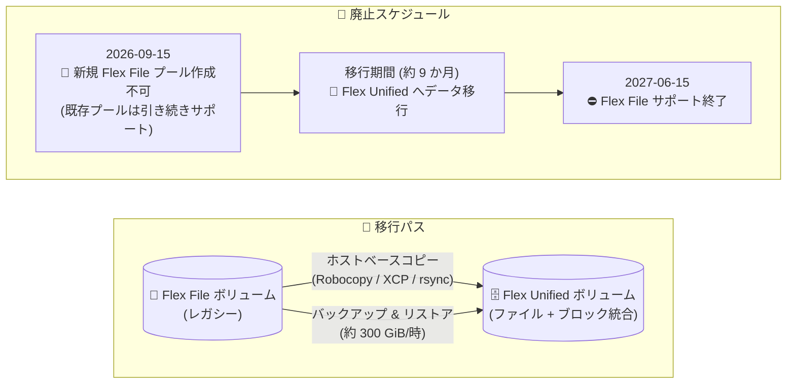

# Google Cloud NetApp Volumes: Flex File サービスレベルの廃止 (Flex Unified への移行が必要)

**リリース日**: 2026-09-15

**サービス**: Google Cloud NetApp Volumes

**機能**: Flex File サービスレベルの廃止と Flex Unified サービスレベルへの移行

**ステータス**: Announcement (Deprecation)

📊 [このアップデートのインフォグラフィックを見る](https://takech9203.github.io/google-cloud-news-summary/20260915-netapp-volumes-flex-file-deprecation.html)

## 概要

Google Cloud NetApp Volumes の Flex File サービスレベルの廃止が発表されました。2026 年 9 月 15 日をもって新しい Flex File ストレージプールの作成ができなくなります。既存のプールは引き続きサポートされますが、Flex File サービスレベルのサポートは **2027 年 6 月 15 日に終了** します。Flex File を利用しているユーザーは、それまでにデータを Flex Unified サービスレベルへ移行する必要があります。

Flex Unified サービスレベルは、ファイルストレージとブロックストレージを単一プラットフォームで提供し、Google Cloud 上で NetApp ONTAP のすべての機能を利用できるサービスレベルです。Flex Unified の拡大に伴い、Flex File は段階的に廃止 (フェーズアウト) されます。移行支援が必要な場合は、サポートチーム (flex-file-migration@google.com) へ連絡できます。また、特定のリージョン要件や Flex Unified での Assured Workloads サポートが必要な場合は、Google Cloud セールスチームへの問い合わせが案内されています。

本アップデートは、Flex File ストレージプールを運用しているすべてのユーザーに影響します。約 9 か月の移行期間内に、移行ツールの選定・移行計画の策定・実施が必要です。

**アップデート前の課題**

- Flex File サービスレベルは、ブロックストレージ (iSCSI / NVMe/TCP)、デュアルプロトコルボリューム (SMB と NFS)、ONTAP 機能 (SnapMirror / FlexCache 連携)、シンクローン、大容量プール・ボリュームなどに対応していなかった
- Flex File では選択的ファイルリストアやクロスリージョンバックアップが利用できなかった
- ファイルとブロックでサービスレベルが分かれており、単一プラットフォームで統合的に扱えなかった

**アップデート後の改善 (移行先の Flex Unified)**

- ファイルとブロック (iSCSI / NVMe/TCP) の両方を単一プラットフォームで利用可能
- ONTAP-mode プールにより ONTAP 機能をフルに利用でき、SnapMirror / FlexCache との連携、シンクローンにも対応
- 大容量プール・ボリューム (大容量ボリュームで最大 22 GiBps スループット、750,000 IOPS) と選択的ファイルリストア、クロスリージョンバックアップに対応
- Flex File と同様にプールレベルの共有 QoS、自動階層化 (auto-tiering)、リージョナル可用性をサポート

## アーキテクチャ図

2026 年 9 月 15 日から新規 Flex File プールの作成が停止され、2027 年 6 月 15 日のサポート終了までに、ホストベースのデータコピーまたはバックアップ & リストアを使用して Flex Unified へ移行する必要があります。

## サービスアップデートの詳細

### 主要なポイント

1. **廃止スケジュール**
   - 2026 年 9 月 15 日: 新規 Flex File ストレージプールの作成が不可に (既存プールは引き続きサポート)
   - 2027 年 6 月 15 日: Flex File サービスレベルのサポート終了
   - サポート終了までに Flex Unified サービスレベルへのデータ移行が必須

2. **移行先: Flex Unified サービスレベル**
   - ファイルとブロックストレージを単一プラットフォームで提供し、Google Cloud 上で NetApp ONTAP のすべての機能を利用可能
   - Default-mode と ONTAP-mode の 2 つの動作モードを提供し、いずれも通常プールと大容量プールで利用可能

3. **移行支援**
   - 移行支援が必要な場合: flex-file-migration@google.com へメールで連絡
   - 特定のリージョン要件や Assured Workloads サポートが必要な場合: Google Cloud セールスチームへ問い合わせ

### Flex Unified と Flex File の機能比較

公式ドキュメントに記載されている機能比較は以下のとおりです。

| 機能 | Flex Unified | Flex File (レガシー) |
|------|--------------|----------------------|
| ブロックストレージ (iSCSI / NVMe/TCP) | 対応 | 非対応 |
| デュアルプロトコルボリューム (SMB / NFS) | 対応 | 非対応 |
| 自動階層化 (auto-tiering) | 対応 | 対応 |
| ONTAP 機能 (ONTAP-mode プール) | 対応 | 非対応 |
| ONTAP 連携 (SnapMirror / FlexCache) | 対応 | 非対応 |
| 選択的ファイルリストアとクロスリージョンバックアップ | 対応 | 非対応 |
| プールレベルの共有 QoS | 対応 | 対応 |
| シンクローン | 対応 | 非対応 |
| 大容量プール・ボリューム | 対応 | 非対応 |
| スループット | 大容量ボリュームで向上したスループット | 標準スループット |
| リージョナル可用性 | 対応 | 対応 |

## 技術仕様

### 移行ツールの比較

| ツール | ユースケース | 考慮事項 |
|--------|--------------|----------|
| ホストベースのデータコピー | ディレクトリの削除・統合などデータ再編成を伴う移行、通常ボリュームから大容量ボリュームへの移行 | Flex File で利用可能。マウント IP アドレスが変わる |
| バックアップ & リストア | 少数の小規模ボリュームの移行 | Flex File で利用可能。リストア速度は約 300 GiB/時。マウント IP アドレスが変わる |
| サポート支援レプリケーション | 少数の大規模ボリュームの移行 | **Standard / Premium / Extreme のみ対応 (Flex File では利用不可)** |

### ホストベースコピーで使用するツール

| クライアント環境 | ツール |
|------------------|--------|
| Windows VM (SMB) | Robocopy (`/mir /sec /secfix /z /mt:32 /b /r:2 /w:1` などのオプションを利用) |
| Linux VM (NFS) | NetApp XCP または rsync |

### バックアップ & リストアによる移行の制限事項

- Flex File ではクロスリージョンバックアップと CMEK がサポートされないため、移行中に使用しない
- Flex File は大容量ボリュームをサポートしないため、Flex File ボリュームから大容量 Flex Unified ボリュームへの移行にはバックアップ & リストアを使用できない (ホストベースのデータコピーを使用する)
- スケジュールバックアップの実行時刻は指定できない (タイミングを制御したい場合は手動バックアップを使用)
- スナップショット履歴は移行されない。新しいボリュームでエクスポートポリシーまたは SMB NTFS 権限の設定、およびスナップショット・バックアップ・レプリケーションのデータ保護ポリシーの再作成が必要

## 設定方法 (移行手順)

### 前提条件

1. 移行先の Flex Unified ストレージプールを作成できるリージョンであることを確認する (Flex Unified の対応リージョンは Flex File より少ないため注意)
2. 移行ツール (ホストベースコピー / バックアップ & リストア) を選定する

### 手順 (バックアップ & リストアの場合)

#### ステップ 1: ベースラインバックアップの作成

移行前に Flex File ボリュームのベースラインバックアップを作成します。スケジュールバックアップがあればそれを利用できます。これにより最終増分バックアップの所要時間を短縮できます。

#### ステップ 2: Flex Unified プールの作成

必要に応じて移行先の NetApp Volumes Flex Unified ストレージプールを作成します。

#### ステップ 3: メンテナンスウィンドウでのカットオーバー

1. クライアントを既存ボリュームから切断し、最終の増分手動バックアップを実行
2. 増分バックアップ完了後、最新の増分バックアップから「バックアップからボリュームを作成」を選択し、移行先の Flex Unified ストレージプールを指定 (リストア速度は約 300 GiB/時を想定。進捗は Google Cloud コンソールの通知で確認可能)
3. リストア完了後、クライアントを Flex Unified ボリュームに接続し、アプリケーションで動作を検証

#### ステップ 4: 残りのクライアントの接続

残りのクライアントを Flex Unified ボリュームに接続します。

### 手順 (ホストベースコピーの場合)

1. Flex Unified プールとボリュームを作成
2. 既存ボリュームと新しい Flex Unified ボリュームを VPC 内の VM にマウントし、データコピーツール (Robocopy / XCP / rsync) でデータを転送
3. メンテナンス時間中にクライアントを切断し、最終増分コピーを実行。ファイル数やチェックサムなどでコピー完了を検証
4. クライアントを Flex Unified ボリュームに接続してアクセスをテスト

## メリット

### ビジネス面

- **単一プラットフォームへの統合**: ファイルとブロックストレージを Flex Unified に統合することで、ストレージ基盤の運用を一元化できる
- **十分な移行期間**: 発表からサポート終了 (2027 年 6 月 15 日) まで約 9 か月の期間があり、計画的な移行が可能。移行支援窓口も用意されている

### 技術面

- **機能の拡充**: 移行により ONTAP 機能、SnapMirror / FlexCache 連携、シンクローン、選択的ファイルリストア、クロスリージョンバックアップ、大容量ボリュームなど Flex File で使えなかった機能が利用可能になる
- **性能の向上余地**: Flex Unified は大容量ボリュームで最大 22 GiBps スループット、750,000 IOPS まで対応

## デメリット・制約事項

### 制限事項

- 2026 年 9 月 15 日以降、新規の Flex File ストレージプールは作成できない
- 2027 年 6 月 15 日で Flex File のサポートが終了するため、移行は必須
- サポート支援レプリケーションは Flex File では利用できず、移行手段はホストベースコピーまたはバックアップ & リストアに限られる
- どの移行ツールを使ってもマウント IP アドレスが変わるため、クライアント側の設定変更が必要
- スナップショット履歴は移行されず、エクスポートポリシー / SMB NTFS 権限 / データ保護ポリシーの再設定が必要

### 考慮すべき点

- **リージョンの差異**: Flex File は africa-south1、asia-northeast3、europe-central2 など多数のリージョンで利用可能だったのに対し、Flex Unified の対応リージョンは限定的 (asia-east1、asia-northeast1 (性能制限あり)、asia-northeast2、us-central1、europe-west1 など)。現在のリージョンで Flex Unified が使えない場合は Google Cloud セールスチームへの相談が必要
- **性能制限リージョン**: asia-northeast1 (東京)、europe-west2、europe-west9、us-east5、us-west2、us-west3 では Flex Unified のプール性能が 1.6 GiBps / 90,000 IOPS に制限され、大容量プールもサポートされない
- **リストア速度**: バックアップ & リストアのリストア速度は約 300 GiB/時のため、大容量データの移行ではカットオーバー時間を十分に見積もる必要がある
- **Assured Workloads**: Flex Unified で Assured Workloads サポートが必要な場合はセールスチームへの問い合わせが必要

## 料金

このアップデート自体に伴う料金変更の情報は Release Notes には記載されていません。Flex Unified への移行後の料金は、公式の料金ページを参照してください。

- [Google Cloud NetApp Volumes の料金](https://cloud.google.com/netapp-volumes/pricing)

## 利用可能リージョン

Flex Unified サービスレベルの対応リージョン (公式ドキュメント記載):

- **通常性能**: asia-east1、asia-northeast2、asia-south1、asia-southeast1、australia-southeast1、australia-southeast2、europe-southwest1、europe-west1、europe-west3、europe-west4、me-central2、me-west1、southamerica-east1、us-central1、us-east1、us-east4、us-south1、us-west1、us-west4
- **性能制限あり (最大 1.6 GiBps / 90,000 IOPS、大容量プール非対応)**: asia-northeast1、europe-west2、europe-west9、us-east5、us-west2、us-west3

最新のリージョン情報は [サービスレベルのドキュメント](https://docs.cloud.google.com/netapp/volumes/docs/discover/service-levels) を参照してください。

## 関連サービス・機能

- **NetApp Volumes バックアップ & リストア**: Flex File から Flex Unified への移行手段の 1 つ。ボリュームのバックアップを作成し、Flex Unified プールにリストアできる
- **Compute Engine (VM)**: ホストベースのデータコピーでは、既存ボリュームと移行先ボリュームを VPC 内の VM にマウントしてコピーを実行する
- **NetApp XCP / Robocopy / rsync**: ホストベースコピーで使用するデータ移行ツール
- **Assured Workloads**: Flex Unified での利用が必要な場合はセールスチームへの問い合わせが必要

## 参考リンク

- 📊 [インフォグラフィック](https://takech9203.github.io/google-cloud-news-summary/20260915-netapp-volumes-flex-file-deprecation.html)
- [公式リリースノート](https://docs.cloud.google.com/release-notes#September_15_2026)
- [Flex Unified サービスレベルへの移行ガイド](https://docs.cloud.google.com/netapp/volumes/docs/get-started/migration-to-flex-unified)
- [NetApp Volumes サービスレベル](https://docs.cloud.google.com/netapp/volumes/docs/discover/service-levels)
- [料金ページ](https://cloud.google.com/netapp-volumes/pricing)

## まとめ

Google Cloud NetApp Volumes の Flex File サービスレベルは 2026 年 9 月 15 日で新規プール作成が停止され、2027 年 6 月 15 日にサポートが終了します。Flex File を利用中の場合は、対象ボリュームの棚卸しと Flex Unified 対応リージョンの確認を早期に行い、ホストベースコピーまたはバックアップ & リストアによる移行計画を策定することを推奨します。移行に不安がある場合は、移行支援窓口 (flex-file-migration@google.com) の活用を検討してください。

---

**タグ**: `NetApp Volumes`, `Flex File`, `Flex Unified`, `Deprecation`, `Storage`, `Migration`
