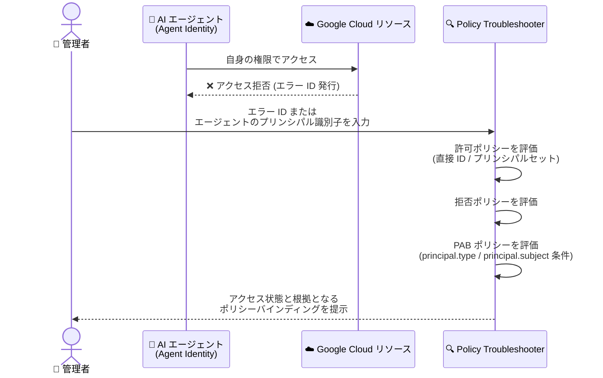

# Policy Intelligence: Policy Troubleshooter がエージェント ID のアクセストラブルシューティングに対応

**リリース日**: 2026-09-15

**サービス**: Policy Intelligence (Policy Troubleshooter)

**機能**: エージェント ID (Agent Identity) のアクセストラブルシューティング対応

**ステータス**: 提供開始 (Principal Access Boundary ポリシーのトラブルシューティングは Preview)

📊 [このアップデートのインフォグラフィックを見る](https://takech9203.github.io/google-cloud-news-summary/20260915-policy-troubleshooter-agent-identities.html)

## 概要

Policy Troubleshooter が、エージェント ID (Agent Identity) のアクセストラブルシューティングに対応しました。Agent Identity は、Vertex AI Agent Engine や Gemini Enterprise などにデプロイされた AI エージェントに SPIFFE 標準ベースの一意な ID を付与し、サービスアカウントを共有せずにエージェント単位で権限管理を行う仕組みです。今回のアップデートにより、自身の権限で動作するエージェント (agents acting under their own authority) に対する IAM 許可ポリシー (allow policy)、拒否ポリシー (deny policy)、プリンシパルアクセス境界 (Principal Access Boundary、PAB) ポリシーをトラブルシューティングできるようになりました。

トラブルシューティングの起点は 2 通りあります。エージェントのプリンシパル識別子 (`TRUST_DOMAIN/resources/SERVICE/RESOURCE_PATH` 形式) を直接入力する方法と、アクセス拒否イベントで発行されるエラー ID を入力する方法です。エラー ID を使用すると、プリンシパル・リソース・権限に加えて、エージェントのプラットフォームやコンテナといったクレーム情報も自動的に補完されます。

AI エージェントを本番運用する組織では、「なぜこのエージェントはリソースにアクセスできないのか (できてしまうのか)」という調査が課題になりつつあります。本アップデートは、ユーザーやサービスアカウントと同じワークフローでエージェントの権限を診断できるようにするもので、エージェントのセキュリティ運用・ガバナンスを担う管理者や Solutions Architect にとって重要な機能追加です。

**アップデート前の課題**

- Policy Troubleshooter はユーザー、サービスアカウント、サービスアカウントプリンシパルセットなどには対応していたが、エージェント ID のアクセス診断には対応していなかった
- エージェントがアクセス拒否された場合、許可ポリシー・拒否ポリシー・PAB ポリシーを手動で個別に確認し、エージェントのプリンシパル識別子やプリンシパルセット (トラストドメイン、プラットフォーム、リソースコンテナなど) とのマッチングを人手で突き合わせる必要があった
- アクセス拒否イベントのエラー ID からエージェントの属性 (プラットフォーム、コンテナなど) を踏まえた診断を行う手段がなかった

**アップデート後の改善**

- エージェントのプリンシパル識別子を入力するだけで、IAM 許可ポリシー・拒否ポリシー・PAB ポリシーを横断したアクセス診断が可能になった
- アクセス拒否イベントのエラー ID を入力すると、エージェントのクレーム (プラットフォーム、コンテナなど) を含むコンテキストが自動補完され、そのままトラブルシューティングできるようになった
- 直接のエージェント ID バインディングだけでなく、トラストドメイン全体・プラットフォーム別・リソースコンテナ別などのプリンシパルセットバインディングとのマッチングも自動評価されるようになった

## アーキテクチャ図



エージェントがアクセス拒否された際、管理者はエラー ID またはエージェントのプリンシパル識別子を Policy Troubleshooter に入力し、3 種類のポリシーを横断した診断結果を確認できます。

## サービスアップデートの詳細

### 主要機能

1. **エージェントのプリンシパル識別子によるトラブルシューティング**
   - `TRUST_DOMAIN/resources/SERVICE/RESOURCE_PATH` 形式の識別子を入力してアクセス診断を実行
   - 例: `agents.global.org-123456789012.system.id.goog/resources/aiplatform/projects/9876543210/locations/us-central1/reasoningEngines/my-test-agent`
   - Policy Troubleshooter は標準パターン `resources/{platform}/projects/{project_number}/...` からプラットフォームとリソースコンテナ属性を抽出して評価に使用

2. **エラー ID によるトラブルシューティング**
   - アクセス拒否イベントで発行されるエラー ID を入力すると、プリンシパル・リソース・権限に加え、エージェントのクレーム (プラットフォーム、コンテナなど) のコンテキストが自動補完される
   - サポートされる IAM 条件属性は `principal.type` と `principal.subject`

3. **3 種類のポリシーの横断評価**
   - **許可ポリシー**: 直接のエージェント ID バインディングに加え、トラストドメイン全体 (`principalSet://TRUST_DOMAIN/*`)、プラットフォーム別、リソースコンテナ別、プラットフォームコンテナ別のプリンシパルセットバインディングとのマッチングを評価
   - **拒否ポリシー**: エージェントに適用される拒否ルールを特定
   - **PAB ポリシー**: エージェントのホスティングプロジェクト / コンテナのリソース階層に関連付けられた PAB ポリシーを評価し、`principal.type == 'iam.googleapis.com/AgentPoolIdentity'` や `principal.subject.startsWith(...)` といった条件も評価

### 許可ポリシー評価で照合されるプリンシパル識別子

| プリンシパル識別子 | 形式 |
|------|------|
| 直接のエージェント ID | `principal://TRUST_DOMAIN/resources/SERVICE/RESOURCE_PATH` |
| トラストドメインプリンシパルセット | `principalSet://TRUST_DOMAIN/*` |
| プラットフォームプリンシパルセット | `principalSet://TRUST_DOMAIN/attribute.platform/SERVICE` |
| リソースコンテナプリンシパルセット | `principalSet://TRUST_DOMAIN/attribute.container/projects/PROJECT_NUMBER` |
| プラットフォームコンテナプリンシパルセット | `principalSet://TRUST_DOMAIN/attribute.platformContainer/SERVICE/projects/PROJECT_NUMBER` |

## 技術仕様

### 入力するプリンシパル識別子の形式

| 項目 | 詳細 |
|------|------|
| 形式 | `TRUST_DOMAIN/resources/SERVICE/RESOURCE_PATH` |
| TRUST_DOMAIN | 組織配下: `agents.global.org-{ORGANIZATION_ID}.system.id.goog` / 組織なしプロジェクト: `agents.global.proj-{PROJECT_NUMBER}.system.id.goog` |
| SERVICE | Google Cloud サービスの短縮名 (例: `aiplatform`、`discoveryengine`) |
| RESOURCE_PATH | エージェントをホストするリソースのフルパス |
| 非対応の入力 | ベアの SPIFFE URI (`spiffe://...`) やメールアドレスを入力すると invalid principal エラーになる |

### 必要な IAM ロール

| 診断対象 | 必要なロール |
|------|------|
| 許可 / 拒否ポリシー | `roles/iam.securityReviewer` (許可)、`roles/iam.denyReviewer` (拒否) — 対象リソースを含む組織に付与 |
| PAB ポリシー | `roles/iam.principalAccessBoundaryViewer` — エージェントが作成されたプロジェクトを含む組織に付与 |
| エージェント ID にバインドされた PAB ポリシー | `roles/resourcemanager.organizationAdmin` |
| gcloud CLI での診断 | `roles/serviceusage.serviceUsageConsumer` |

## 設定方法

### 前提条件

1. トラブルシューティングに必要な IAM ロール (上記「必要な IAM ロール」参照) が付与されていること
2. 診断対象のエージェントのプリンシパル識別子、またはアクセス拒否イベントのエラー ID を把握していること

### 手順

#### ステップ 1: Policy Troubleshooter ページを開く

Google Cloud コンソールで [Policy Troubleshooter](https://console.cloud.google.com/iam-admin/troubleshooter) ページに移動します。

#### ステップ 2: 診断情報を入力する

エラー ID がある場合は **Error ID** を選択して入力します。エラー ID がない場合は **Manual** を選択し、以下を入力します。

```text
プリンシパル: agents.global.org-123456789012.system.id.goog/resources/aiplatform/projects/9876543210/locations/us-central1/reasoningEngines/my-test-agent
リソース:     //cloudresourcemanager.googleapis.com/projects/my-project
権限:         storage.objects.get
```

#### ステップ 3: 結果を確認する

**Check access** をクリックすると、許可ポリシー・拒否ポリシー・PAB ポリシーごとにアクセス評価と該当バインディングが表示されます。各バインディングの **See binding details** から、マッチした条件やプリンシパルセットの詳細を確認できます。

## メリット

### ビジネス面

- **AI エージェント運用のガバナンス強化**: エージェントの権限状態を客観的に診断でき、監査やコンプライアンス対応でエージェントのアクセス根拠を説明しやすくなる
- **障害対応時間の短縮**: エラー ID から直接診断を開始できるため、エージェントのアクセス障害の原因特定にかかる時間を削減できる

### 技術面

- **3 種類のポリシーの横断診断**: 許可・拒否・PAB の各ポリシーを 1 回の診断で評価し、どのポリシーがアクセスを許可 / ブロックしているかを特定できる
- **プリンシパルセットの自動マッチング**: トラストドメイン、プラットフォーム、リソースコンテナといった属性ベースのプリンシパルセットバインディングとの照合を自動化できる
- **ユーザー / サービスアカウントと共通のワークフロー**: 既存の Policy Troubleshooter の操作方法をそのままエージェントにも適用でき、学習コストが低い

## デメリット・制約事項

### 制限事項

- 対象は「自身の権限で動作するエージェント」であり、エンドユーザーの権限を代行するアクセス (ユーザー委任) の診断は本機能の対象外
- ベアの SPIFFE URI (`spiffe://...`) やメールアドレス形式での入力はサポートされず、invalid principal エラーになる
- 非標準のサブジェクト形式を使用するエージェントでは属性を導出できず、属性ベースのプリンシパルセットバインディングの評価が `Unknown` になる
- エージェントに許可バインディングが 1 つも存在しない場合、アクセス状態は `NOT_GRANTED` ではなく `UNKNOWN_INFO` が返る
- グループ、ドメイン、Workforce Identity、Workload Identity など他のプリンシパルタイプは引き続き Policy Troubleshooter のプリンシパル入力としてサポート対象外 (エージェント ID とは別の制約)
- PAB ポリシーのトラブルシューティングは Preview 段階

### 考慮すべき点

- 非エージェントのプリンシパル (ユーザーやサービスアカウント) を診断する場合、エージェント ID 向けのロールバインディングは `Not matched` と評価される
- ポリシーやカスタムロールの閲覧権限がない場合、該当ポリシーの評価結果が `Unknown` になるため、事前に必要なロールを揃えておく必要がある
- PAB ポリシーの診断権限は、リソース側ではなく「エージェントが作成されたプロジェクトを含む組織」に対して必要になる点に注意

## ユースケース

### ユースケース 1: エージェントのアクセス拒否の原因調査

**シナリオ**: Vertex AI Agent Engine にデプロイしたエージェントが Cloud Storage バケットへのアクセスで拒否され、アクセス拒否イベントにエラー ID が記録された。

**実装例**:
```text
1. Policy Troubleshooter で「Error ID」を選択し、エラー ID を入力
2. エージェントのプリンシパル・リソース・権限・クレームが自動補完される
3. Check access を実行し、拒否ポリシーまたは PAB ポリシーのどれがブロックしているかを特定
```

**効果**: 手動でのポリシー突き合わせが不要になり、拒否の根拠となるポリシーバインディングを短時間で特定できる。

### ユースケース 2: エージェントデプロイ前後の権限検証

**シナリオ**: 新しいエージェントに付与した IAM バインディング (直接 ID またはプラットフォームプリンシパルセット) が意図通りに機能しているかを、本番稼働前に検証したい。

**効果**: エージェントのプリンシパル識別子を入力して対象リソース・権限ごとの診断を行うことで、過剰権限や権限不足をリリース前に発見できる。最小権限の原則に沿ったエージェント運用を実現しやすくなる。

## 料金

Policy Troubleshooter は追加料金なしで利用できます。Policy Intelligence の一部機能 (Policy Analyzer の大規模利用や Organization Policy 分析の可視化など) は Security Command Center の Premium / Enterprise ティアが必要ですが、Policy Troubleshooter によるアクセストラブルシューティングはすべての Google Cloud ユーザーが無料で利用可能です。

詳細は [Policy Intelligence の課金に関するドキュメント](https://docs.cloud.google.com/policy-intelligence/docs/billing-questions) を参照してください。

## 利用可能リージョン

Policy Troubleshooter はグローバルなツールとして提供されており、リージョン単位の制約はありません。エージェント ID の利用可能ロケーションは [Agent Identity locations](https://docs.cloud.google.com/iam/docs/agent-identity-locations) を参照してください。

## 関連サービス・機能

- **IAM Agent Identity**: 本アップデートの診断対象。AI エージェントに SPIFFE ベースの一意な ID を付与し、mTLS (X.509 証明書) と DPoP による強固な認証を提供する
- **Principal Access Boundary (PAB) ポリシー**: エージェントがアクセスできるリソース範囲を制限するポリシー。本アップデートで PAB のエージェント向け条件 (`principal.type`、`principal.subject`) も診断可能になった
- **Vertex AI Agent Engine / Gemini Enterprise**: エージェント ID をホストする代表的なプラットフォーム (`aiplatform`、`discoveryengine`)
- **VPC Service Controls violation analyzer**: サービス境界による拒否を診断する補完ツール。エージェント ID は VPC Service Controls の ingress / egress ルールのプリンシパルとしても利用可能
- **Policy Simulator**: ポリシー変更を適用前にシミュレーションするツール。トラブルシューティング後の修正検証に有効

## 参考リンク

- 📊 [インフォグラフィック](https://takech9203.github.io/google-cloud-news-summary/20260915-policy-troubleshooter-agent-identities.html)
- [公式リリースノート](https://docs.cloud.google.com/release-notes#September_15_2026)
- [Troubleshooting access (公式ドキュメント)](https://docs.cloud.google.com/policy-intelligence/docs/troubleshoot-access#troubleshoot-access)
- [Agent Identity overview](https://docs.cloud.google.com/iam/docs/agent-identity-overview)
- [Access-related troubleshooters](https://docs.cloud.google.com/policy-intelligence/docs/access-troubleshooters)
- [Policy Intelligence の課金に関するドキュメント](https://docs.cloud.google.com/policy-intelligence/docs/billing-questions)

## まとめ

AI エージェントの本番運用が広がる中、エージェント ID の権限を許可・拒否・PAB の 3 種類のポリシーにわたって診断できる本アップデートは、エージェントのセキュリティ運用における実用的な前進です。エージェントを運用しているチームは、アクセス障害時のエラー ID を起点とした診断フローを運用手順に組み込み、デプロイ前の権限検証にも Policy Troubleshooter を活用することを推奨します。

---

**タグ**: Policy Intelligence, Policy Troubleshooter, Agent Identity, IAM, Principal Access Boundary, セキュリティ, AI エージェント
