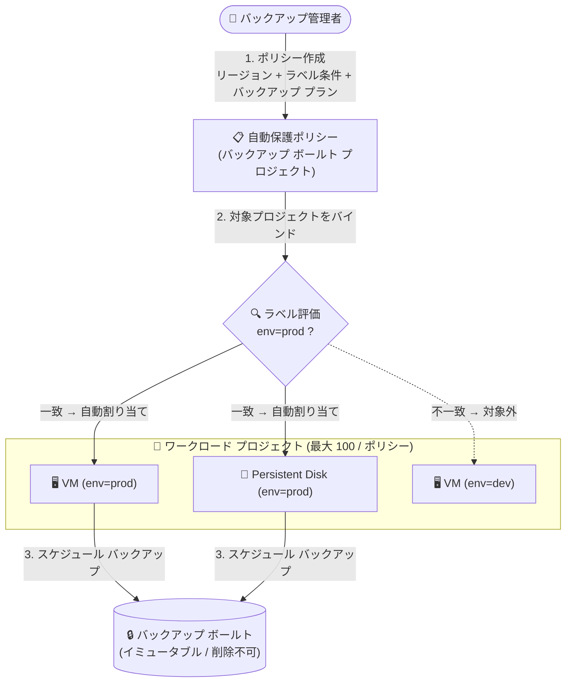

# Backup and DR: 自動保護ポリシーとリソースラベルによる大規模自動保護 (Preview)

**リリース日**: 2026-09-16

**サービス**: Backup and DR

**機能**: 自動保護ポリシー (Auto-protection policies) とリソースラベルによる Compute Engine インスタンス / Persistent Disk の自動保護

**ステータス**: Preview

📊 [このアップデートのインフォグラフィックを見る](https://takech9203.github.io/google-cloud-news-summary/20260916-backup-and-dr-auto-protection-policies.html)

## 概要

Backup and DR で、自動保護ポリシー (Auto-protection policies) とリソースラベルを使用して、Compute Engine インスタンスと Persistent Disk を大規模に自動保護できるようになりました。本機能は Preview として提供されます。

自動保護ポリシーは、ユーザー定義のリソースラベル (Key-Value ペア、例: `env=prod`) を評価して、複数のプロジェクトにまたがる保護対象リソースを自動的に特定し、指定したバックアップ プランを自動的に割り当てます。これまでのように保護対象リソースを個別に選択する必要がなくなり、ラベルという既存のリソース管理の仕組みをそのままバックアップ ガバナンスに転用できます。

多数のプロジェクトと VM / ディスクを運用する組織で、バックアップ管理者が一元的に保護ポリシーを定義し、ワークロード側はラベルを付与するだけで保護が適用される、ポリシー駆動のデータ保護運用を実現する機能です。なお、同時期に gcloud CLI では `gcloud backup-dr auto-protection-policies` / `auto-protection-bindings` などのコマンド群が alpha/beta として追加されています (公式ドキュメント上の管理インターフェースは現時点で Google Cloud コンソールと API で、gcloud CLI / Terraform の正式サポートは今後のリリース予定とされています)。

**アップデート前の課題**

- バックアップ プランを適用するには、Compute Engine インスタンスやディスクを個別に選択して手動で関連付ける必要があった
- 新規作成されたリソースに対して、バックアップ プランの適用漏れが発生しやすく、大規模環境での保護状態の維持に運用負荷がかかっていた
- 複数プロジェクトにまたがるリソースへ一貫した保護ポリシーを適用する仕組みがなかった

**アップデート後の改善**

- ラベル (例: `env=prod`) に一致するリソースへ、バックアップ プランが自動的に割り当てられるようになった
- 1 つのポリシーで同一組織内の複数プロジェクト (1 ポリシーあたり最大 100 プロジェクト推奨) を保護対象にできるようになった
- バックアップ管理者 (バックアップ ボールト プロジェクト側) とワークロード管理者 (ワークロード プロジェクト側) がそれぞれの視点でポリシーと保護状態 (一致リソース数 / 保護済みリソース数 / 保護失敗リソース数) を可視化できるようになった

## アーキテクチャ図



バックアップ管理者がラベル条件とバックアップ プランを定義した自動保護ポリシーを作成すると、対象プロジェクト内のラベル一致リソースに自動的にプランが割り当てられ、バックアップ ボールトへの保護が開始されます。

## サービスアップデートの詳細

### 主要機能

1. **ラベルベースのリソース自動特定**
   - リソースラベル (Key-Value ペア、例: `env=prod`) を条件として、保護対象の Compute Engine インスタンスまたはディスクを自動的に特定
   - 個別リソースの手動選択が不要になり、ラベル運用と保護運用を統合できる

2. **バックアップ プランの自動割り当て**
   - ポリシーに一致したリソースに対して、指定したバックアップ プランの関連付け (Backup Plan Association) を自動的にスケジュール
   - 初回の構成と保護スケジューリングは通常最大 2 時間、場合により最大 8 時間かかる

3. **クロスプロジェクト対応**
   - 同一組織内の複数プロジェクトを 1 つのポリシーの保護対象にでき、ポリシーへのプロジェクトの追加・削除も後から可能
   - バックアップ ボールト プロジェクトで一元管理し、各ワークロード プロジェクト側では「適用されたポリシー」(ポリシー名、条件、ステータス、一致 / 保護済み / 保護失敗リソース数など) を確認できる

4. **ポリシーのライフサイクル管理**
   - コンソールからポリシーの作成・表示・編集・削除、対象プロジェクトの追加・削除が可能
   - ポリシー削除の前には、スコープからすべてのワークロード プロジェクトを削除する必要がある (保護解除も通常最大 2 時間、場合により最大 8 時間)

## 技術仕様

### 機能仕様

| 項目 | 詳細 |
|------|------|
| 対応リソース | Compute Engine インスタンス、ディスク (Persistent Disk) のみ |
| ポリシーのスコープ | 同一組織内の複数プロジェクト (1 ポリシーあたり最大 100 プロジェクトを推奨) |
| リージョン | 1 つのポリシーは単一リージョンのリソースを保護 (複数リージョンはリージョンごとに別ポリシーを作成) |
| 一致条件 | リソースラベルの Key-Value ペア (例: `env=prod`) |
| 管理インターフェース | Google Cloud コンソール、API (gcloud CLI / Terraform サポートは今後追加予定) |
| 反映時間 | 初回の構成・保護スケジューリング / 保護解除は通常最大 2 時間 (最大 8 時間の場合あり) |
| ステータス | Preview (Pre-GA Offerings Terms が適用) |

### 必要な IAM ロール

| プロジェクト | 操作 | ロール |
|------|------|------|
| バックアップ ボールト プロジェクト | ポリシー / バインディングの作成・編集・削除 | Backup and DR Admin (`roles/backupdr.admin`) または Backup and DR Editor (`roles/backupdr.editor`) |
| バックアップ ボールト プロジェクト | ポリシー / バインディング / 一致リソースの表示 | Backup and DR Viewer (`roles/backupdr.viewer`) |
| ワークロード プロジェクト | ポリシー適用の承認・バインディング管理 | Backup and DR Admin または Backup and DR Editor |
| ワークロード プロジェクト | 適用ポリシー / 一致リソースの表示 | Backup and DR Viewer |

クロスプロジェクト保護では、バックアップ ボールトのサービス エージェントに対して、各ワークロード プロジェクトで以下のオペレーター ロールの付与が必要です。

- Compute Engine インスタンス: Backup and DR Compute Engine Operator (`roles/backupdr.computeEngineOperator`)
- ディスク: Backup and DR Disk Operator (`roles/backupdr.diskOperator`)

カスタムロールを使用する場合は、`backupdr.autoProtectionPolicies.create` / `backupdr.autoProtectionPolicyBindings.create` / `backupdr.appliedAutoProtectionPolicies.authorize` などの詳細な権限が必要です (詳細は公式ドキュメントの権限テーブルを参照)。

## 設定方法

### 前提条件

1. バックアップ ボールト プロジェクトとワークロード プロジェクトで必要な IAM ロールが付与されていること
2. 保護対象のバックアップ プラン (およびバックアップ ボールト) が作成済みであること
3. 保護対象の Compute Engine リソースにリソースラベル (Key-Value ペア) が付与されていること

### 手順

#### ステップ 1: リソースラベルの付与

Google Cloud コンソールの「VM インスタンス」または「ディスク」ページで対象リソースを選択し、ラベル (例: キー `env`、値 `prod`) を追加して保存します。

#### ステップ 2: 自動保護ポリシーの作成

1. Google Cloud コンソールで「Backup and DR」ページに移動し、ナビゲーション メニューから「Auto-protection policies」を選択
2. 「Create Auto-protection policy」をクリックし、ポリシー名 (と任意の説明) を入力
3. リソースが存在するリージョンを選択し、保護対象のリソースタイプ (Compute Engine またはディスク) と適用するバックアップ プランを選択
4. 保護対象とする同一組織内のプロジェクトを 1 つまたは複数選択
5. 保護対象リソースのラベル条件 (例: `env = prod`) を入力し、「Create policy」をクリック

作成後、ポリシーは一致するリソースを自動的に特定し、バックアップ プランの関連付けをスケジュールします (通常最大 2 時間、場合により最大 8 時間)。

#### ステップ 3: 保護状態の確認

- バックアップ ボールト プロジェクト側: 「Policies created in this project」タブでポリシーを選択し、「Protected resources」タブで対象プロジェクトごとの一致 / 保護済み / 保護失敗リソース数を確認
- ワークロード プロジェクト側: 「Policies applied on this project」タブで、適用されているポリシー、条件、バックアップ プラン、ステータスを確認

## メリット

### ビジネス面

- **保護漏れリスクの低減**: ラベル条件に一致するリソースが自動的に保護されるため、バックアップ プランの適用漏れによるデータ損失リスクを減らせる
- **ガバナンスの一元化**: バックアップ管理者がバックアップ ボールト プロジェクトでポリシーを一元管理でき、組織全体で一貫したデータ保護基準を適用できる

### 技術面

- **スケーラブルな運用**: 個別リソースの手動関連付けが不要になり、1 ポリシーで最大 100 プロジェクト規模の保護を自動化できる
- **既存のラベル運用との統合**: コスト管理や環境識別に使っている既存のリソースラベルを、そのまま保護対象の判定条件として再利用できる
- **役割分担に沿った可視性**: バックアップ管理者とワークロード管理者がそれぞれの視点でポリシーと保護状態を確認できる

## デメリット・制約事項

### 制限事項 (Preview)

- 対応リソースは Compute Engine インスタンスとディスクのみ
- 本番リソースでの使用は非推奨 (Preview 期間中)。1 ポリシーあたりの保護は最大 100 プロジェクトまで
- 同一プロジェクトに複数のポリシーを適用する場合、すべてのポリシーで同じラベルキーを使用する必要がある (例: `env=prod` と `env=test` は可、`env=prod` と `tier=gold` の併用は不可。プロジェクトが異なれば異なるラベルキーを使用可能)
- 1 つのポリシーは単一リージョンのリソースのみを保護 (マルチリージョンはリージョンごとに個別ポリシーが必要)
- 管理インターフェースは Google Cloud コンソールと API (gcloud CLI / Terraform の正式サポートは今後のリリースで追加予定)

### 考慮すべき点

- ポリシー作成後の初回保護スケジューリングや、プロジェクト削除時の保護解除に最大 8 時間かかる場合があるため、即時反映を前提とした運用は避ける
- Backup and DR のバックアップ プラン自体の制限 (対象リージョンの一致、非対応マシンタイプ・ディスク構成など) は引き続き適用される
- ラベルが保護の判定条件となるため、ラベルの付与・変更に関する統制 (誰がどのラベルを変更できるか) が実質的にバックアップ ガバナンスの一部になる

## ユースケース

### ユースケース 1: 本番環境 VM の保護標準化

**シナリオ**: 組織内の多数のプロジェクトに本番 VM が分散しており、`env=prod` ラベルで管理している。新規 VM 作成時のバックアップ設定漏れが課題。

**実装例**:
```
1. 本番用バックアップ プラン (例: 日次バックアップ + バックアップ ボールト保管) を作成
2. 自動保護ポリシーを作成し、対象リージョン・対象プロジェクト群・条件 env=prod を指定
3. 以降、env=prod ラベル付きで作成された VM に自動的にバックアップ プランが割り当てられる
```

**効果**: 新規リソースを含めて本番 VM の保護が自動化され、適用漏れを防止できる。

### ユースケース 2: 部門・環境別のバックアップ ポリシー適用

**シナリオ**: 環境ごとに異なる保護レベル (本番は長期保持、検証は短期保持) を適用したい。

**効果**: `env=prod` と `env=test` のように同じラベルキーで値の異なるポリシーを同一プロジェクトに複数適用し、環境ごとに異なるバックアップ プランを自動割り当てできる。

## 料金

自動保護ポリシー機能自体の追加料金に関する情報は、現時点の公式ドキュメントには記載されていません。保護対象の Backup and DR (バックアップ管理料金、バックアップ ボールト ストレージ料金) と Compute Engine インスタンス / ディスクの料金が課金対象です。

Backup and DR には 30 日間の導入トライアルがあり、対象プロジェクトでバックアップ管理料金とボールト ストレージ料金なしで機能を評価できます。

詳細は [Backup and DR 料金ページ](https://cloud.google.com/backup-disaster-recovery/pricing) を参照してください。

## 関連サービス・機能

- **Compute Engine**: 本機能の保護対象。インスタンスとディスクに付与したリソースラベルがポリシーの判定条件になる
- **バックアップ ボールト / バックアップ プラン**: 自動保護ポリシーが割り当てるのは既存のバックアップ プランで、バックアップはイミュータブル / 削除不可のバックアップ ボールトに保管される
- **IAM**: バックアップ ボールト プロジェクトとワークロード プロジェクトそれぞれでのロールベースのアクセス制御により、管理者の役割分担を実現
- **Cloud KMS (CMEK)**: バックアップ ボールトは CMEK による暗号化に対応 (Compute Engine インスタンス、Persistent Disk など)

## 参考リンク

- 📊 [インフォグラフィック](https://takech9203.github.io/google-cloud-news-summary/20260916-backup-and-dr-auto-protection-policies.html)
- [公式リリースノート](https://docs.cloud.google.com/release-notes#September_16_2026)
- [ドキュメント: Automate resource protection](https://cloud.google.com/backup-disaster-recovery/docs/protect/automate-protection)
- [ドキュメント: Backup and DR 概要](https://docs.cloud.google.com/backup-disaster-recovery/docs/concepts/backup-dr)
- [料金ページ](https://cloud.google.com/backup-disaster-recovery/pricing)

## まとめ

自動保護ポリシーにより、Backup and DR のバックアップ プラン適用が「リソース単位の手動作業」から「ラベル条件によるポリシー駆動の自動化」へ進化し、複数プロジェクト規模でのデータ保護ガバナンスが大幅に簡素化されます。Preview 段階のため本番リソースでの使用は推奨されていませんが、ラベル運用が整備されている組織は、非本番環境での評価と GA に向けたラベル設計・IAM 設計の準備を始めることを推奨します。

---

**タグ**: #BackupAndDR #ComputeEngine #PersistentDisk #AutoProtection #ResourceLabels #Preview #DataProtection
