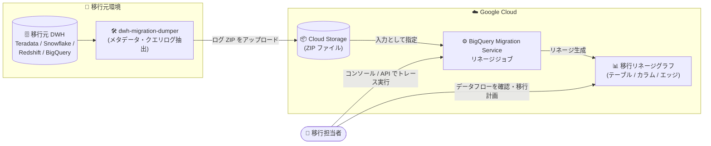

# BigQuery: 移行リネージサービス (Migration Lineage Service) (Preview)

**リリース日**: 2026-09-16

**サービス**: BigQuery

**機能**: 移行リネージサービス (Migration Lineage Service)

**ステータス**: Preview

📊 [このアップデートのインフォグラフィックを見る](https://takech9203.github.io/google-cloud-news-summary/20260916-bigquery-migration-lineage-service.html)

## 概要

BigQuery Migration Service に、移行リネージサービス (Migration Lineage Service) が Preview として追加された。この機能を使用すると、移行元データベース内のデータフローと接続関係を可視化し、BigQuery データウェアハウス移行の計画に役立てることができる。

移行リネージを作成すると、リネージサービスは移行元システム内でデータがどのように流れているか、また各テーブルやビューがどのように接続されているかを可視化するグラフを提供する。グラフではテーブル・ビューがノードとして、データの流れがエッジとして表現され、カラムレベルのリネージまでドリルダウンできる。対応する SQL 方言は Amazon Redshift SQL、Snowflake SQL、Teradata SQL、GoogleSQL (BigQuery) の 4 種類である。

対象ユーザーは、Teradata、Snowflake、Amazon Redshift などのレガシーデータウェアハウスから BigQuery への移行を計画しているデータエンジニアやアーキテクトである。移行前に依存関係を把握することで、移行の順序付けや影響範囲の特定を効率化できる。

**アップデート前の課題**

- 移行元データベースのテーブル・ビュー間の依存関係を把握するには、SQL スクリプトやクエリログを手動で解析する必要があった
- 移行対象オブジェクトの依存関係や利用状況 (どのユーザー・パイプラインがどのテーブルを読み書きしているか) を体系的に可視化する手段が BigQuery Migration Service 内になかった

**アップデート後の改善**

- 移行元データベースのクエリログから、データフローと接続関係を自動的にグラフとして可視化できるようになった
- テーブルレベルだけでなくカラムレベルのリネージも確認でき、エッジをクリックするとその接続を生成した SQL スクリプトまで追跡できるようになった
- 各ノードに関連するユーザー、パイプライン、SQL スクリプトを一覧・CSV ダウンロードでき、移行計画の裏付けデータとして活用できるようになった

## アーキテクチャ図



移行元データベースから `dwh-migration-dumper` ツールでメタデータとクエリログを抽出して Cloud Storage にアップロードし、BigQuery Migration Service のリネージジョブがそれを解析してデータフローの可視化グラフを生成する。

## サービスアップデートの詳細

### 主要機能

1. **データフローの可視化 (Data Flow タブ)**
   - 移行元システム内でデータがどのように流れるかをグラフで表示。ノードはテーブルまたはビュー、エッジは左から右へのデータの流れを表す
   - スキーマごとに色分けされたバーが表示され、同一スキーマのテーブルを視覚的に識別できる
   - ノードのアイコンでビュー、常時全体リフレッシュされるテーブル、短命なテーブル、7 日以上書き込みのない静的テーブルなどの特性を判別できる
   - テーブルをクリックするとカラム一覧 (名前・データ型) を表示し、カラムをクリックするとカラムレベルのリネージグラフに移動できる
   - `WHERE` や `GROUP BY` 句による影響もエッジとして表示され、「Show non-data edges」トグルでデータ転送のみにフィルタリング可能

2. **接続・利用状況の分析 (Connections / Users / Pipelines / Code タブ)**
   - Connections タブ: 現在のノードから近い順に、上流 (プロデューサー) / 下流 (コンシューマー) のノードを一覧表示。CSV ダウンロード可能
   - Users タブ: そのノードを読み書きしたスクリプトを実行したユーザーを、アクション数順に表示
   - Pipelines タブ: そのノードを読み書きしたパイプラインを表示
   - Code タブ: そのノードを読み書きした SQL スクリプトを、該当箇所をハイライトして表示

3. **エッジの詳細分析 (Details / Code タブ)**
   - エッジには述語 (predicate) とカテゴリが付与され、どのような操作 (集計、完全コピー、関数計算、フィルタ、JOIN キー、GROUP BY キーなど) でその接続が生じたかを確認できる
   - `dat` (データ転送)、`res` (フィルタ・制限)、`grp` (グループ化) などの述語タイプで接続の性質を分類
   - Code タブでは、そのエッジを生成した SQL スクリプトをソース・ターゲットのハイライト付きで表示

4. **対応 SQL 方言**
   - Amazon Redshift SQL
   - Snowflake SQL
   - Teradata SQL
   - GoogleSQL (BigQuery)

## 技術仕様

### リネージで使用される用語

| 用語 | 説明 |
|------|------|
| Scripts | リネージ構築時に取り込まれたデータベースログに含まれる SQL スクリプトやプログラム |
| Nodes | リネージグラフの頂点。テーブルとカラムで構成される |
| Tables (Relations) | 通常のテーブル、ビュー、構造化ファイルなどのテーブル状リソース |
| Columns (Attributes) | テーブルのカラム、ビューのプロジェクション、擬似カラム、struct フィールドなどのサブカラム |
| Edges | ノード間の接続。スクリプトの読み書きに起因し、タイムスタンプや述語などのメタデータが付与される |
| Users / Pipelines | スクリプトを実行した主体を示すメタデータラベル。スクリプトを実行元でグループ化するために使用 |

### 必要な IAM 権限

移行リネージサービスを使用するには、プロジェクトに対して **MigrationWorkflow Editor** (`roles/bigquerymigration.editor`) ロールが必要。具体的には以下の権限が求められる。

- `bigquerymigration.workflows.create`
- `bigquerymigration.workflows.get`
- `bigquerymigration.lineageDbs.query`

BigQuery をソースとしてトレースする場合は、追加で以下のロールも必要。

- BigQuery Metadata Viewer (`roles/bigquery.metadataViewer`)
- Data Catalog Viewer (`roles/datacatalog.viewer`)

## 設定方法

### 前提条件

1. `dwh-migration-dumper` コマンドライン抽出ツールをインストールする
2. 抽出したログ ZIP ファイルをアップロードするための Cloud Storage バケットを用意する
3. 必要な IAM ロール (`roles/bigquerymigration.editor`) の付与を受ける

### 手順

#### ステップ 1: dwh-migration-dumper でメタデータとクエリログを抽出

移行元データベース (Amazon Redshift / Snowflake / Teradata / BigQuery) に対して `dwh-migration-dumper` ツールを実行し、ソースシステムのダンプを生成する。BigQuery をソースとする場合の例:

```bash
dwh-migration-dumper --connector bigquery
dwh-migration-dumper --connector bigquery-logs
```

生成されたメタデータとクエリログは 1 つ以上の ZIP ファイルに格納される。

#### ステップ 2: Cloud Storage にアップロード

生成された ZIP ファイルを Cloud Storage バケットにアップロードする。

#### ステップ 3: リネージをトレース (コンソール)

1. Google Cloud コンソールで「Your migration services」ページに移動
2. 「Trace Lineage」で「Trace translation」をクリック
3. 「Lineage configuration」で表示名、処理ロケーション、入力ディレクトリ (ログ ZIP を配置した Cloud Storage パス) を指定
4. 「Trace」をクリック

ジョブは入力サイズによっては完了までに数時間かかる場合がある。完了後、トレースされた移行リネージへのリンクが提供される。

#### ステップ 3 (代替): リネージをトレース (BigQuery Migration API)

```bash
curl -d "{
  \"tasks\": {
    \"TASK_NAME\": {
      \"type\": \"Experimental_Lineage\",
      \"translation_details\": {
        \"target_base_uri\": \"BUCKET_PATH\",
        \"source_target_mapping\": {
          \"source_spec\": { \"base_uri\": \"BUCKET_PATH\" }
        },
        \"target_types\": \"LINEAGE\"
      }
    }
  }
}" \
-H "Content-Type:application/json" \
-H "Authorization: Bearer TOKEN" \
-X POST https://bigquerymigration.googleapis.com/v2/projects/PROJECT_ID/locations/LOCATION/workflows
```

API 経由の場合、`LOCATION` には `eu` または `us` を指定する。完了後、`taskResult.translationTaskResult.consoleUri` フィールドのリンクからリネージビューを開ける。

## メリット

### ビジネス面

- **移行計画の精度向上**: 移行元システムの依存関係を事前に可視化することで、移行の順序付けや段階的な移行計画を根拠に基づいて立案できる
- **移行リスクの低減**: テーブル・ビュー間の見落としがちな依存関係 (`WHERE` / `JOIN` / `GROUP BY` による間接的な影響を含む) を把握でき、移行後の障害リスクを減らせる

### 技術面

- **カラムレベルの追跡**: テーブル単位だけでなくカラム単位のリネージを確認でき、変換ロジックの影響範囲を詳細に分析できる
- **SQL スクリプトへの遡及**: 各エッジを生成した SQL スクリプトをハイライト付きで確認でき、依存関係の根拠を直接検証できる
- **利用状況データの取得**: ノードごとのユーザー・パイプライン・接続ノードの一覧を CSV でダウンロードでき、移行対象の棚卸しに活用できる

## デメリット・制約事項

### 制限事項

- Preview 段階の機能であり、Pre-GA Offerings Terms が適用される (「現状のまま」提供され、サポートが限定される場合がある)
- リネージサービスが処理するのは、移行元データベースの**最も古いログの先頭 5 GB** までである
- 対応する SQL 方言は Amazon Redshift SQL、Snowflake SQL、Teradata SQL、GoogleSQL の 4 種類に限られる

### 考慮すべき点

- リネージジョブは入力サイズによって完了までに数時間かかる場合がある
- ランディングページのオブジェクト総数が移行元データベースの実際のオブジェクト数と一致するか確認が必要。テーブル数が想定より少ない場合は、ログファイルの誤りや 5 GB 制限超過が原因の可能性があり、リネージの再生成が必要になる
- この機能のサポート・フィードバックは専用窓口 (bq-edw-migration-support@google.com) への連絡が必要

## ユースケース

### ユースケース 1: Teradata から BigQuery への移行前の依存関係調査

**シナリオ**: Teradata データウェアハウスを BigQuery へ移行するにあたり、数百のテーブルとビューの依存関係を把握し、移行の波 (ウェーブ) を計画したい。

**実装例**:
```bash
# 1. Teradata から dwh-migration-dumper でクエリログを抽出
# 2. ZIP を Cloud Storage にアップロード
# 3. コンソールの「Trace Lineage」からリネージジョブを実行
# 4. Connections タブで上流・下流の依存を確認し、移行順序を決定
```

**効果**: 依存関係の少ない末端テーブルから段階的に移行するウェーブ計画を、実際のクエリログに基づいて策定できる。

### ユースケース 2: 未使用・静的テーブルの特定による移行スコープ削減

**シナリオ**: 移行対象のテーブル数を削減するため、ほとんど更新されていないテーブルや短命なテーブルを特定したい。

**効果**: Data Flow グラフのアイコン (7 日以上書き込みのないテーブルを示すアイコンや短命テーブルを示すアイコン) により、静的データや一時テーブルを視覚的に識別し、移行スコープの最適化や長期保存ストレージの活用判断に役立てられる。

### ユースケース 3: レポート改修時の影響範囲分析

**シナリオ**: 移行に伴い特定のカラムの変換ロジックを変更する必要があり、そのカラムに依存する下流のビューやテーブルを特定したい。

**効果**: カラムレベルのリネージグラフとエッジの述語 (AGGREGATE、FUNCTION、EXACT_COPY など) により、対象カラムがどのように下流へ伝播しているかを SQL スクリプトレベルまで追跡できる。

## 料金

BigQuery Migration API の利用自体は無料。ただし、入力・出力ファイルに使用する Cloud Storage には通常のストレージ料金が発生する。

- [BigQuery ストレージ料金](https://cloud.google.com/bigquery/pricing#storage)
- [Cloud Storage 料金](https://cloud.google.com/storage/pricing)

## 利用可能リージョン

移行リネージサービスは、BigQuery SQL translator と同じ処理ロケーション (東京 `asia-northeast1`、大阪 `asia-northeast2` を含むアジア太平洋、ヨーロッパ、米国などの選択されたロケーション) で利用できる。なお、API でリネージジョブを実行する場合の処理ロケーションは `eu` または `us` を指定する。

詳細は [BigQuery SQL translator and migration lineage locations](https://docs.cloud.google.com/bigquery/docs/locations#sql-translator-loc) を参照。

## 関連サービス・機能

- **BigQuery Migration Service**: 移行リネージサービスはその一機能。アセスメント、SQL 翻訳 (バッチ / インタラクティブ / API)、データ転送など移行の各フェーズを支援する
- **BigQuery migration assessment**: 移行の実現可能性・コスト・工数を評価するアセスメント機能。リネージと組み合わせて移行計画を立てる
- **dwh-migration-dumper**: 移行元データベースからメタデータとクエリログを抽出するオープンソースのコマンドラインツール。リネージの入力データ生成に使用
- **Cloud Storage**: 抽出したログ ZIP ファイルの配置先として使用
- **Dataplex Universal Catalog データリネージ**: Google Cloud 上のサービス (BigQuery など) 間のリネージを追跡する機能。移行リネージサービスは移行「元」システムのリネージを対象とする点で補完関係にある

## 参考リンク

- 📊 [インフォグラフィック](https://takech9203.github.io/google-cloud-news-summary/20260916-bigquery-migration-lineage-service.html)
- [公式リリースノート](https://docs.cloud.google.com/release-notes#September_16_2026)
- [ドキュメント: Plan a migration with migration lineage](https://docs.cloud.google.com/bigquery/docs/migration/migration-lineage)
- [ドキュメント: Introduction to BigQuery migration](https://docs.cloud.google.com/bigquery/docs/migration-intro)
- [ドキュメント: BigQuery migration assessment](https://docs.cloud.google.com/bigquery/docs/migration-assessment)
- [料金ページ (BigQuery)](https://cloud.google.com/bigquery/pricing)

## まとめ

移行リネージサービスは、レガシーデータウェアハウスから BigQuery への移行計画において最も手間のかかる「依存関係の把握」を、クエリログに基づいて自動的に可視化する機能である。Teradata、Snowflake、Amazon Redshift からの移行を検討している場合は、まず `dwh-migration-dumper` でログを抽出してリネージをトレースし、移行アセスメントと組み合わせて移行ウェーブの計画に活用することを推奨する。Preview 段階のため、ログ処理の 5 GB 制限などの制約を理解した上で利用したい。

---

**タグ**: `BigQuery` `BigQuery Migration Service` `Migration Lineage` `Data Warehouse Migration` `Data Lineage` `Preview` `Teradata` `Snowflake` `Amazon Redshift`
