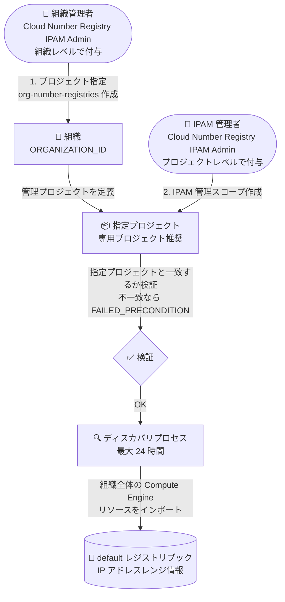

# Cloud Number Registry: 組織セットアップ前のプロジェクト指定の必須化

**リリース日**: 2026-09-16

**サービス**: Cloud Number Registry

**機能**: 組織向けセットアップ前のプロジェクト指定 (org-number-registries リソース) の必須化

**ステータス**: Breaking Change (Cloud Number Registry 自体は Preview)

📊 [このアップデートのインフォグラフィックを見る](https://takech9203.github.io/google-cloud-news-summary/20260916-cloud-number-registry-project-designation.html)

## 概要

Cloud Number Registry は、Google Cloud 上の IP アドレス使用状況を組織全体で可視化・管理・計画するための IPAM (IP Address Management) サービス (Preview) です。IPAM 管理スコープを作成すると、読み取り専用のディスカバリプロセスが組織全体の IP アドレス情報をインポートし、レジストリブックを通じて IP アドレスの利用状況の確認や空きレンジの検索ができます。

今回の Breaking Change により、組織向けに Cloud Number Registry をセットアップ (IPAM 管理スコープを作成) する前に、**Cloud Number Registry を管理するプロジェクトをあらかじめ指定することが必須**になりました。プロジェクトの指定は、組織レベルで Cloud Number Registry IPAM Admin ロールを付与された組織管理者が `org-number-registries` リソースを作成することで行います。IPAM 管理スコープの作成時に、Google Cloud は `org-number-registries` リソースで定義されたプロジェクトと一致するかを検証します。

指定されたプロジェクトには組織全体の IP アドレスレンジ情報が集約されるため、この変更はガバナンスとアクセス制御を強化するものです。組織で Cloud Number Registry の利用を計画している管理者、および既にセットアップ手順を自動化しているチームは影響を確認する必要があります。

**アップデート前の課題**

- IPAM 管理スコープを作成するプロジェクトを組織管理者が事前に承認・統制する仕組みがなかった
- 指定されたプロジェクトには組織全体の IP アドレスレンジ情報が含まれるため、どのプロジェクトで管理するかを組織レベルで明示的にコントロールする必要があった

**アップデート後の改善**

- 組織レベルの Cloud Number Registry IPAM Admin ロールを持つ組織管理者だけが、`org-number-registries` リソースの作成を通じて管理プロジェクトを指定できるようになった
- IPAM 管理スコープの作成時に、指定済みプロジェクトと一致するかが検証されるため、意図しないプロジェクトへの組織全体の IP アドレス情報の集約を防止できるようになった
- `org-number-registries list` / `describe` コマンドで、どのプロジェクトが指定されているかを確認できるようになった

**Breaking Change としての影響**

- プロジェクト指定を行わずに IPAM 管理スコープを作成しようとすると、`FAILED_PRECONDITION: There is no existing registry for 'projects/PROJECT_ID in scope organizations/ORGANIZATION_ID'` エラーで失敗する
- 既存のセットアップ自動化 (スクリプト、IaC) がある場合は、IPAM 管理スコープ作成の前段にプロジェクト指定のステップを追加する必要がある

## アーキテクチャ図



Breaking Change 後のセットアップフロー。組織管理者による `org-number-registries` リソースの作成 (ステップ 1) が完了していないと、IPAM 管理スコープの作成 (ステップ 2) は `FAILED_PRECONDITION` エラーで失敗します。

## サービスアップデートの詳細

### 主要機能

1. **プロジェクト指定 (org-number-registries リソース) の必須化**
   - 組織向けに Cloud Number Registry をセットアップする前に、どのプロジェクトを使用できるかを定義する `org-number-registries` リソースの作成が必須になった
   - IPAM 管理スコープの作成時に、`org-number-registries` リソースで定義されたプロジェクトと一致するかを Google Cloud が検証する
   - 各組織で Cloud Number Registry を構成できるプロジェクトは 1 つのみ

2. **組織レベルでの権限分離**
   - プロジェクト指定には、**組織 (親組織) レベル**で Cloud Number Registry IPAM Admin (`roles/cloudnumberregistry.ipamAdmin`) ロールが必要
   - IPAM 管理スコープの作成 (セットアップ) には、**プロジェクトレベル**で同ロールが必要
   - 組織全体の IP アドレス情報を含むプロジェクトの決定権を組織管理者に限定できる

3. **プロジェクト指定の管理コマンド**
   - `gcloud alpha number-registry org-number-registries create / list / describe / delete` でプロジェクト指定の作成・確認・削除が可能
   - Cloud Number Registry がセットアップ済みの場合、プロジェクト指定を削除するには先に Cloud Number Registry の廃止 (decommission) が必要

## 技術仕様

### プロジェクト指定と IPAM 管理スコープ

| 項目 | 詳細 |
|------|------|
| リソース名 | `org-number-registries` (組織配下、location は `global`) |
| 指定に必要なロール | Cloud Number Registry IPAM Admin (`roles/cloudnumberregistry.ipamAdmin`) を組織レベルで付与 |
| セットアップに必要なロール | 同ロールをプロジェクトレベルで付与 |
| 制約 | 1 組織につき Cloud Number Registry を構成できるプロジェクトは 1 つのみ |
| 検証 | IPAM 管理スコープ作成時に指定プロジェクトとの一致を検証 |
| 未指定時のエラー | `FAILED_PRECONDITION: There is no existing registry for 'projects/PROJECT_ID in scope organizations/ORGANIZATION_ID'` |
| ディスカバリ所要時間 | 既存リソースは最大 24 時間、新規作成リソースは数分以内 |
| 管理スコープのステータス | `SETUP_IN_PROGRESS` → `READY_TO_USE` |

## 設定方法

### 前提条件

1. Cloud Number Registry を管理する専用プロジェクトを作成または選択する (専用プロジェクトの作成を強く推奨)
2. 対象プロジェクトで Cloud Number Registry API を有効化する
3. プロジェクト指定を行うユーザーに、親組織レベルで `roles/cloudnumberregistry.ipamAdmin` を付与する

### 手順

#### ステップ 1: (任意) Cloud Number Registry が構成済みか確認

```bash
gcloud alpha number-registry ipam-admin-scopes check-availability \
    --scopes=organizations/ORGANIZATION_ID \
    --location=global
```

構成済みの場合は `UNAVAILABLE`、未構成の場合は `AVAILABLE` が返ります。

#### ステップ 2: プロジェクトを指定する (org-number-registries リソースの作成)

```bash
gcloud alpha number-registry org-number-registries create ORG_NUMBER_REGISTRY \
    --admin-project=projects/PROJECT_ID \
    --target-scopes=organizations/ORGANIZATION_ID \
    --organization=ORGANIZATION_ID \
    --location=global
```

`ORG_NUMBER_REGISTRY` は組織ナンバーレジストリリソースの名前、`PROJECT_ID` は Cloud Number Registry 情報を格納するプロジェクト、`ORGANIZATION_ID` は管理対象の組織 ID です。

#### ステップ 3: プロジェクト指定を確認する

```bash
gcloud alpha number-registry org-number-registries list \
    --organization=ORGANIZATION_ID \
    --location=global
```

#### ステップ 4: IPAM 管理スコープを作成する (Cloud Number Registry のセットアップ)

```bash
gcloud alpha number-registry ipam-admin-scopes create SCOPE_NAME \
    --enabled-addon-platforms=COMPUTE_ENGINE \
    --scopes=organizations/ORGANIZATION_ID \
    --location=global
```

ステップ 2 で指定したプロジェクトで実行します。作成するとディスカバリプロセスが開始され、組織内の Compute Engine リソースが `default` レジストリブックにインポートされます。

#### ステップ 5: セットアップ状況を確認する

```bash
gcloud alpha number-registry ipam-admin-scopes describe SCOPE_NAME \
    --location=global
```

ステータスが `READY_TO_USE` になればディスカバリ完了です。

## メリット

### ビジネス面

- **ガバナンスの強化**: 組織全体の IP アドレスレンジ情報を集約するプロジェクトを、組織管理者が明示的に承認・統制できる
- **情報漏えいリスクの低減**: 専用プロジェクト + IAM ポリシーにより、組織全体の IP アドレス情報の閲覧を必要な担当者に限定できる

### 技術面

- **セットアップの検証**: IPAM 管理スコープ作成時にプロジェクトの一致が検証され、意図しないプロジェクトでのセットアップを防止できる
- **指定状況の可視性**: `list` / `describe` コマンドでどのプロジェクトが指定されているかを確認でき、トラブルシューティングが容易になる

## デメリット・制約事項

### 制限事項

- 1 組織につき Cloud Number Registry を構成できるプロジェクトは 1 つのみ
- Preview の gcloud alpha コマンドでは、IPAM 管理スコープに指定できる組織スコープは 1 つのみ
- ディスカバリ対象のアドオンプラットフォームは Compute Engine (`COMPUTE_ENGINE`) のみ
- Cloud Number Registry がセットアップ済みのプロジェクトの指定を削除するには、先に Cloud Number Registry の廃止 (decommission) が必要

### 考慮すべき点

- **Breaking Change**: プロジェクト指定を行わずに IPAM 管理スコープを作成すると `FAILED_PRECONDITION` エラーで失敗するため、既存のセットアップ手順・自動化スクリプトの前段にプロジェクト指定ステップの追加が必要
- プロジェクト指定には組織レベルの `roles/cloudnumberregistry.ipamAdmin` が必要なため、セットアップ担当者と組織管理者が異なる場合は事前の調整が必要
- 指定プロジェクトには組織全体の IP アドレスレンジ情報が含まれるため、専用プロジェクトを作成し、アクセスできるプリンシパルを限定する IAM 構成が推奨される
- Cloud Number Registry は Preview のため、Pre-GA Offerings Terms が適用され、サポートが限定される場合がある

## ユースケース

### ユースケース 1: これから組織で Cloud Number Registry を導入する

**シナリオ**: 組織全体の IP アドレス利用状況を可視化するため、Cloud Number Registry を新規にセットアップする。

**実装例**:
```bash
# 組織管理者 (組織レベルの IPAM Admin) が専用プロジェクトを指定
gcloud alpha number-registry org-number-registries create org-cnr \
    --admin-project=projects/cnr-admin-project \
    --target-scopes=organizations/1234567890 \
    --organization=1234567890 \
    --location=global

# 指定プロジェクトで IPAM 管理スコープを作成
gcloud alpha number-registry ipam-admin-scopes create org-scope \
    --enabled-addon-platforms=COMPUTE_ENGINE \
    --scopes=organizations/1234567890 \
    --location=global
```

**効果**: 組織管理者が承認した専用プロジェクトのみで Cloud Number Registry がセットアップされ、組織全体の IP アドレス情報へのアクセスを統制できる。

### ユースケース 2: 既存のセットアップ自動化が FAILED_PRECONDITION で失敗する

**シナリオ**: 以前作成した IaC やスクリプトで IPAM 管理スコープを作成しようとすると、`FAILED_PRECONDITION: There is no existing registry for ...` エラーが発生する。

**対応**: 組織で Cloud Number Registry が別プロジェクトでセットアップ済みでないかを確認し、未セットアップならプロジェクト指定の有無を `org-number-registries list` で確認する。指定がなければ、組織管理者にプロジェクト指定 (またはその権限付与) を依頼し、自動化フローの前段にプロジェクト指定ステップを追加する。

**効果**: Breaking Change 後の新しいセットアップフローに準拠し、エラーなくセットアップを完了できる。

## 関連サービス・機能

- **Compute Engine**: 現時点でディスカバリ対象となる唯一のアドオンプラットフォーム。VPC ネットワークごとにレルムが作成され、IP アドレスレンジが discovered ranges としてインポートされる
- **Resource Manager (組織リソース)**: プロジェクト指定は組織配下の `org-number-registries` リソースとして管理され、対象プロジェクトは組織に所属している必要がある
- **IAM**: プロジェクト指定 (組織レベル) とセットアップ (プロジェクトレベル) の両方で `roles/cloudnumberregistry.ipamAdmin` ロールを使用。指定プロジェクトへのアクセス制限にも IAM ポリシーを利用

## 参考リンク

- 📊 [インフォグラフィック](https://takech9203.github.io/google-cloud-news-summary/20260916-cloud-number-registry-project-designation.html)
- [公式リリースノート](https://docs.cloud.google.com/release-notes#September_16_2026)
- [ドキュメント: Cloud Number Registry で使用するプロジェクトの指定](https://cloud.google.com/number-registry/designate-project-cloud-number-registry)
- [ドキュメント: Cloud Number Registry のセットアップ](https://cloud.google.com/number-registry/set-up-cloud-number-registry)
- [ドキュメント: Cloud Number Registry 概要](https://docs.cloud.google.com/number-registry/cloud-number-registry)

## まとめ

Cloud Number Registry の組織向けセットアップに、組織管理者による事前のプロジェクト指定 (`org-number-registries` リソースの作成) が必須となる Breaking Change です。プロジェクト指定なしで IPAM 管理スコープを作成すると `FAILED_PRECONDITION` エラーで失敗するため、導入予定の組織やセットアップを自動化しているチームは、組織レベルの IPAM Admin ロールの付与とプロジェクト指定ステップの追加を早めに実施することを推奨します。

---

**タグ**: Cloud Number Registry, IPAM, Breaking Change, ネットワーキング, IP アドレス管理, 組織管理, IAM, Preview
