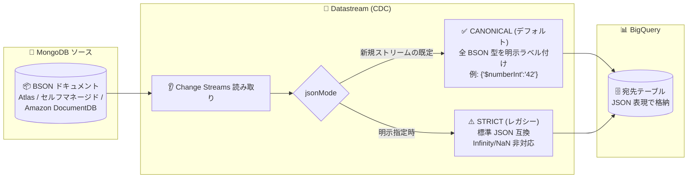

# Datastream: MongoDB Extended JSON canonical モードがデフォルト形式に

**リリース日**: 2026-09-16

**サービス**: Datastream

**機能**: MongoDB ソースから BigQuery 宛先への新規ストリームで Extended JSON canonical モードがデフォルトに

**ステータス**: GA (一般提供)

📊 [このアップデートのインフォグラフィックを見る](https://takech9203.github.io/google-cloud-news-summary/20260916-datastream-mongodb-extended-json-canonical-mode.html)

## 概要

Datastream は、MongoDB ソースから BigQuery 宛先への新規ストリームにおいて、MongoDB Extended JSON の canonical モードをデフォルト形式としてサポートするようになりました。canonical モードは、すべての BSON 型に明示的な型ラベルを付与する (たとえば 32 ビット整数と 64 ビット整数を区別する) ことで、データ交換時の精度損失を防ぎ、より高いデータ忠実性 (data fidelity) を実現します。

MongoDB は BSON (バイナリ JSON) 形式でドキュメントを保持しますが、BigQuery に書き込む際は JSON テキスト表現への変換が必要です。従来の strict モード (Extended JSON v1) は標準的な JSON パーサーとの互換性を優先したレガシー形式であり、`Infinity`、`-Infinity`、`NaN` といった数値をサポートせず、これらの値を含むドキュメントは破棄されるという制約がありました。今回のアップデートにより、新規ストリームでは全データ型をサポートする canonical モードが標準となり、MongoDB のデータを精度を保ったまま BigQuery に複製できます。

MongoDB を運用データベースとして利用し、BigQuery で分析を行うデータエンジニアやアナリティクスチームにとって、CDC (変更データキャプチャ) パイプラインのデータ品質を高める重要なアップデートです。

**アップデート前の課題**

- canonical モードがデフォルトではなく、レガシー形式である strict モード (Extended JSON v1) では `Infinity`、`-Infinity`、`NaN` の数値がサポートされず、これらの値を含むドキュメントは破棄されていた
- strict モードでは `3.1415926535` (DOUBLE) や `42` (INT32) がプレーンな JSON 値として書き込まれるため、32 ビット整数と 64 ビット整数の区別など BSON 型の情報が失われ、精度損失のリスクがあった

**アップデート後の改善**

- 新規ストリームでは canonical モードがデフォルトとなり、すべての BSON 型が `{"$numberInt":"42"}` のように明示的にラベル付けされ、精度損失を防止できる
- canonical モードは `Infinity`、`-Infinity`、`NaN` を含むすべてのデータ型をサポートし、ドキュメントが破棄されなくなる
- 標準 JSON パーサーとの互換性が必要な下流アプリケーション向けには、引き続き `jsonMode` に `STRICT` を指定して strict モードを選択できる

## アーキテクチャ図



MongoDB の Change Streams から取得した BSON ドキュメントを、Datastream が Extended JSON に変換して BigQuery へ書き込むデータフローです。新規ストリームでは高忠実性の canonical モードがデフォルトで適用され、必要に応じて strict モードを明示的に選択できます。

## サービスアップデートの詳細

### 主要機能

1. **canonical モードのデフォルト化**
   - MongoDB ソースから BigQuery 宛先への新規ストリームで、Extended JSON canonical モードがデフォルト形式になった
   - すべての BSON 型に明示的な型ラベルを付与し、データ交換時の精度損失を防止する

2. **全 BSON データ型のサポート**
   - canonical モードは `Infinity`、`-Infinity`、`NaN` を含むすべてのデータ型をサポート
   - strict モードではこれらの値を含むドキュメントが破棄されるため、これらの値を持つデータベースでは canonical モード (デフォルト) の使用が推奨される

3. **strict モードの選択肢は維持**
   - 下流アプリケーションが標準 JSON パーサーとの互換性を必要とする場合は、ストリーム作成時に `jsonMode` を `STRICT` に設定可能
   - API で有効な値は `CANONICAL` (デフォルト) と `STRICT` の 2 つ

## 技術仕様

### canonical モードと strict モードの比較

| 項目 | canonical モード (デフォルト) | strict モード |
|------|------------------------------|---------------|
| 位置づけ | データ忠実性を優先するモダンな形式 | JSON パーサー互換性を優先するレガシー形式 (Extended JSON v1) |
| BSON 型のラベル付け | すべての型を明示的にラベル付け | 標準 JSON に存在しない型のみ `$date` などの規約で表現 |
| `Infinity` / `-Infinity` / `NaN` | サポート (`{"$numberDouble":"Infinity"}` など) | 非対応 (含むドキュメントは破棄) |
| パフォーマンス | strict モードよりわずかに遅くなる可能性がある | - |

### BigQuery での主なデータ型表現の例

| BSON データ型 | 例 | canonical モード | strict モード |
|--------------|-----|------------------|---------------|
| DOUBLE | 3.1415926535 | `{"$numberDouble":"3.1415926535"}` | `3.1415926535` |
| INT32 | 42 | `{"$numberInt": "42"}` | `42` |
| INT64 | 1864712049423024127 | `{"$numberLong": "1864712049423024127"}` | `{"$numberLong": "1864712049423024127"}` |
| DATE | 2024-12-25T10:30:00.000+00:00 | `{"$date":{"$numberLong":"1735122600000"}}` | `{"$date": 1735122600000}` |
| BINARY DATA | `new BinData(0, "...")` | `{"$binary":{"base64":"...","subType":"00"}}` | `{"$binary":"...","$type":"00"}` |
| NaN | NaN | `{"$numberDouble":"NaN"}` | 非対応 |

その他のデータ型のマッピングは [MongoDB data types in BigQuery](https://docs.cloud.google.com/datastream/docs/bq-map-data-types#mongodb-data-types) を参照してください。

### MongoDB ソースのサポート範囲

| 項目 | 詳細 |
|------|------|
| サポートされる MongoDB バージョン | 5.0 より後のバージョン |
| サポートされるデータベース | MongoDB Atlas、セルフマネージド MongoDB、Amazon DocumentDB (インスタンスベース)、Azure DocumentDB (旧 Azure Cosmos DB for MongoDB vCore ベース) |
| レプリケーション方式 | Change Streams (レプリカセットおよびシャーディングされたクラスタに対応) |

## 設定方法

### 前提条件

1. MongoDB ソースの接続プロファイルと宛先 (BigQuery) の接続プロファイルが作成済みであること
2. ソースの MongoDB データベースが Datastream 用に構成済みであること (バージョン 5.0 より後、Change Streams が利用可能)

### 手順

#### ステップ 1: デフォルト (canonical モード) でストリームを作成

新規ストリームでは canonical モードがデフォルトで適用されるため、`jsonMode` の指定は不要です。

#### ステップ 2: strict モードが必要な場合のみ明示的に指定

gcloud CLI には JSON モード専用のフラグはなく、`--mongodb-source-config` フラグに渡す構成ファイルで指定します。

```json
// mongo_source_config.json
{
  "jsonMode": "STRICT",
  "includeObjects": {
    "databases": [
      {
        "database": "DATABASE_NAME",
        "collections": [
          { "collection": "COLLECTION_NAME" }
        ]
      }
    ]
  }
}
```

```bash
gcloud datastream streams create STREAM_ID \
  --location=LOCATION \
  --display-name="STREAM_DISPLAY_NAME" \
  --source=projects/PROJECT_ID/locations/LOCATION/connectionProfiles/SOURCE_PROFILE \
  --destination=projects/PROJECT_ID/locations/LOCATION/connectionProfiles/DEST_PROFILE \
  --mongodb-source-config=mongo_source_config.json \
  --bigquery-destination-config=bigquery_destination_config.json
```

REST API の場合は、`sourceConfig.mongodbSourceConfig` オブジェクト内で `"jsonMode": "STRICT"` を設定します。

## メリット

### ビジネス面

- **データ品質の向上**: BSON 型情報が保持されることで、分析基盤に取り込むデータの精度損失を防ぎ、数値精度が重要な金融・科学計算系ワークロードでも信頼性の高い分析ができる
- **データ欠損リスクの低減**: strict モードで破棄されていた `Infinity` / `-Infinity` / `NaN` を含むドキュメントも複製されるため、ソースと宛先間のデータ欠損を防げる

### 技術面

- **型忠実性の保証**: 32 ビット整数と 64 ビット整数の区別など、すべての BSON 型が明示的にラベル付けされ、データ交換時の精度損失を防止できる
- **設定不要でデフォルト適用**: 新規ストリームでは追加設定なしで canonical モードが適用される
- **後方互換の選択肢**: 標準 JSON パーサー互換が必要な場合は `jsonMode: STRICT` で従来形式を選択できる

## デメリット・制約事項

### 制限事項

- canonical モードは strict モードよりわずかに遅くなる可能性がある (公式ドキュメントに明記)
- 対象は「新規ストリーム」のデフォルト形式であり、strict モードで運用中の既存ストリームの形式が自動的に変わるものではない
- MongoDB ソース共通の制限として、Datastream API ではフィールドの除外リストのみ指定可能 (フィールドの包含リストは非サポート)、Request Unit (RU) ベースの Azure Cosmos DB と Amazon DocumentDB Elastic Clusters は非サポート

### 考慮すべき点

- canonical モードでは `{"$numberInt":"42"}` のように値の表現が strict モードより冗長になるため、BigQuery 側でのパース処理 (下流クエリ) が Extended JSON の型ラベルを前提とした実装になっているか確認が必要
- 標準 JSON パーサーとの互換性を前提とする下流アプリケーションがある場合は、ストリーム作成時に明示的に `STRICT` を指定する必要がある

## ユースケース

### ユースケース 1: 数値精度が重要な MongoDB データの BigQuery 分析

**シナリオ**: 金融取引データを MongoDB Atlas に保存しており、INT64 や DECIMAL128 など精度が重要な数値型を含むコレクションを BigQuery にリアルタイム複製して分析したい。

**効果**: canonical モードにより全 BSON 型が明示的にラベル付けされ、32 ビット / 64 ビット整数の区別や高精度小数 (`$numberDecimal`) が保持されたまま BigQuery に複製されるため、精度損失なく分析できる。

### ユースケース 2: 特殊な数値 (NaN / Infinity) を含む計測データの複製

**シナリオ**: IoT や科学計算のデータで、計算結果として `NaN` や `Infinity` が混在するドキュメントを MongoDB に保存しており、strict モードではこれらのドキュメントが破棄されてしまっていた。

**効果**: canonical モード (デフォルト) では `{"$numberDouble":"NaN"}` のように表現されて複製されるため、ドキュメントの欠損なく BigQuery にデータを集約できる。

## 料金

Datastream の料金は、ソースから宛先へ処理されたデータ量 (GB) に基づいて課金されます。宛先にストリーミングされたデータのみが課金対象です。BigQuery と組み合わせて使用する場合、BigQuery の費用 (CDC 処理を含む) は Datastream とは別に課金されます。

今回のアップデートによる料金体系の変更はアナウンスされていません。詳細は [Datastream の料金ページ](https://cloud.google.com/datastream/pricing) を参照してください。

## 関連サービス・機能

- **BigQuery**: 本アップデートの対象となる宛先。Datastream は Storage Write API を使用して変更イベントを BigQuery テーブルにストリーミングし、BigQuery が CDC としてテーブルに適用する
- **MongoDB Atlas / セルフマネージド MongoDB / Amazon DocumentDB / Azure DocumentDB**: Datastream の MongoDB ソースとしてサポートされるデータベース (MongoDB ソースは 2025 年 9 月 23 日に GA)
- **Secret Manager**: Datastream の接続プロファイルの認証情報を安全に保管するために利用可能
- **Private Service Connect インターフェイス**: MongoDB Atlas などへのプライベート接続方式として利用可能

## 参考リンク

- 📊 [インフォグラフィック](https://takech9203.github.io/google-cloud-news-summary/20260916-datastream-mongodb-extended-json-canonical-mode.html)
- [公式リリースノート](https://docs.cloud.google.com/release-notes#September_16_2026)
- [Stream data from MongoDB databases](https://docs.cloud.google.com/datastream/docs/sources-mongodb)
- [MongoDB data types in BigQuery](https://docs.cloud.google.com/datastream/docs/bq-map-data-types#mongodb-data-types)
- [Manage streams (MongoDB strict JSON mode の設定例)](https://docs.cloud.google.com/datastream/docs/manage-streams)
- [MongoDB Extended JSON (MongoDB 公式)](https://www.mongodb.com/docs/manual/reference/mongodb-extended-json/)
- [料金ページ](https://cloud.google.com/datastream/pricing)

## まとめ

MongoDB から BigQuery への CDC パイプラインにおいて、新規ストリームのデフォルトが高忠実性の canonical モードとなり、BSON 型情報の保持と `NaN` / `Infinity` を含むドキュメントの欠損防止が標準で実現されます。新規に MongoDB ストリームを構築する際は、BigQuery 側の下流クエリが canonical 形式 (型ラベル付き Extended JSON) を正しくパースできるかを確認し、標準 JSON パーサー互換が必要な場合のみ `jsonMode: STRICT` を明示的に指定することを推奨します。

---

**タグ**: Datastream, MongoDB, BigQuery, CDC, データレプリケーション, BSON, Extended JSON, データ忠実性
