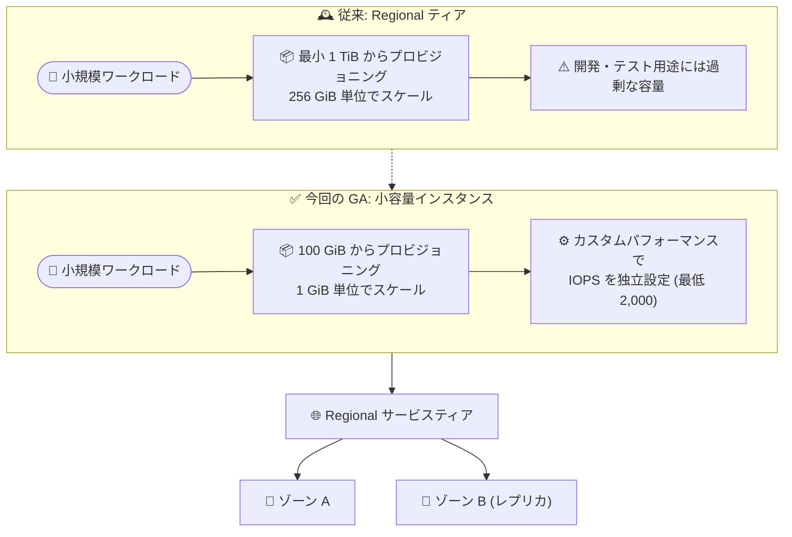

# Filestore: Regional サービスティアの小容量インスタンスが GA

**リリース日**: 2026-09-16

**サービス**: Filestore

**機能**: Regional サービスティアの小容量 (Small capacity) インスタンス

**ステータス**: GA (一般提供)

📊 [このアップデートのインフォグラフィックを見る](https://takech9203.github.io/google-cloud-news-summary/20260916-filestore-small-capacity-regional-ga.html)

## 概要

Filestore の Regional サービスティアにおいて、小容量 (Small capacity) インスタンスが一般提供 (GA) となりました。小容量インスタンスは 100 GiB から作成でき、1 GiB 単位で容量をスケールできます。開発、テスト、トラフィックの少ないアプリケーションや基本的なストレージニーズを持つアプリケーション向けの選択肢として提供されます。

Regional サービスティアは、リージョン内の複数ゾーンにデータを複製することでゾーン障害に耐性を持つ、ミッションクリティカルなワークロード向けのティアです。従来は最小容量が 1 TiB であったため、小規模な用途ではコストと容量が過剰になりがちでした。今回の GA により、ゾーン障害耐性を持つリージョナルな NFS ストレージを、必要最小限の容量 (100 GiB〜) で利用開始し、需要の拡大に合わせて 1 GiB 単位で拡張していく運用が可能になります。

なお、1,024 GiB 未満の Regional インスタンスを作成する場合は、容量とは独立してパフォーマンスを設定できる「カスタムパフォーマンス」機能の利用が必須です。

**アップデート前の課題**

- Regional サービスティアの最小容量は 1 TiB で、開発・テスト環境や小規模アプリケーションには容量・コストが過剰だった
- 下位容量レンジ (1 TiB〜9.75 TiB) のスケーリング単位は 256 GiB で、細かな容量調整ができなかった
- 小規模ワークロードでゾーン障害耐性 (リージョナル可用性) を得るには、必要以上のストレージをプロビジョニングする必要があった

**アップデート後の改善**

- Regional インスタンスを 100 GiB から作成できるようになった (対応リージョンの場合)
- 容量を 1 GiB 単位でスケール (拡張・縮小) できるようになった
- カスタムパフォーマンスにより、容量とは独立して IOPS を設定でき、小容量でも必要な性能 (最低 2,000 IOPS) を確保できる
- 開発・テスト用途から始めて、アプリケーションの成長に合わせて段階的に容量を拡張する運用が可能になった

## アーキテクチャ図



従来は 1 TiB が最小容量だった Regional ティアが、対応リージョンでは 100 GiB から 1 GiB 単位で利用可能になりました。複数ゾーンへのデータ複製によるゾーン障害耐性はそのまま享受できます。

## サービスアップデートの詳細

### 主要機能

1. **100 GiB からの小容量プロビジョニング**
   - 対応リージョンでは、Regional インスタンスの下位容量レンジが 100 GiB〜10,239 GiB (約 0.097 TiB〜9.99 TiB) に拡大
   - 非対応リージョンでは従来通り 1 TiB〜9.75 TiB
   - 開発、テスト、低トラフィックのアプリケーション、基本的なストレージニーズに適した選択肢

2. **1 GiB 単位のきめ細かなスケーリング**
   - 対応リージョンの下位容量レンジでは、容量の増減を 1 GiB 単位で実行可能 (非対応リージョンは 256 GiB 単位)
   - IOPS の増分は 100 単位
   - スケールアップ・スケールダウンの両方向に対応

3. **カスタムパフォーマンスによる性能設定 (1,024 GiB 未満では必須)**
   - 固定 IOPS レート: 2,000 IOPS 以上の任意の値を指定
   - IOPS per TiB 比率: 4,000〜17,000 の範囲で指定 (計算結果の IOPS は 2,000 を下回れない)
   - 容量とは独立してパフォーマンスを最適化可能

## 技術仕様

### Regional ティア 下位容量レンジの比較 (対応リージョン vs 非対応リージョン)

| 項目 | 対応リージョン | 非対応リージョン |
|------|---------------|------------------|
| 容量レンジ | 100 GiB〜10,239 GiB | 1 TiB〜9.75 TiB |
| 容量の増分 | 1 GiB | 256 GiB |
| IOPS の増分 | 100 | 100 |

### Regional ティアの主な仕様

| 項目 | 詳細 |
|------|------|
| 可用性 | リージョナル (複数ゾーンへのデータ複製によりゾーン障害に耐性) |
| プロトコル | NFSv3、NFSv4.1 |
| データ保護 | バックアップ、スナップショット、インスタンスレプリケーション |
| CMEK (顧客管理の暗号鍵) | サポート |
| 無停止メンテナンス | サポート (メンテナンス中もインスタンスは利用可能) |
| スケーリング方向 | 拡張・縮小の両方向 |
| クライアント接続数 (カスタムパフォーマンス有効時) | 購入 IOPS 1,000 あたり 100 接続 |

### カスタムパフォーマンスの IOPS 消費モデル

購入した IOPS は読み取り・書き込みの合計で 100% 利用できますが、操作ごとの重みが異なります。

| 操作 | 消費 IOPS |
|------|-----------|
| 読み取り 1 操作 | 1 IOPS |
| 書き込み 1 操作 | 3.33 IOPS |

例: 4,000 IOPS を購入した場合、すべて読み取りに使うと最大 4,000 読み取り IOPS、すべて書き込みに使うと最大 1,200 書き込み IOPS となります。

## 設定方法

### 前提条件

1. 小容量インスタンス対応リージョン (us-central1 または us-east4) を選択すること
2. 1,024 GiB 未満のインスタンスを作成する場合、カスタムパフォーマンス (`--performance` フラグ) の指定が必須
3. VPC ネットワークの準備 (コンソールから作成する場合は Private Service Connect とサービス接続ポリシーが必要。gcloud CLI / API の場合は VPC ネットワークピアリングも利用可能)

### 手順

#### ステップ 1: 小容量 Regional インスタンスの作成

```bash
gcloud filestore instances create nfs-server \
  --region=us-central1 \
  --tier=REGIONAL \
  --performance=max-iops-per-tb=17000 \
  --file-share=name="vol1",capacity=100GB \
  --network=name="default"
```

`--performance` フラグでは、容量に比例してスケールする `max-iops-per-tb` (4,000〜17,000) か、容量に依存しない固定値 `max-iops` (2,000 以上) のいずれかを指定します。1,024 GiB 未満の Regional インスタンスではこのフラグが必須です。

#### ステップ 2: インスタンスの確認

```bash
gcloud filestore instances describe nfs-server --region=us-central1
```

出力の `customPerformanceSupported: true` と `performanceConfig` セクションで、カスタムパフォーマンスの状態と設定値 (最大 IOPS、最大スループットなど) を確認できます。

## メリット

### ビジネス面

- **コスト最適化**: 開発・テスト環境や小規模アプリケーションで、必要な分 (100 GiB〜) だけをプロビジョニングでき、過剰な事前投資を回避できる
- **スモールスタート**: 小容量で始めて、アプリケーションの成長に合わせて 1 GiB 単位で段階的に拡張できる

### 技術面

- **ゾーン障害耐性を小規模でも確保**: 複数ゾーンへのデータ複製による高可用性を、小容量ワークロードでも利用できる
- **容量と性能の分離**: カスタムパフォーマンスにより、小容量でも最低 2,000 IOPS を確保でき、性能のために容量を過剰に確保する必要がない
- **柔軟なスケーリング**: 拡張・縮小の両方向に 1 GiB 単位で調整可能

## デメリット・制約事項

### 制限事項

- 小容量インスタンス機能は現時点で **us-central1 と us-east4 の 2 リージョンのみ**で利用可能 (他リージョンでは最小 1 TiB)
- 1,024 GiB 未満のインスタンスでは**カスタムパフォーマンスの有効化が必須** (最低 IOPS は 2,000 固定)
- カスタムパフォーマンスは一度有効化するとそのインスタンスでは無効化できず、購入 IOPS に基づいて課金される
- 容量レンジ (下位/上位) の選択は永続的で、レンジをまたぐスケーリングはできない (レンジ変更には新規インスタンスの作成が必要)
- Regional ティアは Filestore マルチシェア機能および GKE Filestore CSI ドライバと併用できない

### 考慮すべき点

- パフォーマンスは容量に対して線形にスケールするため、小容量インスタンスでは大容量インスタンスに比べて絶対性能が低くなる点をワークロード要件と照らして確認する
- バックアップからのリストアは新規インスタンスへのみ可能で、リストア先はバックアップサイズ以上の容量と同一サービスティアが必要

## ユースケース

### ユースケース 1: 開発・テスト環境の NFS ストレージ

**シナリオ**: 本番では Regional ティアの Filestore を利用しており、開発・テスト環境でも同じティア構成を再現したいが、1 TiB のプロビジョニングはコスト過剰。

**実装例**:
```bash
gcloud filestore instances create dev-nfs \
  --region=us-central1 \
  --tier=REGIONAL \
  --performance=max-iops=2000 \
  --file-share=name="dev",capacity=100GB \
  --network=name="default"
```

**効果**: 本番と同一ティアの構成を 100 GiB の最小容量で再現でき、環境の忠実性を保ちながらストレージコストを抑制できる。

### ユースケース 2: 低トラフィックアプリケーションの共有ストレージ

**シナリオ**: 社内ツールや小規模 Web アプリケーションなど、複数の VM から共有ファイルアクセスが必要だが、データ量は数百 GiB 程度で、ゾーン障害時にも継続稼働が求められる。

**効果**: ゾーン障害耐性を持つリージョナル NFS を必要容量のみで運用でき、データ増加時は 1 GiB 単位で無駄なく拡張できる。

## 料金

Filestore の料金はサービスティア、リージョン、プロビジョニング容量に基づきます。カスタムパフォーマンスを有効化したインスタンス (小容量インスタンスでは必須) は、購入した IOPS に基づく課金が適用され、カスタムパフォーマンスを使用しないインスタンスとは課金体系が異なります。

詳細な料金は公式の料金ページを参照してください。

- [Filestore 料金ページ](https://cloud.google.com/filestore/pricing)

## 利用可能リージョン

小容量 Filestore インスタンス機能は、Regional サービスティア向けに以下のリージョンで利用可能です。

- us-central1
- us-east4

上記以外のリージョンでは、Regional インスタンスの最小容量は従来通り 1 TiB です。

## 関連サービス・機能

- **Filestore カスタムパフォーマンス**: 容量と独立して IOPS を設定する機能。1,024 GiB 未満の小容量インスタンスでは有効化が必須
- **Filestore バックアップ / スナップショット**: 小容量インスタンスでもデータ保護機能を利用可能
- **Filestore インスタンスレプリケーション**: Regional ティアでサポートされるレプリケーション機能
- **Google Cloud VMware Engine**: Regional ティアはデータストアとしてサポート
- **Compute Engine**: NFS クライアントとして Filestore ファイル共有をマウントして利用

## 参考リンク

- 📊 [インフォグラフィック](https://takech9203.github.io/google-cloud-news-summary/20260916-filestore-small-capacity-regional-ga.html)
- [公式リリースノート](https://docs.cloud.google.com/release-notes#September_16_2026)
- [Small capacity instances (サービスティア ドキュメント)](https://docs.cloud.google.com/filestore/docs/service-tiers#small-instances)
- [Regional サービスティア](https://docs.cloud.google.com/filestore/docs/service-tiers-regional)
- [カスタムパフォーマンス](https://docs.cloud.google.com/filestore/docs/custom-performance)
- [インスタンスの作成](https://docs.cloud.google.com/filestore/docs/creating-instances)
- [料金ページ](https://cloud.google.com/filestore/pricing)

## まとめ

Regional ティアの小容量インスタンス GA により、ゾーン障害耐性を持つエンタープライズグレードの NFS ストレージを 100 GiB から利用できるようになり、開発・テストや小規模ワークロードでの Filestore 採用のハードルが大きく下がりました。対応リージョンは現時点で us-central1 と us-east4 に限られるため、利用予定のリージョンを確認のうえ、1,024 GiB 未満ではカスタムパフォーマンス設定 (最低 2,000 IOPS) が必須である点を踏まえて設計することを推奨します。

---

**タグ**: #Filestore #Regional #NFS #ストレージ #GA #小容量インスタンス #カスタムパフォーマンス
