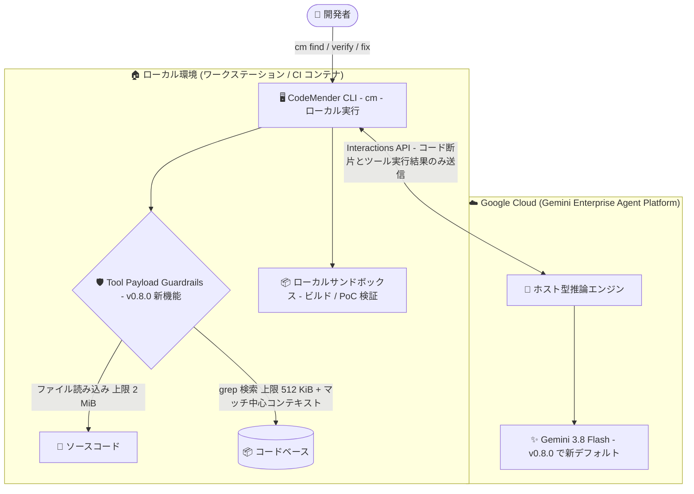

# Gemini Enterprise Agent Platform: CodeMender アップデート (v0.8.0)

**リリース日**: 2026-09-16

**サービス**: Gemini Enterprise Agent Platform

**機能**: CodeMender v0.8.0 - Gemini 3.8 Flash デフォルトモデル化、Tool Payload Guardrails、バグ修正

**ステータス**: Preview (CodeMender は Pre-GA Offerings Terms の対象)

📊 [このアップデートのインフォグラフィックを見る](https://takech9203.github.io/google-cloud-news-summary/20260916-gemini-enterprise-agent-platform-codemender-v0-8-0.html)

## 概要

Gemini Enterprise Agent Platform 上でホストされる AI コードセキュリティエージェント **CodeMender** の v0.8.0 がリリースされた。CodeMender はコードベースの脆弱性をスキャン・検証・修正する自律型エージェントで、クラウド側のホスト型推論エンジンとローカル実行 CLI (`cm`) を組み合わせた「ローカルファースト」実行モデルを採用している。

本リリースの目玉は、2026 年 9 月 2 日に GA となった **Gemini 3.8 Flash** (`gemini-3.8-flash`) が CodeMender CLI セッションのデフォルトモデルとしてサポート・有効化されたことである。より高速な推論と改善された推論能力が標準で利用できるようになり、新デフォルトが有効になった際は CLI 上でワンタイム通知が表示される。また、ファイル読み込みと grep 検索に安全な出力上限を設ける **Tool Payload Guardrails** が導入され、大規模リポジトリのスキャン時に発生していたペイロードオーバーフローエラーが解消された。加えて、Windows 環境でのシェル検出や `cm verify` の findings 永続化に関する複数のバグが修正されている。

対象ユーザーは、CodeMender を利用してコードベースの脆弱性検出・検証・修正を行う開発チームやセキュリティチーム、特に大規模リポジトリや Windows 環境、CI/CD パイプラインで CodeMender を運用しているユーザーである。

**アップデート前の課題**

- Gemini 3.8 Flash は CodeMender CLI セッションのモデルとしてサポートされておらず、最新モデルによる高速推論の恩恵を受けられなかった
- 大きなファイルの読み込みや大規模コードベースの grep 検索でツール出力が肥大化し、ペイロードオーバーフローエラーが発生してスキャンが不安定になることがあった
- Windows で Git Bash が標準レジストリ登録の場所や PATH 外の場所にインストールされている場合、リポジトリのリセットやエクスプロイト検証中にシェル検出・コマンド実行が失敗することがあった
- `cm verify` で検証済みの findings が「not found」と報告されたり、セッションの完了・再開時に信頼度 (confidence) やステータスが永続化されないことがあった
- 生成された検証スクリプト内の grep アサーションで不正な正規表現エスケープによる構文エラーが発生することがあった
- 長時間実行セッションで HTTP 409 リース競合エラーが発生することがあった

**アップデート後の改善**

- Gemini 3.8 Flash がデフォルトモデルとして有効化され、追加設定なしで高速な推論と改善された推論能力を利用できるようになった (新デフォルト有効時は CLI にワンタイム通知を表示)
- ファイル読み込み 2 MiB、コードベース grep 検索 512 KiB の安全な出力上限 (マッチ中心のコンテキストウィンドウ付き) が導入され、ペイロードオーバーフローエラーが解消し、大規模リポジトリスキャンの安定性が向上した
- Windows の Git Bash インストール場所 (標準レジストリ / 非 PATH) に起因するシェル検出・コマンド実行の失敗が修正された
- `cm verify` の検証済み findings の「not found」問題と、セッション完了・再開時の confidence / ステータスの永続化失敗が修正された
- 検証スクリプト生成時の正規表現エスケープ起因の構文エラーが修正され、ストリーミング HTTP 接続の速やかな解放により長時間セッションでの HTTP 409 リース競合エラーが防止されるようになった

## アーキテクチャ図



CodeMender のローカルファースト実行モデル。v0.8.0 では、ローカル CLI のツール出力 (ファイル読み込み・grep 検索) にガードレールが導入され、クラウド側の推論エンジンのデフォルトモデルが Gemini 3.8 Flash になった。

## サービスアップデートの詳細

### 主要機能

1. **Gemini 3.8 Flash のデフォルトモデル化**
   - Gemini 3.8 Flash (`gemini-3.8-flash`) が CodeMender CLI セッションでサポートされ、デフォルトモデルとして有効化された
   - より高速な推論と改善された推論能力を提供する
   - 新しいデフォルトが有効になった際、CLI 上にワンタイム通知が表示される
   - 従来通り `--model` フラグでモデルを上書き可能 (`gemini-3.7-flash`、`gemini-3.6-flash`、`gemini-3.5-flash`、`gemini-3.1-pro-preview`)

2. **Tool Payload Guardrails**
   - ファイル読み込みに 2 MiB、コードベース grep 検索に 512 KiB の安全な出力上限を導入
   - grep 検索ではマッチを中心としたコンテキストウィンドウ (centered match context windows) を提供
   - ペイロードオーバーフローエラーを解消し、大規模リポジトリスキャン時の安定性を改善

3. **バグ修正**
   - **Windows シェル検出**: Git Bash が標準レジストリ登録の場所や PATH 外の場所にインストールされている場合に、リポジトリリセットやエクスプロイト検証中のシェル検出・コマンド実行が失敗する問題を修正
   - **cm verify の findings 永続化**: 検証済み findings が「not found」と報告される問題、およびセッション完了・再開時に confidence とステータスの永続化に失敗する問題を修正
   - **検証スクリプトの構文エラー**: `cm verify` 中の grep アサーションにおける不正な正規表現エスケープに起因する、生成された検証スクリプトの構文エラーを修正
   - **HTTP 409 リース競合**: ストリーミング HTTP 接続を速やかに解放することで、長時間実行セッション中の HTTP 409 リース競合エラーを防止

## 技術仕様

### Tool Payload Guardrails の上限値

| ツール | 出力上限 | 補足 |
|------|------|------|
| ファイル読み込み | 2 MiB | 安全な出力上限 |
| コードベース grep 検索 | 512 KiB | マッチ中心のコンテキストウィンドウ付き |

### CodeMender で利用可能なモデル (`--model` フラグ)

| モデル | 識別子 | 備考 |
|------|------|------|
| Gemini 3.8 Flash | `gemini-3.8-flash` | **v0.8.0 で新デフォルト** |
| Gemini 3.7 Flash | `gemini-3.7-flash` | |
| Gemini 3.6 Flash | `gemini-3.6-flash` | |
| Gemini 3.5 Flash | `gemini-3.5-flash` | |
| Gemini 3.1 Pro Preview | `gemini-3.1-pro-preview` | |

`--model` フラグは `cm find`、`cm verify`、`cm fix` の各コマンドでサポートされる。

### CodeMender の実行モデル

| コンポーネント | 実行場所 | 役割 |
|------|------|------|
| ホスト型推論エンジン | Google Cloud (Gemini Enterprise Agent Platform) | エージェント推論、脅威モデリング、オーケストレーション |
| CodeMender CLI (`cm`) | ローカル (ワークステーション / CI/CD コンテナ) | ファイル読み込み、ローカルビルドチェック、PoC エクスプロイト検証 |
| 通信 | Interactions API | コード断片とツール実行結果のみをクラウドへ送信 (コード全体は送信しない) |

## 設定方法

### 前提条件

1. 必要な API と IAM ロールを設定した Google Cloud プロジェクト
2. CodeMender CLI バイナリのダウンロードとインストール
3. Google Cloud Application Default Credentials (ADC) の設定 (`gcloud auth application-default login`)
4. スキャン対象ソースコードのワークスペースへの配置とサンドボックス設定

### 手順

#### ステップ 1: CLI を最新版に更新

```bash
# 24 時間スロットルを無視して即時更新 (非対話、スクリプトからも実行可能)
cm update
```

CLI には自動更新チェック機構もあり、対話型ターミナルでコマンド実行時に新バージョンが利用可能な場合はプロンプトが表示される。

#### ステップ 2: デフォルトモデル (Gemini 3.8 Flash) でスキャンを実行

```bash
# ワークスペースを初期化 (未実施の場合)
cm init

# デフォルトの Gemini 3.8 Flash でスキャン
cm find ./src/auth/

# 明示的にモデルを指定する場合
cm find ./src/auth/ --model gemini-3.8-flash
```

v0.8.0 適用後の初回実行時に、Gemini 3.8 Flash が新しいデフォルトになったことを知らせるワンタイム通知が CLI に表示される。

#### ステップ 3: 検証と修正

```bash
# 検出された finding を PoC エクスプロイトで検証
cm verify FINDING_ID

# 検証済みの脆弱性に対する検証済みパッチを生成・適用
cm fix FINDING_ID
```

v0.8.0 では `cm verify` の findings 永続化と検証スクリプト生成の問題が修正されており、セッションの完了・再開後も confidence とステータスが正しく保持される。

## メリット

### ビジネス面

- **スキャン運用の安定化**: ペイロードオーバーフローエラーや HTTP 409 エラーの解消により、大規模リポジトリや長時間セッションでのスキャン失敗・再実行のコストが削減される
- **プラットフォーム対応の拡大**: Windows (Git Bash) 環境での動作が改善され、開発チームの環境を問わず CodeMender を展開しやすくなった

### 技術面

- **高速な推論**: デフォルトモデルが Gemini 3.8 Flash になり、追加設定なしで高速な推論と改善された推論能力を利用できる
- **予測可能なツール出力**: ファイル読み込み 2 MiB / grep 512 KiB の上限とマッチ中心のコンテキストウィンドウにより、ツールペイロードのサイズが予測可能になり安定性が向上した
- **検証結果の信頼性向上**: `cm verify` の findings 永続化修正により、セッションを跨いだ検証結果 (confidence / ステータス) の追跡が正しく機能する

## デメリット・制約事項

### 制限事項

- CodeMender は Preview であり、Pre-GA Offerings Terms が適用される (「as is」提供、サポートが限定される場合がある)
- ツール出力に上限が導入されたため、ファイル読み込みは 2 MiB、grep 検索は 512 KiB を超える出力は切り詰められる (grep はマッチ中心のコンテキストウィンドウで補完)

### 考慮すべき点

- CodeMender はホストシステム上でコマンドを実行しファイルを直接変更し得る。デフォルトのプロセスレベルサンドボックスを無効化 (`--sandbox=false`) またはバイパス (`--unrestricted`) する場合は、隔離された VM やコンテナでの実行が強く推奨される
- デフォルトモデルの変更により推論の挙動が変わる可能性があるため、既存ワークフローで特定モデルの挙動に依存している場合は `--model` フラグで従来モデルを明示指定できる

## ユースケース

### ユースケース 1: 大規模モノレポの安定したセキュリティスキャン

**シナリオ**: 数 GB 規模のモノレポに対して `cm find` を実行すると、巨大な生成ファイルやベンダーディレクトリの grep 結果でペイロードオーバーフローエラーが発生し、スキャンが中断していた。

**実装例**:
```bash
cm find ./services/payment/ --compact
```

**効果**: v0.8.0 の Tool Payload Guardrails により、ファイル読み込み・grep 検索の出力が安全な上限内に収まり、オーバーフローエラーなしでスキャンが完走する。`--compact` でトークン消費のステータスラインも確認できる。

### ユースケース 2: Windows 開発環境での脆弱性検証

**シナリオ**: Windows 上で Git Bash を PATH 外のカスタムパスにインストールしているチームが、`cm verify` のエクスプロイト検証やリポジトリリセットでシェル検出エラーに遭遇していた。

**効果**: v0.8.0 のバグ修正により、Git Bash が標準レジストリ登録の場所や非 PATH の場所にあってもシェル検出・コマンド実行が正常に動作し、Windows 環境でも検証ワークフローを完遂できる。

### ユースケース 3: セッションを跨いだ検証結果の管理

**シナリオ**: CI/CD パイプラインで `cm verify` を実行し、セッションの中断・再開を挟みながら findings のステータスを追跡しているが、検証済み findings が「not found」になったり confidence が失われることがあった。

**効果**: v0.8.0 で findings の永続化が修正され、セッション完了・再開後も検証結果 (confidence / ステータス) が正しく保持されるため、`cm report` によるステータス管理の信頼性が向上する。

## 料金

CodeMender はトークン消費に基づいて課金される。`cm find` / `cm fix` / `cm verify` / `cm session resume` の実行中に `--compact` フラグでセッションのトークン消費 (入力 / 出力 / 合計) をリアルタイム表示でき、コマンド完了時にはサマリーが表示される。プロジェクト全体の課金済みトークン使用量は Cloud Billing のレポートで確認できる。

詳細は [Gemini Enterprise Agent Platform の生成 AI 料金ページ](https://cloud.google.com/gemini-enterprise-agent-platform/generative-ai/pricing) を参照。

## 関連サービス・機能

- **Gemini 3.8 Flash**: 2026 年 9 月 2 日に GA となったモデル。v0.8.0 で CodeMender CLI セッションのデフォルトモデルとして採用された
- **Interactions API (Gemini Enterprise Agent Platform)**: CodeMender CLI とクラウド側推論エンジン間の通信に使用される API
- **Cloud Billing**: CodeMender の課金済みトークン使用量とコスト傾向の確認に使用
- **Wiz などのクラウドセキュリティツール**: CodeMender は外部セキュリティツールからの findings のインポートに対応しており、既存のスキャンワークフローと統合できる
- **Artifact Registry**: CodeMender CLI バイナリの配布に使用されている

## 参考リンク

- 📊 [インフォグラフィック](https://takech9203.github.io/google-cloud-news-summary/20260916-gemini-enterprise-agent-platform-codemender-v0-8-0.html)
- [公式リリースノート](https://docs.cloud.google.com/release-notes#September_16_2026)
- [CodeMender ドキュメント](https://docs.cloud.google.com/gemini-enterprise-agent-platform/codemender)
- [CodeMender 環境セットアップ](https://docs.cloud.google.com/gemini-enterprise-agent-platform/codemender/set-up-environment)
- [CodeMender スキャンと検証](https://docs.cloud.google.com/gemini-enterprise-agent-platform/codemender/scan-and-verify)
- [CodeMender 製品ページ](https://cloud.google.com/gemini-enterprise-agent-platform/codemender)
- [Google Cloud Blog: Find and fix software vulnerabilities with CodeMender](https://cloud.google.com/blog/products/identity-security/find-and-fix-software-vulnerabilities-with-codemender)
- [料金ページ](https://cloud.google.com/gemini-enterprise-agent-platform/generative-ai/pricing)

## まとめ

CodeMender v0.8.0 は、Gemini 3.8 Flash のデフォルトモデル化による推論の高速化と、Tool Payload Guardrails による大規模リポジトリスキャンの安定化を柱としたアップデートである。Windows 環境や `cm verify` の永続化に関する修正も含まれており、実運用での信頼性が大きく向上している。CodeMender を利用中のチームは `cm update` で CLI を最新版に更新し、新デフォルトモデルでの挙動を確認することを推奨する。

---

**タグ**: Gemini Enterprise Agent Platform, CodeMender, Gemini 3.8 Flash, セキュリティ, AI エージェント, CLI, 脆弱性管理, Preview
