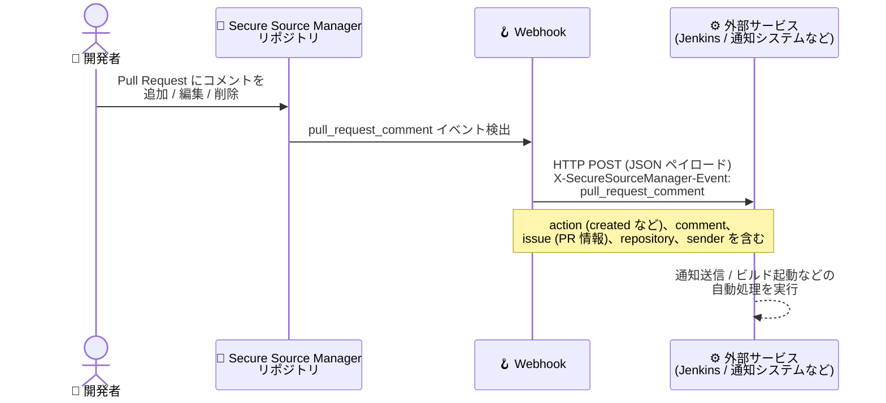

# Secure Source Manager: Webhook の Pull Request コメントトリガーイベント対応

**リリース日**: 2026-09-16

**サービス**: Secure Source Manager

**機能**: Webhook の Pull Request コメントトリガーイベント対応

**ステータス**: Feature

📊 [このアップデートのインフォグラフィックを見る](https://takech9203.github.io/google-cloud-news-summary/20260916-secure-source-manager-webhook-pr-comment-events.html)

## 概要

Secure Source Manager の Webhook が、新たに **Pull request comment (Pull Request コメント) トリガーイベント**をサポートしました。Pull Request にコメントが追加 (added)・編集 (edited)・削除 (deleted) されるたびに、Webhook を通じて外部サービスへ通知をトリガーできるようになります。

Secure Source Manager は Google Cloud 上でホストされるシングルテナントのマネージド Git ソースコード管理サービスであり、IAM、VPC Service Controls、Cloud Build と緊密に統合されています。Webhook はリポジトリ内のイベントをトリガーとして、ユーザーが指定した URL に HTTP リクエストを送信する仕組みで、Jenkins などのサードパーティ CI/CD ツールとの連携に利用されます。

今回のアップデートにより、コードレビューにおけるコメントのやり取りを起点とした自動化 (チャットツールへの通知、コメントコマンドによるビルド起動など) を、Secure Source Manager 標準の Webhook 機能だけで構築できるようになります。

**アップデート前の課題**

- Webhook のトリガーイベントは **Push** (リポジトリへのプッシュ) と **Pull request state changed** (Pull Request のオープン・クローズ・再オープン・編集) の 2 種類のみだった
- Pull Request 上のコメントの追加・編集・削除を外部サービスにリアルタイムで通知する手段が Webhook になかった
- コメントを起点とした CI/CD 自動化や外部通知には、API のポーリングなど別の仕組みを用意する必要があった

**アップデート後の改善**

- トリガーイベントとして **Pull request comment** を選択できるようになり、コメントの追加・編集・削除で Webhook が発火する
- コメントイベント専用のペイロード (`X-SecureSourceManager-Event: pull_request_comment`) が送信され、コメント本文・投稿者・対象 Pull Request・リポジトリ情報を受信側で利用できる
- コメントを契機とした通知・自動化を、追加のポーリング実装なしで構築できる

## アーキテクチャ図



Pull Request 上のコメント操作を検出した Secure Source Manager が、設定済みの Webhook ターゲット URL に対してコメント情報を含む JSON ペイロードを POST し、外部サービス側の処理をトリガーします。

## サービスアップデートの詳細

### 主要機能

1. **Pull request comment トリガーイベント**
   - Webhook の「Trigger on」設定で新たに選択可能になったイベントタイプ
   - Pull Request 上のコメントが追加・編集・削除された際に Webhook リクエストを送信する
   - 既存の Push、Pull request state changed に加わる 3 つ目のトリガーオプション

2. **コメントイベント専用ペイロード**
   - リクエストヘッダーに `X-SecureSourceManager-Event: pull_request_comment` が設定される
   - `action` フィールドで操作種別 (例: `created`) を判別できる
   - `comment` オブジェクト (コメント本文 `body`、`html_url`、投稿者 `user`、作成・更新日時) を含む
   - `issue` オブジェクトで対象 Pull Request の番号・タイトル・状態・マージ状況を、`repository` / `sender` オブジェクトでリポジトリと操作者の情報を取得できる

3. **既存の Webhook 機能との統合**
   - Sensitive query string によるトークン・シークレットの安全な受け渡しに対応
   - Webhooks タブの「Test Delivery」ボタンによる配信テスト、Recent deliveries でのリクエスト/レスポンス確認が可能

## 技術仕様

### Webhook の設定項目

| 項目 | 詳細 |
|------|------|
| Hook ID | Webhook の名前。小文字・数字・ダッシュのみ、先頭は英字。作成後は変更不可 |
| Target URL | Webhook の送信先 URL (公開 URL である必要がある) |
| Sensitive query string | トークンやシークレットを安全に付与するためのクエリ文字列 (`TARGET_URL?SENSITIVE_QUERY_STRING` の形式で送信) |
| Trigger on | **Push** / **Pull request state changed** / **Pull request comment** (今回追加) |
| Git refs filter | Push イベント用のブランチフィルタ (glob パターン)。Push イベントのみ対象 |
| Active | 有効時のみリクエストを送信 |

なお、Webhook の設定は Secure Source Manager の Web インターフェースからのみ行えます。

### Pull request comment イベントペイロード (抜粋)

```json
{
  "action": "created",
  "issue": {
    "number": 4,
    "title": "Open a Pull Request'",
    "state": "open",
    "pull_request": { "merged": false, "merged_at": null },
    "repository": { "name": "my-repo", "full_name": "my-project/my-repo" }
  },
  "comment": {
    "id": 1,
    "html_url": "https://my-instance-123456789.us-central1.sourcemanager.dev/my-project/my-repo/pulls/4#issuecomment-1",
    "body": "this is a comment",
    "created_at": "2024-07-03T18:40:21Z",
    "updated_at": "2024-07-03T18:40:21Z"
  },
  "repository": { "full_name": "my-project/my-repo", "default_branch": "main" },
  "sender": { "login": "user@example.com", "username": "user@example.com" },
  "is_pull": true
}
```

リクエストヘッダーには `X-SecureSourceManager-Delivery` (配信 ID)、`X-SecureSourceManager-Event: pull_request_comment`、`X-SecureSourceManager-Signature` が含まれます。

## 設定方法

### 前提条件

1. Secure Source Manager インスタンスとリポジトリが作成済みであること
2. Webhook の送信先となる公開 URL (Jenkins トリガー URL など) が用意されていること

### 手順

#### ステップ 1: Webhook の追加

1. Secure Source Manager の Web インターフェースで対象リポジトリに移動する
2. **Settings** → **Webhooks** → **Add webhook** をクリックする
3. **Hook ID** と **Target URL** を入力する
4. URL にトークンやシークレットが含まれる場合は、`?` 以降を **Sensitive Query String** フィールドに移動する

#### ステップ 2: トリガーイベントの選択

1. **Trigger on** セクションで **Pull request comment** を選択する
2. **Add webhook** をクリックして保存する

#### ステップ 3: 配信テスト

1. Webhooks ページで作成した Webhook を選択し、**Test Delivery** をクリックする
2. **Recent deliveries** セクションでリクエストとレスポンスの内容を確認する

## メリット

### ビジネス面

- **コードレビューの可視化**: レビューコメントのやり取りをチャットツールなどへリアルタイムに通知でき、レビューサイクルの短縮につながる
- **セキュアな環境での自動化拡充**: VPC Service Controls や IAM と統合されたシングルテナント環境のまま、コメント起点のワークフロー自動化を実現できる

### 技術面

- **ポーリング不要のイベント駆動連携**: コメントイベントがプッシュ型で配信されるため、API ポーリングの実装・運用が不要になる
- **豊富なペイロード情報**: コメント本文・操作種別・PR 情報・操作者が 1 リクエストに含まれ、受信側での追加 API 呼び出しを減らせる
- **既存 Webhook 基盤の再利用**: Sensitive query string による認証情報の管理や Test Delivery によるテストなど、既存の仕組みをそのまま利用できる

## デメリット・制約事項

### 制限事項

- Webhook の設定は Secure Source Manager の Web インターフェースからのみ可能
- Webhook のターゲット URL は公開されたパブリック URL である必要がある
- Hook ID は作成後に変更できない
- ブランチフィルタ (Git refs filter) は Push イベントのみに適用され、Pull request comment イベントには適用されない

### 考慮すべき点

- 受信側では `X-SecureSourceManager-Signature` ヘッダーや Sensitive query string を用いてリクエストの正当性を検証することが推奨される
- コメントの頻度が高いリポジトリでは、受信側サービスの処理負荷を考慮した設計が必要

## ユースケース

### ユースケース 1: レビューコメントのチャット通知

**シナリオ**: 開発チームが Pull Request のレビューコメントを見逃さないよう、コメントが投稿されたらチャットツールに即時通知したい。

**実装例**:
```
1. 通知用の中継エンドポイント (公開 URL) を用意
2. Secure Source Manager リポジトリの Webhook で
   Trigger on = "Pull request comment" を設定
3. 受信側で payload の comment.body、sender.username、
   issue.html_url を整形してチャットに投稿
```

**効果**: レビューコメントへの応答が早まり、Pull Request の滞留時間を削減できる。

### ユースケース 2: コメントコマンドによる CI ジョブ起動

**シナリオ**: Pull Request 上で「/retest」のようなコメントが投稿された場合に、Jenkins の Generic Webhook Trigger 経由で再テストジョブを実行したい。

**効果**: レビュー画面から離れることなく CI ジョブを制御でき、開発者体験が向上する。

## 料金

Secure Source Manager はインスタンス単位の課金で、**1 インスタンスあたり月額 $1,000** です。Webhook 機能自体に追加料金は発生しません (公式料金ページで最新情報を確認してください)。

- 料金ページ: https://docs.cloud.google.com/products/secure-source-manager/pricing

## 利用可能リージョン

Secure Source Manager はアメリカ、EMEA、APAC の複数リージョンに展開されています。最新のリージョン一覧は以下を参照してください。

- https://docs.cloud.google.com/secure-source-manager/docs/locations

## 関連サービス・機能

- **Cloud Build**: Secure Source Manager のトリガーファイルまたは Webhook でビルドを自動起動できる。Webhook ペイロードのデータを Cloud Build YAML の置換変数として利用可能
- **Jenkins**: Generic Webhook Trigger Plugin と Secure Source Manager Webhook を組み合わせて CI/CD を自動化できる
- **Developer Connect**: Secure Source Manager リポジトリの接続を Google Cloud サービス間で統合し、Git proxy による Private Google Access 経由の読み取りアクセスを提供
- **IAM / VPC Service Controls**: Secure Source Manager のアクセス制御とデータ境界保護を担い、Webhook を含む CI/CD パイプライン全体をセキュアに運用できる

## 参考リンク

- 📊 [インフォグラフィック](https://takech9203.github.io/google-cloud-news-summary/20260916-secure-source-manager-webhook-pr-comment-events.html)
- [公式リリースノート](https://docs.cloud.google.com/release-notes#September_16_2026)
- [Webhooks overview (Pull request comment event payload)](https://cloud.google.com/secure-source-manager/docs/webhooks-overview#pull-request-comment-event-payload)
- [Set up webhooks](https://docs.cloud.google.com/secure-source-manager/docs/set-up-webhooks)
- [Connect to Jenkins](https://docs.cloud.google.com/secure-source-manager/docs/connect-jenkins)
- [Secure Source Manager overview](https://docs.cloud.google.com/secure-source-manager/docs/overview)
- [料金ページ](https://docs.cloud.google.com/products/secure-source-manager/pricing)

## まとめ

Secure Source Manager の Webhook が Pull Request コメントイベントに対応したことで、Push・PR 状態変更に加えてコードレビューのコメントを起点とした通知や CI/CD 自動化が標準機能で実現できるようになりました。Jenkins などの外部ツールと連携している場合は、コメント通知やコメントコマンドによるジョブ起動の導入を検討することを推奨します。

---

**タグ**: Secure Source Manager, Webhook, Pull Request, CI/CD, DevOps, ソースコード管理
