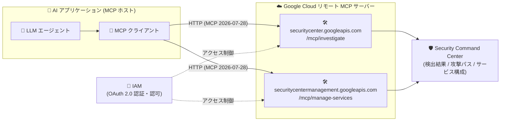

# Security Command Center: MCP サーバーエンドポイント (Preview)

**リリース日**: 2026-09-16

**サービス**: Security Command Center

**機能**: LLM エージェント向け MCP サーバーエンドポイント

**ステータス**: Preview

📊 [このアップデートのインフォグラフィックを見る](https://takech9203.github.io/google-cloud-news-summary/20260916-security-command-center-mcp-server.html)

## 概要

Security Command Center (SCC) に、LLM エージェントが調査 (investigative) タスクと管理 (management) タスクを実行できる Model Context Protocol (MCP) サーバーエンドポイントが Preview として追加された。提供されるのは「Security Command Center」(securitycenter.googleapis.com) と「Security Command Center Management」(securitycentermanagement.googleapis.com) の 2 つの MCP サーバーである。

MCP は Anthropic が開発したオープンソースプロトコルで、AI アプリケーションが外部のデータソースやサービスに接続する方法を標準化する。Google Cloud のリモート MCP サーバーは Google Cloud のインフラ上で動作し、HTTP エンドポイントを通じて AI アプリケーション (MCP ホスト) と通信する。MCP 仕様のバージョン 2026-07-28 (ステートレスコア) に対応しており、IAM による認証・認可、Model Armor によるスキャンなど、エンタープライズ向けのガバナンス機能が組み込まれている。

このアップデートにより、SOC アナリストの支援エージェントやセキュリティ運用の自動化エージェントが、標準化されたインターフェースを通じて SCC の検出結果 (findings) の検索・分析や、SCC サービスの構成確認を行えるようになる。

**アップデート前の課題**

- LLM エージェントから SCC の検出結果や攻撃パスにアクセスするには、REST API を呼び出すカスタムツールを個別に実装する必要があった
- SCC に対する Google 公式の MCP 標準インターフェースが存在せず、エージェントと SCC の連携は独自実装に依存していた

**アップデート後の改善**

- Google が管理するリモート MCP サーバーに接続するだけで、LLM エージェントが SCC の検出結果の一覧取得・グループ化・攻撃パス分析などを実行できるようになった
- `tools/list` などの MCP 標準の discovery メソッドで、エージェントがサーバーの機能 (ツール) を自動的に発見できるようになった
- 用途別のツールセット (toolset) が提供され、エージェントのコンテキストに読み込むツール数を抑えて精度を維持できるようになった

## アーキテクチャ図



LLM エージェント (MCP ホスト内の MCP クライアント) が、IAM で保護された 2 つのリモート MCP エンドポイントを経由して、SCC の調査・管理タスクを実行する構成。

## サービスアップデートの詳細

### 主要機能

1. **Security Command Center MCP サーバー (調査用)**
   - エンドポイント: `https://securitycenter.googleapis.com/mcp/investigate`
   - セキュリティポスチャの読み取り・分析を行うツールセット (`/mcp/investigate`) を提供
   - 提供ツール: `list_findings` (検出結果の一覧)、`group_findings` (検出結果のグループ化)、`get_source` / `list_sources` (検出ソースの取得・一覧)、`list_attack_paths` (攻撃パスの一覧)

2. **Security Command Center Management MCP サーバー (管理用)**
   - エンドポイント: `https://securitycentermanagement.googleapis.com/mcp/manage-services`
   - SCC サービスを管理するための読み取り専用ツールセット (`/mcp/manage-services`) を提供
   - 提供ツール: `list_security_center_services` (SCC サービスの一覧)、`get_security_center_service` (個別サービスの取得)

3. **Google Cloud リモート MCP サーバー共通のエンタープライズ機能**
   - MCP discovery: `tools/list` などの標準メソッドでツール仕様を取得可能。Agent Registry での管理にも対応
   - IAM による管理制御: IAM ポリシー (deny ポリシーを含む) で「誰がどのリソースに対して何をできるか」をきめ細かく制御
   - Model Armor: MCP の呼び出しと応答をスキャンし、プロンプトインジェクションや機密データ漏えいなどのリスク軽減を支援

## 技術仕様

### MCP エンドポイントとツール

| 項目 | Security Command Center | Security Command Center Management |
|------|------------------------|-----------------------------------|
| API | securitycenter.googleapis.com | securitycentermanagement.googleapis.com |
| ツールセットエンドポイント | `/mcp/investigate` | `/mcp/manage-services` |
| 用途 | セキュリティポスチャの読み取り・分析 | SCC サービスの管理 (読み取り専用) |
| ツール | group_findings, list_findings, get_source, list_sources, list_attack_paths | list_security_center_services, get_security_center_service |
| リリースステージ | Preview | Preview |

### プロトコル

- MCP バージョン 2026-07-28 (ステートレスコア) に対応。各リクエストは自己記述型で、`initialize`/`initialized` ハンドシェイクや `Mcp-Session-Id` は不要
- Google Cloud のリモート MCP サーバーは MCP authorization 仕様に準拠し、確立された ID を持つエージェント・MCP クライアント・エンドユーザーのみが認証してツールを利用できる

## 設定方法

### 前提条件

1. [MCP サーバーの有効化](https://docs.cloud.google.com/mcp/enable-disable-mcp-servers) を行う
2. [MCP サーバーへの認証](https://docs.cloud.google.com/mcp/authenticate-mcp) を設定する (Google 認証情報、または AI アプリケーション用の ID を使用)

### 手順

#### ステップ 1: ツール仕様の確認 (tools/list)

```bash
curl --location 'https://securitycenter.googleapis.com/mcp/investigate' \
  --header 'content-type: application/json' \
  --header 'accept: application/json, text/event-stream' \
  --data '{ "method": "tools/list", "jsonrpc": "2.0", "id": 1 }'
```

MCP サーバーが公開するすべてのツールとその仕様を取得できる。管理用サーバーの場合はエンドポイントを `https://securitycentermanagement.googleapis.com/mcp/manage-services` に変更する。

#### ステップ 2: AI アプリケーションへの MCP 設定

MCP ホスト (AI アプリケーション) に上記エンドポイントを MCP サーバーとして登録する。ツールセットはそれぞれ独立した HTTP エンドポイントを持ち、仮想的な MCP サーバーとして通常の MCP サーバーと同じ方法で設定できる。詳細は [Configure MCP in an AI application](https://docs.cloud.google.com/mcp/configure-mcp-ai-application) を参照。

## メリット

### ビジネス面

- **セキュリティ運用の効率化**: SOC アナリストが自然言語でエージェントに指示するだけで、検出結果の調査や攻撃パスの分析を実行でき、調査の初動を高速化できる
- **カスタム開発コストの削減**: SCC 連携用のカスタムツール実装が不要になり、Google 管理のエンドポイントに接続するだけでエージェント連携を実現できる

### 技術面

- **標準プロトコルによる相互運用性**: MCP 対応の任意の AI アプリケーション (MCP ホスト) から同一のインターフェースで SCC にアクセスできる
- **エンタープライズレベルのアクセス制御**: OAuth 2.0 + IAM による認証・認可、IAM deny ポリシー、Model Armor によるスキャンなど、ガバナンスを保ったままエージェントに権限を付与できる
- **ツールセットによるコンテキスト最適化**: 用途別ツールセットにより、エージェントに読み込ませるツール数を絞り、エージェントの応答品質低下を防げる

## デメリット・制約事項

### 制限事項

- 本機能は Preview であり、GA 前の機能に適用される条件のもとで提供される
- Security Command Center Management のツールセットは読み取り専用であり、サービス構成の変更はできない
- 調査用ツールセットも「読み取りと分析」のためのツール群であり、検出結果の修復操作などは提供ツールに含まれない

### 考慮すべき点

- MCP サーバーの有効化と認証設定が事前に必要
- エージェント用には専用の ID (サービスアカウント等) を作成し、アクセスの制御と監視を分離することが推奨されている (Google Cloud リモート MCP サーバー共通のガイダンス)

## ユースケース

### ユースケース 1: エージェントによる検出結果のトリアージ支援

**シナリオ**: SOC アナリストが AI エージェントに「現在アクティブな重大度 HIGH 以上の検出結果をカテゴリごとに集計して」と依頼する。

**実装例**:
```
エージェントが /mcp/investigate の list_findings / group_findings を呼び出し、
検出結果を取得・グループ化してサマリーを生成する。
必要に応じて list_attack_paths で高価値リソースへの攻撃パスを確認する。
```

**効果**: アナリストがコンソールやクエリを手動操作せずに、対話ベースで検出結果の全体像と優先度を把握できる。

### ユースケース 2: SCC サービス構成の棚卸し

**シナリオ**: セキュリティ管理者が、組織内で有効化されている SCC の各サービス (検出サービス) の状態をエージェント経由で確認する。

**効果**: `/mcp/manage-services` の `list_security_center_services` / `get_security_center_service` により、SCC サービスの有効化状態を読み取り専用で安全に確認でき、構成監査の作業を省力化できる。

## 料金

この MCP サーバーエンドポイント自体の料金情報は、今回のリリースノートおよび確認したドキュメントには記載されていない。Security Command Center の料金は以下を参照。

- [Security Command Center の料金](https://cloud.google.com/security-command-center/pricing)

## 関連サービス・機能

- **Google Cloud MCP サーバー (全般)**: SCC 以外にも IAM、Resource Manager など複数の Google Cloud サービスがリモート MCP サーバーを提供している ([対応プロダクト一覧](https://docs.cloud.google.com/mcp/supported-products))
- **Model Armor**: Google Cloud MCP サーバーへの MCP リクエスト/レスポンスをサニタイズし、プロンプトインジェクションや機密データ漏えいのリスク軽減を支援する
- **IAM**: MCP ツールの利用可否を IAM ポリシー (deny ポリシーを含む) で制御する
- **Agent Registry**: プロジェクトで構成した MCP サーバーの管理に利用できる
- **Google SecOps (Chronicle) MCP サーバー**: SecOps 側にも調査 (investigation) 関連の MCP ツールが提供されており、セキュリティ運用エージェントの構築で組み合わせて利用できる

## 参考リンク

- 📊 [インフォグラフィック](https://takech9203.github.io/google-cloud-news-summary/20260916-security-command-center-mcp-server.html)
- [公式リリースノート](https://docs.cloud.google.com/release-notes#September_16_2026)
- [MCP Reference: securitycenter.googleapis.com](https://cloud.google.com/security-command-center/docs/reference/mcp)
- [MCP Reference: securitycentermanagement.googleapis.com](https://cloud.google.com/security-command-center/docs/reference/security-center-management/mcp)
- [Google Cloud MCP servers overview](https://docs.cloud.google.com/mcp/overview)
- [MCP サーバーの有効化/無効化](https://docs.cloud.google.com/mcp/enable-disable-mcp-servers)
- [MCP サーバーへの認証](https://docs.cloud.google.com/mcp/authenticate-mcp)
- [Security Command Center の料金](https://cloud.google.com/security-command-center/pricing)

## まとめ

Security Command Center が公式のリモート MCP サーバーを提供したことで、LLM エージェントによるセキュリティ調査・管理タスクの自動化を、カスタム実装なしに IAM ベースの統制のもとで実現できるようになった。セキュリティ運用への AI エージェント導入を検討している組織は、Preview 段階のうちに `tools/list` でツール仕様を確認し、読み取り専用のユースケース (検出結果のトリアージ支援、サービス構成の棚卸し) から検証を始めることを推奨する。

---

**タグ**: #SecurityCommandCenter #MCP #ModelContextProtocol #LLMエージェント #AIセキュリティ #Preview #セキュリティ運用
