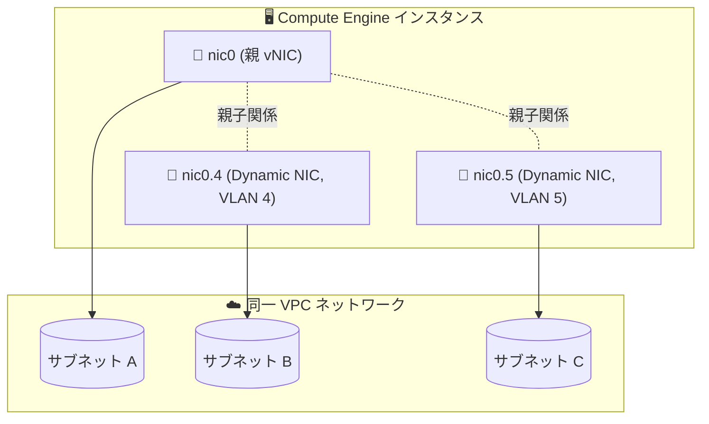

# Virtual Private Cloud (VPC): Dynamic NIC の同一 VPC ネットワークへの接続が GA

**リリース日**: 2026-09-16

**サービス**: Virtual Private Cloud (VPC)

**機能**: Dynamic NIC を他のネットワークインターフェースと同じ VPC ネットワークに追加

**ステータス**: GA (一般提供)

📊 [このアップデートのインフォグラフィックを見る](https://takech9203.github.io/google-cloud-news-summary/20260916-vpc-dynamic-nics-same-network-ga.html)

## 概要

Compute Engine インスタンスの Dynamic NIC を、同じインスタンスの他のネットワークインターフェース (vNIC や他の Dynamic NIC) が使用している VPC ネットワークと同一の VPC ネットワークに追加できる機能が一般提供 (GA) になりました。

Dynamic NIC は、親 vNIC のサブインターフェースとして実装されるネットワークインターフェースです。vNIC がインスタンス作成時にしか構成できないのに対し、Dynamic NIC はインスタンスを再起動・再作成することなく既存インスタンスへの追加・削除が可能で、Dynamic NIC を併用すると 1 インスタンスあたり最大 16 個のネットワークインターフェースを構成できます。今回の GA により、複数のインターフェースを同一 VPC ネットワーク内の異なるサブネットに柔軟に接続する構成を、Dynamic NIC を使って本番環境で利用できるようになりました。

ネットワークアプライアンス (パケット検査、NAT、ネットワークセキュリティ機能など) を運用するチームや、1 つの VPC ネットワーク内で複数サブネットにまたがる接続を必要とするワークロードを持つユーザーが対象です。

**アップデート後の改善**

- Dynamic NIC を、同じインスタンスの他のネットワークインターフェースが接続している VPC ネットワークと同一の VPC ネットワークに接続する構成が GA となり、本番環境で利用できるようになった
- 同一 VPC ネットワーク内の複数サブネットへの接続を、インスタンスの再起動なしで追加できる Dynamic NIC で実現できるようになった

## アーキテクチャ図



1 つの Compute Engine インスタンスで、親 vNIC (nic0) とその配下の Dynamic NIC (nic0.4、nic0.5) を同一 VPC ネットワーク内のそれぞれ異なるサブネットに接続する構成例です。各インターフェースは一意のサブネットを使用する必要があります。

## サービスアップデートの詳細

### 主要機能

1. **Dynamic NIC の同一 VPC ネットワーク接続 (GA)**
   - Dynamic NIC を、同じインスタンスの他のネットワークインターフェースが使用している VPC ネットワークと同一の VPC ネットワークに追加可能
   - 各ネットワークインターフェースは一意のサブネットに接続する必要がある

2. **Dynamic NIC の基本特性**
   - 親 vNIC のサブインターフェースとして実装され、IEEE 802.1Q 標準のパケット形式を使用する VLAN インターフェース
   - インスタンスの再起動・再作成なしで既存インスタンスへの追加・削除が可能
   - 多くのマシンタイプで vNIC の上限は 10 個だが、Dynamic NIC を使うと合計 16 個までのインターフェースを構成可能
   - スタックタイプは親 vNIC と同一でも異なっていてもよい (例: IPv4 のみの親 vNIC 配下に IPv6 のみやデュアルスタックの Dynamic NIC を作成可能)

### 同一 VPC ネットワークに複数インターフェースを接続する際のルール

Compute Engine は、1 つのインスタンスの複数のネットワークインターフェースが同一 VPC ネットワークを使用する場合、以下のルールを適用します。

| ルール | 詳細 |
|------|------|
| 一意のサブネット | 各ネットワークインターフェースは一意のサブネットに接続する必要がある |
| nic0 を含むネットワーク | 追加の vNIC を同一 VPC ネットワークに接続できるのは、そのネットワークに nic0 vNIC も接続されている場合のみ |
| 親 vNIC の接続が必要 | Dynamic NIC と他の NIC を含むネットワークには、各 Dynamic NIC の親 vNIC も接続されている必要がある (例: nic1.6 と nic1.7 を同一 VPC ネットワークに接続するには親 vNIC の nic1 も接続が必要) |
| Private Service Connect インターフェース | ネットワークアタッチメントを使用するインターフェースがある場合、他のインターフェースを同じ VPC ネットワークに接続できない |

### 帯域幅に関する仕様

- Dynamic NIC は親 vNIC の帯域幅を共有するため、Dynamic NIC を追加してもインスタンスの帯域幅は増加しない
- Dynamic NIC は親 vNIC と同じ受信・送信キューを共有する。個別のキューが必要な場合は vNIC の使用が推奨される
- 特定のインターフェースが帯域幅を占有しないように、Linux Traffic Control (TC) などを使用してゲスト OS 内でトラフィックポリシーを構成する必要がある

## 設定方法

### 前提条件

1. Dynamic NIC の VLAN ID は 2〜255 の整数で、親 vNIC 内で一意であること (異なる親 vNIC 配下であれば同じ VLAN ID を使用可能)
2. Dynamic NIC 追加後、ゲスト OS 内で対応する VLAN インターフェースを構成すること (ゲストエージェントによる自動管理、または手動構成)

### 手順

#### 既存インスタンスに Dynamic NIC を追加する

```bash
gcloud compute instances network-interfaces add INSTANCE_NAME \
    --zone=ZONE \
    --vlan=VLAN_ID \
    --parent-nic-name=PARENT_VNIC_NAME \
    --network=NETWORK \
    --subnetwork=SUBNET
```

`--network` に他のインターフェースと同じ VPC ネットワークを指定し、`--subnetwork` にはそのネットワーク内の未使用のサブネットを指定します。Dynamic NIC の名前は `nicN.VLAN_ID` 形式 (例: `nic0.4`) で割り当てられます。

## メリット

### ビジネス面

- **運用の柔軟性向上**: インスタンスの再起動・再作成なしでネットワークインターフェースを追加・削除できるため、ダウンタイムを抑えたネットワーク構成変更が可能
- **GA によるプロダクション利用**: 同一 VPC ネットワークへの Dynamic NIC 接続が GA となり、本番環境で安心して採用できる

### 技術面

- **同一 VPC 内マルチサブネット接続**: 1 つのインスタンスから同一 VPC ネットワーク内の複数サブネットに接続する構成を Dynamic NIC で実現できる
- **インターフェース数の拡張**: Dynamic NIC の併用により最大 16 個のインターフェースを構成でき、多数のネットワーク接続を必要とするアプライアンスに対応できる

## デメリット・制約事項

### 制限事項

- Dynamic NIC の作成後に親 vNIC と VLAN ID は変更できない
- ロードバランサのバックエンドとして使用中の Dynamic NIC は削除できない
- Dynamic NIC は以下をサポートしない:
  - Google Cloud Armor の高度なネットワーク DDoS 対策およびネットワークエッジセキュリティポリシー
  - MIG のインスタンスごとの構成 (per-instance configs) による IP アドレス設定
  - ファイアウォールエンドポイントなど、パケットインターセプトに依存する機能
  - Compute Engine Windows ドライバ
- GPU インスタンスでは Dynamic NIC はサポートされない
- RDMA ネットワークプロファイルを持つ VPC ネットワークでは Dynamic NIC はサポートされない
- エイリアス IP 範囲、プロトコル転送、パススルーネットワークロードバランサと併用する場合、ゲスト OS 内でローカルルートの手動作成が必要になるケースがある

### 考慮すべき点

- Dynamic NIC は親 vNIC の帯域幅を共有するため、帯域幅の増加を目的とする場合は vNIC (複数の物理 NIC を持つマシンタイプ) を検討する
- ゲスト OS 内での VLAN インターフェースの構成 (ゲストエージェントまたは手動) が必要

## ユースケース

### ユースケース 1: 同一 VPC 内の複数サブネットへの接続

**シナリオ**: ネットワークアプライアンス (パケット検査、NAT など) を運用しており、同一 VPC ネットワーク内の複数のサブネットのトラフィックを 1 つのインスタンスで処理したい。

**実装例**:
```bash
# nic0 が接続している VPC ネットワークの別サブネットに Dynamic NIC を追加
gcloud compute instances network-interfaces add my-appliance \
    --zone=us-central1-a \
    --vlan=4 \
    --parent-nic-name=nic0 \
    --network=my-vpc \
    --subnetwork=subnet-b
```

**効果**: インスタンスを再作成することなく、同一 VPC ネットワーク内の追加サブネットへの接続を構成できる。

### ユースケース 2: 稼働中インスタンスへのインターフェース追加

**シナリオ**: 稼働中のインスタンスに新しいサブネットへの接続を追加する必要があるが、再起動によるダウンタイムは避けたい。

**効果**: Dynamic NIC はインスタンスの再起動なしで追加・削除できるため、サービスを停止せずにネットワーク構成を変更できる。

## 料金

Dynamic NIC 固有の料金情報は確認できませんでした。VPC の料金については公式の料金ページを参照してください。

- [VPC 料金ページ](https://cloud.google.com/vpc/pricing)

## 関連サービス・機能

- **Compute Engine**: Dynamic NIC は Compute Engine インスタンスのネットワークインターフェースとして構成する。ベアメタルインスタンス (vNIC は 1 つのみ) のマルチ NIC 化にも Dynamic NIC を使用する
- **Shared VPC**: ホストプロジェクトのインスタンスは共有 VPC ネットワークのサブネットを使用する必要があり、サービスプロジェクトのインスタンスはサービスプロジェクトの VPC またはホストプロジェクトの共有 VPC のサブネットを使用できる
- **Compute Engine 内部 DNS**: 内部 DNS の A / PTR レコードは nic0 のプライマリ内部 IPv4 アドレスに対してのみ作成され、他のインターフェースには作成されない
- **静的ルート**: ネクストホップをアドレスで指定 (`next-hop-address`) すると、特定の vNIC または Dynamic NIC にパケットを配信できる
- **内部パススルーネットワークロードバランサ**: マルチ NIC インスタンスを VPC ネットワーク間のルーティングに使う場合、各 VPC ネットワークで内部パススルーネットワークロードバランサのバックエンドとして構成することがベストプラクティス

## 参考リンク

- 📊 [インフォグラフィック](https://takech9203.github.io/google-cloud-news-summary/20260916-vpc-dynamic-nics-same-network-ga.html)
- [公式リリースノート](https://docs.cloud.google.com/release-notes#September_16_2026)
- [Multiple network interfaces (仕様)](https://cloud.google.com/vpc/docs/multiple-interfaces-concepts#specifications)
- [Add Dynamic NICs to an instance](https://docs.cloud.google.com/vpc/docs/add-dynamic-nics)
- [Create VM instances with multiple network interfaces](https://docs.cloud.google.com/vpc/docs/create-use-multiple-interfaces)
- [料金ページ](https://cloud.google.com/vpc/pricing)

## まとめ

Dynamic NIC を他のネットワークインターフェースと同一の VPC ネットワークに接続する構成が GA になり、インスタンスの再起動なしで同一 VPC 内の複数サブネットへの接続を追加できるようになりました。ネットワークアプライアンスや多数のサブネット接続を必要とするワークロードを運用している場合は、一意のサブネット要件や親 vNIC の接続ルール、帯域幅の共有仕様を確認した上で採用を検討してください。

---

**タグ**: #VPC #ComputeEngine #DynamicNIC #マルチNIC #ネットワーキング #GA
