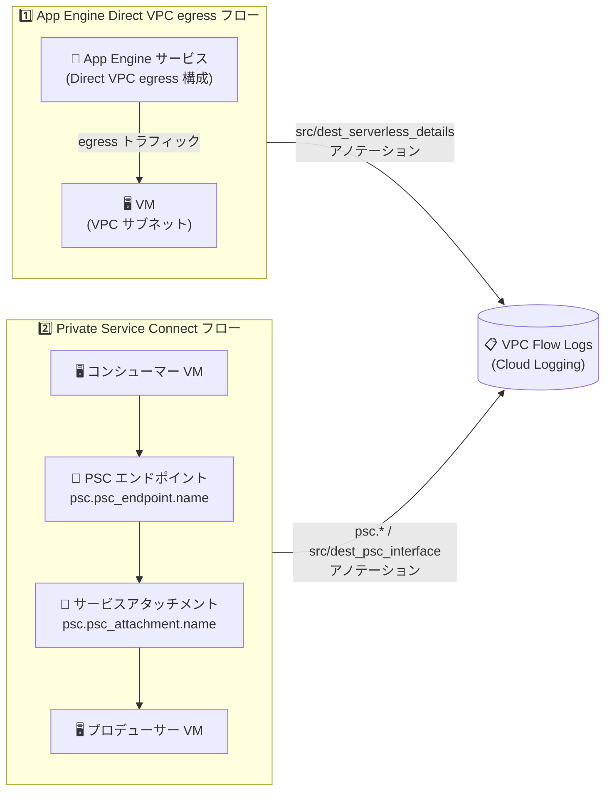

# Virtual Private Cloud: VPC Flow Logs の App Engine Direct VPC egress 対応と Private Service Connect メタデータアノテーション追加 (GA)

**リリース日**: 2026-09-16

**サービス**: Virtual Private Cloud (VPC Flow Logs)

**機能**: App Engine Direct VPC egress のフローログ対応 / Private Service Connect メタデータアノテーション追加

**ステータス**: GA (一般提供)

📊 [このアップデートのインフォグラフィックを見る](https://takech9203.github.io/google-cloud-news-summary/20260916-vpc-flow-logs-enhancements.html)

## 概要

2026 年 9 月 16 日、VPC Flow Logs に関する 2 つの機能強化が一般提供 (GA) となりました。1 つ目は、Direct VPC egress を構成した App Engine リソースのトラフィックに対するロギングのサポートです。これにより、Cloud Run に加えて App Engine のサーバーレストラフィックも VPC Flow Logs で可視化できるようになり、フローログの `src_serverless_details` / `dest_serverless_details` フィールドに App Engine サービスの情報 (`app_engine_service_details.service_name` など) が記録されます。

2 つ目は、Private Service Connect (PSC) に関する以下のメタデータアノテーションの追加です。

- `src_psc_interface` および `dest_psc_interface`: フローの送信元 / 宛先が PSC インターフェースの場合に、そのインターフェースの詳細を記録
- `psc.consumer_connection`: プロデューサー側レポート時に、コンシューマー視点の NAT 変換前 5 タプルを記録
- `psc.psc_endpoint.name`: PSC エンドポイントの名前
- `psc.psc_attachment.name`: プロデューサー側サービスアタッチメントの名前

ネットワーク管理者や SRE は、サーバーレスワークロードや PSC 経由のサービス連携を含むトラフィックを、追加のツールなしにフローログだけでエンドツーエンドに追跡・分析できるようになります。

**アップデート前の課題**

- VPC Flow Logs のサーバーレスフローのアノテーションは Cloud Run エンドポイントが中心で、App Engine の Direct VPC egress トラフィックを App Engine サービス名付きで識別することができなかった
- PSC 経由のフローについて、どのエンドポイント名・サービスアタッチメント名を経由したかをログレコードから直接特定しづらく、コンシューマーとプロデューサー間のフローの突き合わせが困難だった
- プロデューサー側では NAT 変換後のアドレスしか見えず、コンシューマー側の元の接続情報 (変換前の 5 タプル) をログから確認できなかった

**アップデート後の改善**

- App Engine の Direct VPC egress トラフィックが `ServerlessDetails` (プロジェクト ID、リージョン、App Engine サービス名) 付きでフローログに記録されるようになった
- `psc.psc_endpoint.name` と `psc.psc_attachment.name` により、PSC エンドポイントとサービスアタッチメントを名前で特定でき、コンシューマー / プロデューサー双方のログの相関分析が容易になった
- `psc.consumer_connection` により、プロデューサー側のレポートでも NAT 変換前のコンシューマー視点の 5 タプルを確認できるようになった
- `src_psc_interface` / `dest_psc_interface` により、PSC インターフェースを送信元 / 宛先とするフローがコンシューマープロジェクトで送信元・宛先の両方からレポートされるようになった

## アーキテクチャ図



App Engine (Direct VPC egress) から VPC 内リソースへのフローと、PSC エンドポイント経由のコンシューマー / プロデューサー間フローが、それぞれ新しいメタデータアノテーション付きで VPC Flow Logs に記録されます。

## サービスアップデートの詳細

### 主要機能

1. **App Engine Direct VPC egress のフローログ対応 (GA)**
   - Direct VPC egress を構成した App Engine リソースが送受信するトラフィックが VPC Flow Logs に記録される
   - フローの送信元 / 宛先がサーバーレスエンドポイントの場合、`src_serverless_details` / `dest_serverless_details` フィールドにメタデータが付与される
   - 同一 VPC ネットワーク内のサーバーレス - VM 間フローでは、双方のリソースが VPC Flow Logs 有効なサブネットにあれば、リクエスト側・レスポンス側の両方からログがレポートされる

2. **PSC エンドポイント / サービスアタッチメントの名前アノテーション (GA)**
   - `psc.psc_endpoint.name`: PSC エンドポイントの名前 (target_service_type が `PUBLISHED_SERVICE` の場合に記録)
   - `psc.psc_attachment.name`: プロデューサー側サービスアタッチメントの名前
   - PSC 公開サービスへのフローはコンシューマー VM とプロデューサー VM の双方からレポートされ、コンシューマープロジェクトとプロデューサープロジェクトのそれぞれでログを確認できる

3. **`psc.consumer_connection` アノテーション (GA)**
   - レポーターが `PRODUCER` の場合に、コンシューマー視点の NAT 変換前 5 タプル (IpConnection) が記録される
   - プロデューサー側で見える NAT 変換後アドレスと、コンシューマー側の元の接続情報を紐付けたトラブルシューティングが可能になる

4. **PSC インターフェースのアノテーション (GA)**
   - `src_psc_interface` / `dest_psc_interface`: フローの送信元 / 宛先が PSC インターフェースの場合に `PrivateServiceConnectInterfaceDetails` が記録される
   - コンシューマープロジェクトで、送信元・宛先の両方からレポートされる

## 技術仕様

### ServerlessDetails フィールド形式 (App Engine 関連)

| フィールド | 型 | 説明 |
|------|------|------|
| `project_id` | string | Cloud Run または App Engine リソースを含むプロジェクトの ID (Shared VPC 構成では通常サービスプロジェクトの ID) |
| `region` | string | Cloud Run または App Engine リソースのリージョン |
| `app_engine_service_details.service_name` | string | App Engine サービスの名前 |

### PrivateServiceConnectDetails (`psc`) フィールド形式

| フィールド | 型 | 説明 |
|------|------|------|
| `reporter` | string | PSC のレポーター。`CONSUMER` または `PRODUCER` |
| `consumer_connection` | IpConnection | コンシューマー視点の NAT 変換前 5 タプル。レポーターが `PRODUCER` の場合に記録 |
| `psc_endpoint` | PrivateServiceConnectEndpointDetails | コンシューマーエンドポイントの詳細 (`name`、`project_id`、`region`、`psc_connection_id`、`target_service_type`、`vpc`) |
| `psc_attachment` | PrivateServiceConnectAttachmentDetails | プロデューサーのサービスアタッチメントの詳細 (`name`、`project_id`、`region`、`vpc`) |

- `psc_endpoint.name` は `target_service_type` が `PUBLISHED_SERVICE` の場合にのみ記録される
- `target_service_type` は `GLOBAL_GOOGLE_APIS` または `PUBLISHED_SERVICE`

### PrivateServiceConnectInterfaceDetails フィールド形式

| フィールド | 型 | 説明 |
|------|------|------|
| `network_attachment` | NetworkAttachmentDetails | コンシューマーのネットワークアタッチメントのメタデータ (`name`、`project_id`、`region`) |
| `producer` | ProducerDetails | 接続を開始したプロデューサーのメタデータ (`project_id`、`region`、`service_class_id`、`zone`) |

### ログレコードの例 (PSC 公開サービスへのフロー)

| レポーター | 記録されるアノテーション |
|------|------|
| コンシューマー VM | `src_instance.*`、`src_vpc.*`、`psc.reporter`、`psc.psc_endpoint.*`、`psc.psc_attachment.*` |
| プロデューサー VM | `dest_instance.*`、`dest_vpc.*`、`psc.reporter`、`psc.consumer_connection.*`、`psc.psc_endpoint.*`、`psc.psc_attachment.*` |

## 設定方法

### 前提条件

1. 対象トラフィックが通過するサブネットで VPC Flow Logs が有効になっていること
2. App Engine のフローログを取得する場合は、App Engine サービスが Direct VPC egress で VPC ネットワークに接続されていること
3. メタデータアノテーションを取得するには、フローログ設定でメタデータが「すべて」または対象フィールドを含むカスタム設定になっていること

### 手順

#### ステップ 1: サブネットで VPC Flow Logs を有効化 (メタデータをすべて含める)

```bash
gcloud compute networks subnets update SUBNET_NAME \
    --region=REGION \
    --enable-flow-logs \
    --logging-metadata=include-all
```

メタデータを「すべて含める」に設定している場合、レコード形式に新しいメタデータフィールドが追加されると、フローログに自動的に新フィールドが含まれます。カスタムメタデータでフルネーム指定 (例: `src_vpc.project_id`) をしている場合、新フィールドは自動では含まれない点に注意してください。

#### ステップ 2: Cloud Logging でログを確認

```bash
# PSC エンドポイント名でフィルタする例
gcloud logging read 'logName:"compute.googleapis.com%2Fvpc_flows"
  AND jsonPayload.psc.psc_endpoint.name!=""' \
  --project=PROJECT_ID --limit=10
```

App Engine のサーバーレスフローは `jsonPayload.src_serverless_details` / `jsonPayload.dest_serverless_details` で確認できます。

## メリット

### ビジネス面

- **可観測性のギャップ解消**: App Engine ベースのアプリケーションでも、VM や GKE、Cloud Run と同水準のネットワーク可視性が得られ、監査・フォレンジック対応の網羅性が向上する
- **マルチプロジェクト構成の運用効率化**: PSC を使ったサービス公開 (プロデューサー / コンシューマーモデル) で、双方のチームが名前ベースでフローを特定でき、部門間のトラブルシューティングの調整コストが減る

### 技術面

- **名前ベースの相関分析**: `psc.psc_endpoint.name` / `psc.psc_attachment.name` により、IP アドレスや接続 ID だけに頼らず、リソース名でログの検索・集計・アラート設定が可能
- **NAT 越しのフロー追跡**: `psc.consumer_connection` により、プロデューサー側で NAT 変換前のコンシューマー接続情報を確認でき、変換前後のアドレスの突き合わせが不要になる
- **サーバーレスの双方向レポート**: 同一 VPC 内のサーバーレス - VM 間フローは要求側・応答側の両方からレポートされるため、片側のログ欠落時にも分析を継続できる

## デメリット・制約事項

### 制限事項

- `psc.psc_endpoint.name` は `target_service_type` が `PUBLISHED_SERVICE` の場合にのみ記録される (`GLOBAL_GOOGLE_APIS` では記録されない)
- `psc.consumer_connection` はレポーターが `PRODUCER` の場合にのみ記録される
- PSC エンドポイントの `region` フィールドは、ターゲットサービスタイプが `GLOBAL_GOOGLE_APIS` の場合は記録されない
- レポーターが `PRODUCER` の場合、`psc_endpoint.vpc` の `subnetwork_name` と `subnetwork_region` は記録されない

### 考慮すべき点

- フローログの記録には、対象リソースが属するサブネットで VPC Flow Logs が有効になっている必要がある。双方向のレポートを得るには両側のサブネットで有効化が必要
- カスタムメタデータ設定でフィールドをフルネーム指定している場合、今回追加されたフィールドは明示的に追加しない限りログに含まれない
- App Engine 側の Direct VPC egress 機能自体の提供状況 (リリースステージ) は App Engine のドキュメントで別途確認が必要
- メタデータを増やすとログのボリュームが増加するため、ログの生成・保存コストへの影響を考慮する

## ユースケース

### ユースケース 1: App Engine アプリの VPC 内通信の可視化

**シナリオ**: App Engine スタンダード環境のアプリケーションが Direct VPC egress 経由で VPC 内の Memorystore や Compute Engine 上の内部 API にアクセスしている。どのサービスがどの内部リソースにどれだけ通信しているかを把握したい。

**実装例**:
```
Cloud Logging クエリ:
logName:"compute.googleapis.com%2Fvpc_flows"
jsonPayload.src_serverless_details.app_engine_service_details.service_name="my-service"
```

**効果**: App Engine サービス名単位でトラフィックを集計でき、通信先の棚卸し、ファイアウォールルールの検証、異常通信の検知が可能になる。

### ユースケース 2: PSC 公開サービスのプロデューサー側トラブルシューティング

**シナリオ**: SaaS プロバイダーが PSC のサービスアタッチメントで複数の顧客 (コンシューマー) にサービスを公開している。特定顧客からの接続不具合を調査したいが、プロデューサー側では NAT 変換後のアドレスしか見えない。

**効果**: `psc.consumer_connection` でコンシューマー視点の変換前 5 タプルを、`psc.psc_endpoint.name` / `psc.psc_attachment.name` でどのエンドポイント・アタッチメント経由かを特定でき、顧客側のログとの突き合わせが名前ベースで行える。

## 料金

このアップデートに固有の料金情報は Release Notes に記載されていません。VPC Flow Logs の生成・保存に関する料金は、以下の公式ページを参照してください。

- [VPC の料金 (Network Telemetry)](https://cloud.google.com/vpc/pricing)
- [Cloud Logging の料金](https://cloud.google.com/stackdriver/pricing)

## 関連サービス・機能

- **App Engine (Direct VPC egress)**: サーバーレス VPC Access コネクタなしで App Engine から VPC ネットワークへ egress トラフィックを送信する機能。今回のアップデートでこのトラフィックがフローログの対象になった
- **Private Service Connect**: VPC 間でサービスをプライベートに公開・消費する仕組み。エンドポイント、サービスアタッチメント、インターフェースのフローが今回のアノテーション対象
- **Cloud Logging**: VPC Flow Logs の出力先。ログエクスプローラでの検索やログベースのアラートに利用
- **Cloud Run**: Direct VPC egress のサーバーレスフローアノテーションは Cloud Run エンドポイントにも対応しており、`cloud_run_service_details` などが記録される
- **Network Connectivity Center**: PSC 接続が Network Connectivity Center 経由で伝播される場合も `psc` フィールドのアノテーション対象になる

## 参考リンク

- 📊 [インフォグラフィック](https://takech9203.github.io/google-cloud-news-summary/20260916-vpc-flow-logs-enhancements.html)
- [公式リリースノート (September 16, 2026)](https://docs.cloud.google.com/release-notes#September_16_2026)
- [VPC Flow Logs: トラフィックフローについて (Serverless flows)](https://cloud.google.com/vpc/docs/about-traffic-flows#serverless-flows)
- [VPC Flow Logs: レコード形式](https://cloud.google.com/vpc/docs/about-flow-logs-records#record_format)
- [App Engine: Direct VPC egress](https://cloud.google.com/appengine/docs/standard/vpc-direct-vpc)
- [VPC の料金](https://cloud.google.com/vpc/pricing)

## まとめ

VPC Flow Logs が App Engine の Direct VPC egress トラフィックと Private Service Connect の詳細メタデータに対応したことで、サーバーレスとサービス公開 (PSC) を含むハイブリッドな構成でも、フローログだけでエンドツーエンドのトラフィック分析が可能になりました。App Engine や PSC を利用している場合は、対象サブネットのフローログ設定 (特にメタデータのカスタム指定) を確認し、新しいアノテーションが取得できる状態になっているかを点検することを推奨します。

---

**タグ**: #VPC #VPCFlowLogs #AppEngine #DirectVPCEgress #PrivateServiceConnect #ネットワーク監視 #GA
