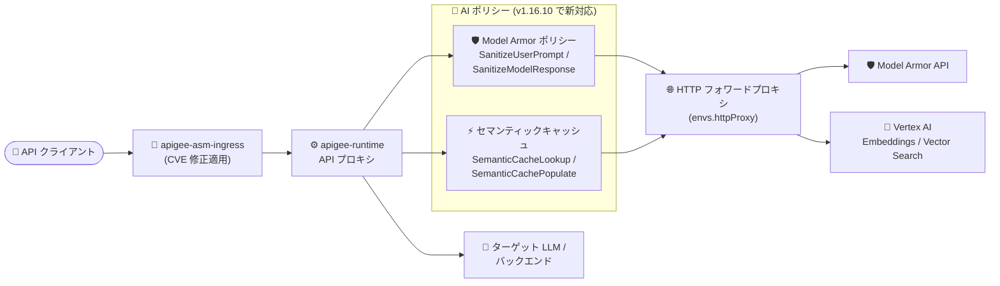

# Apigee hybrid: v1.16.10 リリース (EventFlow 修正、Kubernetes 1.36 対応、AI ポリシーのフォワードプロキシ対応)

**リリース日**: 2026-09-17

**サービス**: Apigee hybrid

**機能**: v1.16.10 パッチリリース (バグ修正・Kubernetes 1.36 サポート・AI ポリシーのフォワードプロキシ対応・セキュリティ修正)

**ステータス**: GA (パッチリリース)

📊 [このアップデートのインフォグラフィックを見る](https://takech9203.github.io/google-cloud-news-summary/20260917-apigee-hybrid-v1-16-10.html)

## 概要

2026 年 9 月 17 日、Apigee hybrid ソフトウェアの更新版 v1.16.10 がリリースされました。本リリースはパッチリリースであり、コンテナイメージは Apigee hybrid の Helm チャートに統合されているため、Helm チャート経由でパッチにアップグレードするとイメージも自動的に更新されます。手動でのイメージ変更は通常不要です。

v1.16.10 には、EventFlow (Server-Sent Events) の 16 KB 超イベントの欠落・破損の修正、SAML/OAuthV2/Script/SpikeArrest といった各種ポリシーのセキュリティ強化とバグ修正、WSFrameDecoder のメモリリーク修正など 13 件の修正が含まれます。また、機能面では Kubernetes 1.36 のサポート (GKE、GDC Virtual for VMware/ベアメタル、Amazon EKS、Azure AKS、RKE2) と、Model Armor やセマンティックキャッシュなどの AI ポリシーからのアウトバウンド呼び出しを HTTP フォワードプロキシ経由でルーティングできる機能が追加されました。さらに、apigee-asm-ingress、apigee-runtime、apigee-fluent-bit をはじめとする多数のコンポーネントに対する多数の CVE 対応 (セキュリティ修正) が含まれています。

Apigee hybrid を GKE やマルチクラウドの Kubernetes 上で運用しているプラットフォームチーム、および Apigee の AI ポリシー (Model Armor、セマンティックキャッシュ) を厳格なネットワーク境界 (Egress 制御) 下で利用したい組織にとって重要なアップデートです。

**アップデート前の課題**

- Apigee hybrid の AI ポリシー (Model Armor、セマンティックキャッシュ) からのアウトバウンド呼び出しはフォワードプロキシに対応しておらず (v1.15.1 リリースノートに「Apigee hybrid does not support forward proxy with these policies」と明記)、すべての Egress をプロキシ経由に統制している環境では利用が困難だった
- EventFlow (Server-Sent Events) で 16 KB を超えるイベントが負荷下で欠落・切り詰め・破損することがあり、LLM のストリーミングレスポンスなど SSE を使うワークロードの信頼性に影響していた
- v1.16 系は Kubernetes 1.36 に未対応で、クラスタ側の Kubernetes バージョンアップに追随できなかった
- ValidateSAMLAssertion (XSW 脆弱性)、OAuthV2 (トークンインジェクション、redirect_uri 検証)、Script ポリシー (リンクローカルアドレスへの SSRF) などに既知のセキュリティ課題が存在した
- Apigee hybrid コンポーネントの Kubernetes PodDisruptionBudget をカスタム値で構成できなかった

**アップデート後の改善**

- AI ポリシーのアウトバウンド呼び出し (Model Armor のサニタイズ呼び出し、Vertex AI の埋め込み・Vector Search 呼び出しなど) を HTTP フォワードプロキシ経由でルーティングできるようになった
- EventFlow (SSE) の 16 KB 超イベントに関する 2 件の不具合が修正され、大きなイベントを含むストリーミングが安定した
- Kubernetes 1.36 が GKE / GDC Virtual (VMware・ベアメタル) / Amazon EKS / Azure AKS / RKE2 でサポートされた
- SAML・OAuthV2・Script・SpikeArrest 各ポリシーのセキュリティ強化と、Netty 接続プールのスレッドセーフティ修正、WSFrameDecoder のメモリリーク修正 (503 `no_healthy_upstream` スパイクの原因) が適用された
- `overrides.yaml` で各コンポーネントの PodDisruptionBudget (`minAvailable` / `maxUnavailable`) をカスタム構成できるようになった
- `request.path.decode.encoded.separators` プロキシプロパティにより、フロー選択前にパーセントエンコードされたパス区切り文字 (`%2F`、`%5C`) のデコードをオプションで有効化できるようになった
- 14 コンポーネントに対する CVE 修正 (apigee-fluent-bit だけで 50 件超) が適用され、セキュリティポスチャが向上した

## アーキテクチャ図



v1.16.10 では、環境にフォワードプロキシ (`envs.httpProxy`) を構成すると、Model Armor ポリシーとセマンティックキャッシュポリシーからのアウトバウンド呼び出し (Model Armor サニタイズ、Vertex AI 埋め込み、Vector Search の `findNeighbors` / `upsertDatapoints`) がポリシーレベルの追加設定なしでフォワードプロキシ経由にルーティングされます。

## サービスアップデートの詳細

### 主要機能

1. **AI ポリシーのフォワードプロキシ対応 (Bug ID: 402250928)**
   - Model Armor ポリシー (SanitizeUserPrompt / SanitizeModelResponse) およびセマンティックキャッシュポリシー (SemanticCacheLookup / SemanticCachePopulate) からのアウトバウンド呼び出しを HTTP フォワードプロキシ経由でルーティング可能に
   - 環境に `envs.httpProxy` を構成すると、これらのポリシー呼び出しはデフォルトでフォワードプロキシを経由する (ポリシーレベルの設定は不要)。`*.googleapis.com` 配下でないエンドポイント (パブリックの Vector Search エンドポイントなど) にも適用される
   - `envs[].managementCallsSkipProxy` を `true` に設定すると、これらの呼び出しはフォワードプロキシをスキップして直接 Egress する (ランタイムのトレース・アナリティクストラフィックと同じ扱い)
   - なお、SemanticCacheLookup が Private Service Connect (PSC) 経由のプライベート Vector Search エンドポイントを使う構成では、類似検索呼び出しはプライベートエンドポイントへの直接 gRPC 接続となり、フォワードプロキシを経由しない
   - v1.17.0 (2026-09-14 リリース) で導入された同機能の v1.16 系へのバックポートに相当する

2. **Kubernetes 1.36 サポート**
   - 対応プラットフォーム: Google Kubernetes Engine (GKE)、Google Distributed Cloud Virtual for VMware (vSphere)、Google Distributed Cloud Virtual for bare metal、Amazon EKS、Azure AKS、Rancher Kubernetes Engine (RKE2)
   - 詳細は [Supported platforms](https://docs.cloud.google.com/apigee/docs/hybrid/supported-platforms) を参照

3. **EventFlow (Server-Sent Events) の修正**
   - Bug ID 556750755: http-adaptor データパス上で、負荷下において 16 KB 超の大きなイベントの後続イベントが欠落・切り詰められる問題を修正
   - Bug ID 547712217: 16 KB を超える SSE レスポンスがソケット読み取りをまたいで切り詰め・破損する可能性がある問題を修正

4. **ポリシーのセキュリティ強化・バグ修正**
   - ValidateSAMLAssertion: SAML XML Signature Wrapping (XSW) 脆弱性の修正 (519729209)、エンティティ・コメントインジェクションに対する SAML アサーション検証の改善 (472526232)
   - OAuthV2: HTTP フォームパラメータ経由の不正なトークンインジェクション防止 (505645076)、implicit グラントの redirect_uri 検証のセキュリティ改善 (503817773)
   - Script ポリシー: リンクローカルアドレスへの SSRF をブロックするよう強化 (514384893)
   - SpikeArrest: NullPointerException と 500 エラーを引き起こすエッジケースの修正 (480770263)

5. **ランタイムの安定性向上**
   - Netty クライアント接続プールとチャネルライフサイクルのスレッドセーフティ問題を修正 (505543289)
   - WSFrameDecoder のメモリリークを修正。このリークは 503 レスポンス (`no_healthy_upstream` エラー) のスパイクを引き起こす可能性があった (470375542)

6. **構成の柔軟性向上**
   - PodDisruptionBudget: `overrides.yaml` で Apigee hybrid コンポーネントのカスタム `minAvailable` / `maxUnavailable` 値を構成可能に (449228485)
   - `request.path.decode.encoded.separators` プロキシプロパティ: フロー選択前にパーセントエンコードされたパス区切り文字 (`%2F`、`%5C`) のデコードをオプションで有効化 (502268966)

7. **コンポーネントのセキュリティ修正 (CVE 対応)**
   - 以下の 14 コンポーネントに対する多数の CVE / GHSA 修正が含まれる:

   | コンポーネント | 修正された主な脆弱性 |
   |------|------|
   | apigee-asm-ingress / apigee-asm-istiod | CVE-2026-33818、CVE-2026-39821、CVE-2026-56853、CVE-2026-56858〜56865、GHSA-hrxh-6v49-42gf など 10 件 |
   | apigee-connect-agent / apigee-hybrid-cassandra-client | 上記に加え CVE-2026-46600、CVE-2026-84303/84304/84445 など 14 件 |
   | apigee-fluent-bit | CVE-2025-13151、CVE-2026-14456 系、CVE-2026-63072〜63076 など 50 件超 |
   | apigee-mart-server / apigee-mint-task-scheduler / apigee-runtime / apigee-synchronizer | CVE-2026-55831/55833、CVE-2026-56745/56746/56819、CVE-2026-59898〜59921、CVE-2026-73508、CVE-2026-75595/75596 など 14 件 |
   | apigee-operators / apigee-watcher | CVE-2026-33818、CVE-2026-84303/84304/84445、GHSA-hrxh-6v49-42gf ほか (operators は GHSA-w67g-5rqw-f597 も) |
   | apigee-prom-prometheus / apigee-prometheus-adapter / apigee-redis | CVE-2026-33818、CVE-2026-39821、CVE-2026-46600、CVE-2026-56853〜56865 ほか |
   | apigee-open-telemetry-collector | GHSA-hrxh-6v49-42gf |

## 技術仕様

### リリース情報

| 項目 | 詳細 |
|------|------|
| バージョン | v1.16.10 |
| リリース種別 | パッチリリース |
| リリース日 | 2026 年 9 月 17 日 |
| アップグレード方式 | Helm チャート経由 (コンテナイメージは自動更新、手動のイメージ変更は通常不要) |
| サポートされる Kubernetes | 1.36 を新規サポート (GKE、GDC Virtual for VMware / bare metal、Amazon EKS、Azure AKS、RKE2) |
| 修正件数 | バグ・機能修正 13 件 + コンポーネント別セキュリティ修正 14 グループ |

### フォワードプロキシ関連の構成プロパティ

| プロパティ | 説明 |
|------|------|
| `envs[].httpProxy` | 環境単位のフォワードプロキシ設定。設定すると AI ポリシーのアウトバウンド呼び出しもデフォルトでプロキシ経由になる |
| `envs[].managementCallsSkipProxy` | `true` にすると AI ポリシー呼び出しやトレース・アナリティクストラフィックがプロキシをスキップし直接 Egress する |
| PodDisruptionBudget | `overrides.yaml` でコンポーネントごとに `minAvailable` / `maxUnavailable` を指定可能 (449228485) |
| `request.path.decode.encoded.separators` | フロー選択前の `%2F` / `%5C` デコードを有効化するプロキシプロパティ (502268966) |

## 設定方法

### 前提条件

1. Apigee hybrid v1.16.x が稼働していること (アップグレード手順は [Upgrading Apigee hybrid to version v1.16.10](https://docs.cloud.google.com/apigee/docs/hybrid/v1.16/upgrade) を参照)
2. Helm チャートによる管理 (パッチリリースのコンテナイメージは Helm チャートに統合)

### 手順

#### ステップ 1: Helm チャートのアップグレード

```bash
# Apigee hybrid の Helm チャートを v1.16.10 に更新
# (詳細な手順は公式アップグレードガイドを参照)
export CHART_VERSION=1.16.10
helm upgrade operator apigee-operator/ \
  --namespace apigee \
  --atomic \
  -f overrides.yaml
```

パッチリリースのため、Helm チャート経由のアップグレードでコンテナイメージが自動的に更新されます。

#### ステップ 2: (任意) AI ポリシー用フォワードプロキシの構成

```yaml
# overrides.yaml (環境単位のフォワードプロキシ設定)
envs:
  - name: my-environment
    httpProxy:
      host: proxy.example.com
      port: 3128
      scheme: HTTP
```

`envs.httpProxy` を構成すると、Model Armor ポリシーとセマンティックキャッシュポリシーのアウトバウンド呼び出しが追加設定なしでフォワードプロキシ経由になります。設定の詳細は [Configure a forward proxy](https://docs.cloud.google.com/apigee/docs/hybrid/v1.16/forward-proxy) を参照してください。

## メリット

### ビジネス面

- **セキュリティコンプライアンスの維持**: 多数の CVE 修正により、脆弱性管理・監査要件への対応が容易になる
- **AI ゲートウェイ活用範囲の拡大**: Egress をプロキシ経由に統制する厳格なネットワークポリシーを持つ組織でも、Model Armor / セマンティックキャッシュといった AI ポリシーを利用可能になる
- **プラットフォーム更新への追随**: Kubernetes 1.36 対応により、マルチクラウド (GKE / EKS / AKS / GDC / RKE2) でのクラスタバージョンアップ計画を進められる

### 技術面

- **SSE ストリーミングの信頼性向上**: 16 KB 超イベントの欠落・破損修正により、LLM ストリーミングなど EventFlow を使うワークロードが安定する
- **可用性の改善**: WSFrameDecoder メモリリーク修正 (503 スパイクの原因) と Netty スレッドセーフティ修正によりランタイムの安定性が向上
- **運用の柔軟性**: PodDisruptionBudget のカスタム構成により、ノードメンテナンス時の可用性要件をコンポーネント単位で制御できる

## デメリット・制約事項

### 制限事項

- SemanticCacheLookup がプライベート Vector Search エンドポイント (PSC) を使う場合、類似検索呼び出しは直接 gRPC 接続となりフォワードプロキシを経由しない
- `envs[].managementCallsSkipProxy: true` を設定すると、AI ポリシー呼び出しも一括でプロキシをスキップする (AI ポリシーのみ個別制御する仕組みではない)
- フォワードプロキシ設定 (`httpProxy` のみの指定) では Pub/Sub などの Google Cloud API への Apigee Runtime の外部呼び出しにプロキシ構成が適用されないため、`*.googleapis.com` の許可リスト登録が必要

### 考慮すべき点

- パッチリリースとはいえ、本番環境への適用前に非本番環境でのアップグレード検証を推奨
- セキュリティ修正 (SAML XSW、OAuthV2 トークンインジェクション、SSRF など) が多数含まれるため、該当ポリシーを使用している環境では早期の適用が望ましい
- 2026-09-14 には v1.17.0 (MCP サポート、TLS 1.3、ルート CA ローテーションなどを含むマイナーリリース) もリリースされており、v1.16 系に留まるか v1.17 へ移行するかの計画も併せて検討するとよい

## ユースケース

### ユースケース 1: Egress 統制環境での AI ゲートウェイ運用

**シナリオ**: 金融機関がオンプレミスの Kubernetes (GDC Virtual / RKE2) 上で Apigee hybrid を運用しており、すべてのアウトバウンド通信を社内フォワードプロキシ経由に統制している。LLM API へのアクセスに Model Armor によるプロンプトサニタイズを適用したい。

**実装例**:
```yaml
envs:
  - name: prod
    httpProxy:
      host: corporate-proxy.internal
      port: 3128
      scheme: HTTP
```

**効果**: Model Armor のサニタイズ呼び出しや Vertex AI 埋め込み呼び出しが社内プロキシ経由となり、ネットワークセキュリティポリシーを維持したまま AI ポリシーを導入できる。

### ユースケース 2: LLM ストリーミング API の安定化

**シナリオ**: EventFlow (SSE) を使って LLM のストリーミングレスポンスを配信しているが、大きなチャンク (>16 KB) を含むレスポンスで欠落・破損が発生していた。

**効果**: v1.16.10 へのアップグレードにより、16 KB 超のイベントを含む SSE ストリームが負荷下でも安定して配信される。

### ユースケース 3: 脆弱性対応の一括適用

**シナリオ**: セキュリティチームのスキャンで apigee-fluent-bit や apigee-asm-ingress のコンテナイメージに多数の CVE が検出され、対応期限が設定されている。

**効果**: Helm チャートでのパッチアップグレードのみで 14 コンポーネントの CVE 修正が一括適用され、手動のイメージ差し替え作業が不要。

## 料金

Apigee hybrid 自体のソフトウェアアップデートに追加料金はありません。Apigee の料金体系 (サブスクリプションまたは従量課金) の詳細は料金ページを参照してください。

- [Apigee 料金ページ](https://cloud.google.com/apigee/pricing)

## 関連サービス・機能

- **Model Armor**: LLM のプロンプト・レスポンスをサニタイズするセキュリティサービス。Apigee の SanitizeUserPrompt / SanitizeModelResponse ポリシーから呼び出され、今回フォワードプロキシ経由のルーティングに対応
- **Vertex AI (Embeddings / Vector Search)**: セマンティックキャッシュポリシーが類似検索に利用。埋め込み生成と `findNeighbors` / `upsertDatapoints` 呼び出しもフォワードプロキシ対象
- **Google Kubernetes Engine (GKE) / GDC / Amazon EKS / Azure AKS / RKE2**: Apigee hybrid のランタイムプラットフォーム。Kubernetes 1.36 が新たにサポート対象に
- **Apigee X (マネージド版)**: ランタイムを Google が管理する形態。hybrid はランタイムを自社の Kubernetes 上で運用する形態で、今回のようなランタイムのパッチ適用は利用者側の作業となる

## 参考リンク

- 📊 [インフォグラフィック](https://takech9203.github.io/google-cloud-news-summary/20260917-apigee-hybrid-v1-16-10.html)
- [公式リリースノート](https://docs.cloud.google.com/release-notes#September_17_2026)
- [Apigee hybrid リリースノート](https://docs.cloud.google.com/apigee/docs/hybrid/release-notes)
- [Upgrading Apigee hybrid to version v1.16.10](https://docs.cloud.google.com/apigee/docs/hybrid/v1.16/upgrade)
- [Configure a forward proxy](https://docs.cloud.google.com/apigee/docs/hybrid/v1.16/forward-proxy)
- [Get started with the Model Armor policies](https://docs.cloud.google.com/apigee/docs/api-platform/tutorials/using-model-armor-policies)
- [Get started with semantic caching policies](https://docs.cloud.google.com/apigee/docs/api-platform/tutorials/using-semantic-caching-policies)
- [Supported platforms](https://docs.cloud.google.com/apigee/docs/hybrid/supported-platforms)
- [Apigee release process](https://docs.cloud.google.com/apigee/docs/release/apigee-release-process#apigee-hybrid-container-images)
- [料金ページ](https://cloud.google.com/apigee/pricing)

## まとめ

Apigee hybrid v1.16.10 は、多数の CVE 修正とポリシーのセキュリティ強化を含むパッチリリースであり、v1.16 系を運用中の環境では早期の適用を推奨します。特に、AI ポリシー (Model Armor / セマンティックキャッシュ) のフォワードプロキシ対応は、厳格な Egress 統制下で AI ゲートウェイ機能を導入する際の障壁を解消する重要な機能追加です。Kubernetes 1.36 対応も含まれるため、クラスタバージョンアップ計画と合わせてアップグレードを検討してください。

---

**タグ**: Apigee hybrid, パッチリリース, セキュリティ, CVE, Kubernetes 1.36, Model Armor, セマンティックキャッシュ, フォワードプロキシ, EventFlow, SSE, GKE, EKS, AKS
