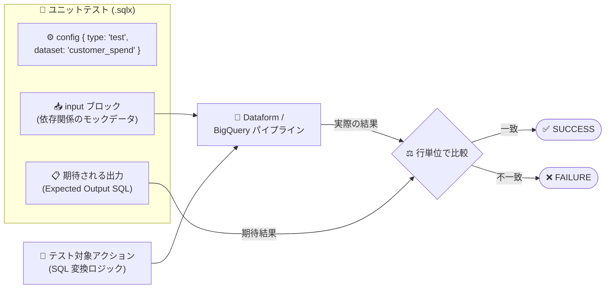

# BigQuery / Dataform: パイプラインとアクションのユニットテストが GA

**リリース日**: 2026-09-17

**サービス**: BigQuery / Dataform

**機能**: ユニットテスト (パイプライン / Dataform アクション) の一般提供 (GA)

**ステータス**: GA (一般提供)

📊 [このアップデートのインフォグラフィックを見る](https://takech9203.github.io/google-cloud-news-summary/20260917-bigquery-dataform-unit-tests-ga.html)

## 概要

BigQuery パイプラインおよび Dataform のユニットテスト機能が一般提供 (GA) になりました。ユニットテストは専用の `.sqlx` ファイルに定義するデータ品質テストで、テスト対象アクションのすべての依存関係 (先行テーブル、ビュー、宣言など) をモックデータで置き換え、期待される結果セットと実際の実行結果を行単位で比較します。これにより、本番データに触れることなく SQL 変換ロジックそのものの正しさを検証できます。

BigQuery 側では、BigQuery Studio のパイプラインに「ユニットテスト」タスクを追加し、モックデータセットに対して SQL 変換ロジックを検証できます。BigQuery パイプラインは Dataform を基盤としており、Dataform リポジトリの `definitions/` ディレクトリに作成した `.sqlx` テストファイルをパイプラインから直接実行できます。

対象ユーザーは、BigQuery / Dataform で ELT パイプラインを開発するデータエンジニアやアナリティクスエンジニアです。エッジケース、NULL 値、集計、正規表現、条件分岐ロジックの動作をコードレビューや本番デプロイ前に自動検証したいチームに有用です。

**アップデート前の課題**

- Dataform のデータ品質検証は主にアサーション (assertion) に依存しており、アサーションはテーブル作成後に実データへ対して実行されるため、変換ロジック自体をデプロイ前に検証する手段としては不十分だった
- SQL 変換ロジックのエッジケース (NULL 値、集計、条件分岐など) を検証するには、実データを用意するか、検証用のデータセットやテーブルクローンを手動で準備する必要があった

**アップデート後の改善**

- 依存関係をモックした制御された入力データに対して SQL ロジックを実行し、期待結果セットと行単位で比較する検証が GA 機能として利用可能になった
- BigQuery パイプラインにユニットテストタスクを追加し、パイプラインの実行フローの一部として、または実行モード「Unit tests」で選択的にテストを実行できるようになった
- API (`WorkflowInvocations.create` の `executionMode: "UNIT_TESTS_ONLY"`) からもプログラマティックに実行でき、CI/CD への組み込みが容易になった

## アーキテクチャ図



ユニットテストは、`input` ブロックで定義したモックデータをテスト対象アクションの SQL ロジックに適用し、その実行結果を期待される出力セットと行単位で比較して SUCCESS / FAILURE を判定します。

## サービスアップデートの詳細

### 主要機能

1. **モックデータによる SQL ロジック検証**
   - `${ref()}` 関数で参照される先行テーブル、ビュー、宣言などの依存関係を `input` ブロックでモック化する
   - 各 `input` ブロックは依存関係を名前で参照し、`SELECT ... UNION ALL ...` 形式の SQL クエリでモック行を定義する
   - エッジケース、NULL 値、集計、正規表現、条件分岐ロジックの動作を検証できる

2. **期待結果セットとの行単位比較**
   - 期待される出力は、モック入力に対してアクションが生成すべき行と列を返す SQL クエリとして記述する
   - Dataform がテストを行単位で実行し、実際の結果と期待結果を比較する
   - テスト結果は `SUCCESS` (一致) または `FAILURE` (不一致) のいずれかに解決される

3. **BigQuery パイプラインへのユニットテストタスク追加**
   - BigQuery Studio のパイプラインで「タスクを追加」から「ユニットテスト」を選択し、テスト対象のテーブル / ビューを指定して作成できる
   - 実行モード「Unit tests」で、特定のテスト選択・タグによる選択・全テスト実行の 3 つのスコープを選べる

4. **柔軟な実行方法 (コンソール / API)**
   - Dataform ワークスペースの「実行を開始」からユニットテストのみを実行できる
   - デフォルトではコンピュートコストを抑えるバッチリソースで実行され、オプションで高優先度のインタラクティブジョブとして即時実行も選択できる
   - API では `WorkflowInvocations.create` に `executionMode: "UNIT_TESTS_ONLY"` を指定して実行できる

## 技術仕様

### ユニットテストの仕様

| 項目 | 詳細 |
|------|------|
| 定義場所 | Dataform リポジトリの `definitions/` ディレクトリ内の専用 `.sqlx` ファイル |
| config タイプ | `type: "test"`、`dataset` にテスト対象アクション名を指定 |
| モック定義 | `input "依存関係名" { SELECT ... }` ブロック (依存関係ごとに 1 つ) |
| 期待結果 | `input` ブロックの下に標準 SQL クエリで記述 |
| 判定方法 | 行単位の比較。結果は `SUCCESS` / `FAILURE` |
| 必要な Dataform core バージョン | 3.0.56 以降 |
| 入力データの上限 | 1 入力あたり最大 100 行 |
| 必要な IAM ロール | ワークスペースに対する Dataform 編集者 (`roles/dataform.editor`) |
| クエリ優先度 | デフォルトはバッチ (コスト優先)。オプションでインタラクティブ (速度優先) |

### API 実行パラメータ (`WorkflowInvocations.create`)

```json
{
  "compilationResult": "projects/my-project/locations/us/repositories/my-repo/compilationResults/my-compilation-id",
  "invocationConfig": {
    "executionMode": "UNIT_TESTS_ONLY",
    "queryPriority": "INTERACTIVE",
    "includedTargets": [],
    "includedTags": []
  }
}
```

- `executionMode: "UNIT_TESTS_ONLY"`: リポジトリに定義されたユニットテストの実行をトリガー (必須)
- `queryPriority: "INTERACTIVE"`: 即時実行 (省略時はバッチ優先度)
- `includedTargets` / `includedTags`: 実行するテストをターゲットまたはタグで絞り込み (省略可)

## 設定方法

### 前提条件

1. Dataform リポジトリと開発ワークスペース (または BigQuery パイプライン) が作成済みであること
2. Dataform core バージョン 3.0.56 以降を使用していること
3. ワークスペースに対する `roles/dataform.editor` が付与されていること

### 手順

#### ステップ 1: ユニットテストファイルの作成

`definitions/` ディレクトリに `{名前}_test.sqlx` ファイル (例: `definitions/customer_spend_test.sqlx`) を作成し、config ブロックでテスト対象アクションを指定します。

```sql
config {
  type: "test",
  dataset: "customer_spend"
}
```

#### ステップ 2: 依存関係のモックと期待結果の定義

テスト対象アクションの依存関係ごとに `input` ブロックを追加し、その下に期待される出力行を SQL で記述します。

```sql
input "source_customers" {
  SELECT 101 AS customer_id, 'Alice' AS name UNION ALL
  SELECT 102 AS customer_id, 'Bob' AS name UNION ALL
  SELECT 103 AS customer_id, 'Charlie' AS name
}

input "source_orders" {
  SELECT 1 AS order_id, 101 AS customer_id, 'COMPLETED' AS status, 100.0 AS amount UNION ALL
  SELECT 2 AS order_id, 101 AS customer_id, 'PENDING' AS status, 50.0 AS amount UNION ALL
  SELECT 3 AS order_id, 102 AS customer_id, 'COMPLETED' AS status, 250.0 AS amount UNION ALL
  SELECT 4 AS order_id, 999 AS customer_id, 'COMPLETED' AS status, 10.0 AS amount
}

-- Expected Output
SELECT 101 AS customer_id, 'Alice' AS name, 100.0 AS total_completed_amount UNION ALL
SELECT 102 AS customer_id, 'Bob' AS name, 250.0 AS total_completed_amount
```

#### ステップ 3: ユニットテストの実行

**Dataform ワークスペースの場合**: 「実行を開始」>「アクションを実行」を選択し、実行モードで「Unit tests」を選択します。テストの個別選択、タグによる選択、全テスト実行のいずれかを指定して実行します。

**BigQuery パイプラインの場合**: パイプラインで「タスクを追加」>「ユニットテスト」を選択し、テスト対象のテーブル / ビューとテスト名を指定します。タスク詳細ペインからテストを開いて入力と期待出力を構成し、パイプラインの一部として実行します。

## メリット

### ビジネス面

- **データ品質インシデントの予防**: 変換ロジックの不具合をデプロイ前に検出でき、下流のレポートや ML パイプラインへの不正データ伝播リスクを低減できる
- **GA による本番適用**: 一般提供となったことで、本番のデータパイプライン開発プロセスに正式に組み込める

### 技術面

- **本番データに依存しないテスト**: モックデータで完結するため、テスト用の実データ準備やテーブルクローン作成が不要
- **CI/CD 統合**: API の `UNIT_TESTS_ONLY` 実行モードにより、Git 連携された Dataform リポジトリの CI パイプラインからテストを自動実行できる
- **コスト制御**: デフォルトでバッチ優先度で実行されるため、頻繁なテスト実行でもコンピュートコストを抑制できる

## デメリット・制約事項

### 制限事項

- Dataform core バージョン 3.0.56 以降が必要
- ユニットテストの入力データは 1 入力あたり最大 100 行

### 考慮すべき点

- ユニットテストはモックデータに対するロジック検証であり、実データの品質検証 (NULL チェック、一意性チェックなど) には引き続きアサーションを併用する必要がある
- 期待される出力クエリは、モック入力に対してテスト対象アクションが生成すべき行と列のみを返すように記述する必要がある

## ユースケース

### ユースケース 1: 集計ロジックのエッジケース検証

**シナリオ**: 顧客ごとの完了済み注文金額を集計するテーブル (`customer_spend`) で、「保留中の注文は除外される」「注文のない顧客は出力されない」「存在しない顧客 ID の注文は無視される」ことを検証したい。

**実装例**: 上記「設定方法」のとおり、完了 / 保留の注文、注文のない顧客、不整合な顧客 ID を含むモックデータを `input` ブロックに定義し、期待される集計結果を Expected Output に記述する。

**効果**: JOIN 条件や WHERE 句の変更でエッジケースの挙動が壊れた場合に、デプロイ前にテストが FAILURE となり検出できる。

### ユースケース 2: BigQuery パイプラインの品質ゲート

**シナリオ**: BigQuery Studio で構築した ELT パイプラインに、変換タスクの後続としてユニットテストタスクを配置し、パイプラインの一部として品質検証を実行する。

**効果**: パイプラインのシーケンス内でデータ品質テストが実行され、SQL 変換ロジックの検証がパイプライン運用に統合される。

## 料金

Dataform 自体は無料のサービスです。ただし、Dataform は BigQuery でクエリを実行するため、ユニットテストの実行にともなうクエリには BigQuery の料金が適用されます。また、Dataform はワークフロー呼び出しのモニタリングに Cloud Logging を使用します (デフォルトで有効、すべてのワークフロー呼び出しに必要)。

ユニットテストはデフォルトでバッチクエリ優先度で実行され、コンピュートコストの節約が優先されます。高優先度のインタラクティブジョブとしての即時実行も選択できます。

詳細は [Dataform の料金ページ](https://cloud.google.com/dataform/pricing) および [BigQuery の料金ページ](https://cloud.google.com/bigquery/pricing) を参照してください。

## 関連サービス・機能

- **BigQuery**: ユニットテストのクエリは BigQuery 上で実行される。BigQuery パイプラインは Dataform を基盤としており、同一のユニットテスト機能を利用する
- **Dataform アサーション**: 実データに対する品質テスト (nonNull、uniqueKey、rowConditions など)。テーブル作成後に実行され、ユニットテストと補完関係にある
- **Cloud Logging**: Dataform のワークフロー呼び出し (ユニットテスト実行を含む) のモニタリングに使用される
- **Git プロバイダ連携**: Dataform リポジトリは GitHub、GitLab、Bitbucket、Azure DevOps Services と連携でき、CI/CD からの API 実行と組み合わせられる

## 参考リンク

- 📊 [インフォグラフィック](https://takech9203.github.io/google-cloud-news-summary/20260917-bigquery-dataform-unit-tests-ga.html)
- [公式リリースノート](https://docs.cloud.google.com/release-notes#September_17_2026)
- [ドキュメント: Test data quality (Dataform ユニットテスト)](https://cloud.google.com/dataform/docs/test-data#unit-tests)
- [ドキュメント: Create pipelines (BigQuery パイプライン)](https://cloud.google.com/bigquery/docs/create-pipelines)
- [料金ページ (Dataform)](https://cloud.google.com/dataform/pricing)

## まとめ

BigQuery パイプラインと Dataform のユニットテストが GA となり、SQL 変換ロジックをモックデータで検証するテスト駆動のデータパイプライン開発が正式にサポートされました。Dataform でパイプラインを運用しているチームは、既存のアサーションに加えてユニットテストを `definitions/` ディレクトリに追加し、API の `UNIT_TESTS_ONLY` 実行モードを CI/CD に組み込むことを推奨します。

---

**タグ**: BigQuery, Dataform, ユニットテスト, データ品質, ELT, GA
