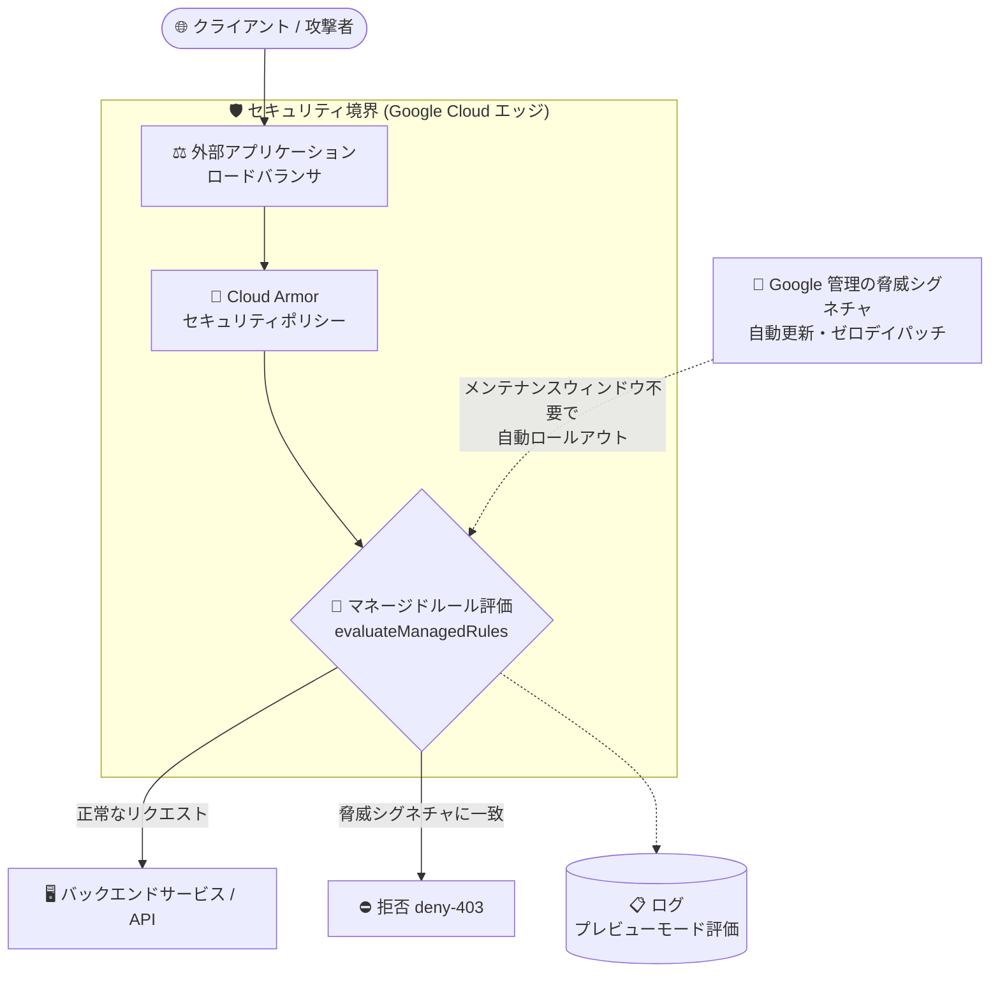

# Google Cloud Armor: マネージドルールセット (Preview)

**リリース日**: 2026-09-17

**サービス**: Google Cloud Armor

**機能**: マネージドルールセット (Managed Rules)

**ステータス**: Preview

📊 [このアップデートのインフォグラフィックを見る](https://takech9203.github.io/google-cloud-news-summary/20260917-cloud-armor-managed-rulesets-preview.html)

## 概要

Google Cloud Armor に、バックエンドサービスと API を幅広い Web アプリケーション脅威から保護する「マネージドルールセット (Managed Rules)」が Preview として追加されました。マネージドルールは、Google Cloud によって自動的に最新状態に保たれる脅威シグネチャを使用し、Cloud Armor セキュリティポリシーに直接統合されます。これにより、手動でのシグネチャ更新が不要になり、設定ドリフト (configuration drift) を削減できます。

新しいシグネチャは脅威フィードに対してキュレーション・検証された上で提供され、既知の CVE や新興の攻撃に対する保護をルールロジックの手動変更なしで実現します。緊急性の高いゼロデイ脆弱性についても、アクティブなルールに直接パッチが適用されます。SQL インジェクションや XSS といった従来型の WAF カテゴリに加え、アカウント乗っ取り、SSRF、機密データ漏えい、悪意のあるファイルアップロード、スパムなど 13 の脅威カテゴリをカバーします。

Web アプリケーションや API を外部公開しており、WAF ルールの運用・チューニング負荷を軽減したいセキュリティチーム・インフラチームが主な対象ユーザーです。

**アップデート前の課題**

- 従来の事前構成 WAF ルール (preconfigured WAF rules) は OWASP ModSecurity Core Rule Set (CRS) ベースであり、CRS 3.0 / 3.3 / 4.22 などのバージョンをユーザー自身が選択し、新バージョンへの移行を管理する必要があった
- シグネチャの更新やルールロジックの変更をユーザー側で追随する必要があり、設定ドリフトが発生しやすかった
- 事前構成 WAF ルールのカテゴリは SQLi や XSS など CRS 由来のものが中心で、アカウント乗っ取り、SSRF、データ漏えい、スパムなどのカテゴリは名前付きルールとして提供されていなかった

**アップデート後の改善**

- シグネチャの更新が Google Cloud によって管理され、メンテナンスウィンドウなしでセキュリティポリシーに自動ロールアウトされるようになった
- 緊急・時間的制約のあるゼロデイ脆弱性がアクティブなルールに直接パッチされ、エンドポイントが保護されるようになった
- `evaluateManagedRules()` 式により、CEL (Common Expression Language) ベースのカスタムルール内できめ細かい条件制御と組み合わせて評価できるようになった
- アカウント乗っ取り、認証バイパス、SSRF、データ漏えい、ファイルアップロード、スパムなど 13 カテゴリの脅威に名前付きカテゴリで対応できるようになった

## アーキテクチャ図



Google が自動更新する脅威シグネチャがセキュリティポリシー内のマネージドルールに反映され、ロードバランサ配下のバックエンドサービス到達前のセキュリティ境界でリクエストが評価・ブロックされます。

## サービスアップデートの詳細

### 主要機能

1. **自動化された脅威インテリジェンス**
   - 新しいシグネチャは脅威フィードに対してキュレーション・検証されて提供される
   - 既知の CVE や新興の攻撃に対して、手動でのルールロジック変更なしに保護を提供

2. **運用負荷の削減とゼロデイ対応**
   - シグネチャ更新は Google Cloud が管理し、メンテナンスウィンドウなしでセキュリティポリシーへ自動ロールアウト
   - 緊急・時間的制約のある脆弱性はアクティブなルールに直接パッチされる

3. **CEL 統合とバージョン戦略**
   - `evaluateManagedRules('<カテゴリ>:<バージョン>')` 式としてカスタムルール内でネイティブに評価され、きめ細かい条件制御と組み合わせ可能
   - `stable` (本番検証済み、推奨) と `canary` (早期アクセス) の 2 つのバージョン戦略を選択でき、canary はプレビューモードでの先行評価が推奨される

4. **13 の脅威カテゴリ**
   - 従来の WAF カテゴリ (SQLi、XSS、LFI、RFI など) に加え、アカウント乗っ取りや SSRF などの新カテゴリをカバー (詳細は技術仕様を参照)

## 技術仕様

### 対応する脅威カテゴリ

| カテゴリ | 概要 | 構文例 |
|------|------|------|
| アカウント乗っ取り | クレデンシャルスタッフィング、ブルートフォース、セッション悪用を検出 | `account_takeover:canary` |
| 認証バイパス | サインインフロー、セッションチェック、トークン検証の回避を検出 | `authentication_bypass:canary` |
| 自動化攻撃 | 既知のスキャナ、攻撃ツール、非人間トラフィックを検出 | `automated_attack:canary` |
| バックドア/トロイの木馬 | Web シェルや既知のバックドアに関連する通信・実行パターンを検出 | `backdoor_trojan:canary` |
| データ漏えい | 内部 IP、認証情報、API キー、PII の漏えいを検出 | `data_leakage:canary` |
| ファイルアップロード | Web シェル、実行ファイル、偽装ペイロードなどの悪意あるアップロードを検出 | `file_upload:canary` |
| LFI | パストラバーサル、ローカルファイルインクルージョンを検出 | `lfi:canary` |
| その他 | 未分類の攻撃、不正な形式のリクエスト、一般的な異常パターンを検出 | `misc:canary` |
| RFI | リモートコード実行、リモートファイルインクルージョンを検出 | `rfi:canary` |
| スパム | フォームスパム、コメントスパム、bot による一括送信を検出 | `spam:canary` |
| SQLi | SQL クエリを操作するリクエストを検出 | `sqli:canary` |
| SSRF | サーバーに内部・不正な外部リクエストを発行させる試みを検出 | `ssrf:canary` |
| XSS | セッションハイジャックなどにつながるスクリプト注入を検出 | `xss:canary` |

### バージョン戦略

| バージョン | 説明 |
|------|------|
| `stable` | 本番検証済み。Google が自動更新 (ゼロデイルールは迅速に更新)。本番トラフィックへの適用が推奨される安全なベースライン |
| `canary` | 早期アクセス。早期公開シグネチャを含み自動更新される。stable に先行してプレビューモードでの実行が推奨 |

### サポート範囲

| 項目 | 詳細 |
|------|------|
| 対応ポリシー | グローバルおよびリージョナルのバックエンドセキュリティポリシー |
| ルール記述 | カスタムルール言語 (CEL) の `evaluateManagedRules()` 式 |
| ステータス | Preview (Pre-GA Offerings Terms が適用) |
| シグネチャ更新 | Google Cloud が管理・自動ロールアウト (canary / stable は脆弱性カバレッジ拡大のため継続的に進化) |

## 設定方法

### 前提条件

1. セキュリティポリシーの作成・変更には IAM の Compute Security Admin ロール (`roles/compute.securityAdmin`)、バックエンドサービスへのポリシー適用には Compute Network Admin ロール (`roles/compute.networkAdmin`) が必要
2. 保護対象のバックエンドサービス (サポート対象のロードバランサ配下) が存在すること

### 手順

#### ステップ 1: セキュリティポリシーを作成

```bash
gcloud compute security-policies create POLICY_NAME \
    --global
```

#### ステップ 2: マネージドルールをポリシーに追加

stable 版の SQL インジェクション (`sqli`) マネージドルールを deny アクションで追加します。

```bash
gcloud compute security-policies rules create 100 \
    --security-policy POLICY_NAME \
    --action deny-403 \
    --expression "evaluateManagedRules('sqli:stable')"
```

#### ステップ 3: セキュリティポリシーをバックエンドサービスにアタッチ

```bash
gcloud compute backend-services update BACKEND_SERVICE \
    --global \
    --security-policy POLICY_NAME
```

セキュリティポリシーはバックエンドサービスにアタッチするまで有効になりません。アタッチすることで、そのバックエンドサービス宛ての受信トラフィックが検査・保護されます。

## メリット

### ビジネス面

- **セキュリティ運用コストの削減**: シグネチャ更新が Google Cloud 管理となり、セキュリティチームは開発・運用業務に集中できる
- **ゼロデイリスクの低減**: 緊急脆弱性がアクティブなルールへ直接パッチされるため、公表から保護までのギャップを短縮できる

### 技術面

- **設定ドリフトの解消**: メンテナンスウィンドウなしの自動ロールアウトにより、環境間・時系列でのルール構成の乖離を防げる
- **CEL によるきめ細かい制御**: `evaluateManagedRules()` を他のマッチ条件と組み合わせ、パスや送信元条件付きの柔軟なルールを構成できる
- **canary + プレビューモードによる安全な評価**: 新シグネチャをブロックせずにログで評価してから stable を強制適用する段階的運用が可能

## デメリット・制約事項

### 制限事項

- Preview 段階の機能であり、Pre-GA Offerings Terms が適用され、サポートが限定される場合がある
- 対応するのはバックエンドセキュリティポリシー (グローバル/リージョナル) であり、サポートされるロードバランサはセキュリティポリシー概要のとおり

### 考慮すべき点

- ルールは Google 側で自動更新されるため、canary 版はプレビューモード (非ブロック) で先行評価し、誤検知の影響を確認する運用が推奨されている
- マネージドルール (canary / stable) は脆弱性カバレッジ拡大のため継続的に進化するため、ログの監視体制を整えておくことが望ましい

## ユースケース

### ユースケース 1: 公開 API の WAF 保護を自動更新型に移行

**シナリオ**: 外部アプリケーションロードバランサ配下で公開している API に対し、CRS バージョン管理やシグネチャ更新の追随なしで SQLi / XSS / SSRF などの保護を維持したい。

**実装例**:
```bash
gcloud compute security-policies rules create 100 \
    --security-policy api-policy \
    --action deny-403 \
    --expression "evaluateManagedRules('sqli:stable')"

gcloud compute security-policies rules create 110 \
    --security-policy api-policy \
    --action deny-403 \
    --expression "evaluateManagedRules('ssrf:stable')"
```

**効果**: シグネチャが自動更新されるため、手動でのルール更新作業なしに既知の CVE や新興攻撃への保護を継続できる。

### ユースケース 2: canary 版をプレビューモードで先行評価

**シナリオ**: 新しいシグネチャが本番トラフィックをブロックする前に、ログ上で誤検知の有無を評価したい。

**実装例**:
```bash
# canary 版を高優先度・プレビューモードで追加 (ブロックせずログのみ)
gcloud compute security-policies rules create 100 \
    --security-policy POLICY_NAME \
    --action deny-403 \
    --expression "evaluateManagedRules('xss:canary')" \
    --preview

# stable 版を低優先度・強制モードで追加
gcloud compute security-policies rules create 200 \
    --security-policy POLICY_NAME \
    --action deny-403 \
    --expression "evaluateManagedRules('xss:stable')"
```

**効果**: 新ルールがライブトラフィックをブロックし始める前にログで評価でき、誤検知リスクを抑えながら最新シグネチャの効果を確認できる。

## 料金

マネージドルールセット固有の料金情報は現時点で確認できませんでした。Cloud Armor は Standard (ポリシー数・ルール数・リクエスト数に基づく従量課金) と Cloud Armor Enterprise (WAF 利用がバンドルされる Paygo / Annual) の 2 つのサービスティアで提供されています。詳細は料金ページを参照してください。

- [Cloud Armor 料金ページ](https://cloud.google.com/armor/pricing)

## 関連サービス・機能

- **外部アプリケーションロードバランサ**: マネージドルールはグローバル/リージョナルのバックエンドセキュリティポリシーでサポートされ、ロードバランサ配下のバックエンドサービスを保護する
- **事前構成 WAF ルール (preconfigured WAF rules)**: OWASP CRS ベースの既存 WAF ルール (`evaluatePreconfiguredWaf()`)。CRS バージョン選択やチューニングをユーザーが管理する方式で、マネージドルールと併用・比較の対象となる
- **Cloud Armor Enterprise**: Adaptive Protection、Google Threat Intelligence、階層型セキュリティポリシーなどを含む上位ティア
- **Cloud Logging / モニタリング**: プレビューモードで追加した canary ルールの評価結果をログで確認し、段階的に強制適用へ移行できる

## 参考リンク

- 📊 [インフォグラフィック](https://takech9203.github.io/google-cloud-news-summary/20260917-cloud-armor-managed-rulesets-preview.html)
- [公式リリースノート](https://docs.cloud.google.com/release-notes#September_17_2026)
- [Managed rules overview](https://cloud.google.com/armor/docs/managed-rules-overview)
- [Set up managed rules](https://cloud.google.com/armor/docs/set-up-managed-rules)
- [Cloud Armor security policy overview](https://docs.cloud.google.com/armor/docs/security-policy-overview)
- [料金ページ](https://cloud.google.com/armor/pricing)

## まとめ

Cloud Armor マネージドルールセットは、WAF シグネチャの更新・管理を Google Cloud に委ねることで、設定ドリフトとゼロデイ対応のギャップという WAF 運用の代表的な課題に応える機能です。まずは canary 版をプレビューモードで既存のセキュリティポリシーに追加してログで挙動を評価し、問題がなければ stable 版の強制適用へ移行する段階的な導入を推奨します。Preview 段階のため、本番適用の際は Pre-GA の提供条件を確認してください。

---

**タグ**: Google Cloud Armor, WAF, セキュリティ, マネージドルール, Preview
