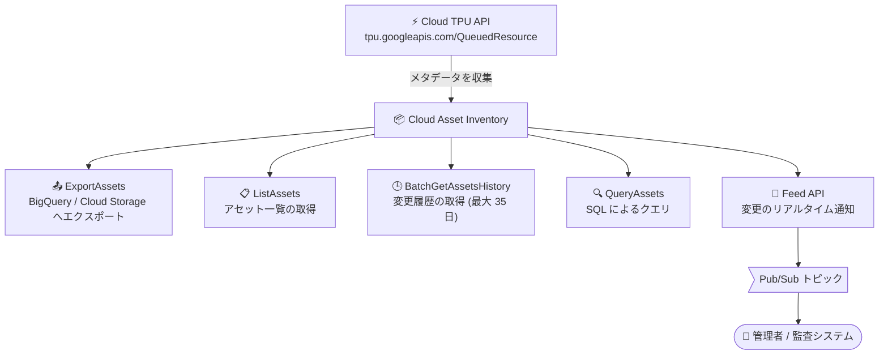

# Cloud Asset Inventory: Cloud TPU QueuedResource リソースタイプのサポート追加

**リリース日**: 2026-09-17

**サービス**: Cloud Asset Inventory

**機能**: Cloud TPU API `tpu.googleapis.com/QueuedResource` リソースタイプのサポート

**ステータス**: Feature (一般公開)

📊 [このアップデートのインフォグラフィックを見る](https://takech9203.github.io/google-cloud-news-summary/20260917-cloud-asset-inventory-tpu-queuedresource.html)

## 概要

Cloud Asset Inventory で、Cloud TPU API の新しいリソースタイプ `tpu.googleapis.com/QueuedResource` が一般公開されました。このリソースタイプは、ExportAssets、ListAssets、BatchGetAssetsHistory、QueryAssets、Feed の各 API を通じて利用できます。

Cloud TPU の Queued Resource (キュードリソース) は、TPU リソースをキュー方式でリクエストする仕組みです。リクエストは Cloud TPU サービスが管理するキューに追加され、リソースが利用可能になった時点でプロジェクトに割り当てられます。今回のアップデートにより、この Queued Resource のメタデータを Cloud Asset Inventory の各 API で一元的に取得・エクスポート・監視できるようになりました。

大規模な ML トレーニング基盤を運用する組織では、複数プロジェクトにまたがる TPU リクエストの棚卸しやガバナンス管理が課題となりますが、本アップデートにより組織・フォルダ・プロジェクト単位での Queued Resource の可視化が可能になります。

**アップデート前の課題**

- Cloud Asset Inventory は `tpu.googleapis.com/QueuedResource` リソースタイプに対応しておらず、Queued Resource を組織横断のアセットインベントリとして把握できなかった
- Queued Resource の状態確認には、プロジェクト・ゾーンごとに Cloud TPU API (`gcloud compute tpus queued-resources list/describe`) を個別に呼び出す必要があった
- Queued Resource の構成変更の履歴追跡や、変更をトリガーとした通知の仕組みを Cloud Asset Inventory 側で構築できなかった

**アップデート後の改善**

- ExportAssets により、Queued Resource のメタデータを BigQuery や Cloud Storage へ組織・フォルダ・プロジェクト単位で一括エクスポートできるようになった
- ListAssets / QueryAssets により、Queued Resource を他のアセットと合わせて一覧取得・SQL クエリで分析できるようになった
- BatchGetAssetsHistory により、Queued Resource の変更履歴 (最大 35 日間) を取得できるようになった
- Feed API により、Queued Resource の変更を Pub/Sub 経由でリアルタイムに通知できるようになった

## アーキテクチャ図



Cloud TPU の QueuedResource のメタデータが Cloud Asset Inventory に収集され、エクスポート・一覧取得・履歴取得・SQL クエリ・リアルタイム通知の 5 つの API から利用できるようになります。

## サービスアップデートの詳細

### 主要機能

1. **ExportAssets / ListAssets での取得**
   - Queued Resource のメタデータを、組織・フォルダ・プロジェクト単位で BigQuery や Cloud Storage にエクスポート可能
   - ListAssets で他のリソースタイプと合わせて一覧取得が可能

2. **BatchGetAssetsHistory による履歴取得**
   - Queued Resource の作成・更新・削除の履歴を取得可能
   - Cloud Asset Inventory はアセットの変更履歴を最大 35 日間保持

3. **QueryAssets による SQL 分析**
   - BigQuery SQL 構文を用いて、Queued Resource を含むアセットメタデータへのクエリが可能

4. **Feed API によるリアルタイム通知**
   - Queued Resource の変更を Pub/Sub 経由で通知するフィードを作成可能
   - フィードに条件を設定し、特定の変更のみを通知対象にすることも可能

## 技術仕様

### 対象リソースタイプ

| 項目 | 詳細 |
|------|------|
| アセットタイプ | `tpu.googleapis.com/QueuedResource` |
| 提供元サービス | Cloud TPU API (`tpu.googleapis.com`) |
| 対応 API | ExportAssets、ListAssets、BatchGetAssetsHistory、QueryAssets、Feed |
| 履歴保持期間 | 最大 35 日 (Cloud Asset Inventory 共通) |

### Cloud TPU Queued Resource の状態

Cloud Asset Inventory で追跡できる Queued Resource は、以下のいずれかの状態を持ちます。

| 状態 | 説明 |
|------|------|
| `WAITING_FOR_RESOURCES` | 初期検証を通過しキューに追加された状態 (旧 `ACCEPTED` を置き換え) |
| `PROVISIONING` | キューから選択され、リソースの割り当て中 |
| `ACTIVE` | リソースの割り当てが完了し利用可能 |
| `FAILED` | リクエストに問題がある、または割り当て期間内にリソースを確保できなかった |
| `SUSPENDING` | リクエストに関連付けられたリソースの削除中 |
| `SUSPENDED` | リソースが削除済みで、それ以上の割り当て対象外 |

## 設定方法

### 前提条件

1. 対象プロジェクトで Cloud Asset Inventory API を有効化する
2. Cloud Asset Inventory API の呼び出しに必要な IAM ロールを付与する (呼び出しタイプごとの権限はドキュメントの [Roles and permissions](https://docs.cloud.google.com/asset-inventory/docs/roles-permissions) を参照)
3. Feed を利用する場合は、通知先の Pub/Sub トピックを作成しておく

### 手順

#### ステップ 1: Queued Resource の一覧取得

```bash
gcloud asset list \
  --project=PROJECT_ID \
  --asset-types="tpu.googleapis.com/QueuedResource" \
  --content-type=resource
```

プロジェクト内の Queued Resource アセットを一覧取得します。`--project` の代わりに `--organization` や `--folder` を指定すれば、組織・フォルダ単位での棚卸しも可能です。

#### ステップ 2: BigQuery へのエクスポート

```bash
gcloud asset export \
  --project=PROJECT_ID \
  --asset-types="tpu.googleapis.com/QueuedResource" \
  --content-type=resource \
  --bigquery-table="projects/PROJECT_ID/datasets/DATASET_ID/tables/TABLE_NAME" \
  --output-bigquery-force
```

Queued Resource のメタデータを BigQuery テーブルにエクスポートし、SQL で分析できるようにします。

#### ステップ 3: 変更監視フィードの作成

```bash
gcloud asset feeds create tpu-queued-resource-feed \
  --project=PROJECT_ID \
  --asset-types="tpu.googleapis.com/QueuedResource" \
  --content-type=resource \
  --pubsub-topic="projects/PROJECT_ID/topics/TOPIC_ID"
```

Queued Resource の変更が発生すると、Pub/Sub トピックに `TemporalAsset` 形式のメッセージ (変更前後のメタデータを含む) が配信されます。

## メリット

### ビジネス面

- **ガバナンスの強化**: 組織・フォルダ単位で TPU の Queued Resource を棚卸しでき、コンプライアンス追跡や定期監査の対象に含められる
- **コスト管理の改善**: Queued Resource はリクエストの状態にかかわらずクォータを消費するため、使い終わったリクエストの放置を検出して削除を促すことで、クォータの枯渇や無駄を防止できる

### 技術面

- **一元的な可視化**: プロジェクト・ゾーンごとに Cloud TPU API を呼び出すことなく、Cloud Asset Inventory の標準 API で他のアセットと同じ方法で Queued Resource を取得できる
- **変更のトレーサビリティ**: BatchGetAssetsHistory による履歴取得と Feed によるリアルタイム通知により、Queued Resource の状態変化 (例: `WAITING_FOR_RESOURCES` から `ACTIVE` への遷移) を監査証跡として残せる
- **既存パイプラインとの統合**: BigQuery エクスポートや Pub/Sub 通知を既存のアセット管理・監視パイプラインにそのまま組み込める

## デメリット・制約事項

### 制限事項

- Cloud Asset Inventory の履歴保持期間は最大 35 日間 (35 日間変更がないアセットは最新の状態を返す)
- Cloud Asset Inventory は現在データについて結果整合性、履歴データについてベストエフォートの整合性を提供する。まれにデータ更新を取りこぼす可能性がある
- リアルタイムのクエリ用途 (欠落や古いデータが本番の可用性やセキュリティ制御を損なうケース) には設計されていない。ライブなデータが必要な場合は Cloud TPU API を直接呼び出す必要がある
- Feed の作成・更新・削除が反映されるまで最大 10 分かかる。また、1 つの親リソースに作成できるフィードは最大 200 個

### 考慮すべき点

- 今回のリリースノートで明示されている対応 API は ExportAssets、ListAssets、BatchGetAssetsHistory、QueryAssets、Feed であり、検索 API (SearchAllResources など) や分析 API での対応は言及されていない
- Cloud TPU API (`tpu.googleapis.com`) 自体は現在アクティブな開発対象ではなく、バグ修正とセキュリティアップデートのみが提供される。TPU7x 以降の TPU バージョンでは Cloud TPU API はサポートされず、Compute Engine または GKE での TPU 管理が推奨されている

## ユースケース

### ユースケース 1: 組織横断での TPU リクエストの棚卸し

**シナリオ**: 複数のプロジェクトで ML トレーニングを実施している組織で、どのプロジェクトにどのような Queued Resource が存在するかを定期的に棚卸ししたい。

**実装例**:
```bash
gcloud asset list \
  --organization=ORGANIZATION_ID \
  --asset-types="tpu.googleapis.com/QueuedResource" \
  --content-type=resource
```

**効果**: プロジェクトやゾーンを個別に確認することなく、組織全体の Queued Resource を一括で把握できる。`FAILED` や `SUSPENDED` のまま放置されたリクエストを検出し、クォータの無駄な消費を防止できる。

### ユースケース 2: Queued Resource の状態変化の監視と通知

**シナリオ**: 大規模トレーニングジョブ用の TPU リクエストが `ACTIVE` になったタイミングや、意図しない削除が発生したことを運用チームに即時通知したい。

**実装例**:
```bash
gcloud asset feeds create tpu-qr-monitor \
  --project=PROJECT_ID \
  --asset-types="tpu.googleapis.com/QueuedResource" \
  --content-type=resource \
  --pubsub-topic="projects/PROJECT_ID/topics/tpu-qr-changes"
```

**効果**: Pub/Sub 通知を Cloud Run functions などと連携させることで、状態遷移に応じたジョブ起動や、変更検知時の自動アクションを実装できる。

### ユースケース 3: BigQuery での TPU リソース利用状況の分析

**シナリオ**: Queued Resource のメタデータを BigQuery にエクスポートし、アクセラレータタイプやゾーンごとのリクエスト傾向を分析したい。

**効果**: エクスポートしたメタデータに対して SQL で集計・分析ができ、キャパシティプランニングや予約 (Reservation) 購入の判断材料として活用できる。

## 関連サービス・機能

- **Cloud TPU**: Queued Resource の提供元。TPU リソースのキュー方式でのリクエスト・管理を行う
- **BigQuery**: ExportAssets / QueryAssets の連携先。アセットメタデータの SQL 分析に利用
- **Cloud Storage**: ExportAssets のエクスポート先として利用可能
- **Pub/Sub**: Feed API の通知配信基盤。変更メッセージ (TemporalAsset 形式) を受信
- **Cloud Logging**: Feed の配信エラーが発生した場合のエラーステータス・メッセージの記録先

## 参考リンク

- 📊 [インフォグラフィック](https://takech9203.github.io/google-cloud-news-summary/20260917-cloud-asset-inventory-tpu-queuedresource.html)
- [公式リリースノート](https://docs.cloud.google.com/release-notes#September_17_2026)
- [Cloud Asset Inventory: サポートされているアセットタイプ](https://docs.cloud.google.com/asset-inventory/docs/asset-types)
- [Cloud Asset Inventory の概要](https://docs.cloud.google.com/asset-inventory/docs/asset-inventory-overview)
- [アセット変更の監視 (Feed)](https://docs.cloud.google.com/asset-inventory/docs/monitor-asset-changes)
- [Cloud TPU: Queued Resource の管理](https://docs.cloud.google.com/tpu/docs/queued-resources)

## まとめ

Cloud TPU の Queued Resource が Cloud Asset Inventory の対応リソースタイプに追加され、エクスポート・一覧取得・履歴取得・SQL クエリ・リアルタイム通知の各 API から TPU リクエストを一元管理できるようになりました。複数プロジェクトで TPU を利用している組織は、既存のアセット管理パイプラインに `tpu.googleapis.com/QueuedResource` を追加し、放置されたリクエストの検出や状態変化の監視を自動化することを推奨します。

---

**タグ**: #CloudAssetInventory #CloudTPU #QueuedResource #ガバナンス #インベントリ管理 #Feature
