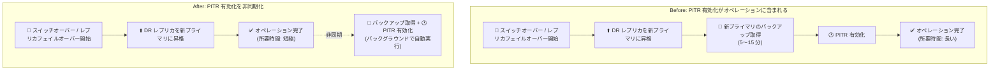

# Cloud SQL for MySQL / PostgreSQL: DR スイッチオーバー・レプリカフェイルオーバー後の PITR 非同期有効化

**リリース日**: 2026-09-17

**サービス**: Cloud SQL for MySQL / Cloud SQL for PostgreSQL

**機能**: 高度な災害復旧 (Advanced DR) オペレーション後のポイントインタイムリカバリ (PITR) 非同期有効化

**ステータス**: Change (仕様変更)

📊 [このアップデートのインフォグラフィックを見る](https://takech9203.github.io/google-cloud-news-summary/20260917-cloud-sql-async-pitr-dr-switchover.html)

## 概要

Cloud SQL for MySQL および Cloud SQL for PostgreSQL において、災害復旧 (DR) のスイッチオーバーとレプリカフェイルオーバーの完了後に、ポイントインタイムリカバリ (PITR) が別の非同期オペレーションとして自動的に有効化されるようになりました。PITR の有効化がスイッチオーバーやレプリカフェイルオーバーの処理をブロックしなくなったため、これらのオペレーションがより速く完了し、復旧時間 (RTO) の短縮に貢献します。

高度な災害復旧 (Advanced DR) は Cloud SQL Enterprise Plus エディションの機能で、クロスリージョンの DR レプリカを指定し、計画的なロール切り替え (スイッチオーバー) やリージョン障害時の昇格 (レプリカフェイルオーバー) を実行できます。これらのオペレーションでは、新しいプライマリインスタンスの昇格直後にバックアップが取得され、そのバックアップ完了後に PITR が完全に有効化されます。このバックアップはディスクサイズに応じて 5〜15 分程度かかります。

今回の変更により、PITR の構成・有効化はスイッチオーバー / レプリカフェイルオーバー完了後に非同期で実行されるため、オペレーション自体の所要時間に加算されなくなりました。リージョン障害からの復旧を急ぐ場面で、アプリケーションの書き込み再開までの時間を短縮できます。

**アップデート前の課題**

- スイッチオーバーおよびレプリカフェイルオーバーのオペレーションに PITR の有効化処理が含まれており、オペレーションの完了までの時間が長くなっていた
- 新プライマリ昇格後のバックアップ (ディスクサイズにより 5〜15 分) の分だけ、災害時の復旧時間 (RTO) が延びる要因となっていた

**アップデート後の改善**

- PITR の構成・有効化がスイッチオーバー / レプリカフェイルオーバー完了後の独立した非同期オペレーションとして自動実行されるようになった
- PITR 有効化がオペレーションをブロックしなくなり、スイッチオーバーとレプリカフェイルオーバーがより速く完了するようになった
- 結果として、DR 発動時の復旧時間 (RTO) を短縮できるようになった

## アーキテクチャ図



従来はスイッチオーバー / レプリカフェイルオーバーのオペレーション内で PITR 有効化まで行われていましたが、今回の変更で PITR の構成・有効化がオペレーション完了後の非同期処理に分離され、オペレーション自体の完了が速くなりました。

## サービスアップデートの詳細

### 主要機能

1. **PITR 有効化の非同期化**
   - スイッチオーバー / レプリカフェイルオーバーの完了後、Cloud SQL が PITR を別の非同期オペレーションとして自動的に構成・有効化する
   - PITR 有効化がオペレーションの所要時間に加算されなくなった

2. **復旧時間 (RTO) の短縮**
   - スイッチオーバーとレプリカフェイルオーバーがより速く完了するため、DR 発動時の復旧時間を短縮できる
   - リージョン障害時に、新プライマリへの書き込み切り替えまでの時間短縮に寄与する

3. **昇格後の自動バックアップと PITR カバレッジ**
   - 新プライマリインスタンスの昇格直後に、Cloud SQL がベストエフォートでバックアップを開始する
   - PITR はこのバックアップ完了後に有効化される (バックアップはディスクサイズにより 5〜15 分)
   - PITR のカバレッジ (復元可能期間) はこのバックアップ完了後から開始される

## 技術仕様

### 高度な災害復旧 (Advanced DR) の前提条件

| 項目 | 詳細 |
|------|------|
| エディション | プライマリ・DR レプリカともに Cloud SQL Enterprise Plus |
| PITR | プライマリインスタンスで PITR を有効化しておく必要がある |
| DR レプリカの配置 | プライマリと別リージョンの直接接続リードレプリカ (カスケードレプリカ不可) |
| トランザクションログ | DR レプリカは PITR 用トランザクションログを Cloud Storage に保存する必要がある |
| gcloud CLI | バージョン 502.0.0 以降が必要 |

### PITR と Advanced DR の関係

- スイッチオーバー / レプリカフェイルオーバーに関与したインスタンスは、リードレプリカ期間中もプライマリ期間中も PITR とバックアップからの復元をサポートする
- スイッチオーバー前 (プライマリだった時点) の時刻への PITR も実行可能
- 昇格後のバックアップ完了までの期間は、新プライマリで PITR は利用できない

## 設定方法

今回の変更はユーザー側の設定変更は不要で、スイッチオーバー / レプリカフェイルオーバー実行時に自動的に適用されます。参考として、Advanced DR の主なオペレーションのコマンドを示します。

### DR レプリカの指定

```bash
gcloud sql instances patch PRIMARY_INSTANCE_NAME \
    --failover-dr-replica-name=REPLICA_NAME
```

### スイッチオーバーの実行 (計画的なロール切り替え)

```bash
gcloud sql instances switchover REPLICA_NAME [--db-timeout=TIMEOUT_DURATION]
```

### レプリカフェイルオーバーの実行 (リージョン障害時)

```bash
gcloud sql instances promote-replica REPLICA_NAME --failover
```

いずれのオペレーションも、完了後に PITR が非同期で自動的に有効化されます。

## メリット

### ビジネス面

- **復旧時間 (RTO) の短縮**: DR 発動時にアプリケーションの書き込み再開までの時間が短縮され、ダウンタイムによるビジネス影響を低減できる
- **追加コスト・設定不要**: 既存の Advanced DR 構成のまま自動的に適用され、ユーザー側の作業は不要

### 技術面

- **オペレーションの高速化**: PITR 有効化 (昇格後バックアップを含む) がスイッチオーバー / レプリカフェイルオーバーをブロックしなくなった
- **自動化された PITR 再有効化**: 新プライマリでの PITR 構成を Cloud SQL が非同期で自動実行するため、手動での再構成が不要

## デメリット・制約事項

### 制限事項

- プライマリインスタンスが PITR 用トランザクションログをディスクに保存している場合、Enterprise Plus エディションのリードレプリカを DR レプリカに指定できない
- 外部レプリカは DR レプリカに指定できない
- レプリカフェイルオーバーのオペレーションは Terraform でサポートされていない

### 考慮すべき点

- 昇格後のバックアップ (5〜15 分程度) が完了するまで、新プライマリで PITR は利用できない。PITR のカバレッジはバックアップ完了後から開始される
- VPC Service Controls を使用している場合、特に別プロジェクトの鍵で CMEK を使用しているときは、PITR の有効化・再構成がサービス境界にブロックされないよう境界の設定を確認する必要がある (KMS 鍵のプロジェクトをインスタンスと同じ境界に含めることが推奨)
- レプリカフェイルオーバーでは、レプリケーションラグによりデータ損失 (スプリットブレイン) が発生する可能性がある。旧プライマリ復旧時に取得される最終バックアップから未反映データを回復できる

## ユースケース

### ユースケース 1: リージョン障害時の迅速な復旧

**シナリオ**: プライマリリージョンで障害が発生し、クロスリージョンの DR レプリカへのフェイルオーバーが必要になった。

**実装例**:
```bash
gcloud sql instances promote-replica dr-replica-tokyo --failover
```

**効果**: PITR 有効化がフェイルオーバーをブロックしないため、新プライマリへの書き込み切り替えがより速く完了し、RTO を短縮できる。PITR はフェイルオーバー完了後にバックグラウンドで自動的に有効化される。

### ユースケース 2: DR 訓練 (計画的スイッチオーバー) の所要時間短縮

**シナリオ**: 定期的な DR 訓練として、プライマリと DR レプリカのロールを計画的に入れ替える。

**効果**: スイッチオーバーの所要時間が短縮され、訓練時のメンテナンスウィンドウを短くできる。訓練後の切り戻し (逆方向のスイッチオーバー) でも同様に時間を短縮できる。

## 料金

今回の変更自体に伴う追加料金の情報はリリースノートに記載されていません。なお、高度な災害復旧 (Advanced DR) は Cloud SQL Enterprise Plus エディションで利用可能な機能であり、DR レプリカのインスタンス料金やバックアップ・ログのストレージ料金が発生します。詳細は料金ページを参照してください。

- [Cloud SQL の料金](https://cloud.google.com/sql/pricing)

## 関連サービス・機能

- **ポイントインタイムリカバリ (PITR)**: トランザクションログを使用して任意の時点にインスタンスを復元する機能。今回のアップデートで DR オペレーション後の有効化が非同期化された
- **高可用性 (HA) 構成**: 同一リージョン内のゾーン障害に対応する機能。Advanced DR (クロスリージョン) と組み合わせて使用し、プライマリで HA を有効にしている場合は DR レプリカでも HA を有効にすることが推奨される
- **DNS 書き込みエンドポイント**: スイッチオーバー / フェイルオーバー後に新プライマリへ自動的に解決されるエンドポイント。アプリケーションの接続先変更を不要にする
- **VPC Service Controls / Cloud KMS (CMEK)**: DR オペレーションによる PITR の有効化・再構成がサービス境界にブロックされないよう、境界設定の確認が必要

## 参考リンク

- 📊 [インフォグラフィック](https://takech9203.github.io/google-cloud-news-summary/20260917-cloud-sql-async-pitr-dr-switchover.html)
- [公式リリースノート (2026 年 9 月 17 日)](https://docs.cloud.google.com/release-notes#September_17_2026)
- [Cloud SQL for MySQL: 高度な災害復旧 (DR) の使用](https://cloud.google.com/sql/docs/mysql/use-advanced-disaster-recovery)
- [Cloud SQL for PostgreSQL: 高度な災害復旧 (DR) の使用](https://cloud.google.com/sql/docs/postgres/use-advanced-disaster-recovery)
- [Cloud SQL の料金](https://cloud.google.com/sql/pricing)

## まとめ

Cloud SQL for MySQL / PostgreSQL の DR スイッチオーバーとレプリカフェイルオーバーにおいて、PITR の有効化が非同期化され、オペレーションの完了が速くなり RTO を短縮できるようになりました。ユーザー側の設定変更は不要ですが、昇格後バックアップが完了するまで新プライマリで PITR が利用できない点と、VPC Service Controls / CMEK 環境では境界設定の確認が必要な点に留意してください。Advanced DR を利用中のチームは、DR 訓練 (スイッチオーバー) で所要時間の短縮効果を確認しておくことをおすすめします。

---

**タグ**: Cloud SQL, MySQL, PostgreSQL, 災害復旧, DR, PITR, スイッチオーバー, フェイルオーバー, Enterprise Plus
