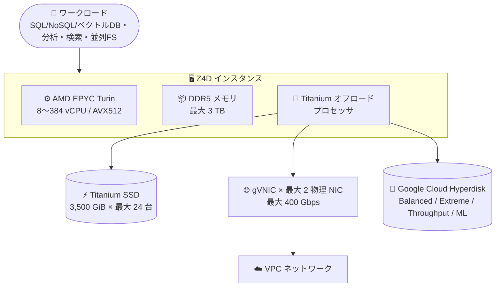

# Compute Engine: ストレージ最適化 Z4D マシンシリーズが GA

**リリース日**: 2026-09-17

**サービス**: Compute Engine

**機能**: ストレージ最適化 Z4D マシンシリーズ

**ステータス**: GA (Generally Available)

📊 [このアップデートのインフォグラフィックを見る](https://takech9203.github.io/google-cloud-news-summary/20260917-compute-engine-z4d-machine-series-ga.html)

## 概要

Compute Engine のストレージ最適化マシンファミリーに、新しい Z4D マシンシリーズが一般提供 (GA) されました。Z4D は AMD EPYC Turin プロセッサ、DDR5 メモリ、Titanium オフロードプロセッサを搭載し、コア使用率が低くストレージ密度が高いワークロード向けに設計されています。具体的には SQL / NoSQL / ベクトルデータベース、データ分析・データウェアハウス、検索、AI/ML 向け並列ファイルシステムなどが主なターゲットです。

リリースノートでは、最大 3 TB のメモリと 42,000 GiB のローカル Titanium SSD 容量、2 つの物理 NIC を使用した最大 400 Gbps のネットワーク帯域幅がアナウンスされています。なお、公式ドキュメントには 24 台の Titanium SSD (合計 84,000 GiB) を搭載する `z4d-highmem-384-standardlssd` および `z4d-highmem-192-highlssd` 構成も記載されています。マシンタイプは vCPU あたりの SSD 容量比率が異なる `standardlssd` と `highlssd` の 2 種類の事前定義シェイプで提供されます。

従来の Z3 シリーズ (Intel Xeon Sapphire Rapids ベース) に続く第 2 のストレージ最適化シリーズであり、AMD ベースの選択肢が加わったことで、ローカルストレージ集約型ワークロードの設計自由度が大きく広がります。

**アップデート前の課題**

- ストレージ最適化ファミリーは Z3 (Intel ベース) のみで、AMD プロセッサの選択肢がなかった
- Z3 の VM インスタンスはメモリ最大 1.5 TB、ローカル Titanium SSD 最大 36,000 GiB (ベアメタルで 72,000 GiB) に制限されていた
- Z3 のネットワーク帯域幅は Tier_1 ネットワーキング使用時でも最大 200 Gbps だった

**アップデート後の改善**

- AMD EPYC Turin ベースの Z4D が GA となり、ストレージ最適化ワークロードで AMD プロセッサを選択可能になった
- VM インスタンスで最大 3 TB (3,024 GB) のメモリと、1 台あたり 3,500 GiB の大容量 Titanium SSD ディスクを利用可能になった (ドキュメント記載の最大構成では合計 84,000 GiB)
- 2 物理 NIC 構成で最大 400 Gbps の標準ネットワーキング帯域幅を利用可能になった (Tier_1 ネットワーキング機能は不要)
- AVX512 によるベクトル処理のビルトインアクセラレーションをサポート

## アーキテクチャ図



Z4D は Titanium オフロードプロセッサがネットワークとストレージ処理をホスト CPU から分離し、ローカル Titanium SSD と Hyperdisk、最大 400 Gbps のネットワーキングを高効率に提供します。

## サービスアップデートの詳細

### 主要機能

1. **AMD EPYC Turin プロセッサ + Titanium オフロード**
   - AMD EPYC Turin プロセッサと DDR5 メモリを搭載し、NUMA アーキテクチャに最適化された一貫性のあるパフォーマンスを提供
   - Titanium によりネットワーキングとストレージ処理をホスト CPU からデータセンター内のシリコンデバイスへオフロード
   - AVX512 (32 個の倍精度 / 64 個の単精度浮動小数点数、8 個の 64 ビット / 16 個の 32 ビット整数) によるベクトル処理アクセラレーションをサポート

2. **大容量 Titanium SSD (1 ディスクあたり 3,500 GiB)**
   - Z3 の 3,000 GiB より大きい 3,500 GiB のディスクパーティションサイズ
   - 全マシンタイプにローカル Titanium SSD が自動アタッチされる
   - 最大構成 (24 ディスク) で読み取り 15,600,000 IOPS / 75,600 MiBps スループット

3. **2 種類の事前定義 lssd マシンシェイプ**
   - `standardlssd`: vCPU あたり SSD 容量比 1:219。vCPU あたりの Titanium SSD 性能が最も高く、中規模データセットの高性能検索・分析向け
   - `highlssd`: vCPU あたり SSD 容量比 1:438。`standardlssd` より大きなディスクパーティションを提供し、大規模データセットのストレージ集約型ストリーミング・分析向け

4. **最大 400 Gbps のネットワーキング**
   - 1 物理 NIC 構成で最大 200 Gbps、2 物理 NIC 構成 (`z4d-highmem-384-standardlssd`) で最大 400 Gbps の標準ネットワーキング帯域幅
   - Z3 と異なり per-VM Tier_1 ネットワーキング機能を使用せずに高帯域を実現
   - gVNIC ネットワークインターフェースが必須

## 技術仕様

### Z4D standardlssd マシンタイプ

| マシンタイプ | vCPU | メモリ (GB) | Titanium SSD | NIC 数 | デフォルト帯域幅 |
|------|------|------|------|------|------|
| z4d-highmem-16-standardlssd | 16 | 126 | 3,500 GiB (1 x 3,500) | 1 | 最大 20 Gbps |
| z4d-highmem-32-standardlssd | 32 | 252 | 7,000 GiB (2 x 3,500) | 1 | 最大 32 Gbps |
| z4d-highmem-48-standardlssd | 48 | 378 | 10,500 GiB (3 x 3,500) | 1 | 最大 50 Gbps |
| z4d-highmem-64-standardlssd | 64 | 504 | 14,000 GiB (4 x 3,500) | 1 | 最大 65 Gbps |
| z4d-highmem-96-standardlssd | 96 | 756 | 21,000 GiB (6 x 3,500) | 1 | 最大 100 Gbps |
| z4d-highmem-192-standardlssd | 192 | 1,512 | 42,000 GiB (12 x 3,500) | 1 | 最大 200 Gbps |
| z4d-highmem-384-standardlssd | 384 | 3,024 | 84,000 GiB (24 x 3,500) | 2 | 最大 400 Gbps |

### Z4D highlssd マシンタイプ

| マシンタイプ | vCPU | メモリ (GB) | Titanium SSD | NIC 数 | デフォルト帯域幅 |
|------|------|------|------|------|------|
| z4d-highmem-8-highlssd | 8 | 63 | 3,500 GiB (1 x 3,500) | 1 | 最大 20 Gbps |
| z4d-highmem-16-highlssd | 16 | 126 | 7,000 GiB (2 x 3,500) | 1 | 最大 20 Gbps |
| z4d-highmem-32-highlssd | 32 | 252 | 14,000 GiB (4 x 3,500) | 1 | 最大 32 Gbps |
| z4d-highmem-48-highlssd | 48 | 378 | 21,000 GiB (6 x 3,500) | 1 | 最大 50 Gbps |
| z4d-highmem-64-highlssd | 64 | 504 | 28,000 GiB (8 x 3,500) | 1 | 最大 65 Gbps |
| z4d-highmem-96-highlssd | 96 | 756 | 42,000 GiB (12 x 3,500) | 1 | 最大 100 Gbps |
| z4d-highmem-192-highlssd | 192 | 1,512 | 84,000 GiB (24 x 3,500) | 1 | 最大 200 Gbps |

### Titanium SSD パフォーマンス (代表値)

| マシンタイプ | 読み取り IOPS | 書き込み IOPS | 読み取りスループット | 書き込みスループット |
|------|------|------|------|------|
| z4d-highmem-16-standardlssd | 650,000 | 512,000 | 3,150 MiBps | 2,400 MiBps |
| z4d-highmem-96-standardlssd | 3,900,000 | 3,072,000 | 18,900 MiBps | 14,400 MiBps |
| z4d-highmem-192-standardlssd / 96-highlssd | 7,800,000 | 6,144,000 | 37,800 MiBps | 28,800 MiBps |
| z4d-highmem-384-standardlssd / 192-highlssd | 15,600,000 | 12,288,000 | 75,600 MiBps | 57,600 MiBps |

### サポートされるブロックストレージ

Z4D インスタンスは NVMe ディスクインターフェースのみをサポートし、以下のブロックストレージタイプを利用できます。

| ストレージタイプ | 備考 |
|------|------|
| Hyperdisk Balanced / Balanced High Availability | 全マシンタイプで利用可 |
| Hyperdisk Extreme | 64 vCPU 以上のマシンタイプのみ (最大 8 台) |
| Hyperdisk Throughput | 全マシンタイプで利用可 |
| Hyperdisk ML | 全マシンタイプで利用可 |
| Titanium SSD | 全マシンタイプに自動アタッチ |

Persistent Disk (pd-balanced / pd-ssd) は Z3 ではサポートされていましたが、Z4D のサポート対象ディスクタイプには含まれていません。ホスト間で最大接続数はマシンタイプにより Hyperdisk 合計 16〜128 台です。

### メンテナンス動作

| アタッチ済み Titanium SSD | メンテナンス動作 | 事前通知 |
|------|------|------|
| 42,000 GiB 以下 | ライブマイグレーション | 7 日前 |
| 42,000 GiB 超 | Local SSD データ保持を伴う終了 | 7 日前 |

ホストイベント発生時、Compute Engine は Z4D インスタンスの Titanium SSD データを最大 6 時間かけて復旧を試みます (デフォルトは 1 時間、タイムアウトはカスタマイズ可能)。オンデマンドメンテナンスとメンテナンスシミュレーションもサポートされます。

## 設定方法

### 前提条件

1. 使用する OS イメージが gVNIC ドライバをサポートしていること (最新の gVNIC ドライバを推奨)
2. Z4D が利用可能なゾーン・リージョンを選択すること
3. Windows イメージは非サポートであること

### 手順

#### Z4D インスタンスの作成例

```bash
gcloud compute instances create my-z4d-instance \
    --zone=ZONE \
    --machine-type=z4d-highmem-16-standardlssd \
    --image-family=IMAGE_FAMILY \
    --image-project=IMAGE_PROJECT \
    --network-interface=nic-type=GVNIC
```

Titanium SSD はマシンタイプに応じた台数が自動的にアタッチされるため、明示的な指定は不要です。

## メリット

### ビジネス面

- **ストレージ集約型ワークロードの選択肢拡大**: Intel ベースの Z3 に加えて AMD EPYC Turin ベースの Z4D が選択可能になり、価格性能比の観点で最適なシリーズを選定できる
- **スケールアップによる集約**: 最大 3 TB メモリ・84,000 GiB のローカル SSD により、従来複数ノードに分散していたデータベースや分析基盤をより少ないノードに集約できる

### 技術面

- **高いローカルストレージ性能**: 最大構成で読み取り 15,600,000 IOPS / 75,600 MiBps という高いローカル SSD 性能を提供
- **Titanium オフロードによる CPU 効率化**: ネットワーク・ストレージ処理をホスト CPU からオフロードし、vCPU をワークロード処理に集中させられる
- **Tier_1 不要の高帯域ネットワーキング**: 標準ネットワーキングで最大 400 Gbps (2 NIC) を実現
- **データ保持型メンテナンス**: メンテナンスイベント時に Titanium SSD のデータが保持され、復旧試行時間も最大 6 時間に延長されている

## デメリット・制約事項

### 制限事項

- リージョナル Persistent Disk は使用不可
- GPU は使用不可
- 単一テナンシー (sole tenancy) 非サポート
- インスタンスのサスペンド不可
- カスタムマシンタイプの作成不可
- ライブマイグレーションは Titanium SSD 42,000 GiB 以下の構成のみ (それを超える構成はデータ保持を伴う終了)
- Windows イメージ非サポート
- 利用可能なゾーン・リージョンが限定される

### 考慮すべき点

- ローカル Titanium SSD はエフェメラルストレージであり、永続化が必要なデータは Hyperdisk やスナップショットと組み合わせた設計が必要
- gVNIC ドライバが古い OS イメージでは帯域幅低下やレイテンシ増加が発生する可能性がある
- Hyperdisk Extreme は 64 vCPU 以上のマシンタイプでのみ利用可能

## ユースケース

### ユースケース 1: 高スループットな NoSQL / ベクトルデータベース基盤

**シナリオ**: 大規模なベクトル検索や NoSQL データベース (低レイテンシのローカルストレージアクセスが必須) を運用しており、ノードあたりのストレージ密度と IOPS を最大化したい。

**効果**: `z4d-highmem-96-highlssd` (96 vCPU / 756 GB メモリ / 42,000 GiB Titanium SSD) により、1 ノードで数百万 IOPS のローカルストレージ性能を確保し、クラスタノード数と運用コストを削減できる。

### ユースケース 2: AI/ML 向け並列ファイルシステム

**シナリオ**: AI/ML トレーニング用に高スループットな並列ファイルシステム (Lustre 系など) のストレージノードを構築したい。

**効果**: `z4d-highmem-384-standardlssd` の 84,000 GiB ローカル SSD と 2 物理 NIC・最大 400 Gbps 帯域により、少ないストレージノード数で GPU クラスタへ高スループットにデータを供給できる。

## 料金

Z4D の料金は vCPU・メモリのマシンタイプ料金に加え、Titanium SSD・Hyperdisk・ネットワーク使用量が別途課金されます。具体的な単価は以下の公式料金ページを参照してください。

- [VM インスタンス料金 (Z4D)](https://cloud.google.com/compute/vm-instance-pricing#z4d-highmem-with-standardlssd)
- [ディスクとイメージの料金](https://cloud.google.com/compute/disks-image-pricing)
- [ネットワーク料金](https://cloud.google.com/vpc/network-pricing)

## 利用可能リージョン

Z4D インスタンスは一部のゾーン・リージョンで利用可能です。最新の提供状況は [リージョンとゾーン](https://cloud.google.com/compute/docs/regions-zones#available) を参照してください。

## 関連サービス・機能

- **Titanium**: ネットワーク・ストレージ処理をオフロードする Google のカスタムシリコン基盤。Z4D の性能・セキュリティの中核
- **Google Cloud Hyperdisk**: Z4D がサポートする永続ブロックストレージ (Balanced / Extreme / Throughput / ML)。ローカル SSD と組み合わせた永続化層として利用
- **Z3 マシンシリーズ**: Intel Sapphire Rapids ベースの既存ストレージ最適化シリーズ。ベアメタルや Persistent Disk が必要な場合の選択肢
- **gVNIC**: Z4D で必須の仮想ネットワークインターフェース。最大 400 Gbps の帯域を実現

## 参考リンク

- 📊 [インフォグラフィック](https://takech9203.github.io/google-cloud-news-summary/20260917-compute-engine-z4d-machine-series-ga.html)
- [公式リリースノート](https://docs.cloud.google.com/release-notes#September_17_2026)
- [ストレージ最適化マシンファミリー (Z4D シリーズ)](https://cloud.google.com/compute/docs/storage-optimized-machines#z4d_series)
- [料金ページ](https://cloud.google.com/compute/vm-instance-pricing#z4d-highmem-with-standardlssd)

## まとめ

Z4D マシンシリーズの GA により、ストレージ最適化ファミリーに AMD EPYC Turin ベースの強力な選択肢が加わりました。1 ディスク 3,500 GiB の Titanium SSD、最大 3 TB メモリ、Tier_1 不要で最大 400 Gbps のネットワーキングは、データベース・分析・検索・AI/ML 向け並列ファイルシステムのスケールアップに大きな価値をもたらします。ローカル SSD 集約型ワークロードを Z3 や汎用シリーズで運用している場合は、Z4D の提供リージョンと料金を確認し、移行評価を始めることを推奨します。

---

**タグ**: Compute Engine, Z4D, ストレージ最適化, AMD EPYC Turin, Titanium SSD, Hyperdisk, GA
