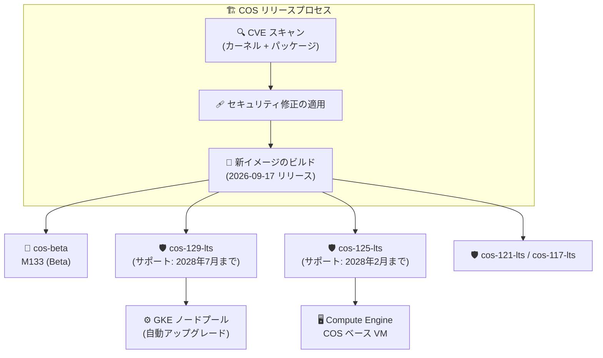

# Container-Optimized OS: 全アクティブマイルストーンのセキュリティ更新イメージリリース

**リリース日**: 2026-09-17

**サービス**: Container-Optimized OS

**機能**: セキュリティ更新イメージリリース (Beta 1 系統 + LTS 4 系統)

**ステータス**: リリース済み (LTS: GA / M133: Beta)

📊 [このアップデートのインフォグラフィックを見る](https://takech9203.github.io/google-cloud-news-summary/20260917-container-optimized-os-security-updates.html)

## 概要

2026 年 9 月 17 日、Container-Optimized OS (COS) のアクティブな全マイルストーンに対して新しいイメージが一斉にリリースされた。対象は Beta チャネルの `cos-beta-133-19999-44-44` と、LTS 4 系統 (`cos-129-19506-448-36`、`cos-125-19216-655-28`、`cos-121-18867-584-23`、`cos-117-18613-731-21`) である。

今回のリリースは主に Linux カーネルの多数の CVE 修正 (CVE-2026-80590 および CVE-2026-80737〜CVE-2026-80917 の範囲) を全マイルストーンに横断的に適用するセキュリティリリースである。加えて、coreutils、wget、setuptools、nghttp2 といったユーザーランドパッケージの CVE 修正、GVE (Google Virtual Ethernet) ドライバのマルチ NUMA システムにおけるパフォーマンス問題の修正も含まれる。

COS は Compute Engine および GKE のノード OS として広く使われており、GKE クラスタや COS ベースの VM を運用するすべてのユーザーが対象となる。特にコンテナホストのセキュリティコンプライアンスを維持したい組織は、ノードの自動アップグレードまたは計画的なイメージ更新を確認すべきアップデートである。

**アップデート前の課題**

- 従来イメージには、Linux カーネルの複数の脆弱性 (CVE-2026-80590、CVE-2026-80737 ほか CVE-2026-808xx / 809xx 番台の多数の CVE) が未修正のまま残っていた
- coreutils (CVE-2026-56391)、wget (CVE-2026-58470)、setuptools (CVE-2026-59890)、nghttp2 (CVE-2026-58055) など、ユーザーランドパッケージにも既知の脆弱性が存在していた
- マルチ NUMA 構成のシステムにおいて、GVE ネットワークドライバにパフォーマンス問題が存在していた

**アップデート後の改善**

- Beta 1 系統 + LTS 4 系統の全アクティブマイルストーンで Linux カーネル CVE 群が修正され、脆弱性スキャンやコンプライアンス要件への対応が容易になった
- coreutils / wget / setuptools / nghttp2 の CVE 修正とパッケージ更新 (nghttp2 v1.69.0、libnftnl v1.2.9) が取り込まれた
- マルチ NUMA システムでの GVE ドライバのパフォーマンス問題が修正され、大型マシンタイプでのネットワーク性能が改善された

## アーキテクチャ図



CVE 修正が全アクティブマイルストーンのイメージファミリーに横断的に適用され、GKE ノードプールの自動アップグレードや Compute Engine の VM 更新を通じて利用者に配信される流れを示す。

## サービスアップデートの詳細

### リリースされたイメージ一覧

| イメージ | マイルストーン / チャネル | カーネル | Docker | Containerd |
|----------|--------------------------|----------|--------|------------|
| cos-beta-133-19999-44-44 | M133 / Beta | COS-6.18.48 | v29.4.3 | v2.3.4 |
| cos-129-19506-448-36 | M129 / LTS | COS-6.12.105 | v27.5.1 | v2.2.7 |
| cos-125-19216-655-28 | M125 / LTS | COS-6.12.105 | v27.5.1 | v2.2.7 |
| cos-121-18867-584-23 | M121 / LTS | COS-6.6.153 | v27.5.1 | v2.0.10 |
| cos-117-18613-731-21 | M117 / LTS | COS-6.6.153 | v24.0.9 | v1.7.34 |

### 主要な修正内容

1. **Linux カーネルの CVE 修正 (全マイルストーン横断)**
   - CVE-2026-80590、CVE-2026-80737 に加え、CVE-2026-80788〜80793、80805〜80808、80842〜80856、80916/80917 など多数のカーネル CVE を修正
   - M129 / M125 系ではさらに CVE-2026-80837〜80839、80845、80862 なども修正され、1 イメージあたり最大 23 件のカーネル CVE に対応
   - 各イメージが修正する CVE の正確なリストはマイルストーン別リリースノートを参照

2. **ユーザーランドパッケージの CVE 修正・更新 (最新系リリース)**
   - sys-apps/coreutils: CVE-2026-56391 を修正
   - net-misc/wget: CVE-2026-58470 を修正
   - dev-python/setuptools: CVE-2026-59890 を修正
   - net-libs/nghttp2: v1.69.0 へアップグレードし CVE-2026-58055 を修正

3. **GVE ドライバの修正・その他の変更 (cos-125 系)**
   - マルチ NUMA システムにおける GVE (Google Virtual Ethernet) ドライバのパフォーマンス問題を修正
   - net-libs/libnftnl を v1.2.9 へアップグレード
   - ランタイム sysctl の変更: `net.ipv4.udp_mem` が `188034 250714 376068` から `188034 250715 376068` に変更

## 技術仕様

### アクティブマイルストーンとサポート期限

| マイルストーン | イメージファミリー (x86 / Arm) | サポート終了 |
|----------------|-------------------------------|--------------|
| COS 133 (Beta) | cos-beta / cos-arm64-beta | 未定 (LTS 昇格前) |
| COS 129 (LTS) | cos-129-lts / cos-arm64-129-lts | 2028 年 7 月 |
| COS 125 (LTS) | cos-125-lts / cos-arm64-125-lts | 2028 年 2 月 |
| COS 121 (LTS) | cos-121-lts / cos-arm64-121-lts | 2027 年 3 月 |
| COS 117 (LTS) | cos-117-lts / cos-arm64-117-lts | 2026 年 9 月 |

LTS マイルストーンは 26 か月間サポートされ、高優先度のバグ・セキュリティ修正はオンデマンドで、中・低優先度の修正は 3 か月ごとの「LTS Refresh」リリースで提供される。

**注意**: COS 117 LTS のサポート終了は 2026 年 9 月であり、今回が終盤の更新となる。M117 利用者は新しいマイルストーン (M129 など) への移行計画が必要である。

## 設定方法

### 前提条件

1. Compute Engine で COS イメージ (cos-cloud プロジェクト) を利用している、または GKE で COS ベースのノードイメージを利用している
2. 本番環境では特定イメージバージョンを検証のうえ固定利用することが推奨される (イメージファミリー API は検証用途向け)

### 手順

#### ステップ 1: 最新イメージの確認

```bash
# アクティブな LTS イメージの一覧を確認
gcloud compute images list --no-standard-images --project=cos-cloud | grep lts
```

新イメージ (例: `cos-129-19506-448-36`) がファミリーに反映されていることを確認する。

#### ステップ 2: VM またはノードプールの更新

```bash
# Compute Engine: 特定バージョンを指定して VM を作成
gcloud compute instances create my-cos-vm \
  --image=cos-129-19506-448-36 \
  --image-project=cos-cloud \
  --zone=asia-northeast1-a
```

GKE の場合は、ノード自動アップグレードが有効であればリリースチャネルに応じて順次適用される。手動管理のクラスタではノードプールのアップグレードを計画する。

## メリット

### ビジネス面

- **コンプライアンス維持**: 既知 CVE の修正により、脆弱性スキャンやセキュリティ監査への対応コストを低減できる
- **長期の安定運用**: LTS 4 系統すべてに同時にパッチが提供されるため、利用中のマイルストーンを問わず保護される

### 技術面

- **カーネル脆弱性の一掃**: 1 イメージあたり最大 23 件のカーネル CVE が修正され、コンテナホストの攻撃対象領域が縮小される
- **ネットワーク性能の改善**: マルチ NUMA システムでの GVE ドライバ修正により、大型マシンタイプでのネットワークパフォーマンスが改善される

## デメリット・制約事項

### 制限事項

- 修正される CVE のセットはマイルストーンごとに異なる (例: CVE-2026-80837〜80839 などは M129 / M125 系のみに記載)
- coreutils / wget / setuptools / nghttp2 などユーザーランドの修正は最新系リリースに含まれ、全 LTS 系統に含まれるわけではない

### 考慮すべき点

- COS 117 LTS はサポート終了 (2026 年 9 月) 間近のため、早急に新しいマイルストーンへの移行を計画すべきである
- 本番環境ではイメージファミリーの自動追従ではなく、検証済みの特定イメージバージョンを明示指定することが推奨される
- cos-125 系では `net.ipv4.udp_mem` の sysctl 既定値が微修正されており、カーネルパラメータをチューニングしている場合は確認が必要

## ユースケース

### ユースケース 1: GKE ノードの定期セキュリティ更新

**シナリオ**: GKE クラスタでノード自動アップグレードを有効にしており、コンテナホスト OS の CVE 対応状況を監査に報告する必要がある。

**実装例**:
```bash
# ノードプールの自動アップグレード設定を確認
gcloud container node-pools describe default-pool \
  --cluster=my-cluster --region=asia-northeast1 \
  --format="value(management.autoUpgrade)"
```

**効果**: リリースチャネル経由で今回の修正済みイメージが順次ロールアウトされ、カーネル CVE 群への対応が自動化される。

### ユースケース 2: COS 117 からの移行計画

**シナリオ**: cos-117-lts を利用中だが、サポート終了 (2026 年 9 月) が迫っているため、cos-129-lts へ移行したい。

**効果**: サポート期間が 2028 年 7 月まで確保され、今後もセキュリティ修正を継続的に受けられる。移行前に今回の cos-129-19506-448-36 で動作検証を行うことで、安全に切り替えられる。

## 料金

Container-Optimized OS 自体に追加のライセンス料金はなく、イメージを実行する Compute Engine リソース (vCPU、メモリ、ディスクなど) に対してのみ課金される。今回のアップデートによる料金変更はない。

- [Compute Engine の料金](https://cloud.google.com/compute/pricing)

## 利用可能リージョン

COS イメージは `cos-cloud` プロジェクトからグローバルに提供され、Compute Engine が利用可能なすべてのリージョンで使用できる。

## 関連サービス・機能

- **Google Kubernetes Engine (GKE)**: COS はデフォルトのノードイメージであり、ノード自動アップグレードにより本リリースが配信される
- **Compute Engine**: COS ベースの VM インスタンスの実行基盤。イメージファミリー機能で LTS リリースを追跡できる
- **gVNIC (Google Virtual NIC)**: 今回修正された GVE ドライバが提供する仮想ネットワークインターフェース

## 参考リンク

- 📊 [インフォグラフィック](https://takech9203.github.io/google-cloud-news-summary/20260917-container-optimized-os-security-updates.html)
- [公式リリースノート (2026 年 9 月 17 日)](https://docs.cloud.google.com/release-notes#September_17_2026)
- [Container-Optimized OS リリースノート](https://docs.cloud.google.com/container-optimized-os/docs/release-notes)
- [Container-Optimized OS バージョニングスキーム](https://docs.cloud.google.com/container-optimized-os/docs/concepts/versioning)
- [Container-Optimized OS サポートポリシー](https://docs.cloud.google.com/container-optimized-os/docs/resources/support-policy)
- [Compute Engine の料金](https://cloud.google.com/compute/pricing)

## まとめ

Container-Optimized OS の全アクティブマイルストーンに対し、多数の Linux カーネル CVE とユーザーランドパッケージ CVE を修正するセキュリティリリースが提供された。GKE / Compute Engine で COS を利用している場合は、ノード自動アップグレードの適用状況を確認するか、修正済みイメージへの更新を計画したい。また、COS 117 LTS はサポート終了間近のため、新しいマイルストーンへの移行検討を強く推奨する。

---

**タグ**: `Container-Optimized OS`, `セキュリティ`, `CVE`, `GKE`, `Compute Engine`, `LTS`, `カーネル`
