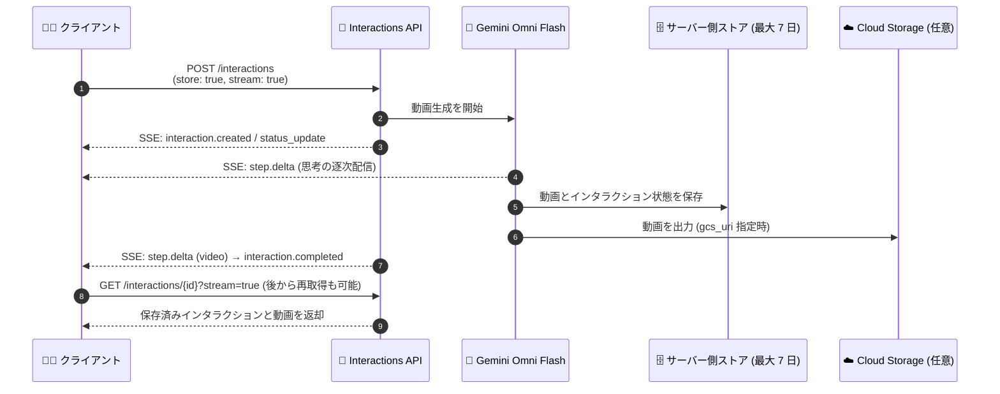

# Gemini Enterprise Agent Platform: Gemini Omni Flash がステートフル・ストリーミング動画生成に対応 (Preview)

**リリース日**: 2026-09-17

**サービス**: Gemini Enterprise Agent Platform

**機能**: Gemini Omni Flash のステートフル (store: true) およびストリーミング (stream: true) 動画生成

**ステータス**: Preview

📊 [このアップデートのインフォグラフィックを見る](https://takech9203.github.io/google-cloud-news-summary/20260917-gemini-enterprise-agent-platform-omni-flash-video-generation.html)

## 概要

Gemini Enterprise Agent Platform の動画生成モデル Gemini Omni Flash が、Interactions API におけるステートフル (`store: true`) およびサーバー送信イベント (SSE) ストリーミング (`stream: true`) の動画生成に Preview 対応しました。生成した動画とインタラクション状態をサーバー側に一時保存し、ステータス更新や最終出力を SSE 接続経由でストリーミング受信できるほか、完了した非同期インタラクションを unary またはストリーミングの GET リクエストで取得できます。

動画生成は完了までに 1 分以上かかることがあるため、ワークフローに応じたインタラクションモードの選択が重要です。今回のアップデートにより、同期・ステートレスな単発リクエストに加えて、「同期・ステートフル」「同期・ステートフルストリーミング」「非同期 (background)」といった複数のモードを組み合わせられるようになり、動画生成アプリケーションの応答性と柔軟性が大きく向上します。

対象ユーザーは、Gemini Omni Flash を使った会話型の動画生成・編集アプリケーションを構築する開発者や、長時間の生成処理をバックエンドで扱う AI アプリケーション開発者です。

**アップデート前の課題**

- 動画生成は完了まで 1 分以上かかることがあり、クライアントは単一のリクエストで応答を待ち続ける必要があった
- 生成の進行状況 (モデルの思考過程やステータス) をリアルタイムに把握する手段が限られていた
- インタラクション状態がサーバーに保存されないため、結果を後から取得したり、インタラクション ID を参照して継続処理を行うことが難しかった

**アップデート後の改善**

- `store: true` により、生成された動画とインタラクション状態をサーバー側に一時保存 (最大 7 日間保持) し、後から結果を取得したり、インタラクション ID を参照したマルチターンの動画編集に利用できるようになった
- `stream: true` により、SSE 接続でモデルの思考 (thought) を逐次受信し、その後に出力動画を受け取れるようになり、体感レイテンシと進捗の可視性が改善された
- 完了した非同期インタラクション (`background: true`) を、unary GET またはストリーミング GET (`?stream=true`) で柔軟に取得できるようになった

## アーキテクチャ図



ステートフルストリーミングモードでは、SSE 接続を通じてステータス更新とモデルの思考が逐次配信され、最終的に出力動画が届きます。保存されたインタラクションはインタラクション ID を使って後から GET リクエストで取得できます。

## サービスアップデートの詳細

### 主要機能

1. **ステートフル動画生成 (`store: true`)**
   - 生成された動画とインタラクション状態をサーバー側に一時保存する
   - 保存されたインタラクションと非同期インタラクションは最大 7 日間保持される
   - インタラクション ID (`previous_interaction_id`) を参照して、マルチターンの動画編集に活用できる

2. **SSE ストリーミング動画生成 (`stream: true`)**
   - `store` と `stream` の両方を `true` に設定すると、モデルの思考 (thought summary) が生成されるたびに逐次受信でき、その後に出力動画が届く
   - `interaction.created` → `interaction.status_update` → `step.start` / `step.delta` / `step.stop` → `interaction.completed` → `done` というイベントシーケンスで配信される
   - `step.delta` イベントには思考テキストのほか、出力動画の `mime_type` と URI (Cloud Storage 出力時) が含まれる

3. **非同期インタラクションの柔軟な取得**
   - `background: true` でバックグラウンド実行した動画生成を、後からインタラクション ID で取得できる
   - unary GET リクエストのほか、`?stream=true` を付与したストリーミング GET で保存済みインタラクションと生成動画をストリーミング取得できる

### インタラクションモードの比較

| モード | パラメータ | 特徴 |
|--------|-----------|------|
| 同期・ステートレス | (デフォルト) | 単一リクエストで動画を生成。状態はサーバーに保存されない |
| 同期・ステートフル | `store: true` | 状態を保存し、後から結果取得やマルチターン編集に利用可能 |
| 同期・ステートフルストリーミング | `store: true` + `stream: true` | 思考を逐次受信し、その後に出力動画を受信 |
| 非同期 | `background: true` | バックグラウンドで生成し、インタラクション ID で後から取得 |

## 技術仕様

### Gemini Omni 1.1 Flash (Preview) の主な仕様

| 項目 | 詳細 |
|------|------|
| モデル ID | `gemini-omni-1.1-flash-preview` |
| モダリティ | テキスト (入出力)、画像 (入力)、動画 (入出力) |
| 最大入力トークン | 131,072 |
| 最大出力トークン | 57,920 |
| 出力動画の長さ | 3 秒〜10 秒 |
| アスペクト比 | 16:9 (デフォルト)、9:16 |
| 解像度 | 360p / 720p / 1080p / 4K |
| 状態の保持期間 | 保存済み・非同期インタラクションは最大 7 日間 |
| エンドポイント | `https://aiplatform.googleapis.com/v1beta1/projects/{PROJECT_ID}/locations/global/interactions` |

### リクエスト例 (ステートフルストリーミング)

```json
{
  "model": "gemini-omni-1.1-flash-preview",
  "background": false,
  "store": true,
  "stream": true,
  "input": [
    {
      "type": "user_input",
      "content": [
        { "type": "text", "text": "TEXT_PROMPT" }
      ]
    }
  ],
  "response_format": [
    {
      "type": "video",
      "delivery": "uri",
      "gcs_uri": "gs://video-bucket/output/",
      "aspect_ratio": "16:9",
      "duration": "10s"
    }
  ]
}
```

## 設定方法

### 前提条件

1. 課金が有効な Google Cloud プロジェクト
2. Agent Platform API の有効化と認証トークン (Bearer トークン) の取得
3. (任意) 動画出力先の Cloud Storage バケット

### 手順

#### ステップ 1: ステートフルストリーミングで動画生成をリクエスト

```bash
curl -X POST \
  -H "Authorization: Bearer $(gcloud auth print-access-token)" \
  -H "Content-Type: application/json; charset=utf-8" \
  -d @request.json \
  "https://aiplatform.googleapis.com/v1beta1/projects/PROJECT_ID/locations/global/interactions"
```

`store: true` と `stream: true` を含む request.json を送信すると、SSE イベント (`interaction.created`、`step.delta`、`interaction.completed` など) が順次返されます。

#### ステップ 2: 保存済みインタラクションを後から取得

```bash
# ストリーミング GET で保存済みインタラクションと動画を取得
curl -X GET \
  -H "Authorization: Bearer $(gcloud auth print-access-token)" \
  "https://aiplatform.googleapis.com/v1beta1/projects/PROJECT_ID/locations/global/interactions/INTERACTION_ID?stream=true"
```

レスポンスに含まれるインタラクション ID を使い、unary またはストリーミングの GET リクエストで完了済みインタラクションを取得できます。

## メリット

### ビジネス面

- **ユーザー体験の向上**: 1 分以上かかる動画生成でも、進捗やモデルの思考をリアルタイムに表示でき、待ち時間の体感を大幅に改善できる
- **会話型動画編集の実現**: インタラクション状態がサーバーに保存されるため、「前の動画をもとに修正する」といったマルチターンの動画編集ワークフローを構築しやすくなる

### 技術面

- **クライアント実装の簡素化**: 状態管理をサーバー側に委ねられるため、クライアントは動画を再アップロードせずインタラクション ID の参照だけで継続処理ができる
- **柔軟な取得パターン**: 同期 / 非同期、unary / ストリーミングを組み合わせられ、Web アプリからバッチ処理まで幅広いアーキテクチャに対応できる
- **Cloud Storage 出力対応**: `gcs_uri` を指定すれば動画バイト列ではなく Cloud Storage URI で受け取れ、大きな動画データの転送を効率化できる

## デメリット・制約事項

### 制限事項

- Preview 段階の機能であり、Pre-GA Offerings Terms が適用される
- 保存済みインタラクションと非同期インタラクションの保持期間は最大 7 日間
- 出力動画の長さは 3 秒〜10 秒に制限される
- 利用可能なエンドポイントは `global` リージョンのみ

### 考慮すべき点

- SSE ストリーミングを利用するには、クライアント側で SSE イベント (`step.delta` など) を処理する実装が必要
- `store: true` を使う場合、生成コンテンツがサーバー側に一時保存される点を考慮し、データ取り扱いポリシーとの整合を確認する
- Preview 機能のため、GA までに API 仕様が変更される可能性がある

## ユースケース

### ユースケース 1: 会話型の動画生成・編集アプリケーション

**シナリオ**: マーケティングチーム向けに、チャット UI で動画を生成し「照明を明るくして」「背景を変えて」と対話的に編集できるアプリを構築する。

**実装例**:
```
1. store: true + stream: true で初回動画を生成し、思考と進捗を UI に逐次表示
2. 返却されたインタラクション ID を保持
3. 次のターンで previous_interaction_id を指定して編集指示を送信
   (動画を再アップロードせずに継続編集)
```

**効果**: 動画の再アップロードが不要になり、生成待ちの間も進捗が見えるため、対話的な編集体験を低い実装コストで実現できる。

### ユースケース 2: バックグラウンド動画生成とポーリングレス取得

**シナリオ**: 大量の商品紹介動画をバッチ生成するパイプラインで、`background: true` により非同期で生成をキックし、完了後にインタラクション ID で結果を回収する。

**効果**: クライアントが長時間接続を維持する必要がなくなり、完了済みインタラクションを unary またはストリーミング GET で効率的に回収できる。Cloud Storage 出力と組み合わせれば動画データの受け渡しも効率化できる。

## 料金

Gemini Omni Flash はトークンベースの課金で、使用量は `interaction.completed` イベントの `usage` フィールド (入力トークン、動画出力トークン、思考トークンなど) で確認できます。詳細な料金は公式の料金ページを参照してください。

- [Gemini Enterprise Agent Platform Generative AI 料金](https://cloud.google.com/gemini-enterprise-agent-platform/generative-ai/pricing)

## 利用可能リージョン

- Global (`global`) エンドポイントで利用可能

詳細は [Model locations](https://docs.cloud.google.com/gemini-enterprise-agent-platform/resources/locations) を参照してください。

## 関連サービス・機能

- **Interactions API**: 今回のステートフル・ストリーミング動画生成の基盤となる API。マルチターンのインタラクション管理を提供
- **Cloud Storage**: `response_format` の `gcs_uri` に出力バケットを指定することで、生成動画を Cloud Storage に直接出力可能
- **Agent Studio / Model Garden**: Gemini Omni Flash をコンソール上で試用・確認できる
- **Files API (Gemini API)**: 既存動画をアップロードして Gemini Omni Flash で編集する際に使用

## 参考リンク

- 📊 [インフォグラフィック](https://takech9203.github.io/google-cloud-news-summary/20260917-gemini-enterprise-agent-platform-omni-flash-video-generation.html)
- [公式リリースノート](https://docs.cloud.google.com/release-notes#September_17_2026)
- [ドキュメント: Generate videos from text](https://docs.cloud.google.com/gemini-enterprise-agent-platform/models/video/generate-videos-from-text)
- [ドキュメント: Gemini Omni 1.1 Flash モデル情報](https://docs.cloud.google.com/gemini-enterprise-agent-platform/models/gemini/omni-1-1-flash)
- [ドキュメント: Interactions API リファレンス](https://docs.cloud.google.com/gemini-enterprise-agent-platform/reference/models/interactions-api)
- [料金ページ](https://cloud.google.com/gemini-enterprise-agent-platform/generative-ai/pricing)

## まとめ

Gemini Omni Flash の動画生成が Interactions API でステートフル (`store: true`) および SSE ストリーミング (`stream: true`) に Preview 対応し、進捗の可視化・状態のサーバー保存・非同期取得を組み合わせた柔軟な動画生成ワークフローが構築できるようになりました。会話型の動画生成・編集アプリケーションを検討しているチームは、まず global エンドポイントでステートフルストリーミングモードを試し、マルチターン編集や Cloud Storage 出力との組み合わせを評価することを推奨します。

---

**タグ**: `Gemini Enterprise Agent Platform`, `Gemini Omni Flash`, `Interactions API`, `動画生成`, `ストリーミング`, `SSE`, `Preview`, `生成AI`
