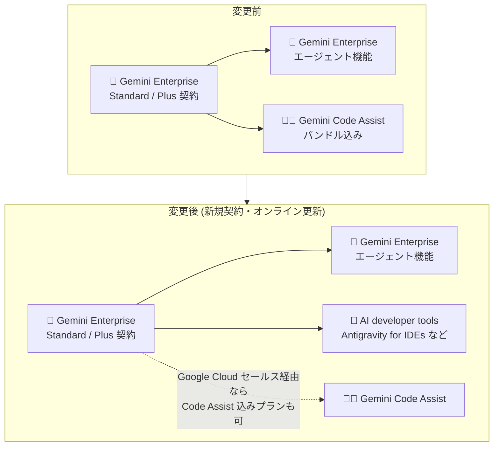

# Gemini Enterprise: 新規サブスクリプションにおける Gemini Code Assist 提供内容の変更

**リリース日**: 2026-09-17

**サービス**: Gemini Enterprise

**機能**: Gemini Code Assist のサブスクリプション提供内容の変更 (ライセンス/エンタイトルメント変更)

**ステータス**: 発表 (Announcement)

📊 [このアップデートのインフォグラフィックを見る](https://takech9203.github.io/google-cloud-news-summary/20260917-gemini-enterprise-code-assist-subscription-availability.html)

## 概要

Google Cloud は、Gemini Enterprise の Standard および Plus エディションのサブスクリプションにおける Gemini Code Assist の提供内容の変更を発表しました。今後、新規に Gemini Enterprise Standard / Plus サブスクリプションを取得する場合、またはオンラインで既存サブスクリプションを更新する場合、そのサブスクリプションには Gemini Code Assist 機能へのアクセスが含まれなくなります。

Gemini Code Assist の後継として、Gemini Enterprise の AI developer tools に含まれる Antigravity for IDEs (IDE 向けの自律型 AI エージェント拡張機能) の利用が案内されています。AI developer tools には Antigravity for IDEs のほか、Google Antigravity (Antigravity 2.0 / Antigravity CLI) や Android Studio の AI 機能も含まれます。

この変更は、Gemini Enterprise のライセンス管理を担当する管理者や、開発チームに AI コーディング支援ツールを展開している組織に影響します。既存のサブスクリプション契約者への影響は契約期間終了時まで発生しないため、更新タイミングまでに移行方針を検討する猶予があります。

**アップデート前の課題 (変更前の状態)**

- 従来は、Gemini Enterprise Standard / Plus のサブスクリプションに Gemini Code Assist 機能へのアクセスが含まれていた (バンドル提供)
- Gemini Enterprise バンドル経由で取得した Gemini Code Assist Standard ライセンスは、スタンドアロンのサブスクリプションではないため、Google Cloud コンソールからエディションをアップグレードできないなど、管理上の制約があった

**アップデート後の変更点**

- 新規の Gemini Enterprise Standard / Plus サブスクリプション、およびオンラインでの更新では、Gemini Code Assist 機能へのアクセスが含まれなくなった
- Gemini Code Assist を含む既存サブスクリプションは、サブスクリプション期間の終了まで引き続き Gemini Code Assist 機能を利用できる
- 代替として、AI developer tools の Antigravity for IDEs を利用できる (Gemini Enterprise Standard / Plus / Pay-as-you-go エディションで利用可能)
- Gemini Enterprise ライセンスで引き続き Gemini Code Assist を利用したい場合は、Google Cloud セールスに連絡することで、Gemini Code Assist を含む新しい Gemini Enterprise サブスクリプションを取得できる

## アーキテクチャ図

新規契約およびオンライン更新の Gemini Enterprise Standard / Plus では Gemini Code Assist のバンドルが外れ、代わりに Antigravity for IDEs を含む AI developer tools が開発者向けツールとして案内されます。Gemini Code Assist を含むプランはセールス経由で引き続き取得可能です。

## サービスアップデートの詳細

### 主要な変更点

1. **新規・オンライン更新サブスクリプションからの Gemini Code Assist 除外**
   - 新規に取得する Gemini Enterprise Standard / Plus サブスクリプションには Gemini Code Assist 機能へのアクセスが含まれない
   - 既存サブスクリプションをオンラインで更新した場合も同様に含まれなくなる

2. **既存サブスクリプションの経過措置**
   - Gemini Code Assist 機能を含む既存のサブスクリプションは、サブスクリプション期間の終了まで機能を利用可能
   - 即時の機能停止はなく、契約期間満了までに移行を検討できる

3. **代替手段: AI developer tools (Antigravity for IDEs)**
   - Gemini Code Assist の代わりに、Antigravity for IDEs を含む AI developer tools を利用可能
   - AI developer tools は自律型 AI エージェントによるソフトウェア開発の高速化を目的としたツール群で、以下が含まれる:
     - **Google Antigravity**: 自律型 AI エージェントを使ってアプリケーションを構築する AI 開発環境 (Antigravity 2.0 / Antigravity CLI)
     - **Antigravity for IDEs**: IDE に自律型 AI エージェント機能を組み込む拡張機能
     - **Android Studio**: Android 開発向け AI 機能 (最新の Canary バージョンでサポート)

4. **Gemini Code Assist を継続利用したい場合の選択肢**
   - Google Cloud セールスに連絡することで、Gemini Code Assist を含む新しい Gemini Enterprise サブスクリプションを取得可能
   - Gemini Code Assist のスタンドアロンの新規サブスクリプション購入も Google Cloud セールスへの連絡が必要

## 技術仕様

### AI developer tools の利用要件

| 項目 | 詳細 |
|------|------|
| 対応エディション | Gemini Enterprise Standard、Plus、Standard Emerging Market、Pay-as-you-go |
| 請求アカウント | 有効な月次請求書を受け取る請求書払い (invoiced) の Cloud Billing アカウントが必要 |
| 管理者ロール | Gemini Enterprise Admin (`roles/discoveryengine.agentspaceAdmin`): AI developer tools の設定・メトリクス閲覧に必要 |
| 利用者ロール | Gemini Enterprise User (`roles/discoveryengine.agentspaceUser`): AI developer tools へのアクセスに必要 (Admin ロールだけではアクセス不可) |

### Gemini Code Assist ライセンスに関する留意点

- Gemini Enterprise バンドルで取得した Gemini Code Assist Standard ライセンスは、スタンドアロンのサブスクリプションではないため、Google Cloud コンソールからエディションをアップグレードできない (Enterprise 機能が必要な場合は別途 Gemini Code Assist Enterprise サブスクリプションの購入が必要)
- Gemini Code Assist の新規サブスクリプション購入には Google Cloud セールスへの連絡が必要

## メリット

### ビジネス面

- **経過措置による移行猶予**: 既存サブスクリプションは契約期間終了まで Gemini Code Assist を利用できるため、計画的に移行を検討できる
- **継続利用の選択肢を確保**: Gemini Code Assist が必要な組織は、セールス経由で Code Assist 込みの Gemini Enterprise サブスクリプションを引き続き取得できる

### 技術面

- **エージェント型開発ツールへの移行パス**: Antigravity for IDEs は自律型 AI エージェントによるコードレビュー自動化、デバッグ・根本原因分析、機能開発・リファクタリングの委任など、従来のコード補完型支援より広範なワークフローに対応する
- **IDE・CLI 両対応**: Antigravity 2.0、Antigravity CLI、Antigravity for IDEs、Android Studio により、IDE とターミナルの両方のワークフローに AI エージェントを組み込める

## デメリット・制約事項

### 制限事項

- 新規・オンライン更新の Gemini Enterprise Standard / Plus サブスクリプションでは Gemini Code Assist を利用できない
- AI developer tools の利用には請求書払い (invoiced) の Cloud Billing アカウントが必要 (セルフサーブのオンラインアカウントでは利用不可)
- Gemini Enterprise の Antigravity は、Access Transparency (AXT)、FedRAMP (Moderate / High)、IL4 / IL5、ISO 27001 / ISO 42001、ITAR、SOC 1 / 2 / 3 などのコンプライアンス認証・セキュリティ管理に対応していない

### 考慮すべき点

- Gemini Code Assist に依存した開発ワークフローを持つ組織は、契約更新前に Antigravity for IDEs への移行、またはセールス経由での Code Assist 込みサブスクリプション取得のいずれかを判断する必要がある
- Gemini Code Assist と Antigravity for IDEs は機能特性が異なるため、移行時には開発チームでの評価・検証を推奨
- コンプライアンス要件 (FedRAMP、ISO、SOC など) がある組織は、Antigravity の非対応項目を確認したうえで移行可否を判断する必要がある

## ユースケース

### ユースケース 1: 契約更新を控えた組織の移行判断

**シナリオ**: Gemini Enterprise Standard を利用中で、開発チームが Gemini Code Assist を日常的に利用している組織が、数か月後にサブスクリプションの更新時期を迎える。

**対応例**:
1. 契約期間中に一部の開発者で Antigravity for IDEs を評価する
2. 機能・コンプライアンス要件を満たす場合は AI developer tools へ移行する
3. Gemini Code Assist の継続が必要な場合は、Google Cloud セールスに連絡して Code Assist 込みのサブスクリプションを取得する

**効果**: 契約更新時に Gemini Code Assist へのアクセスを失うリスクを回避し、計画的なツール移行が可能になる。

### ユースケース 2: 新規に Gemini Enterprise を導入する組織

**シナリオ**: これから Gemini Enterprise Standard / Plus を新規契約し、開発者向け AI ツールも展開したい組織。

**効果**: 新規契約では Antigravity for IDEs を含む AI developer tools が開発者向けツールとなるため、最初から Antigravity ベースの開発ワークフローを設計できる。Gemini Code Assist が必須要件の場合は、契約前にセールスへ相談することで Code Assist 込みプランを選択できる。

## 料金

今回の発表はライセンス/エンタイトルメントの変更であり、新しい料金体系の発表は含まれていません。エディションごとの提供機能と料金の詳細は以下を参照してください。

- [Gemini Enterprise エディションの比較](https://docs.cloud.google.com/gemini/enterprise/docs/editions)
- [Gemini Enterprise 料金](https://cloud.google.com/gemini-enterprise/pricing)

## 関連サービス・機能

- **Gemini Code Assist**: 従来 Gemini Enterprise Standard / Plus にバンドルされていた AI コーディング支援。今後は新規・オンライン更新のサブスクリプションに含まれず、継続利用にはセールス経由の契約が必要
- **Google Antigravity / Antigravity for IDEs**: Gemini Enterprise の AI developer tools として提供される、自律型 AI エージェントベースの開発環境および IDE 拡張機能
- **Android Studio**: Gemini Enterprise バンドルの一部として AI 機能が提供される Android 開発向け IDE (最新 Canary バージョン)
- **Cloud Billing**: AI developer tools の利用には請求書払いアカウントが必要

## 参考リンク

- 📊 [インフォグラフィック](https://takech9203.github.io/google-cloud-news-summary/20260917-gemini-enterprise-code-assist-subscription-availability.html)
- [公式リリースノート](https://docs.cloud.google.com/release-notes#September_17_2026)
- [AI developer tools の概要](https://docs.cloud.google.com/gemini/enterprise/docs/ai-developer-tools-overview)
- [Gemini Enterprise のライセンス取得](https://docs.cloud.google.com/gemini/enterprise/docs/licenses)
- [Gemini Enterprise エディションの比較](https://docs.cloud.google.com/gemini/enterprise/docs/editions)
- [Gemini Code Assist ライセンス管理](https://docs.cloud.google.com/gemini/docs/codeassist/manage-licenses)

## まとめ

Gemini Enterprise Standard / Plus の新規契約およびオンライン更新では Gemini Code Assist が含まれなくなり、開発者向けツールは Antigravity for IDEs を中心とした AI developer tools に移行します。既存契約は期間満了まで Gemini Code Assist を利用できるため、更新時期までに Antigravity への移行評価、またはセールス経由での Code Assist 込みサブスクリプション取得を検討することを推奨します。

---

**タグ**: #GeminiEnterprise #GeminiCodeAssist #Antigravity #ライセンス #サブスクリプション #AIDeveloperTools
