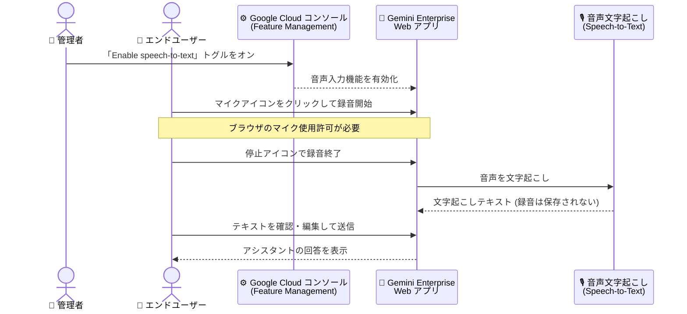

# Gemini Enterprise: チャットボックスの音声入力が一般提供 (GA) に

**リリース日**: 2026-09-17

**サービス**: Gemini Enterprise

**機能**: チャットボックスの音声入力 (Voice input for the chat box)

**ステータス**: 一般提供 (GA)

📊 [このアップデートのインフォグラフィックを見る](https://takech9203.github.io/google-cloud-news-summary/20260917-gemini-enterprise-voice-input-ga.html)

## 概要

Gemini Enterprise のチャットボックスで音声入力機能が一般提供 (GA) になりました。ユーザーはチャットボックスのマイクボタンをクリックして音声を録音し、文字起こしされたテキストを確認・編集したうえで送信できます。キーボード入力の代替手段として、特に長いクエリやプロンプトを作成する際のハンズフリーでの入力 (dictation) に有効です。

この機能を利用するには、Gemini Enterprise 管理者が Google Cloud コンソールで「Enable speech-to-text」トグルをオンにする必要があります。機能管理 (Feature Management) はアプリ単位で設定でき、組織のポリシーに応じてエンドユーザーへの提供可否を制御できます。

なお、公式ドキュメントによると録音は文字起こしに使用されるのみで、録音データ自体は保存されません (The recording is transcribed but not stored)。

**アップデート前の課題**

- チャットボックスへのクエリやプロンプトの入力はキーボードによるテキスト入力が前提であり、長文のプロンプト作成には時間がかかった
- ハンズフリーで Gemini Enterprise に質問する手段が標準機能として提供されていなかった

**アップデート後の改善**

- マイクボタンから音声でクエリ・プロンプトを入力できるようになり、長文のドラフト作成が容易になった
- 文字起こし結果を送信前に確認・編集できるため、音声認識の誤りを修正してから送信できる
- 管理者はアプリごとの「Enable speech-to-text」トグルで機能の有効/無効を制御でき、ガバナンスを維持しながら展開できる

## アーキテクチャ図

管理者がトグルを有効化した後、ユーザーはマイクで録音した音声が文字起こしされ、確認・編集を経てチャットに送信されるフローです。

## サービスアップデートの詳細

### 主要機能

1. **マイクボタンによる音声入力**
   - チャットボックスのマイクアイコンをクリックして録音を開始し、停止アイコンで録音を終了する
   - 初回利用時はブラウザからマイクの使用許可を求められる場合があり、「許可」する必要がある

2. **文字起こしテキストの確認・編集**
   - 録音した音声は文字起こしされてチャットボックスに表示される
   - 送信前にテキストを確認・編集できるため、認識誤りを修正したうえで送信できる
   - 録音データは文字起こしに使用されるのみで保存されない

3. **管理者による機能制御**
   - Gemini Enterprise 管理者が Google Cloud コンソールの Feature Management タブで「Enable speech-to-text」トグルをオンにすることで、ユーザーに機能が提供される
   - Agent Gallery、チャットエージェント、モデルセレクタ、Canvas などと同様に、Web アプリの機能管理設定の 1 つとして制御できる

## 技術仕様

### 機能の概要

| 項目 | 詳細 |
|------|------|
| 機能名 | Voice input for the chat box (チャットボックスの音声入力) |
| 提供ステータス | 一般提供 (GA) |
| 有効化方法 | Google Cloud コンソール → Gemini Enterprise → 対象アプリ → Configurations → Feature Management → 「Enable speech-to-text」トグル |
| 必要な管理者ロール | Gemini Enterprise Admin (`roles/discoveryengine.agentspaceAdmin`) |
| ユーザー側の要件 | ブラウザでのマイク使用許可 |
| 録音データの扱い | 文字起こしに使用されるのみで保存されない |

## 設定方法

### 前提条件

1. Gemini Enterprise Admin IAM ロール (`roles/discoveryengine.agentspaceAdmin`) を持っていること
2. 既存の Gemini Enterprise Web アプリがあること (新規作成する場合は「Create an app」を参照)

### 手順

#### ステップ 1: 管理者が音声入力を有効化する

1. Google Cloud コンソールで **Gemini Enterprise** ページに移動する
2. 設定するアプリの名前をクリックする
3. **Configurations** をクリックし、**Feature Management** タブをクリックする
4. **Enable speech-to-text** トグルをオンにする

#### ステップ 2: ユーザーが音声でクエリを入力する

1. チャットボックスでマイクアイコンをクリックして録音を開始する
2. ブラウザから許可を求められた場合は **Allow** (許可) をクリックする
3. デバイスのマイクに向かってはっきりと話す
4. 停止アイコンをクリックして録音を終了する
5. チャットボックスに表示された文字起こしテキストを確認し、必要に応じて編集する
6. 送信ボタンをクリックして送信する

## メリット

### ビジネス面

- **入力の効率化**: 長いクエリやプロンプトのドラフト作成をハンズフリーの口述入力で行えるため、作業効率が向上する
- **アクセシビリティの向上**: キーボード入力が難しい状況やユーザーにとって、音声という代替入力手段が提供される
- **ガバナンスの維持**: 管理者トグルによりアプリ単位で機能の提供可否を制御でき、組織のポリシーに沿った展開が可能

### 技術面

- **送信前の確認・編集フロー**: 文字起こし結果をそのまま送信せず、ユーザーが確認・編集してから送信するため、意図しないクエリの送信を防げる
- **録音データの非保存**: 録音は文字起こしに使用されるのみで保存されないと明記されており、データ保持の観点で扱いが明確
- **GA 品質**: 一般提供となり、本番環境での利用に適したステータスになった

## デメリット・制約事項

### 制限事項

- 管理者が「Enable speech-to-text」トグルをオンにしない限り、ユーザーは音声入力を利用できない
- ブラウザでマイクの使用許可がブロックされていると文字起こしが表示されない

### 考慮すべき点

- 背景ノイズや入力音量の低さにより文字起こしの精度が下がる場合がある。マイクに向かって直接話すか、OS 設定でマイク入力音量を調整することが推奨されている
- 音声はそのまま送信されるのではなく文字起こしテキストとして送信されるため、送信前の確認・編集ステップをユーザーに周知するとよい

### トラブルシューティング

| 事象 | 原因 | 推奨される対応 |
|------|------|----------------|
| 文字起こしが表示されない | ブラウザでマイク権限がブロックされている可能性がある | マイクの録音権限を付与する |
| 文字起こしが不正確 | 背景ノイズまたは入力音量が低い | マイクに直接話す、または OS 設定でマイク入力音量を調整する |

## ユースケース

### ユースケース 1: 長文プロンプトのハンズフリー作成

**シナリオ**: 社内ナレッジ検索やドキュメント作成支援で、背景情報や条件を多く含む長いプロンプトを Gemini Enterprise に入力したい。

**効果**: キーボードで長文を打ち込む代わりに口述で入力でき、文字起こし結果を編集して仕上げることでプロンプト作成の時間を短縮できる。公式ドキュメントでも、長いクエリやプロンプトのドラフト作成にハンズフリー口述が特に有効とされている。

### ユースケース 2: 組織ポリシーに沿った段階的な機能展開

**シナリオ**: 管理者として、音声入力を特定の Gemini Enterprise アプリのユーザーにのみ提供したい。

**効果**: Feature Management はアプリ単位の設定であるため、「Enable speech-to-text」トグルを対象アプリでのみオンにすることで、組織のポリシーに応じた段階的な展開ができる。

## 料金

音声入力機能に固有の料金情報は Release Notes および関連ドキュメントには記載されていません。Gemini Enterprise はエディション (Business / Standard / Plus / Pay-as-you-go / Frontline) ごとのサブスクリプションで提供されており、詳細は以下を参照してください。

- [Gemini Enterprise editions](https://cloud.google.com/gemini/enterprise/docs/editions)

## 関連サービス・機能

- **Gemini Enterprise Web アプリの機能管理 (Feature Management)**: 音声入力のほか、Agent Gallery、チャットエージェント、ワークフロー、モデルセレクタ、Gemini Notebook、Canvas などの機能をアプリ単位でオン/オフできる
- **Gemini Enterprise アシスタントチャット**: 音声入力はチャットボックスの入力手段の 1 つであり、ソース表示や透過的な思考 (transparent thinking)、コネクタ経由のファイルとのチャットなどと組み合わせて利用する

## 参考リンク

- 📊 [インフォグラフィック](https://takech9203.github.io/google-cloud-news-summary/20260917-gemini-enterprise-voice-input-ga.html)
- [公式リリースノート (September 17, 2026)](https://docs.cloud.google.com/release-notes#September_17_2026)
- [Manage web app features](https://cloud.google.com/gemini/enterprise/docs/manage-web-app-features)
- [Chat with the assistant (Use your voice to chat)](https://cloud.google.com/gemini/enterprise/docs/assistant-chat)
- [Gemini Enterprise editions](https://cloud.google.com/gemini/enterprise/docs/editions)

## まとめ

Gemini Enterprise のチャットボックスに音声入力が GA として追加され、長文プロンプトのハンズフリー作成やアクセシビリティ向上に活用できるようになりました。利用には管理者による「Enable speech-to-text」トグルの有効化が必要なため、Gemini Enterprise を利用中の組織は、Google Cloud コンソールの Feature Management 設定を確認し、ユーザーへの展開とマイク権限・利用手順の周知を進めることを推奨します。

---

**タグ**: #GeminiEnterprise #VoiceInput #SpeechToText #GA #GoogleCloud
