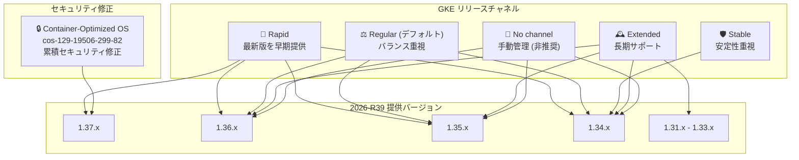

# Google Kubernetes Engine (GKE): 2026-R39 バージョンおよびセキュリティアップデート

**リリース日**: 2026-09-17

**サービス**: Google Kubernetes Engine (GKE)

**機能**: 2026-R39 バージョンアップデートおよび Container-Optimized OS セキュリティ修正

**ステータス**: GA

📊 [このアップデートのインフォグラフィックを見る](https://takech9203.github.io/google-cloud-news-summary/20260917-gke-version-security-updates-2026-r39.html)

## 概要

GKE 2026-R39 リリースとして、すべてのリリースチャネル (Rapid、Regular、Stable、Extended、No channel) に新しいクラスタバージョンが提供された。今回のアップデートでは、Rapid チャネルのデフォルトバージョンが 1.36.4-gke.1247000 に、Regular / Extended / No channel のデフォルトバージョンが 1.35.8-gke.1036000 に更新されている。また、Rapid チャネルには Kubernetes 1.37 系の新しいパッチ 1.37.0-gke.3503000 が追加された。

セキュリティ面では、GKE バージョン 1.37.0-gke.3503000 に対応する Container-Optimized OS (COS) イメージ cos-129-19506-299-82 が更新され、累積的なセキュリティ修正が適用された。COS イメージのセキュリティ修正は累積的であり、前回の GKE リリース以降にリリースされたすべての COS バージョンのセキュリティ修正が含まれる。

本アップデートは、GKE を利用するすべてのユーザーに影響する定期的なバージョンアップデートであり、特にセキュリティパッチの適用はすべての本番環境クラスタで推奨される。なお、ロールアウトはリリースノート公開時点で既に進行中であり、すべての Google Cloud ゾーンで利用可能になるまで数日かかる場合がある。

**アップデート前の課題**

- 以前の COS イメージには、cos-129-19506-299-82 で修正された既知のセキュリティ脆弱性が存在していた
- Rapid チャネルでは Kubernetes 1.37.0 系の最新パッチ (1.37.0-gke.3503000) が利用できなかった
- 各チャネルの旧パッチバージョン (Regular の 1.36.3-gke.1640000 など) が非推奨となる前の状態で稼働していた

**アップデート後の改善**

- Container-Optimized OS イメージの累積セキュリティ修正により、既知の脆弱性が解消された
- 各チャネルで最新のパッチバージョンが利用可能になり、新規クラスタ作成および既存クラスタのアップグレードの選択肢が拡大した
- Rapid チャネルに Kubernetes 1.37.0-gke.3503000 が追加され、最新の Kubernetes 1.37 系機能を早期に検証可能になった
- 自動アップグレードのターゲットが更新され、1.33 → 1.34、1.34 → 1.35 などのマイナーバージョン自動アップグレードが新しいパッチバージョンに向けて実施される

## アーキテクチャ図



各リリースチャネルで利用可能なバージョン範囲と、セキュリティ修正が適用された COS イメージの対象バージョンを示す。Rapid チャネルのみが 1.37 系を提供し、Extended チャネルは 1.31 からの長期サポートを含む。

## サービスアップデートの詳細

### 主要機能

1. **Rapid チャネルのバージョン更新**
   - デフォルトバージョンが 1.36.4-gke.1247000 に更新
   - 1.34.11-gke.1102000、1.35.8-gke.1439000、1.36.4-gke.1391000、1.37.0-gke.3503000 が新たに追加
   - 1.34.11-gke.1044000、1.35.8-gke.1225000、1.36.4-gke.1082000、1.37.0-gke.2941000 は利用不可に
   - 自動アップグレードターゲット: 1.33 → 1.34.11-gke.1056000、1.34 → 1.35.8-gke.1380000、1.35 → 1.36.4-gke.1247000 (マイナーバージョンアップグレード)

2. **Regular チャネルのバージョン更新**
   - デフォルトバージョンが 1.35.8-gke.1036000 に更新
   - 1.34.11-gke.1044000、1.35.8-gke.1225000、1.36.4-gke.1082000 が新たに追加
   - 1.34.10-gke.1236000、1.35.7-gke.1222000 は利用不可に。1.36.3-gke.1640000 は非推奨となり、90 日以内またはサポート終了時に削除
   - 自動アップグレードターゲット: 1.33 → 1.34.10-gke.1328000、1.34 → 1.35.8-gke.1036000 (マイナーバージョンアップグレード)

3. **Stable チャネルのバージョン更新**
   - 1.34.10-gke.1236000 が新たに利用可能に
   - 1.34.10-gke.1106000 は非推奨となり、90 日以内またはサポート終了時に削除
   - 自動アップグレードターゲット: 1.34 → 1.35.6-gke.1250000 (マイナーバージョンアップグレード)

4. **Extended チャネルのバージョン更新**
   - デフォルトバージョンが 1.35.8-gke.1036000 に更新
   - 1.31.14 系 (3 パッチ)、1.32.13 系 (3 パッチ)、1.33.13 系 (3 パッチ)、1.34.11-gke.1044000、1.35.8-gke.1225000、1.36.4-gke.1082000 が新たに追加
   - 1.31.14 / 1.32.13 / 1.33.13 系の旧パッチおよび 1.36.3-gke.1640000 が非推奨に
   - 自動アップグレードターゲット: 1.30 → 1.31.14-gke.2630000、1.31 → 1.32.13-gke.2337000 (マイナーバージョンアップグレード)

5. **No channel (非推奨) のバージョン更新**
   - デフォルトバージョンが 1.35.8-gke.1036000 に更新
   - クラスタバージョン 1.34.11-gke.1102000、1.35.8-gke.1439000、1.36.4-gke.1391000 が新たに追加
   - ノードバージョンとして 1.31.14-gke.2704000 から 1.36.4-gke.1391000 まで 6 バージョンが新たに利用可能に
   - 1.34.10-gke.1106000、1.35.7-gke.1150000、1.36.3-gke.1640000 は非推奨に

6. **Container-Optimized OS セキュリティ修正**
   - GKE バージョン 1.37.0-gke.3503000 に対応する COS イメージが cos-129-19506-299-82 に更新
   - 累積的なセキュリティ修正が適用され、前回の GKE リリース以降に公開されたすべての COS セキュリティ修正を含む
   - 解消された個別の脆弱性は COS イメージのセキュリティリリースノートで確認可能

## 技術仕様

### チャネル別バージョン一覧 (2026-R39)

| チャネル | デフォルトバージョン | 新規提供バージョン |
|------|------|------|
| Rapid | 1.36.4-gke.1247000 | 1.34.11-gke.1102000 / 1.35.8-gke.1439000 / 1.36.4-gke.1391000 / 1.37.0-gke.3503000 |
| Regular | 1.35.8-gke.1036000 | 1.34.11-gke.1044000 / 1.35.8-gke.1225000 / 1.36.4-gke.1082000 |
| Stable | - (変更なし) | 1.34.10-gke.1236000 |
| Extended | 1.35.8-gke.1036000 | 1.31.14 系 / 1.32.13 系 / 1.33.13 系 / 1.34.11-gke.1044000 / 1.35.8-gke.1225000 / 1.36.4-gke.1082000 |
| No channel (非推奨) | 1.35.8-gke.1036000 | 1.34.11-gke.1102000 / 1.35.8-gke.1439000 / 1.36.4-gke.1391000 (ノード: 1.31.14 ~ 1.36.4) |

### 自動アップグレードターゲット (マイナーバージョン)

| チャネル | 自動アップグレード対象 |
|------|------|
| Rapid | 1.33 → 1.34.11-gke.1056000、1.34 → 1.35.8-gke.1380000、1.35 → 1.36.4-gke.1247000 |
| Regular | 1.33 → 1.34.10-gke.1328000、1.34 → 1.35.8-gke.1036000 |
| Stable | 1.34 → 1.35.6-gke.1250000 |
| Extended | 1.30 → 1.31.14-gke.2630000、1.31 → 1.32.13-gke.2337000 |
| No channel | 1.33 → 1.34.10-gke.1328000、1.34 → 1.35.6-gke.1250000 |

### セキュリティ修正対象の COS イメージ

| GKE バージョン | Container-Optimized OS バージョン |
|------|------|
| 1.37.0-gke.3503000 | cos-129-19506-299-82 |

### リリースチャネルの選択基準

| チャネル | 特徴 | 推奨用途 |
|------|------|------|
| Rapid | 最新バージョンを最も早く提供 | 開発・検証環境、新機能の早期評価 |
| Regular (デフォルト) | Rapid の 2-3 か月後に提供 | 一般的な本番環境 |
| Stable | Regular の 2-3 か月後に提供 | 安定性を最優先する本番環境 |
| Extended | 最大 24 か月の長期サポート | 長期サポートが必要な環境 |
| No channel | 非推奨 | ノード自動アップグレードを手動管理したい場合 |

## 設定方法

### 前提条件

1. Google Cloud プロジェクトで GKE API が有効化されていること
2. `gcloud` CLI がインストールおよび認証済みであること
3. 対象クラスタに対する `container.clusters.update` 権限があること

### 手順

#### ステップ 1: 利用可能なバージョンを確認

```bash
# 特定チャネルで利用可能なバージョンを確認
gcloud container get-server-config \
  --zone=asia-northeast1-a \
  --format="yaml(channels)"
```

各チャネルで利用可能なバージョンとデフォルトバージョンを確認できる。ロールアウトは段階的に行われるため、使用するゾーンではまだ新バージョンが利用できない場合がある。

#### ステップ 2: クラスタのコントロールプレーンをアップグレード

```bash
# コントロールプレーンを指定バージョンにアップグレード (Regular チャネルの例)
gcloud container clusters upgrade my-cluster \
  --zone=asia-northeast1-a \
  --master \
  --cluster-version=1.35.8-gke.1036000
```

コントロールプレーンのアップグレードは数分から数十分かかる。アップグレード中もワークロードは引き続き実行される。

#### ステップ 3: ノードプールをアップグレード

```bash
# ノードプールをコントロールプレーンと同じバージョンにアップグレード
gcloud container clusters upgrade my-cluster \
  --zone=asia-northeast1-a \
  --node-pool=default-pool
```

ノードプールのアップグレードにより、更新された COS イメージのセキュリティ修正が適用される。

## メリット

### ビジネス面

- **セキュリティリスクの低減**: COS イメージの累積セキュリティ修正により、既知の脆弱性に対するリスクが軽減される。コンプライアンス要件を満たすためにも定期的なアップデート適用が重要
- **運用の安定性向上**: 各チャネルで検証済みのバージョンが提供されるため、安定した運用が可能

### 技術面

- **最新 Kubernetes 機能へのアクセス**: Rapid チャネルで 1.37.0 の新パッチが利用可能になり、最新の Kubernetes API やリソースタイプを早期に検証できる
- **柔軟なバージョン管理**: Extended チャネルでは 1.31 から 1.36 まで幅広いバージョンをサポートしており、アプリケーションの互換性に応じて適切なバージョンを選択可能
- **自動アップグレードの更新**: 各チャネルの自動アップグレードターゲットが最新パッチに更新され、手動操作なしで新しいバージョンへ移行できる

## デメリット・制約事項

### 制限事項

- ロールアウトはリリースノート公開時点で既に進行中であり、すべての Google Cloud ゾーンで利用可能になるまで数日かかる場合がある
- 非推奨となったバージョン (Regular の 1.36.3-gke.1640000 など) は 90 日以内、またはサポート終了時のいずれか早い時点で削除される
- Rapid チャネルのバージョンは最新機能の早期提供を目的としており、本番環境での利用には注意が必要

### 考慮すべき点

- セキュリティ修正は COS イメージに含まれるため、ノードプールのアップグレードが必要。コントロールプレーンのアップグレードだけでは COS のセキュリティ修正は適用されない
- メンテナンス除外や非推奨 API の使用がある場合、マイナーバージョンの自動アップグレードが実施されず、パッチバージョンの自動アップグレードのみが行われる
- No channel は非推奨であるため、リリースチャネルへの移行を検討することが推奨される

## ユースケース

### ユースケース 1: 本番環境のセキュリティパッチ適用

**シナリオ**: Regular チャネルを使用している本番クラスタで、最新パッチバージョンへのアップグレードとセキュリティ修正の適用を計画的に実施したい。

**実装例**:
```bash
# 現在のクラスタバージョンを確認
gcloud container clusters describe my-prod-cluster \
  --zone=asia-northeast1-a \
  --format="value(currentMasterVersion,currentNodeVersion)"

# Regular チャネルの最新デフォルトバージョンにアップグレード
gcloud container clusters upgrade my-prod-cluster \
  --zone=asia-northeast1-a \
  --master \
  --cluster-version=1.35.8-gke.1036000

# ノードプールもアップグレード (COS セキュリティ修正を適用)
gcloud container clusters upgrade my-prod-cluster \
  --zone=asia-northeast1-a \
  --node-pool=default-pool
```

**効果**: 最新パッチと COS イメージの累積セキュリティ修正が適用され、既知の脆弱性に対するリスクが解消される。

### ユースケース 2: Kubernetes 1.37 の早期検証

**シナリオ**: 開発環境で Kubernetes 1.37 の新機能を検証し、本番環境への移行計画を立てたい。

**実装例**:
```bash
# Rapid チャネルで 1.37.0 のクラスタを新規作成
gcloud container clusters create dev-cluster-137 \
  --zone=asia-northeast1-a \
  --release-channel=rapid \
  --cluster-version=1.37.0-gke.3503000 \
  --num-nodes=3
```

**効果**: 最新の Kubernetes 1.37 機能を早期に評価でき、本番環境への移行に向けた互換性テストを実施できる。

## 料金

GKE の料金はクラスタモード (Autopilot / Standard) によって異なる。バージョンアップデート自体に追加料金は発生しない。

- **Autopilot**: Pod のリソースリクエスト (vCPU、メモリ、エフェメラルストレージ) に基づく従量課金
- **Standard**: クラスタ管理手数料 + ノードの Compute Engine インスタンス料金
- **Extended チャネル**: 延長サポート期間に入ったマイナーバージョンを使用する場合、追加料金が発生

詳細は [GKE 料金ページ](https://cloud.google.com/kubernetes-engine/pricing) を参照。

## 利用可能リージョン

すべての GKE 提供リージョンが対象。ただし、ロールアウトは段階的に行われるため、すべてのゾーンで新バージョンが利用可能になるまで数日かかる場合がある。

## 関連サービス・機能

- **Container-Optimized OS**: GKE ノードで使用される OS イメージ。セキュリティ修正は COS イメージの更新として提供される
- **Cloud Monitoring / Cloud Logging**: クラスタのバージョン情報やアップグレード状況の監視に活用
- **GKE リリースチャネル**: バージョン提供のペースを制御する仕組み。環境の要件に応じて Rapid / Regular / Stable / Extended を選択
- **GKE Security Posture**: クラスタのセキュリティ構成を評価し、推奨事項を提示。バージョンアップデート後のセキュリティ状態確認に有用

## 参考リンク

- 📊 [インフォグラフィック](https://takech9203.github.io/google-cloud-news-summary/20260917-gke-version-security-updates-2026-r39.html)
- [公式リリースノート](https://docs.cloud.google.com/release-notes#September_17_2026)
- [GKE リリースノート](https://cloud.google.com/kubernetes-engine/docs/release-notes)
- [リリースチャネルの概要](https://cloud.google.com/kubernetes-engine/docs/concepts/release-channels)
- [GKE バージョニングとサポート](https://cloud.google.com/kubernetes-engine/versioning)
- [GKE クラスタアップグレードについて](https://cloud.google.com/kubernetes-engine/docs/concepts/cluster-upgrades)
- [GKE セキュリティ情報](https://cloud.google.com/kubernetes-engine/docs/security-bulletins)
- [料金ページ](https://cloud.google.com/kubernetes-engine/pricing)

## まとめ

GKE 2026-R39 は、すべてのリリースチャネルにおけるバージョン更新と、GKE 1.37.0-gke.3503000 向け COS イメージ (cos-129-19506-299-82) の累積セキュリティ修正を含む定期アップデートである。特にセキュリティ修正はノードプールのアップグレードによって適用されるため、本番環境クラスタでは計画的なノードアップグレードの実施が推奨される。各チャネルの特性を理解した上で、自組織の運用要件に合ったバージョンとチャネルを選択することが重要である。

---

**タグ**: #GKE #GoogleKubernetesEngine #Kubernetes #セキュリティ #バージョンアップデート #ContainerOptimizedOS #リリースチャネル #2026-R39
