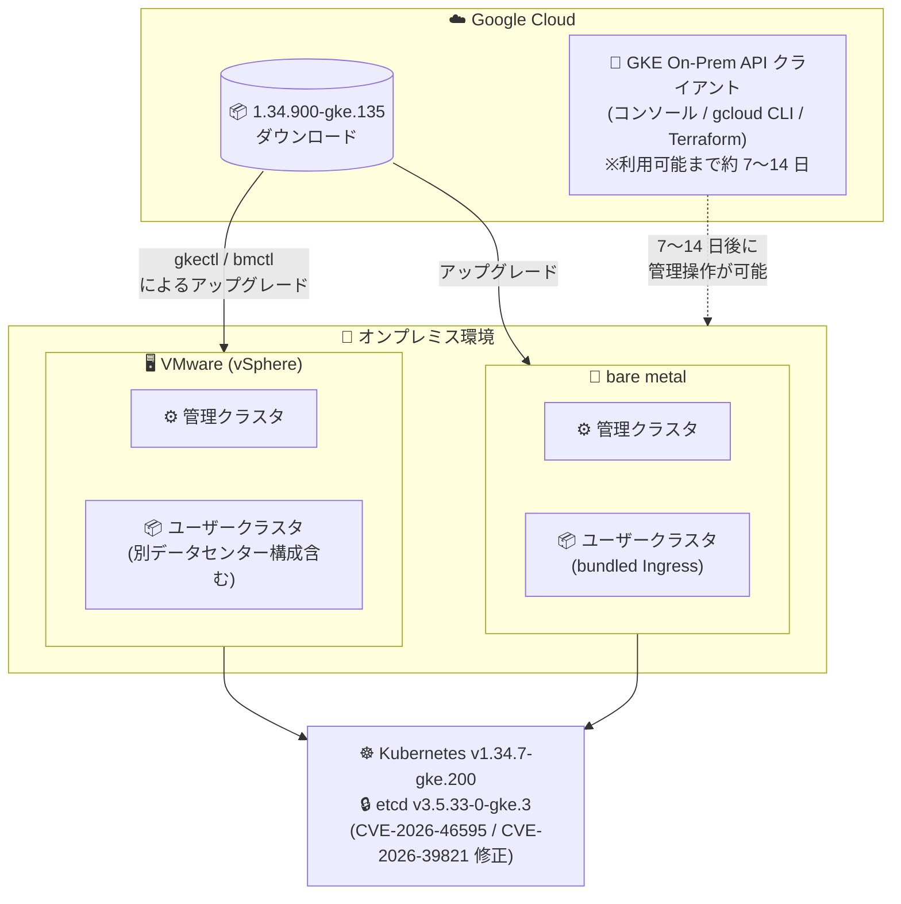

# Google Distributed Cloud (software only): 1.34.900-gke.135 リリース (VMware / bare metal)

**リリース日**: 2026-09-17

**サービス**: Google Distributed Cloud (software only) for VMware / for bare metal

**機能**: バージョン 1.34.900-gke.135 リリース (脆弱性修正・不具合修正)

**ステータス**: Announcement / Fixed

📊 [このアップデートのインフォグラフィックを見る](https://takech9203.github.io/google-cloud-news-summary/20260917-google-distributed-cloud-1-34-900.html)

## 概要

Google Distributed Cloud (software only) 1.34.900-gke.135 が、VMware 版・ベアメタル版の両方でダウンロード可能になりました。本リリースは Kubernetes v1.34.7-gke.200 上で動作するパッチリリースで、新機能の追加ではなく、セキュリティ脆弱性の修正と複数の重要な不具合修正が中心です。オンプレミスやエッジ環境で Google Distributed Cloud を運用する IT 管理者・プラットフォーム運用者が対象です。

セキュリティ面では、etcd が v3.5.33-0-gke.3 に更新され、脆弱性 CVE-2026-46595 および CVE-2026-39821 に対応しました。あわせて、Vulnerability fixes ページに記載された脆弱性群も修正されています。運用面では、管理クラスタとユーザークラスタの Pod 密度設定が異なる場合にユーザークラスタが Reconciling と Running の状態を繰り返す問題や、クラスタ削除中にノードプールコントローラーがマシンリソースを再作成しようとして削除がスタックする問題など、クラスタライフサイクル管理に影響する不具合が両エディションで修正されています。

なお、リリース後、GKE On-Prem API クライアント (Google Cloud コンソール、gcloud CLI、Terraform) でこのバージョンが利用可能になるまでには約 7〜14 日かかります。サードパーティのストレージベンダーを使用している場合は、当該ベンダーが本リリースの認定 (qualification) を取得済みかをストレージパートナーのドキュメントで確認する必要があります。

**アップデート前の課題**

このアップデート以前 (1.34 系の従来パッチ) には、以下の問題が存在していました。

- (共通) etcd に脆弱性 CVE-2026-46595 / CVE-2026-39821 が存在し、その他の既知脆弱性も未修正だった
- (共通) 管理クラスタとユーザークラスタで Pod 密度の設定が異なる場合、ユーザークラスタが Reconciling と Running の状態を繰り返していた
- (共通) クラスタ削除の進行中にノードプールコントローラーがマシンリソースを再作成しようとするため、クラスタ削除がスタックすることがあった
- (VMware) 管理クラスタと別の vSphere データセンターにデプロイされたユーザークラスタ (`cpNodesInAdminDatacenter: true`) に対して、`gkectl diagnose` とプリフライト検証が PersistentVolume のデータストアを見つけられず失敗していた
- (bare metal) bundled Ingress 使用時に、Ingress リソースのステータスが更新されなかった

**アップデート後の改善**

1.34.900-gke.135 へのアップグレードにより、以下が改善されます。

- (共通) etcd が v3.5.33-0-gke.3 に更新され、CVE-2026-46595 / CVE-2026-39821 が解消。Vulnerability fixes ページ記載の脆弱性群も修正された
- (共通) Pod 密度設定が管理クラスタとユーザークラスタで異なっていても、クラスタ状態が安定して Running を維持するようになった
- (共通) クラスタ削除が途中でスタックする問題が解消され、ライフサイクル操作の信頼性が向上した
- (VMware) 別データセンター構成でも `gkectl diagnose` とプリフライト検証が PV データストアを正しく検出できるようになった
- (bare metal) bundled Ingress 使用時に Ingress リソースのステータスが正しく更新されるようになった

## アーキテクチャ図

VMware 版・ベアメタル版の両エディションが同一バージョン 1.34.900-gke.135 (Kubernetes v1.34.7-gke.200 / etcd v3.5.33-0-gke.3) としてリリースされ、ダウンロードによるアップグレードが可能になった構成を示しています。GKE On-Prem API クライアント経由での利用はリリースから約 7〜14 日後に可能になります。

## サービスアップデートの詳細

### 主要な修正内容

1. **セキュリティ脆弱性の修正 (両エディション共通)**
   - Vulnerability fixes ページに記載された脆弱性群を修正
   - etcd を v3.5.33-0-gke.3 に更新し、CVE-2026-46595 および CVE-2026-39821 に対応

2. **Pod 密度設定差異による状態フラッピングの修正 (両エディション共通)**
   - 管理クラスタ (management cluster) とユーザークラスタで Pod 密度の設定が異なる場合、ユーザークラスタが Reconciling と Running の状態を繰り返す問題を修正

3. **クラスタ削除スタックの修正 (両エディション共通)**
   - クラスタ削除の進行中にノードプールコントローラーがマシンリソースを再作成しようとし、削除処理がスタックする問題を修正

4. **診断・プリフライト検証の修正 (VMware のみ)**
   - 管理クラスタと別の vSphere データセンターにユーザークラスタをデプロイした構成 (`cpNodesInAdminDatacenter: true`) で、`gkectl diagnose` とプリフライト検証が PersistentVolume のデータストアを見つけられず失敗する問題を修正

5. **bundled Ingress のステータス更新の修正 (bare metal のみ)**
   - bundled Ingress 使用時に Ingress リソースのステータスが更新されない問題を修正

## 技術仕様

### リリース構成

| 項目 | 詳細 |
|------|------|
| バージョン | 1.34.900-gke.135 (VMware 版 / bare metal 版で同一) |
| ベース Kubernetes | v1.34.7-gke.200 |
| etcd | v3.5.33-0-gke.3 (CVE-2026-46595 / CVE-2026-39821 対応) |
| リリースタイプ | 1.34 系パッチリリース (脆弱性修正 + 不具合修正) |
| GKE On-Prem API クライアント対応 | リリース後 約 7〜14 日で利用可能 (コンソール / gcloud CLI / Terraform) |
| ストレージ | サードパーティストレージベンダー利用時は認定済みパートナーの一覧を要確認 |

### 1.34 系の補足 (公式ドキュメントより)

- 1.34 へのアップグレード時、非 advanced クラスタは常に advanced クラスタに変換されます (非 advanced のまま維持できるのは 1.32 → 1.33 のアップグレードのみ)
- VMware 版 1.34 にバンドルされる cert-manager のバージョンは 1.19 です

## 設定方法

### 前提条件

1. 既存の Google Distributed Cloud (software only) クラスタ (VMware 版または bare metal 版) を運用していること
2. アップグレード前に管理クラスタ・ユーザークラスタのバックアップを取得しておくこと (公式のアップグレードベストプラクティスで推奨)
3. サードパーティストレージベンダー利用時は、本リリースの認定取得状況を確認済みであること
4. バージョンスキュー等のバージョンルールについて、アップグレード概要ドキュメントを確認しておくこと

### 手順

#### ステップ 1: リリースのダウンロードとアップグレード (VMware 版)

VMware 版のアップグレード手順は公式ドキュメント「[Upgrade a cluster](https://cloud.google.com/kubernetes-engine/distributed-cloud/vmware/docs/how-to/upgrading)」を参照してください。管理ワークステーション、ユーザークラスタ、管理クラスタのアップグレード手順が記載されています。

#### ステップ 2: リリースのダウンロードとアップグレード (bare metal 版)

bare metal 版のアップグレード手順は公式ドキュメント「[Upgrade clusters](https://docs.cloud.google.com/kubernetes-engine/distributed-cloud/bare-metal/docs/how-to/upgrade)」を参照してください。

#### ステップ 3: GKE On-Prem API クライアントでの利用

Google Cloud コンソール、gcloud CLI、Terraform からこのバージョンを利用する場合は、リリース後約 7〜14 日で利用可能になるまで待つ必要があります。

## メリット

### ビジネス面

- **セキュリティリスクの低減**: etcd の CVE-2026-46595 / CVE-2026-39821 を含む脆弱性が修正され、オンプレミス環境のコンプライアンス・セキュリティ要件への対応が容易になる
- **運用コストの削減**: クラスタ削除のスタックや状態フラッピングといった、運用者の手動介入を要していた問題が解消される

### 技術面

- **クラスタライフサイクルの安定化**: Pod 密度設定差異による Reconciling/Running の繰り返しや、削除スタックの問題が修正され、クラスタの作成・削除・更新の信頼性が向上する
- **マルチデータセンター構成の診断性向上 (VMware)**: 別データセンター構成でも `gkectl diagnose` とプリフライト検証が正常に機能し、トラブルシューティングとアップグレード前検証が確実に行える
- **Ingress 運用の可観測性向上 (bare metal)**: bundled Ingress のステータスが正しく更新され、Ingress の状態確認に基づく自動化・監視が正常に機能する

## デメリット・制約事項

### 考慮すべき点

- GKE On-Prem API クライアント (コンソール、gcloud CLI、Terraform) でこのバージョンが利用可能になるまで約 7〜14 日かかるため、これらのツールでライフサイクル管理をしている場合はスケジュールに注意が必要
- サードパーティストレージベンダーを使用している場合、ベンダーが本リリースの認定を取得済みかを事前に確認する必要がある
- 1.34 へのアップグレード時、非 advanced クラスタは advanced クラスタへ自動変換されるため、非 advanced クラスタ構成に依存するカスタムコードがある場合は影響を確認する必要がある (1.34.0 リリースノート記載)

## ユースケース

### ユースケース 1: etcd 脆弱性対応としての計画的アップグレード

**シナリオ**: 金融・公共など厳格なセキュリティ基準を持つ組織が、オンプレミスの Google Distributed Cloud クラスタで CVE 対応の SLA を運用している。CVE-2026-46595 / CVE-2026-39821 への対応が必要になった。

**効果**: 1.34.900-gke.135 へのアップグレードにより etcd が v3.5.33-0-gke.3 に更新され、両 CVE および Vulnerability fixes 記載の脆弱性へまとめて対応できる。

### ユースケース 2: マルチデータセンター vSphere 構成の検証正常化 (VMware)

**シナリオ**: 管理クラスタとユーザークラスタを別々の vSphere データセンターに配置 (`cpNodesInAdminDatacenter: true`) しており、`gkectl diagnose` やアップグレード前のプリフライト検証が PV データストアを検出できず失敗していた。

**効果**: 本バージョンで診断・検証が正常に完了するようになり、アップグレードやトラブルシューティングのワークフローを阻害されずに実行できる。

### ユースケース 3: クラスタライフサイクル自動化の安定運用

**シナリオ**: Terraform や CI/CD パイプラインでクラスタの作成・削除を自動化しているが、削除処理がスタックしたり、Pod 密度設定の差異でクラスタ状態が安定しないため、パイプラインが失敗・タイムアウトしていた。

**効果**: 削除スタックと状態フラッピングの修正により、自動化パイプラインが安定して完走するようになる。bare metal では Ingress ステータスの更新修正により、ステータス監視に基づく自動化も正常に機能する。

## 関連サービス・機能

- **GKE On-Prem API (Google Cloud コンソール / gcloud CLI / Terraform)**: Google Cloud 側から Distributed Cloud クラスタのライフサイクルを管理するクライアント群。本バージョンは約 7〜14 日後に利用可能
- **GKE Enterprise / フリート管理**: Google Distributed Cloud クラスタを Google Cloud に接続して一元管理する基盤
- **VMware vSphere**: VMware 版の実行基盤。本リリースでは別データセンター構成での診断・検証の問題が修正された
- **bundled Ingress (bare metal)**: bare metal 版に同梱される Ingress 機能。本リリースでステータス更新の問題が修正された

## 参考リンク

- 📊 [インフォグラフィック](https://takech9203.github.io/google-cloud-news-summary/20260917-google-distributed-cloud-1-34-900.html)
- [公式リリースノート (2026 年 9 月 17 日)](https://docs.cloud.google.com/release-notes#September_17_2026)
- [クラスタのアップグレード (VMware 版)](https://cloud.google.com/kubernetes-engine/distributed-cloud/vmware/docs/how-to/upgrading)
- [クラスタのアップグレード (bare metal 版)](https://docs.cloud.google.com/kubernetes-engine/distributed-cloud/bare-metal/docs/how-to/upgrade)
- [Vulnerability fixes (VMware 版)](https://cloud.google.com/kubernetes-engine/distributed-cloud/vmware/docs/vulnerabilities)
- [Vulnerability fixes (bare metal 版)](https://cloud.google.com/kubernetes-engine/distributed-cloud/bare-metal/docs/vulnerabilities)

## まとめ

Google Distributed Cloud (software only) 1.34.900-gke.135 は、etcd の CVE 対応 (CVE-2026-46595 / CVE-2026-39821) を含むセキュリティ修正と、クラスタ削除スタック・状態フラッピングなどライフサイクル運用に直結する不具合修正をまとめたパッチリリースです。1.34 系を運用中の環境では、事前バックアップとストレージパートナーの認定状況を確認のうえ、早期のアップグレード適用を推奨します。GKE On-Prem API クライアント経由の利用は約 7〜14 日後になる点も計画に織り込んでください。

---

**タグ**: Google Distributed Cloud, GDC software only, VMware, bare metal, Kubernetes, etcd, セキュリティ, CVE-2026-46595, CVE-2026-39821, パッチリリース, オンプレミス, ハイブリッドクラウド
