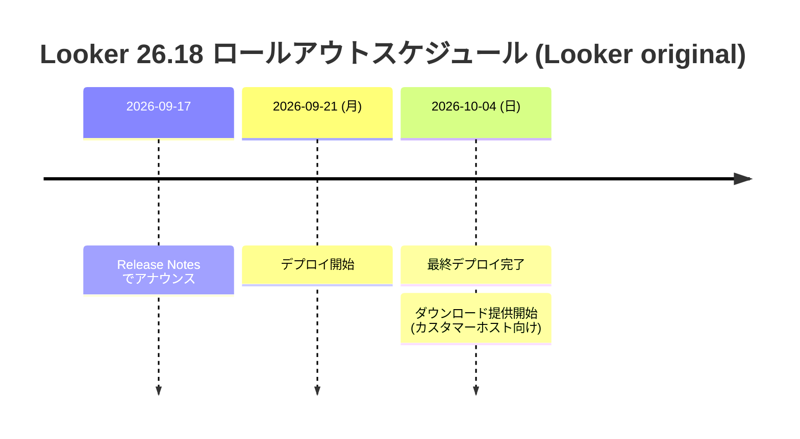

# Looker: Looker 26.18 ロールアウト予告 (多数の不具合修正を含む)

**リリース日**: 2026-09-17

**サービス**: Looker

**機能**: Looker 26.18 リリース (Looker (original) インスタンス向けロールアウト)

**ステータス**: Announcement (ロールアウト予告)

📊 [このアップデートのインフォグラフィックを見る](https://takech9203.github.io/google-cloud-news-summary/20260917-looker-26-18.html)

## 概要

Looker 26.18 が Looker (original) インスタンスに対して、2026 年 9 月 21 日 (月) からロールアウトを開始し、2026 年 10 月 4 日 (日) に最終デプロイおよびダウンロード提供が完了する予定であることが発表されました。Looker のバージョン番号は「西暦下 2 桁.月次バージョン (1 月 = 0 で偶数刻み)」の体系であり、26.18 は 2026 年 10 月向けのマイナーリリースに相当します。

26.18 は新機能の追加よりも品質改善に重点を置いたリリースで、Release Notes には 19 件の修正 (Fixed) が列挙されています。ダッシュボードの CSV/ZIP ダウンロードや LookML `link` パラメータで発生していた 500 エラー、スケジュール配信の PDF 破損や権限エラー、BigQuery/Snowflake での analytic model コンパイル失敗、セルフサービス分析での CSV/Excel アップロード時のデータ破損など、日常運用に直接影響する不具合が幅広く解消されます。

Looker 管理者、LookML 開発者、および Looker を埋め込み分析やスケジュール配信で利用しているチームが対象です。特にカスタマーホスト (自己管理) の Looker (original) 環境では、10 月 4 日以降にダウンロード可能となる 26.18 への計画的なアップグレードが推奨されます。

**アップデート前の課題**

このリリース以前の Looker (original) には、以下のような不具合が存在していました。

- タイトルのないダッシュボード要素を含むダッシュボードを CSV/ZIP でダウンロードすると 500 エラーが発生することがあった
- ラベル未指定の LookML `link` パラメータで作成したリンクが 500 エラーを返すことがあった
- Cloud Storage へのスケジュール PDF 配信でファイルが破損したり、ファイル名のスペースが意図せずアンダースコアに置換されたりすることがあった
- ワーカースレッド上でユーザー権限が誤ってキャッシュされ、スケジュール配信が `Cannot send all results` などの権限エラーで断続的に失敗することがあった
- クロスデータベース・スキーマ修飾・ドット区切りのテーブル名を参照する analytic model が、BigQuery および Snowflake の DDL 生成でコンパイルに失敗していた
- セルフサービス分析の CSV/Excel アップロード (BigQuery/Snowflake 向け) で、複数行ヘッダー・先頭が数字の文字列・UTF-8 BOM・特殊文字を含むファイルが失敗またはデータ破損を起こすことがあった

**アップデート後の改善**

Looker 26.18 により、以下が改善されます。

- ダッシュボードのダウンロード、LookML `link`、SQL Runner のピボット可視化など、500 エラー / TypeError を引き起こしていた複数の不具合が解消される
- スケジュール配信の PDF 破損・ファイル名置換・権限キャッシュ起因の断続的エラーが解消され、配信の信頼性が向上する
- LookML プロジェクトのファイル/ディレクトリが見つからない場合の API 応答が 500 ではなく適切な 404 Not Found を返すようになり、エラーハンドリングが改善される
- embed preload ページが `theme` URL クエリパラメータによるカスタムテーマに対応し、埋め込み体験の一貫性が向上する
- Conversational Analytics で、対象モデルの `explore` 権限を持たないユーザーには「Open in Explore」ボタンやサイドバーの探索リンクが非表示化/無効化 (説明ツールチップ付き) され、権限制御が適切になる

## アーキテクチャ図

Looker 26.18 は約 2 週間かけて段階的にデプロイされ、最終日にカスタマーホスト環境向けのダウンロードも提供されます。

## サービスアップデートの詳細

### 主な修正内容 (カテゴリ別)

1. **ダッシュボード・可視化**
   - タイトルのないダッシュボード要素がある場合に CSV/ZIP ダウンロードが 500 エラーになる問題を修正
   - フィルタ値選択時にダッシュボードフィルタのトークンチップにアクティブなハイライト背景が表示されない問題を修正
   - ダッシュボードのフィルタトークンとポップオーバーメニューがカスタムテーマのフォントを継承しないことがある問題を修正
   - Look 編集モードバーにカスタムコンテンツテーマのフォントが不適切に適用される問題を修正
   - Single Record 可視化のカスタムツールチップが、選択行の直下ではなく Explore パネル下部に表示される問題を修正
   - Donut Multiples 可視化で、重なり合う値ラベルを自動的に非表示にするよう改善

2. **Explore・チャート設定**
   - ピボットした Cartesian チャートで系列を Y 軸間でドラッグすると Explore ページがクラッシュしたり可視化設定を保存できなくなったりする問題を修正
   - Explore の Chart Config Editor ダイアログで JSON 可視化設定の編集中にスクロールできない問題を修正
   - SQL Runner でピボットしたクエリ結果を可視化しようとすると `TypeError` 設定エラーになる問題を修正

3. **LookML 開発・Git**
   - ラベル未指定の LookML `link` パラメータで作成したリンクが 500 エラーを返すことがある問題を修正
   - Git プロバイダのブランチ保護ルールが一時ブランチを制限している場合に、Git 接続テストが認証情報を十分と認識できないことがある問題を修正
   - ベアリポジトリのプロジェクトで production ブランチを基に共有ブランチを作成すると古いリモートコミットから初期化され、Looker IDE が即座に「production より遅れている」と報告する問題を修正
   - クロスデータベース・スキーマ修飾・ドット区切りのテーブル名を参照する analytic model が BigQuery および Snowflake の DDL 生成でコンパイルに失敗する問題を修正

4. **スケジュール配信**
   - Cloud Storage へのスケジュール PDF 配信でファイルが破損したり、ファイル名のスペースがアンダースコアに置換されたりする問題を修正
   - ワーカースレッド上でスケジュールジョブ間にユーザー権限が誤ってキャッシュされ、`Cannot send all results` などの権限エラーで配信が断続的に失敗する問題を修正

5. **API・エラーハンドリング**
   - LookML プロジェクトのファイルまたはディレクトリがインスタンス上に見つからない場合、API リクエストが `500 Internal Server Error` ではなく `404 Not Found` を返すよう改善

6. **埋め込み・Conversational Analytics・セルフサービス分析**
   - embed preload ページが `theme` URL クエリパラメータによるカスタムテーマに対応
   - Conversational Analytics で、基盤モデルの `explore` 権限がないユーザーには「Open in Explore」ボタンとサイドバーの探索リンクが非表示化または無効化 (説明ツールチップ付き) されるよう改善
   - セルフサービス分析の BigQuery/Snowflake への CSV/Excel アップロードで、複数行ヘッダー・先頭が数字の文字列・UTF-8 BOM マーカー・特殊文字を含むファイルが失敗またはデータ破損を起こす問題を修正

## 技術仕様

### リリース情報

| 項目 | 詳細 |
|------|------|
| バージョン | Looker 26.18 |
| 対象 | Looker (original) インスタンス |
| デプロイ開始 (予定) | 2026 年 9 月 21 日 (月) |
| 最終デプロイ・ダウンロード提供 (予定) | 2026 年 10 月 4 日 (日) |
| 内容 | 19 件の修正 (Fixed) を含む変更・機能・修正 |

### バージョン番号の体系

Looker のリリース番号は X.Y.Z の 3 つの数字で構成されます。X はリリース年の下 2 桁、Y は月次バージョン (1 月を 0 とし、以降の月は偶数)、Z はパッチリリース番号です。26.18 は 2026 年 10 月の月次リリースに相当します。

## メリット

### ビジネス面

- **レポート配信の信頼性向上**: スケジュール PDF 配信の破損や権限キャッシュ起因の断続的な配信失敗が解消され、経営層や顧客向けの定期レポート運用の安定性が高まる
- **セルフサービス分析の安定化**: CSV/Excel アップロード時のデータ破損問題の解消により、ビジネスユーザーが自身のデータを安心して取り込めるようになる

### 技術面

- **500 エラーの広範な解消**: ダッシュボードダウンロード、LookML `link`、API のエラーハンドリング (404/500) など、運用でのトラブルシューティング負荷が下がる
- **マルチウェアハウス対応の改善**: BigQuery/Snowflake での analytic model コンパイル失敗や、Git ブランチ保護ルール環境での接続テスト問題が解消され、開発ワークフローが円滑になる
- **埋め込み分析の品質向上**: embed preload ページのカスタムテーマ対応により、埋め込み先アプリケーションとの外観の一貫性を保ちやすくなる

## デメリット・制約事項

### 考慮すべき点

- 記載のスケジュールは「予定 (Expected)」であり、変更される可能性がある。Google Cloud ホストのインスタンスは 9 月 21 日〜10 月 4 日の期間中に順次アップグレードされる
- カスタマーホスト環境向けのダウンロード提供は最終デプロイ日 (2026 年 10 月 4 日) からとなる
- 2026 年 3 月 23 日のアナウンスによると、Looker SDK と Looker API の `/login` エンドポイントは 26.18 リリースをもって、URL クエリパラメータによる認証情報の受け渡しをサポートしなくなり、HTTP リクエストボディでの受け渡しのみを受け付けるようになる予定。URL クエリパラメータで API 認証情報を渡しているスクリプトやアプリケーションは失敗するため、Looker SDK 26.4 以降へのアップグレードとスクリプトの修正を事前に行う必要がある

## 関連サービス・機能

- **BigQuery / Snowflake**: analytic model の DDL 生成や、セルフサービス分析の CSV/Excel アップロード先として修正の対象
- **Cloud Storage**: スケジュール PDF 配信の宛先。ファイル破損・ファイル名置換の修正が適用される
- **Conversational Analytics**: `explore` 権限に基づく「Open in Explore」ボタンの表示制御が改善
- **Looker (Google Cloud core)**: 同じバージョン番号体系を持つマネージド版。リリースチャネル (Rapid/Regular) に応じて新バージョンが適用される

## 参考リンク

- 📊 [インフォグラフィック](https://takech9203.github.io/google-cloud-news-summary/20260917-looker-26-18.html)
- [公式リリースノート (September 17, 2026)](https://docs.cloud.google.com/release-notes#September_17_2026)
- [Looker リリースノート](https://docs.cloud.google.com/looker/docs/release-notes)
- [Looker (Google Cloud core) のリリースプロセス](https://docs.cloud.google.com/looker/docs/looker-core-release-process)

## まとめ

Looker 26.18 は、500 エラー・配信失敗・データ破損といった日常運用に直結する 19 件の不具合を修正する品質重視のリリースです。Google Cloud ホストのインスタンスは 9 月 21 日から自動的にロールアウトされるため、管理者は修正内容を把握し、影響のあった既知の問題が解消されるかを確認しておくことを推奨します。また、26.18 では API `/login` エンドポイントの認証情報受け渡し方式の変更 (URL クエリパラメータ廃止) が発効予定のため、該当するスクリプト・SDK の事前更新を必ず行ってください。

---

**タグ**: Looker, Release, BugFix, BI, Dashboard, LookML, Scheduling, EmbeddedAnalytics
