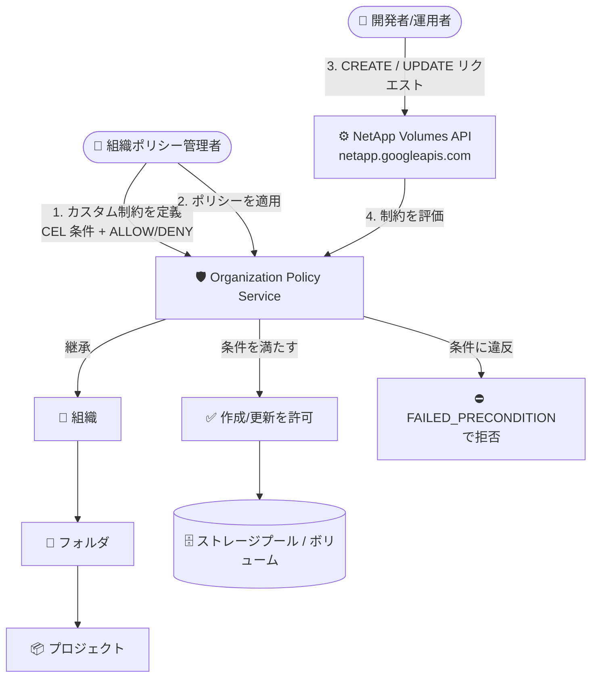

# Google Cloud NetApp Volumes: Organization Policy Service カスタム制約のサポート

**リリース日**: 2026-09-17

**サービス**: Google Cloud NetApp Volumes

**機能**: Organization Policy Service カスタム制約 (Custom Constraints) のサポート

**ステータス**: 一般提供 (GA)

📊 [このアップデートのインフォグラフィックを見る](https://takech9203.github.io/google-cloud-news-summary/20260917-netapp-volumes-custom-org-policy-constraints.html)

## 概要

Google Cloud NetApp Volumes で Organization Policy Service のカスタム制約 (Custom Constraints) が利用可能になりました。組織ポリシー管理者は、組織内での NetApp Volumes の利用方法を、組織・フォルダ・プロジェクトの各レベルで集中管理・プログラマティックに制御できるようになります。

カスタム制約は、Common Expression Language (CEL) で記述した条件を使って、NetApp Volumes リソースの特定フィールドに対するきめ細かな制限を定義できる仕組みです。例えば、ストレージプールやボリュームの容量上限の強制、Premium または Extreme サービスレベルでのみストレージプール作成を許可する、バックアップに説明 (description) の記載を必須化する、といったガバナンスルールを定義できます。

対象ユーザーは、大規模組織で NetApp Volumes を利用しており、コスト管理・構成の標準化・コンプライアンス対応のために、リソース構成のガードレールを組織全体で強制したいクラウド管理者や組織ポリシー管理者です。

**アップデート前の課題**

- NetApp Volumes のリソース構成 (ストレージプール容量、サービスレベル、ボリューム容量など) を組織レベルで一元的に制限する仕組みがなく、ガバナンスは IAM 権限設計や運用ルール、レビュープロセスに依存していた
- 意図しない大容量のストレージプール/ボリューム作成や、要件に合わないサービスレベルの選択を、リソース作成時点でシステム的にブロックできなかった
- プロジェクトごとに構成ルールを徹底するには手動での監査・是正が必要だった

**アップデート後の改善**

- CEL 条件によるカスタム制約で、NetApp Volumes の 10 種類のリソースタイプ (StoragePool、Volume、Backup、BackupPolicy、BackupVault、Snapshot、ActiveDirectory、KmsConfig、QuotaRule、HostGroup) の構成フィールドを CREATE / UPDATE 時に検証・強制できるようになった
- 組織・フォルダ・プロジェクトの各レベルでポリシーを適用でき、リソース階層に沿った継承により組織全体で一貫したガードレールを実現できる
- ドライラン (dry-run) モードや Policy Simulator により、本番適用前にポリシーの影響をテストできる

## アーキテクチャ図



組織ポリシー管理者が定義したカスタム制約は、リソース階層に沿って継承され、NetApp Volumes リソースの CREATE / UPDATE リクエスト時に評価されます。条件に違反するリクエストはエラーで拒否されます。

## サービスアップデートの詳細

### 主要機能

1. **10 種類の NetApp Volumes リソースタイプに対するカスタム制約**
   - `netapp.googleapis.com/StoragePool`、`Volume`、`Backup`、`BackupPolicy`、`BackupVault`、`Snapshot`、`ActiveDirectory`、`KmsConfig`、`QuotaRule`、`HostGroup` が対象
   - StoragePool では `capacityGib`、`serviceLevel`、`allowAutoTiering`、`kmsConfig`、`network`、`totalIops`、`totalThroughputMibps` など、Volume では `capacityGib`、`protocols`、`exportPolicy`、`snapshotPolicy`、`backupConfig` など、多数のフィールドを参照可能

2. **CEL 条件による柔軟なルール定義**
   - 例: `"resource.capacityGib <= 10240"` (容量制限)、`"!(resource.serviceLevel in ['PREMIUM', 'EXTREME'])"` (サービスレベル強制)
   - アクションタイプとして `ALLOW` / `DENY` を選択可能
   - 適用対象のメソッドは `CREATE` のみ、または `CREATE` と `UPDATE` の両方を指定可能

3. **リソース階層に沿ったポリシー適用と事前テスト**
   - 組織・フォルダ・プロジェクトの各レベルで適用でき、デフォルトで下位リソースに継承される
   - dry-run モードでの適用や Policy Simulator による影響のシミュレーションが可能

## 技術仕様

### カスタム制約の仕様

| 項目 | 詳細 |
|------|------|
| 対象リソース | `netapp.googleapis.com/` 配下の 10 リソースタイプ |
| 条件記述言語 | Common Expression Language (CEL)、最大 1,000 文字 |
| アクションタイプ | `ALLOW` / `DENY` |
| 適用メソッド | `CREATE`、または `CREATE` + `UPDATE` |
| 制約数の上限 | ほとんどのリソースタイプで最大 20 個のカスタム制約 |
| 制約 ID | 英数字のみ、`custom.` プレフィックスを除き最大 70 文字 |
| ポリシー反映時間 | 適用後、最大 15 分程度で有効化 |
| 必要な IAM ロール | Organization Policy Administrator (`roles/orgpolicy.policyAdmin`) を組織リソースに付与 |

### カスタム制約の定義例 (YAML)

```yaml
name: organizations/ORGANIZATION_ID/customConstraints/custom.enforcePremiumServiceLevel
resourceTypes: netapp.googleapis.com/StoragePool
methodTypes:
  - CREATE
  - UPDATE
condition: "!(resource.serviceLevel in ['PREMIUM', 'EXTREME'])"
actionType: DENY
displayName: Enforce Premium or Extreme service level
description: Make sure that the storage pools are created only for the Premium or Extreme service level.
```

## 設定方法

### 前提条件

1. 組織 ID を確認しておく
2. 組織リソースに対して Organization Policy Administrator (`roles/orgpolicy.policyAdmin`) ロールが付与されていること

### 手順

#### ステップ 1: カスタム制約を作成・登録する

```bash
# constraint-storage-pool-capacity.yaml を作成
cat <<EOF > constraint-storage-pool-capacity.yaml
name: organizations/ORGANIZATION_ID/customConstraints/custom.restrictStoragePoolCapacity
resourceTypes: netapp.googleapis.com/StoragePool
methodTypes:
- CREATE
condition: "resource.capacityGib <= 10240"
actionType: ALLOW
displayName: Restrict storage pool capacity
description: Restrict storage pool capacity to 10,240 GiB.
EOF

# カスタム制約を登録
gcloud org-policies set-custom-constraint constraint-storage-pool-capacity.yaml

# 登録された制約を確認
gcloud org-policies list-custom-constraints --organization=ORGANIZATION_ID
```

ストレージプールの容量を 10,240 GiB 以下に制限するカスタム制約を定義し、組織に登録します。

#### ステップ 2: 組織ポリシーとして適用する

```bash
# policy-storage-pool-capacity.yaml を作成
cat <<EOF > policy-storage-pool-capacity.yaml
name: projects/PROJECT_ID/policies/custom.restrictStoragePoolCapacity
spec:
  rules:
  - enforce: true
EOF

# ポリシーを適用
gcloud org-policies set-policy policy-storage-pool-capacity.yaml

# 適用されたポリシーを確認
gcloud org-policies list --project=PROJECT_ID
```

カスタム制約を参照する組織ポリシーを作成し、プロジェクトに適用します。適用後、約 2 分でポリシーの強制が開始されます。dry-run モードでテストする場合は `dryRunSpec` を使用し、`--update-mask=dryRunSpec` を指定します。

#### ステップ 3: ポリシーの動作を確認する

```bash
# 制約に違反するストレージプール作成を試行 (capacityGib > 10240)
gcloud netapp storage-pools create test-pool \
  --location=us-central1 \
  --service-level=standard \
  --capacity=10241 \
  --network=name=default
```

制約に違反するリクエストは `FAILED_PRECONDITION: Operation denied by custom org policy on resource ...` エラーで拒否されます。

## メリット

### ビジネス面

- **コストガバナンスの強化**: ストレージプールやボリュームの容量上限を強制することで、意図しない大容量プロビジョニングによるコスト超過を作成時点で防止できる
- **コンプライアンスと標準化**: サービスレベル、バックアップ設定、CMEK 構成などの組織標準をシステム的に強制でき、監査・是正の手間を削減できる

### 技術面

- **きめ細かな制御**: 組み込みのマネージド制約では対応できないフィールド単位の制御を、CEL 条件で柔軟に定義できる
- **安全な導入**: dry-run モードと Policy Simulator により、既存ワークロードへの影響を事前に検証してから本番適用できる
- **階層的な適用と継承**: 組織・フォルダ・プロジェクトの各レベルで適用でき、リソース階層に沿って自動的に継承される

## デメリット・制約事項

### 制限事項

- ほとんどのリソースタイプでカスタム制約は最大 20 個までしか作成できない
- CEL 条件は最大 1,000 文字、説明は最大 2,000 文字などのフィールド長制限がある
- 制約が強制されるのは REST の `CREATE` / `UPDATE` メソッドのみで、既存リソースに遡って自動修正されるわけではない

### 考慮すべき点

- ポリシー適用から有効化まで最大 15 分程度かかるため、即時反映を前提とした運用は避ける
- `UPDATE` メソッドに制約を適用した場合、制約に違反している既存リソースへの変更は、違反を解消する変更でない限りブロックされる
- 制約 ID・表示名・説明はエラーメッセージに露出する可能性があるため、PII や機密情報を含めない
- いきなり本番適用せず、dry-run モードでの検証を推奨

## ユースケース

### ユースケース 1: ストレージコストの上限ガードレール

**シナリオ**: 複数の開発プロジェクトで NetApp Volumes を利用しており、開発環境での過大な容量プロビジョニングによるコスト超過を防ぎたい。

**実装例**:
```yaml
name: organizations/ORGANIZATION_ID/customConstraints/custom.restrictVolumeCapacity
resourceTypes: netapp.googleapis.com/Volume
methodTypes:
- CREATE
- UPDATE
condition: "resource.capacityGib > 5000"
actionType: DENY
displayName: Restrict volume capacity
description: Prevent creation or update of volumes with capacity greater than 5,000 GiB.
```

**効果**: 5,000 GiB を超えるボリュームの作成・拡張が組織ポリシーで自動的に拒否され、コスト超過を未然に防げる。

### ユースケース 2: 本番環境でのサービスレベル標準の強制

**シナリオ**: 本番データベースワークロード用のフォルダでは、性能要件を満たす Premium または Extreme サービスレベルのストレージプールのみを許可したい。

**効果**: `"!(resource.serviceLevel in ['PREMIUM', 'EXTREME'])"` を DENY 条件とする制約を本番フォルダに適用することで、Standard や Flex などの低性能なサービスレベルでのプール作成を防ぎ、性能要件の逸脱を排除できる。

## 料金

Organization Policy Service のカスタム制約の利用自体に関する追加料金の記載はリリースノートにはありません。NetApp Volumes 自体の料金は、ロケーション・サービスレベル・プールに割り当てた容量に基づいて課金されます。詳細は料金ページを参照してください。

- [NetApp Volumes 料金ページ](https://cloud.google.com/netapp-volumes/pricing)

## 利用可能リージョン

カスタム制約は Organization Policy Service の機能として組織リソースに対して定義されるため、特定リージョンへの依存はありません。NetApp Volumes 自体のロケーションについては [サポートされているロケーション](https://docs.cloud.google.com/netapp/volumes/docs/locations) を参照してください。

## 関連サービス・機能

- **Organization Policy Service**: 本アップデートの基盤となるサービス。マネージド制約とカスタム制約により組織リソースを集中管理する
- **Policy Simulator (Policy Intelligence)**: 組織ポリシー変更の影響を本番適用前にシミュレーションできる
- **IAM**: カスタム制約の管理には Organization Policy Administrator ロールが必要。IAM がアクセス制御を担い、組織ポリシーがリソース構成の制御を担う補完関係
- **Cloud KMS (CMEK)**: `resource.kmsConfig` フィールドへの制約により、ストレージプールでの CMEK 利用を強制するといった制御が可能

## 参考リンク

- 📊 [インフォグラフィック](https://takech9203.github.io/google-cloud-news-summary/20260917-netapp-volumes-custom-org-policy-constraints.html)
- [公式リリースノート](https://docs.cloud.google.com/release-notes#September_17_2026)
- [ドキュメント: NetApp Volumes のカスタム組織ポリシー制約](https://docs.cloud.google.com/netapp/volumes/docs/secure-control-access/custom-constraints)
- [ドキュメント: カスタム組織ポリシーの概要](https://docs.cloud.google.com/organization-policy/overview#custom-organization-policies)
- [料金ページ](https://cloud.google.com/netapp-volumes/pricing)

## まとめ

NetApp Volumes が Organization Policy Service のカスタム制約に対応したことで、ストレージプールやボリュームの容量・サービスレベル・バックアップ設定などを組織全体で強制できるガードレールを構築できるようになりました。大規模組織で NetApp Volumes を運用している場合は、まず dry-run モードでコスト・構成標準に関する制約を検証し、段階的に本番適用することを推奨します。

---

**タグ**: NetApp Volumes, Organization Policy, カスタム制約, ガバナンス, セキュリティ, ストレージ
