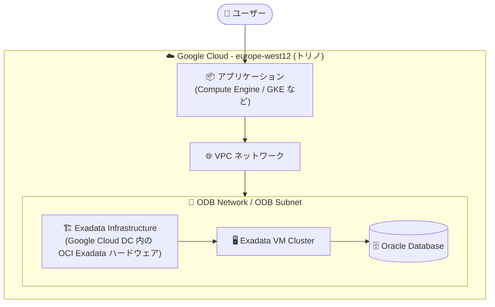

# Oracle Database@Google Cloud: Exadata Database Service が europe-west12 (トリノ) リージョンで利用可能に

**リリース日**: 2026-09-17

**サービス**: Oracle Database@Google Cloud

**機能**: Exadata Database Service の europe-west12 (イタリア・トリノ) リージョン対応

**ステータス**: Feature (リージョン拡大)

📊 [このアップデートのインフォグラフィックを見る](https://takech9203.github.io/google-cloud-news-summary/20260917-oracle-database-at-google-cloud-europe-west12.html)

## 概要

Oracle Database@Google Cloud の Exadata Database Service が、europe-west12 (イタリア・トリノ) リージョンで利用可能になりました。Oracle Database@Google Cloud は、Google Cloud と Oracle のパートナーシップにより、Google Cloud のデータセンター内に設置された OCI (Oracle Cloud Infrastructure) Exadata ハードウェア上で Oracle Database サービスを実行できるサービスです。ワークロードは Google Cloud 内に配置され、Google Cloud がコアインフラ、ネットワーク、物理・ネットワークセキュリティ、ハードウェアモニタリングを提供します。

今回の拡大により、ヨーロッパで Exadata Database Service を利用できるリージョンは、ロンドン (europe-west2)、フランクフルト (europe-west3)、ミラノ (europe-west8) に続き 4 リージョン目となります。特にイタリア国内ではミラノに続く 2 番目のリージョンとなり、イタリア国内でのデータレジデンシー要件を満たしながら、国内 2 リージョン構成を検討できるようになりました。

対象ユーザーは、イタリアおよび南ヨーロッパで Oracle Exadata ワークロードを Google Cloud 上で実行したい企業、特に金融・公共など国内データ保管や低レイテンシが求められる業種の組織です。

**アップデート前の課題**

- イタリア国内で Exadata Database Service を利用できるのはミラノ (europe-west8) のみで、イタリア国内でのマルチリージョン構成が組めなかった
- トリノ周辺 (イタリア北西部) のユーザー・システムからは、ミラノまたは他の欧州リージョンを利用する必要があった

**アップデート後の改善**

- europe-west12 (トリノ) で Exadata Infrastructure および Exadata VM Cluster のリソースを作成できるようになった
- イタリア国内 2 リージョン (ミラノ・トリノ) を利用した国内完結の災害対策 (DR) 構成を検討できるようになった
- ヨーロッパにおける Exadata Database Service の選択肢が 4 リージョンに拡大した

## アーキテクチャ図

europe-west12 リージョン内の Google Cloud データセンターに設置された OCI Exadata ハードウェア上で Exadata Database Service を実行し、同一リージョン内の Google Cloud アプリケーションから ODB Network 経由で低レイテンシにアクセスする構成です。

## サービスアップデートの詳細

### 主要機能

1. **europe-west12 (トリノ) での Exadata Database Service 提供**
   - Exadata Infrastructure インスタンスと Exadata VM Cluster を europe-west12 で作成可能
   - Google Cloud コンソール、gcloud CLI、Oracle Database@Google Cloud API から管理可能

2. **ヨーロッパ 4 リージョン体制への拡大**
   - 既存のロンドン (europe-west2)、フランクフルト (europe-west3)、ミラノ (europe-west8) にトリノ (europe-west12) が追加
   - イタリア国内で 2 リージョン (ミラノ・トリノ) が利用可能に

3. **Google Cloud サービスとの統合**
   - IAM によるアクセス管理、Cloud Monitoring のメトリクス、Cloud Logging のログを利用可能
   - ODB Network により VPC 上のアプリケーションと接続

## 技術仕様

### リソースのスコープ

Oracle Database@Google Cloud のリソースはリージョナルまたはゾーナルであり、Exadata 関連リソースはゾーナルリソースです。最適なパフォーマンスと通信のため、ODB Network とその他のゾーナルリソースは同一リージョン・ゾーンに作成する必要があります。

| リソース | スコープ |
|------|------|
| Exadata Infrastructure | ゾーナル |
| Exadata VM Cluster | ゾーナル |
| ODB Network / ODB Subnet | ゾーナル |
| Autonomous AI Database | リージョナル |

### Exadata Database Service のヨーロッパ提供リージョン (今回の追加後)

| リージョン | ロケーション |
|------|------|
| europe-west2 | ロンドン (イギリス) |
| europe-west3 | フランクフルト (ドイツ) |
| europe-west8 | ミラノ (イタリア) |
| **europe-west12** | **トリノ (イタリア)** ← 今回追加 |

その他、アジア太平洋 (東京、大阪、シドニー、メルボルン、ムンバイ、デリー)、北米 (モントリオール、トロント、アイオワ、北バージニア、ソルトレイクシティ)、南米 (サンパウロ) でも提供されています。最新の一覧は[公式ドキュメント](https://cloud.google.com/oracle/database/docs/regions-and-zones)を参照してください。

## 設定方法

### 前提条件

1. Google Cloud Marketplace で Oracle Database@Google Cloud のオファー (Public または Private) を購入していること
2. Oracle のオンボーディングタスク (OCI アカウントの新規作成または既存アカウントのリンク) が完了していること

### 手順

#### ステップ 1: ODB Network の作成

europe-west12 リージョンの対象ゾーンに ODB Network と ODB Subnet を作成します。

#### ステップ 2: Exadata Infrastructure の作成

Google Cloud コンソール、gcloud CLI、または API を使用して、europe-west12 に Exadata Infrastructure インスタンスを作成します。

#### ステップ 3: Exadata VM Cluster の作成

同一リージョン・ゾーンに Exadata VM Cluster を作成します。なお、Exadata Database 自体の作成は OCI 側で行います。

詳細な手順は[環境セットアップのドキュメント](https://docs.cloud.google.com/oracle/database/docs/setup-oracle-database-environment)を参照してください。

## メリット

### ビジネス面

- **イタリア国内でのデータレジデンシー**: ミラノに加えトリノでも Exadata ワークロードを実行でき、国内データ保管要件への対応の選択肢が広がる
- **国内 DR 構成の実現**: イタリア国内 2 リージョンを利用した災害対策構成を検討可能

### 技術面

- **低レイテンシ**: イタリア北西部のアプリケーションから近接リージョンでデータベースにアクセス可能
- **統合管理**: Google Cloud コンソール・CLI・API から Exadata リソースを管理でき、IAM・Monitoring・Logging と統合

## デメリット・制約事項

### 考慮すべき点

- Exadata Infrastructure、Exadata VM Cluster、ODB Network はゾーナルリソースであり、同一リージョン・ゾーンに作成する必要がある
- Exadata Database の作成は OCI 側で行う必要がある (Google Cloud 側で作成できるのは Infrastructure と VM Cluster)
- 利用には Google Cloud Marketplace でのオファー購入と OCI アカウントのオンボーディングが必要

## ユースケース

### ユースケース 1: イタリア国内完結の DR 構成

**シナリオ**: イタリアの金融機関が、Oracle Exadata 上の基幹データベースについて国内データ保管要件を満たしつつ災害対策を行いたい。

**効果**: ミラノ (europe-west8) をプライマリ、トリノ (europe-west12) を DR サイトとする国内 2 リージョン構成を検討でき、データを国外に出さずに可用性を高められる。

### ユースケース 2: オンプレミス Oracle ワークロードのクラウド移行

**シナリオ**: イタリア北西部にデータセンターを持つ企業が、Oracle Exadata ワークロードを近接リージョンのクラウドへ移行し、Google Cloud 上のアプリケーションと統合したい。

**効果**: トリノリージョンで Exadata Database Service を利用することで、既存拠点から近い場所で低レイテンシに移行でき、Google Cloud のアプリケーション基盤 (Compute Engine、GKE など) と同一リージョンで連携できる。

## 料金

Oracle Database@Google Cloud の課金は Google Cloud 経由で行われ、以下の 2 種類のオファータイプがあります。

| オファータイプ | 内容 |
|--------|-----------------|
| Public (Pay-As-You-Go) | 公開リスト価格でのオンデマンド課金 (OCPU 時間、ストレージ GB など)。Google Cloud の請求書に明細として記載される |
| Private | Oracle セールスチームと直接交渉するカスタム価格・条件 (契約期間割引、CUD など)。Cloud Marketplace 経由でオファーを受諾し、Google Cloud の請求書に反映される |

リージョン別の具体的な料金は [Oracle Database@Google Cloud の料金ページ](https://www.oracle.com/cloud/google/oracle-database-at-google-cloud/pricing/)を参照してください。

## 利用可能リージョン

今回のアップデートで、Exadata Database Service が **europe-west12 (トリノ、イタリア)** で利用可能になりました。対応リージョンの全一覧は[Supported regions and zones](https://cloud.google.com/oracle/database/docs/regions-and-zones)を参照してください。

なお、Oracle Database@Google Cloud は 2025 年後半から継続的にリージョンを拡大しており、Exadata Database Service では 2025 年 9 月にメルボルン、10 月にロンドン・フランクフルト、11 月にムンバイ・シドニー・トロント、12 月にサンパウロが追加されています。

## 関連サービス・機能

- **ODB Network**: Oracle Database@Google Cloud リソースへの接続を管理するネットワークリソース。VPC 上のアプリケーションとの接続に使用
- **IAM (Identity and Access Management)**: Exadata Infrastructure などへのユーザー・グループのアクセス管理に統合
- **Cloud Monitoring / Cloud Logging**: Oracle Database@Google Cloud リソースのメトリクス監視とログ確認に利用可能
- **Cloud KMS (CMEK)**: Exadata VM Cluster で顧客管理の暗号鍵 (CMEK) を利用可能
- **Exadata Database Service on Exascale Infrastructure / Base Database Service / Autonomous AI Database / GoldenGate**: Oracle Database@Google Cloud で提供される他の OCI サービス (対応リージョンはサービスごとに異なる)

## 参考リンク

- 📊 [インフォグラフィック](https://takech9203.github.io/google-cloud-news-summary/20260917-oracle-database-at-google-cloud-europe-west12.html)
- [公式リリースノート](https://docs.cloud.google.com/release-notes#September_17_2026)
- [Supported regions and zones](https://cloud.google.com/oracle/database/docs/regions-and-zones)
- [Oracle Database@Google Cloud 概要](https://docs.cloud.google.com/oracle/database/docs/overview)
- [購入と課金](https://docs.cloud.google.com/oracle/database/docs/purchase-and-billing)
- [料金ページ (Oracle)](https://www.oracle.com/cloud/google/oracle-database-at-google-cloud/pricing/)

## まとめ

Exadata Database Service の europe-west12 (トリノ) 対応により、イタリア国内で 2 リージョン構成が可能になり、データレジデンシーと災害対策の両立がしやすくなりました。イタリアや南ヨーロッパで Oracle ワークロードのクラウド移行を検討している場合は、対応リージョン一覧と料金ページを確認し、ミラノ・トリノを組み合わせた構成を検討することをおすすめします。

---

**タグ**: Oracle Database@Google Cloud, Exadata Database Service, リージョン拡大, europe-west12, トリノ, イタリア, データレジデンシー
