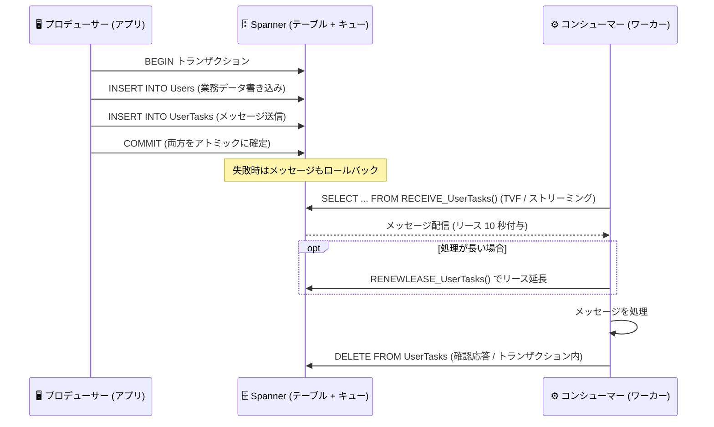

# Spanner: Spanner queues が一般提供 (GA) 開始

**リリース日**: 2026-09-17

**サービス**: Spanner

**機能**: Spanner queues (トランザクショナルメッセージング)

**ステータス**: GA (一般提供)

📊 [このアップデートのインフォグラフィックを見る](https://takech9203.github.io/google-cloud-news-summary/20260917-spanner-queues-ga.html)

## 概要

Spanner queues が一般提供 (GA) となりました。Spanner queues は、非同期処理を管理するためのトランザクショナルメッセージング機能をデータベースに直接組み込むもので、Spanner のスケーラビリティと信頼性を活かしてイベント駆動型アプリケーションを構築できます。

Spanner queues はメッセージ消費に Pull モデルを採用しており、受信側は SQL インターフェース (テーブル値関数) を使ってメッセージをリクエスト・受信します。メッセージの送信 (INSERT / Mutation API) と確認応答 (DELETE / Mutation API) は、他のデータベース書き込みと同一の Spanner トランザクション内でアトミックに実行できます。トランザクションが失敗した場合、エンキューされたメッセージはロールバックされ、配信対象になりません。

なお、この機能は Spanner Enterprise エディションおよび Enterprise Plus エディションで利用できます。

**アップデート前の課題**

- データベースの書き込みと連動した非同期処理を実現するには、Pub/Sub などの外部メッセージングインフラを別途プロビジョニング・管理し、データを外部に送出する必要があった
- データベースのトランザクションとメッセージ送信を厳密にアトミックにすることが難しく、「DB には書き込まれたがメッセージは送信されなかった」といった不整合への対策 (Outbox パターンの自作など) が必要だった
- 将来の特定時刻にタスクを実行するスケジューリングや、キュー内メッセージの SQL による照会には追加の仕組みが必要だった

**アップデート後の改善**

- メッセージングがデータベースに統合され、別のメッセージング基盤の構築・管理・データ送出が不要になり、アプリケーションアーキテクチャの簡素化と全体コストの低減が可能になった
- メッセージの送信・確認応答を他の DB 書き込みと同一トランザクション内でアトミックに実行でき、トランザクション失敗時はメッセージも自動的にロールバックされるようになった
- メッセージは Spanner テーブルと同じプリミティブ上に行として保存されるため、通常のテーブルと同様にクエリ・結合・フィルタリングが可能になった
- `DeliverTime` を指定した将来時刻へのメッセージ配信スケジューリングが可能になった
- Spanner の高可用性を継承し、ゾーン障害・リージョン障害に対して耐障害性を持つメッセージ処理が可能になった

## アーキテクチャ図



プロデューサーは業務データの書き込みとメッセージ送信を同一トランザクションで実行し、コンシューマーは `RECEIVE_` テーブル値関数でメッセージをストリーミング受信して処理後に `DELETE` で確認応答する流れです。

## サービスアップデートの詳細

### 主要機能

1. **トランザクショナルなメッセージ送信・確認応答**
   - メッセージ送信 (`INSERT` DML / Mutation API の `Send`) と確認応答 (`DELETE` DML / Mutation API の `Ack`) をトランザクション内でアトミックに実行
   - トランザクション失敗時はエンキューされたメッセージがロールバックされ、配信されない
   - ACID セマンティクスにより、確認応答は at-most-once (最大 1 回) が保証される

2. **SQL インターフェースによる Pull 型のメッセージ受信**
   - `ExecuteStreamingSQL` API でテーブル値関数 (TVF) `RECEIVE_<QUEUE_NAME>()` を呼び出し、長時間実行クエリとしてメッセージをストリーミング受信
   - メッセージは行として保存され、通常のテーブル同様にクエリ・結合・フィルタリングが可能
   - 配信は at-least-once (少なくとも 1 回) で、リース延長により再配信を抑制可能

3. **将来時刻へのメッセージスケジューリング**
   - `DeliverTime` (PostgreSQL では `deliver_time`) を指定して、将来の特定タイムスタンプにタスク実行を延期可能
   - 無料トライアル期限処理のような「N 日後に実行」といったワークロードを実現

4. **リース管理による長時間処理のサポート**
   - 受信時にデフォルト 10 秒のリースが付与され、`RENEWLEASE_<QUEUE_NAME>()` TVF でリースを延長可能
   - 将来配信と手動リースを組み合わせることで、非常に長い処理時間にも対応

5. **細粒度アクセス制御 (FGAC) との統合**
   - キューはスキーマオブジェクトとして定義され、`GRANT INSERT ON QUEUE` (プロデューサー)、`GRANT EXECUTE ON TABLE FUNCTION RECEIVE_...` (コンシューマー)、`GRANT DELETE ON QUEUE` (確認応答) など、操作単位で権限を分離可能

## 技術仕様

### Spanner queues の主な特性

| 項目 | 詳細 |
|------|------|
| 対応エディション | Enterprise / Enterprise Plus |
| 消費モデル | Pull 型 (TVF `RECEIVE_<QUEUE_NAME>()` によるストリーミング) |
| 配信保証 | At-least-once 配信 / at-most-once 確認応答 |
| デフォルトリース | 10 秒 (`RENEWLEASE_<QUEUE_NAME>()` で延長可能) |
| Payload 型 | GoogleSQL: BYTES / PROTO / JSON / STRING、PostgreSQL: bytea / text / varchar / jsonb |
| 自動生成カラム | `DeliverTime` (GoogleSQL) / `deliver_time` (PostgreSQL) |
| 再試行動作 | 最初の 1 時間はバックオフ付きで再試行、それ以降は 1 時間ごとに再試行 |
| TTL | キューは TTL ポリシーに対応 (未確認応答の古いメッセージのバックログ管理に利用可能) |
| 対応ダイアレクト | GoogleSQL / PostgreSQL |

### Spanner queues と change streams の使い分け

| | Spanner queues | Spanner change streams |
|---|---|---|
| 適した用途 | トランザクショナルなイベント通知、将来スケジュールされた処理、メッセージ単位の確認応答ロジック | 高スループットのデータレプリケーション、下流キャッシュ・インデックスの同期、全変更の監査ログ |
| 主な特性 | 小さなユーザー定義ペイロード、Pull 型の消費、Spanner インスタンスのコンピュートに応じてスケール | 全レコードフラグメントをキャプチャ (最大 10MB)、パーティショントークンによる Pull 型ストリーミング、ハートビートとチェックポイント |

### Cloud Monitoring メトリクス

`spanner.googleapis.com/queue/*` プレフィックスで以下のメトリクスが提供されます (約 60 秒間隔でサンプリング)。

| メトリクス | 種類 | 説明 |
|------|------|------|
| `buffered_ready_messages` | GAUGE | メモリに保持され受信側に配信可能なメッセージ数 |
| `message_send_count` | DELTA | 期間内に送信されたメッセージ数 |
| `message_ack_count` | DELTA | 期間内に確認応答されたメッセージ数 |
| `oldest_unacked_message_age` | GAUGE | 最も古い未確認応答メッセージの経過時間 (秒) |
| `lease_expiration_count` | DELTA | 期間内のリース失効数 |

## 設定方法

### 前提条件

1. Spanner Enterprise エディションまたは Enterprise Plus エディションのインスタンス
2. GoogleSQL または PostgreSQL ダイアレクトのデータベース

### 手順

#### ステップ 1: キューを作成する (DDL)

```sql
-- インターリーブ用のテーブル例
CREATE TABLE Users (
  UserId INT64 NOT NULL,
  UserName STRING(MAX)
) PRIMARY KEY (UserId);

-- ユーザー関連タスクを処理するキュー
-- キューのインターリーブは必須ではないが、テーブルとキューに同時挿入する場合は
-- ローカリティとプリウォーミングの観点で推奨
CREATE QUEUE UserTasks (
  UserId INT64 NOT NULL,
  MessageId STRING(36) NOT NULL,  -- UUID 推奨
  Payload BYTES(MAX) NOT NULL     -- Proto / JSON / String も可
) PRIMARY KEY (UserId, MessageId),
  INTERLEAVE IN PARENT Users ON DELETE CASCADE;
```

`CREATE QUEUE` 文でキューを定義します。`Payload` カラムと主キーが必須で、`DeliverTime` カラムは Spanner が自動的に作成します。

#### ステップ 2: メッセージを送信する (プロデューサー)

```sql
-- 即時配信のメッセージ送信 (業務データの書き込みと同一トランザクションで実行可能)
INSERT INTO Users (UserId) VALUES (123);
INSERT INTO UserTasks (UserId, MessageId, Payload, DeliverTime)
VALUES (123, 'some-unique-id-1', b'Your task payload here', CURRENT_TIMESTAMP());

-- 将来時刻へのスケジュール配信 (1 時間後)
INSERT INTO UserTasks (UserId, MessageId, Payload, DeliverTime)
VALUES (123, 'some-unique-id-2', b'Scheduled task',
        TIMESTAMP_ADD(CURRENT_TIMESTAMP(), INTERVAL 1 HOUR));
```

クライアントライブラリの `Send` ミューテーション (Go / Java など) でも送信できます。

#### ステップ 3: メッセージを受信・処理・確認応答する (コンシューマー)

```sql
-- 1. 受信プロセスでキューからメッセージをストリーミング受信
SELECT UserId, MessageId, Payload, DeliverTime,
       SpannerLeaseExpirationTimestamp, SpannerLeaseToken
FROM RECEIVE_UserTasks(max_duration=>'20m');

-- 2. 処理完了後、メッセージを確認応答 (削除)
DELETE FROM UserTasks
WHERE UserId = 123 AND MessageId = 'some-unique-id-1';
```

処理がデフォルトリース (10 秒) を超える場合は、`SELECT * FROM RENEWLEASE_UserTasks([leaseToken])` を定期的に呼び出してリースを延長します。

#### ステップ 4: (任意) 細粒度アクセス制御を設定する

```sql
-- プロデューサーロール: 送信権限のみ
CREATE ROLE queue_producer;
GRANT INSERT ON QUEUE UserTasks TO ROLE queue_producer;

-- コンシューマーロール: 受信・リース延長・確認応答権限
CREATE ROLE queue_consumer;
GRANT EXECUTE ON TABLE FUNCTION RECEIVE_UserTasks TO ROLE queue_consumer;
GRANT EXECUTE ON TABLE FUNCTION RENEWLEASE_UserTasks TO ROLE queue_consumer;
GRANT DELETE ON QUEUE UserTasks TO ROLE queue_consumer;
```

## メリット

### ビジネス面

- **インフラコストと運用負荷の削減**: メッセージング基盤がデータベースに統合されるため、別のメッセージングインフラのプロビジョニング・管理・データ送出が不要になり、アーキテクチャの簡素化と全体コストの低減につながる
- **データ整合性リスクの低減**: DB 書き込みとメッセージ送信の不整合 (書き込み成功・通知失敗など) がトランザクションレベルで排除され、注文処理や課金処理などミッションクリティカルな非同期ワークフローの信頼性が向上する

### 技術面

- **アトミック性**: メッセージ送信・確認応答が他の DB 書き込みと同一トランザクションで実行され、失敗時は自動ロールバック
- **クエリ可能**: メッセージは行として保存され、標準テーブルと同様にクエリ・結合・フィルタが可能
- **スケーラビリティと可用性**: Spanner テーブルと同じスケーラビリティで動作し、ゾーン・リージョン障害に耐性を持つ
- **スケジューラビリティ**: 将来時刻を指定したメッセージ配信により、遅延タスク実行を追加コンポーネントなしで実現

## デメリット・制約事項

### 制限事項

- Spanner Enterprise エディションおよび Enterprise Plus エディションでのみ利用可能
- 配信保証は at-least-once であり、重複配信が発生し得る (リース延長で緩和可能だが、処理側の冪等性設計が必要)
- デフォルトのメッセージリースは 10 秒で、それを超える処理ではリース延長 (`RENEWLEASE_`) または将来配信への再エンキューが必要

### 考慮すべき点

- **ペイロードサイズ**: メッセージペイロードは 4 KB 未満の小さなサイズが推奨。大きなデータは out-of-band ストレージパターン (実データを別に保存しキューには参照を格納) を使用する
- **再試行と DLQ 相当の設計**: 処理に失敗したメッセージは最初の 1 時間はバックオフ付きで再試行され、その後は 1 時間ごとに再試行される。恒久的に失敗するメッセージは別のキューへ移動する設計を検討する
- **TVF の実行時間**: `RECEIVE_` TVF の実行時間は極端に短くも長くもせず、20 分程度の中程度の値が推奨
- **バッチサイズ**: 高ファンアウトのイベントでは小さいバッチでロック競合を回避し、独立した高 QPS タスクでは大きいバッチを使用する。バッチの確認応答・リース延長は単一トランザクションで行うと性能が良い
- **高スループットレプリケーション用途には不向き**: 全変更のキャプチャや下流システムへの大量データ同期には change streams が適している

## ユースケース

### ユースケース 1: トランザクションコミット後の外部システム連携 (ウェルカムメール送信)

**シナリオ**: ユーザー登録が DB 上で成功した場合のみ、外部メール API でウェルカムメールを送信したい。

**実装例**:
```sql
-- アプリケーションのトランザクション内:
-- 1. Users テーブルへ挿入
INSERT INTO Users (UserId, UserName) VALUES (124, 'New User');
-- 2. メール送信をトリガーするメッセージをキューへ送信
INSERT INTO UserTasks (UserId, MessageId, Payload)
VALUES (124, 'welcome-email-id',
        b'{"type": "welcome", "email": "user@example.com"}');
```

**効果**: 登録トランザクションが成功した場合のみメッセージが配信され、ワーカーが後から外部メール API を呼び出す。登録失敗時はメッセージもロールバックされるため、不整合な通知が発生しない。

### ユースケース 2: 将来時刻のタスクスケジューリング (無料トライアル期限処理)

**シナリオ**: SaaS 企業が 30 日間の無料トライアルを提供する。ユーザーのリソースをプロビジョニングすると同時に、30 日後に配信されるメッセージをキューに登録する。

**効果**: ワーカーが 30 日後にメッセージを受信してトライアル期限切れロジックを実行できる。外部のスケジューラーやバッチジョブが不要になる。

### ユースケース 3: マルチステップパイプラインのオーケストレーション (注文管理)

**シナリオ**: 注文のフルフィルメントは独立して失敗し得る複数ステップで構成される。各ステップをキューメッセージとして表現する。

**効果**: パイプラインの状態をチェックポイントし、障害発生時にはその地点から処理を再開できる。

## 料金

Spanner queues は Spanner Enterprise エディションおよび Enterprise Plus エディションで利用可能な機能で、メッセージ処理は Spanner インスタンスのコンピュートに応じてスケールします。Spanner の料金体系 (コンピュート容量、ストレージなど) の詳細は料金ページを参照してください。

- [Spanner 料金ページ](https://cloud.google.com/spanner/pricing)
- [Spanner エディションの概要](https://docs.cloud.google.com/spanner/docs/editions-overview)

## 関連サービス・機能

- **Spanner change streams**: 全データ変更のキャプチャと高スループットのデータレプリケーションに適した補完機能。トランザクショナルなイベント通知やメッセージ単位の確認応答が必要な場合は queues、下流キャッシュ同期や監査ログには change streams を選択する
- **Cloud Monitoring**: `spanner.googleapis.com/queue/*` メトリクスでキューの深さや最古の未確認応答メッセージの経過時間を監視
- **Spanner 細粒度アクセス制御 (FGAC)**: キューに対する送信・受信・確認応答の権限をデータベースロール単位で分離
- **Spanner TTL**: キューの TTL ポリシーにより、古い未確認応答メッセージのバックログを管理
- **Pub/Sub**: 汎用的なメッセージングサービス。Spanner queues は Spanner トランザクションとの統合が必要なワークロードに特化した選択肢となる

## 参考リンク

- 📊 [インフォグラフィック](https://takech9203.github.io/google-cloud-news-summary/20260917-spanner-queues-ga.html)
- [公式リリースノート](https://docs.cloud.google.com/release-notes#September_17_2026)
- [Spanner queues の概要](https://docs.cloud.google.com/spanner/docs/queues/queues-overview)
- [Spanner queues の使用方法](https://docs.cloud.google.com/spanner/docs/queues/queues-using)
- [Spanner queues のパターンとコード例](https://docs.cloud.google.com/spanner/docs/queues/queues-examples)
- [Exactly-once 処理と at-most-once 確認応答](https://docs.cloud.google.com/spanner/docs/queues/queues-at-most-once)
- [Spanner queues の細粒度アクセス制御](https://docs.cloud.google.com/spanner/docs/fgac-queues)
- [料金ページ](https://cloud.google.com/spanner/pricing)

## まとめ

Spanner queues の GA により、Spanner ユーザーは外部メッセージング基盤を追加することなく、データベーストランザクションと完全に整合した非同期メッセージングをイベント駆動型アプリケーションに組み込めるようになりました。Outbox パターンの自作や Pub/Sub との整合性調整に課題を感じていたチームは、Enterprise / Enterprise Plus エディションでの本機能の採用を検討し、まずは概要ドキュメントで change streams との使い分けを確認することを推奨します。

---

**タグ**: #Spanner #Queues #GA #トランザクショナルメッセージング #イベント駆動 #非同期処理 #EnterpriseEdition
