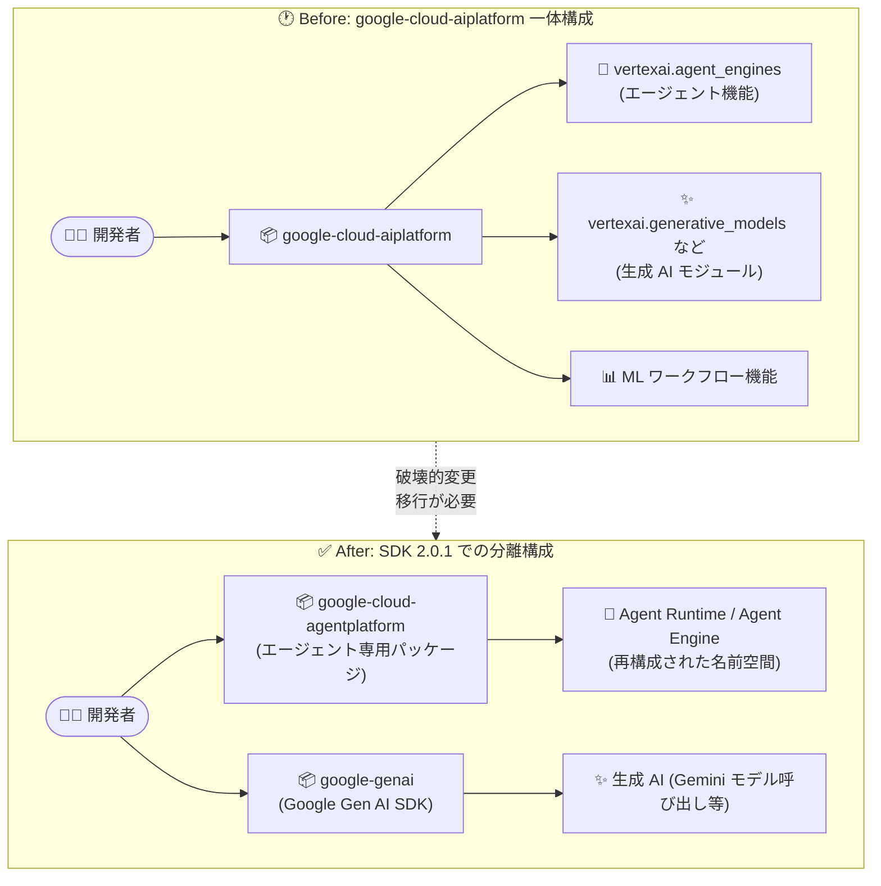

# Gemini Enterprise Agent Platform: Agent Platform SDK for Python 2.0.1 リリース (破壊的変更)

**リリース日**: 2026-09-18

**サービス**: Gemini Enterprise Agent Platform

**機能**: Agent Platform SDK for Python version 2.0.1 (`google-cloud-agentplatform`)

**ステータス**: Breaking (破壊的変更)

📊 [このアップデートのインフォグラフィックを見る](https://takech9203.github.io/google-cloud-news-summary/20260918-agent-platform-sdk-python-2-0-1.html)

## 概要

Agent Platform SDK for Python のバージョン 2.0.1 (`google-cloud-agentplatform`) がリリースされました。このリリースは 3 つの大きな変更を含む**破壊的変更 (Breaking Change)** です。(1) 生成 AI モジュールの Google Gen AI SDK (`google-genai`) への移行、(2) エージェント関連のサーフェスを `google-cloud-aiplatform` から専用パッケージ `google-cloud-agentplatform` へ分離、(3) 名前空間の再構成です。

これまで Agent Platform SDK for Python は `google-cloud-aiplatform` パッケージの一部として提供され、エージェント機能 (Agent Engine / Agent Runtime)、生成 AI モジュール、ML ワークフロー機能が 1 つのパッケージに同居していました。今回の 2.0.1 リリースにより、エージェント開発のサーフェスが独立したパッケージとして切り出され、生成 AI 機能は Google Gen AI SDK に一本化されます。

影響を受けるのは、`google-cloud-aiplatform` パッケージ経由でエージェント系モジュール (`vertexai.agent_engines` など) や生成 AI モジュール (`vertexai.generative_models` など) を利用しているすべての Python 開発者です。既存コードは名前空間の再構成に合わせた移行が必要であり、`google-cloud-aiplatform` からの移行手順は公式の Agent Platform SDK for Python version 2.0.1 移行ガイドで案内されています。

**アップデート前の課題**

- エージェント機能 (Agent Engine / Agent Runtime) を使うには、ML トレーニングや予測など多数の機能を含む大きな `google-cloud-aiplatform` パッケージ全体をインストールする必要があった
- 生成 AI モジュール (`vertexai.generative_models`、`vertexai.language_models`、`vertexai.caching`、`vertexai.tuning` など) は Vertex AI SDK 内で非推奨となっており、2026 年 6 月 24 日以降の SDK リリースには含まれないことが告知されていた
- モジュールレベルの `vertexai.init()` + `agent_engines.create()` という旧設計では、マルチプロジェクト・マルチリージョン構成でプロジェクトやロケーションをクライアント単位でスコープできなかった
- ADK (Agent Development Kit) や Google Gen AI SDK と型表現が統一されておらず、SDK 間の相互運用時に変換のオーバーヘッドがあった

**アップデート後の改善**

- エージェントサーフェスが専用パッケージ `google-cloud-agentplatform` として分離され、エージェント開発に必要な依存関係が明確になった
- 生成 AI モジュールが Google Gen AI SDK (`google-genai`) に移行し、生成 AI の開発体験が単一 SDK に統一された
- 名前空間が再構成され、クライアントベース設計 (`client.agent_engines.*`、`client.agent_engines.memories.*`、`client.agent_engines.sessions.*` など) により Agent Runtime サービスの発見性と一貫性が向上した
- ADK・Google Gen AI SDK と正規の型表現が揃い、SDK 間の相互運用が簡素化された

## アーキテクチャ図



従来 `google-cloud-aiplatform` に同居していたエージェントサーフェスが専用パッケージ `google-cloud-agentplatform` に分離され、生成 AI モジュールは Google Gen AI SDK (`google-genai`) に移行しました。

## サービスアップデートの詳細

### 主要機能

1. **エージェントサーフェスの専用パッケージ化 (`google-cloud-agentplatform`)**
   - これまで `google-cloud-aiplatform` パッケージに含まれていたエージェント関連機能が、専用パッケージとして独立
   - エージェント開発・デプロイに必要な依存関係が明確になり、パッケージの見通しが向上

2. **生成 AI モジュールの Google Gen AI SDK への移行**
   - `vertexai.generative_models`、`vertexai.language_models`、`vertexai.vision_models`、`vertexai.caching`、`vertexai.tuning` などの生成 AI モジュールは Google Gen AI SDK (`google-genai`) に置き換え
   - Vertex AI SDK の生成 AI モジュールは非推奨であり、2026 年 6 月 24 日以降のリリースには含まれない。Google Gen AI SDK は非推奨モジュールと完全な機能パリティを持ち、追加機能もサポート

3. **名前空間の再構成 (クライアントベース設計)**
   - モジュールレベルの関数呼び出しから、クライアントオブジェクト経由の呼び出しへ移行
   - `vertexai.agent_engines.create/get/list/update/delete` → `client.agent_engines.create/get/list/update/delete`
   - Memory Bank・Session 関連はサブリソース化: `client.agent_engines.create_memory` → `client.agent_engines.memories.create`、`client.agent_engines.create_session` → `client.agent_engines.sessions.create` など
   - 再構成の目的: ADK・Google Gen AI SDK との正規型表現の統一、マルチプロジェクト・マルチロケーション対応のクライアントレベルスコープ、Agent Runtime サービスの発見性向上

## 技術仕様

### パッケージ構成の変更点

| 項目 | 変更前 | 変更後 (2.0.1) |
|------|--------|----------------|
| エージェント機能のパッケージ | `google-cloud-aiplatform` (一体型) | `google-cloud-agentplatform` (専用パッケージ) |
| 生成 AI モジュール | `vertexai.generative_models` 等 (`google-cloud-aiplatform` 内) | Google Gen AI SDK (`google-genai`) |
| Agent Engine 操作 | `vertexai.agent_engines.create(...)` (モジュールレベル) | `client.agent_engines.create(...)` (クライアントベース) |
| Memory / Session 操作 | `client.agent_engines.create_memory` 等のフラットなメソッド | `client.agent_engines.memories.create` / `client.agent_engines.sessions.create` 等のサブリソース構造 |
| プロジェクト / ロケーション指定 | `vertexai.init(project=..., location=...)` によるグローバル設定 | クライアントインスタンスごとの設定 (マルチプロジェクト対応) |

### 名前空間の対応表 (Agent Runtime)

| 旧名前空間 (非推奨) | 新名前空間 (クライアントベース) |
|---------------------|--------------------------------|
| `vertexai.agent_engines.create` | `client.agent_engines.create` |
| `vertexai.agent_engines.get` | `client.agent_engines.get` |
| `vertexai.agent_engines.list` | `client.agent_engines.list` |
| `vertexai.agent_engines.update` | `client.agent_engines.update` |
| `vertexai.agent_engines.delete` | `client.agent_engines.delete` |
| `client.agent_engines.create_memory` ほか Memory 系 | `client.agent_engines.memories.create` ほか |
| `client.agent_engines.create_session` ほか Session 系 | `client.agent_engines.sessions.create` ほか |
| `client.agent_engines.append_session_event` ほか Event 系 | `client.agent_engines.sessions.events.append` ほか |

## 設定方法

### 前提条件

1. 現在 `google-cloud-aiplatform` 経由でエージェント系モジュール (`vertexai.agent_engines` など) または生成 AI モジュール (`vertexai.generative_models` など) を利用していること
2. 移行前に公式の Agent Platform SDK for Python version 2.0.1 移行ガイドを確認すること

### 手順 (移行の概要)

#### ステップ 1: 依存パッケージの入れ替え

```bash
# エージェント機能: 専用パッケージをインストール
pip install google-cloud-agentplatform

# 生成 AI 機能: Google Gen AI SDK をインストール
pip install -U -q "google-genai"
```

エージェントサーフェスは `google-cloud-agentplatform`、生成 AI 機能は `google-genai` に依存を分離します。

#### ステップ 2: 生成 AI コードを Google Gen AI SDK に移行

```python
# Before (Vertex AI SDK の生成 AI モジュール)
import vertexai
from vertexai.generative_models import GenerativeModel

vertexai.init(project=PROJECT, location=LOCATION)
model = GenerativeModel("gemini-2.5-flash")
response = model.generate_content("Why is the sky blue?")

# After (Google Gen AI SDK)
from google import genai

client = genai.Client()
response = client.models.generate_content(
    model="gemini-2.5-flash",
    contents="Why is the sky blue?",
)
print(response.text)
```

`vertexai.generative_models` などの非推奨モジュールを `google-genai` のクライアントベース API に置き換えます。

#### ステップ 3: エージェントコードをクライアントベース設計に移行

```python
# Before (モジュールレベルの旧設計)
import vertexai
from vertexai import agent_engines

vertexai.init(project=PROJECT, location=LOCATION, staging_bucket=STAGING_BUCKET)
agent_engines.create(local_agent, requirements=REQUIREMENTS)

# After (クライアントベース設計)
import vertexai

client = vertexai.Client(project=PROJECT, location=LOCATION)
client.agent_engines.create(
    agent=local_agent,
    config={
        "staging_bucket": STAGING_BUCKET,
        "requirements": REQUIREMENTS,
    },
)
```

`vertexai.init()` によるグローバル初期化から、クライアントインスタンス単位のスコープ設定に移行します。Memory / Session 系のメソッドはサブリソース構造 (`memories.*` / `sessions.*`) への書き換えが必要です。

## メリット

### ビジネス面

- **保守性の向上**: エージェント開発の依存関係が専用パッケージに整理され、アプリケーションの依存管理・アップグレード戦略が立てやすくなる
- **将来への備え**: Vertex AI SDK の生成 AI モジュールは 2026 年 6 月 24 日以降のリリースに含まれないため、Google Gen AI SDK への移行はサポート継続の観点で必須

### 技術面

- **マルチプロジェクト / マルチロケーション対応**: クライアントレベルで project / location をスコープできるため、複数の Google Cloud プロジェクトやリージョンにまたがるアプリケーションを 1 プロセス内で扱える
- **SDK 間の一貫性**: ADK (Agent Development Kit) や Google Gen AI SDK と正規の型表現が統一され、変換オーバーヘッドが削減される
- **API の発見性向上**: `client.agent_engines.memories.*` / `client.agent_engines.sessions.*` のようなサブリソース構造により、Agent Runtime サービスの機能が体系的に整理される

## デメリット・制約事項

### 制限事項

- **破壊的変更**: 旧名前空間 (`vertexai.agent_engines` のモジュールレベル呼び出し、フラットな Memory / Session メソッド) を使用している既存コードはそのままでは動作せず、コードの書き換えが必要
- Vertex AI SDK の生成 AI モジュール (`vertexai.generative_models` 等) は非推奨であり、2026 年 6 月 24 日以降の SDK リリースには含まれない

### 考慮すべき点

- CI/CD パイプラインや requirements.txt / pyproject.toml の依存定義を `google-cloud-agentplatform` および `google-genai` に更新する必要がある
- `create` / `update` の引数構造が変わっている (例: `staging_bucket` や `requirements` が `config` 辞書に集約) ため、単純なメソッド名の置換だけでは移行できない
- 移行の詳細は公式の Agent Platform SDK for Python version 2.0.1 移行ガイドを必ず参照すること

## ユースケース

### ユースケース 1: 既存 Agent Engine デプロイコードの移行

**シナリオ**: `google-cloud-aiplatform` の `vertexai.agent_engines` を使って ADK エージェントを Agent Runtime にデプロイしている開発チームが、SDK 2.0.1 に移行する。

**実装例**:
```python
import vertexai

client = vertexai.Client(project="my-project", location="us-central1")
client.agent_engines.create(
    agent=local_agent,
    config={
        "staging_bucket": "gs://my-staging-bucket",
        "requirements": ["google-cloud-agentplatform"],
    },
)
```

**効果**: サポートが継続される新パッケージ上でエージェント運用を継続でき、クライアント単位のスコープにより複数環境 (開発 / 本番プロジェクト) への展開コードも簡潔になる。

### ユースケース 2: 生成 AI コードベースの Google Gen AI SDK への統一

**シナリオ**: エージェントアプリケーション内で `vertexai.generative_models` による Gemini 呼び出しと Agent Engine の両方を利用しており、非推奨期限 (2026 年 6 月 24 日以降のリリースに非搭載) を見据えて生成 AI コードを刷新する。

**効果**: 生成 AI の呼び出しが `google-genai` に一本化され、ADK・Agent Platform SDK と型表現が揃うことで、コードの一貫性と長期的な保守性が向上する。

## 料金

SDK 自体の利用に追加料金は発生しません。デプロイ先である Agent Runtime (Agent Engine) や Gemini モデル呼び出しには、それぞれのサービスの料金が適用されます。詳細は料金ページを参照してください。

- [Gemini Enterprise Agent Platform の料金](https://cloud.google.com/vertex-ai/pricing)

## 関連サービス・機能

- **Google Gen AI SDK (`google-genai`)**: 生成 AI モジュールの移行先。Gemini モデル呼び出し、コンテキストキャッシュ、チューニングなどを単一 SDK で提供
- **Agent Development Kit (ADK)**: エージェント構築フレームワーク。今回の名前空間再構成は ADK・Gen AI SDK との正規型表現の統一が目的の 1 つ
- **Agent Runtime (Agent Engine)**: `client.agent_engines.*` でデプロイ・管理するエージェントのマネージドランタイム。Memory Bank・Session 管理も同クライアントから操作
- **Gemini Enterprise**: Agent Platform で構築したエージェントの提供先となるエンタープライズ向けプラットフォーム

## 参考リンク

- 📊 [インフォグラフィック](https://takech9203.github.io/google-cloud-news-summary/20260918-agent-platform-sdk-python-2-0-1.html)
- [公式リリースノート](https://docs.cloud.google.com/release-notes#September_18_2026)
- [Agent Runtime SDK migration (クライアントベース設計への移行ガイド)](https://docs.cloud.google.com/gemini-enterprise-agent-platform/build/runtime/sdk-migration)
- [Vertex AI SDK 生成 AI モジュールの非推奨と Google Gen AI SDK への移行](https://docs.cloud.google.com/vertex-ai/generative-ai/docs/deprecations/genai-vertexai-sdk)
- [Agent Runtime の概要](https://docs.cloud.google.com/gemini-enterprise-agent-platform/build/runtime)
- [Agent Platform SDK for Python GitHub リポジトリ](https://github.com/googleapis/python-aiplatform/)

## まとめ

Agent Platform SDK for Python 2.0.1 は、エージェントサーフェスの専用パッケージ化 (`google-cloud-agentplatform`)、生成 AI モジュールの Google Gen AI SDK への移行、名前空間の再構成を伴う破壊的変更です。`google-cloud-aiplatform` のエージェント系・生成 AI 系モジュールを利用しているチームは、旧生成 AI モジュールが 2026 年 6 月 24 日以降のリリースに含まれない点も踏まえ、公式移行ガイドに沿って依存パッケージとコードの計画的な移行を早期に進めることを推奨します。

---

**タグ**: Gemini Enterprise Agent Platform, Agent Platform SDK, Python, google-cloud-agentplatform, Google Gen AI SDK, Breaking Change, Migration, Agent Engine, Agent Runtime
