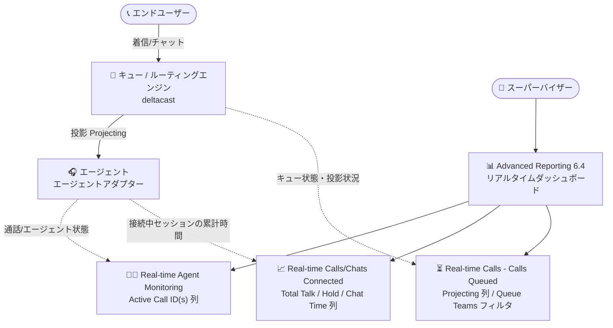

# Google Cloud Contact Center as a Service (CCaaS): 6.13 正式リリースと Advanced reporting dashboards 6.4

**リリース日**: 2026-09-18

**サービス**: Google Cloud Contact Center as a Service (CCaaS)

**機能**: バージョン 6.13 正式リリース (約 36 件の既知の問題を修正) / Advanced reporting dashboards 6.4 (新機能 + 修正)

**ステータス**: Announcement / Feature / Fixed

📊 [このアップデートのインフォグラフィックを見る](https://takech9203.github.io/google-cloud-news-summary/20260918-ccaas-6-13-advanced-reporting-6-4.html)

## 概要

Google Cloud CCaaS のバージョン **6.13 が正式リリース** されました。2026-09-16 に公開されたプレリリースノート ([解説レポート](./2026-09-16-ccaas-6-13-prerelease.md)) の内容が、そのまま正式版として提供されます。6.13 は新機能の追加ではなく、通話ルーティング・キュー制御、レポーティング、エージェントデスクトップ、Salesforce / Kustomer などの CRM 統合、Web SDK のアクセシビリティにまたがる約 36 件の既知の問題の修正で構成されています。実際にインスタンスへ適用されるタイミングは、各組織が選択しているデプロイメントスケジュール (Rapid / Regular / Critical) に依存します。

同日、**Advanced reporting dashboards 6.4** もリリースされました。こちらは新機能を含むアップデートで、Real-time Agent Monitoring ダッシュボードへの「Active Call ID(s)」列の追加、チームフィルタリングの改善 (「Teams」→「Agent Teams」への改名と「Queue Teams」フィルタの追加)、Connected Calls / Connected Chats テーブルへの累計時間列の追加、Calls Queued ダッシュボードの「Projecting」列、そしてすべての advanced reporting ダッシュボードと Explore のフランス語 (カナダ) 対応が含まれます。スーパーバイザーによるリアルタイムモニタリングの効率と、多言語環境・カナダ市場での利用性が向上する内容です。

対象ユーザーは CCaaS を運用するすべての組織、特にリアルタイムダッシュボードでオペレーションを監視するスーパーバイザー・コンタクトセンター管理者です。

**アップデート前の課題**

- スーパーバイザーがライブモニタリング中にエージェントのアクティブな通話を特定するには、複数のステップを要していた
- 「Teams」フィルタがエージェント側のチームを指すのかキュー側のチームを指すのか分かりにくく、キューに割り当てられたチームでキュー内インタラクションを絞り込むフィルタもなかった
- Connected Calls / Connected Chats テーブルに接続後の累計時間 (通話時間・保留時間・チャット時間) を示す列がなく、長時間化しているセッションを把握しにくかった
- キュー内の通話がルーティングエンジンによってエージェントに投影 (projecting) されているかどうかをダッシュボード上で確認できなかった
- Advanced reporting ダッシュボードと Explore はフランス語 (カナダ) に対応していなかった
- CCaaS 本体には、通話終了後もエージェントが「通話中」扱いになる問題やコールスパイク時のキャパシティ制限バイパス、レポートからの通話欠落など多数の既知の問題が存在していた (詳細は [プレリリースノートのレポート](./2026-09-16-ccaas-6-13-prerelease.md) を参照)

**アップデート後の改善**

- Live Agent Data テーブルの「Active Call ID(s)」列により、接続中 (connecting)・接続済み (connected)・再接続中 (reconnecting) の通話 ID を一目で特定できるようになった (複数同時通話はカンマ区切りで表示)
- フィルタ名が「Agent Teams」に明確化され、Real-time Queued - Calls/Chats ダッシュボードに「Queue Teams」フィルタが追加された
- Connected Calls テーブルに Total Consumer Talk Time / Total Hold Time 列、Connected Chats テーブルに Total Consumer Chat Time 列が追加された
- Calls Queued テーブルの「Projecting」列で、ルーティングエンジン (deltacast) がキュー内通話を利用可能なエージェントに投影中かどうかを確認できるようになった
- すべての advanced reporting ダッシュボードと Explore がフランス語 (カナダ) で利用可能になった
- CCaaS 6.13 の正式リリースにより、プレリリースノートに記載されていた約 36 件の既知の問題の修正が (デプロイスケジュールに沿って) 各インスタンスに展開される

## アーキテクチャ図

スーパーバイザーは Advanced reporting のリアルタイムダッシュボード群を通じて、エージェントのアクティブな通話 ID、接続中セッションの累計時間、キュー内通話の投影状況を一元的に可視化できるようになります。

## サービスアップデートの詳細

### 1. Google Cloud CCaaS 6.13 正式リリース

バージョン 6.13 がリリースされました。インスタンスへの適用時期は、選択しているデプロイメントスケジュールに依存します。

- **Rapid**: 最も早く更新を受け取る (開発・テスト環境向け)
- **Regular**: Rapid の少なくとも 2 日後に更新
- **Critical**: ピーク営業時間外に更新。Rapid の少なくとも 2 日後に開始され、通常 1 週間以内に完了 (本番環境向けに推奨)

6.13 は約 36 件の既知の問題の修正で構成されており、内容は 2026-09-16 のプレリリースノートと同一です。主な修正のカテゴリは以下のとおりです (各修正の詳細は [プレリリースノートのレポート](./2026-09-16-ccaas-6-13-prerelease.md) を参照)。

| カテゴリ | 主な修正 |
|---------|---------|
| エージェント状態管理 | 通話終了後もエージェントが「通話中」扱いになり、Available への変更や新規コールの着信が妨げられる問題 / エージェント間転送の不応答時に状態が残留する問題 / エージェントアダプターがブランク化し新規コールが届かなくなる問題 |
| キュー・ルーティング | コールスパイク時にキャパシティ制限がバイパスされる問題 / ミスドオファーの通話がキュー内にスタックする問題 (multicast フォールバック無効時) / エージェント優先度オーバーライドのルーティング不良 |
| レポーティング | All Call History / Voice Inbound (IVR) History からのデフレクト通話・ボイスメール前切断通話の欠落 / Agent Activity Timeline の誤記録 / EventFlow まわりの重複「chat finished」イベント・「応答済み」と「放棄」の二重報告 |
| Salesforce 統合 | click-to-dial の誤ったケース関連付け・所有権再割り当て / 重複アカウント作成 / OAuth Refresh Token Rotation 強制組織での CRM 接続断 |
| Web SDK・その他 | プレチャット・チャット画面の WAI-ARIA キーボードナビゲーション対応 / スクリーンリーダー対応 / Kustomer の発信者情報非表示 / メールアカウントの再接続不能 / Agent Assist の誤検知アラート |

### 2. Advanced reporting dashboards 6.4 (新機能)

#### Real-time Agent Monitoring ダッシュボード: Active Call ID(s) 列

- Live Agent Data テーブルに **Active Call ID(s)** 列が追加された
- エージェントの接続中 (connecting)・接続済み (connected)・再接続中 (reconnecting) 状態にある通話の ID を表示する
- エージェントが複数の通話を同時に処理している場合、通話 ID はカンマ区切りのリストで表示される
- スーパーバイザーがライブモニタリング中にアクティブな通話を特定するためのステップ数が削減される

#### チームフィルタリングの改善

- **「Teams」フィルタを「Agent Teams」に改名**: インタラクションを処理しているエージェントのチームでフィルタすることを明確化。対象は Real-time Queue Monitoring - Calls/Chats、Real-time Connected - Calls/Chats ダッシュボード
- **「Queue Teams」フィルタを追加**: Real-time Queued - Calls および Real-time Queued - Chats ダッシュボードで、キューに割り当てられたチームによりキュー内インタラクションをフィルタできるようになった

#### Real-time Calls / Chats ダッシュボードの改善

- **Real-time Calls - Calls Connected ダッシュボード**: Connected Calls テーブルに以下の列を追加
  - **Total Consumer Talk Time**: 通話が最初に仮想エージェントまたは人間のエージェントに接続してからの累計時間
  - **Total Hold Time**: 現在進行中の保留も含む、これまでの累計保留時間
- **Real-time Chats - Chats Connected ダッシュボード**: Connected Chats テーブルに以下の列を追加
  - **Total Consumer Chat Time**: チャットが最初に仮想エージェントまたは人間のエージェントに接続してからの累計時間

#### Real-time Calls - Calls Queued ダッシュボード: Projecting 列

- Call Queued テーブルに新しい **Projecting** 列が追加された
- ルーティングエンジン (deltacast) がキュー内の通話を利用可能なエージェントに投影中かどうかを示す

#### フランス語 (カナダ) 対応

- すべての advanced reporting ダッシュボードと Explore がフランス語 (カナダ) で利用可能になった
- CCAI Platform ポータルのプロファイル言語としてフランス語 (カナダ) を選択すると、その言語で表示される
- 管理者向けに、ポータルの **Admin > Change Language** に新しい **Français (CAN)** オプションが追加された

#### ダッシュボード関連の不具合修正

- タイル間で数値フォーマットが不整合になる問題を修正
- 言語切替後に列ヘッダー・フィルタラベル・タイルタイトルが即座に切り替わらない問題を修正
- Queue Group Performance - All ダッシュボードの Productive Agents 列がキューグループ設定に応じた値を表示しない問題を修正
- Call Queue Metrics (Historical) Explore で、Agent Name を表示列に含めずにフィルタすると 0 行が返る問題を修正
- Custom After Hours Deflection でメッセージへデフレクトされたサブメニュー宛の通話が、All Queued Interactions レポートで親メニューに誤って帰属される問題を修正
- Agent Performance、Real-time Agent Monitoring、All Interactions - Calls/Chats ダッシュボードにおける Direction フィルタの有効性を修正
- Queue Performance - Calls ダッシュボードで、期間内にショートアバンダンが存在する場合に Queue Summary テーブルの **Avg Queue Time** 列が真の平均ではなくキュー滞在時間の合計を表示する問題を修正
- Individual Call History Report / Individual Chat History Report の生成時にチームフィルタが正しく適用されず、管理外キューのデータが含まれる問題を修正
- 複数のダッシュボード指標・ラベルのフランス語 (カナダ) 翻訳が不正確・不完全・欠落していた問題を修正
- Real-time Calls - Calls Queued ダッシュボードで、自動応答検出ミス後にキューへ戻された発信者が Total Queued Now に含まれない問題、Current Max/Avg Queue Wait Time がキューへの最初の投入時点から誤って計測される問題を修正
- ダッシュボード下部にグレーのバーが表示され、全体を表示できない問題を修正

## 技術仕様

### Advanced reporting dashboards 6.4 の変更点サマリー

| ダッシュボード / 対象 | 変更内容 |
|------|------|
| Real-time Agent Monitoring (Live Agent Data テーブル) | Active Call ID(s) 列を追加 (connecting / connected / reconnecting の通話 ID、複数はカンマ区切り) |
| Real-time Queue Monitoring - Calls/Chats、Real-time Connected - Calls/Chats | Teams フィルタを Agent Teams に改名 |
| Real-time Queued - Calls/Chats | Queue Teams フィルタを追加 |
| Real-time Calls - Calls Connected (Connected Calls テーブル) | Total Consumer Talk Time、Total Hold Time 列を追加 |
| Real-time Chats - Chats Connected (Connected Chats テーブル) | Total Consumer Chat Time 列を追加 |
| Real-time Calls - Calls Queued (Call Queued テーブル) | Projecting 列を追加 (ルーティングエンジン deltacast による投影状況) |
| 全ダッシュボード・Explore | フランス語 (カナダ) 対応 |

### リアルタイムダッシュボードの基本仕様

| 項目 | 詳細 |
|------|------|
| アクセス方法 | CCAI Platform ポータル > Dashboard > Advanced Reporting |
| リフレッシュ間隔 | リアルタイムダッシュボードはデフォルトで 60 秒ごとに更新 |
| Agent Monitoring の主なフィルタ | Agent Name / Email / ID、Role、Teams、Location、Status、Channel、Direction など |
| 言語設定 | プロファイル言語で表示言語を変更。管理者は Admin > Change Language (Français (CAN) が追加) |

## 設定方法

### 前提条件

1. CCAI Platform (Google Cloud CCaaS) インスタンスが稼働しており、advanced reporting ダッシュボードにアクセスできること
2. CCaaS 6.13 の修正内容の適用は、インスタンスのデプロイメントスケジュール (Rapid / Regular / Critical) に沿って自動的に行われる

### 手順

#### ステップ 1: デプロイメントスケジュールの確認

1. Google Cloud コンソールでインスタンスを含むプロジェクトを選択する
2. ナビゲーションメニューで **CCAI Platform** をクリックする
3. インスタンス一覧の **Schedule** 列でデプロイメントスケジュールを確認する

6.13 が自社インスタンスへ適用されるおおよそのタイミングを把握できます。

#### ステップ 2: 新しいダッシュボード項目の確認

1. CCAI Platform ポータルで **Dashboard > Advanced Reporting** をクリックする
2. **Agent Monitoring** を開き、Live Agent Data テーブルの **Active Call ID(s)** 列を確認する
3. **Real-time Calls - Calls Connected / Calls Queued** などを開き、新しい列 (Total Consumer Talk Time、Total Hold Time、Projecting) とフィルタ (Agent Teams、Queue Teams) を確認する

#### ステップ 3: フランス語 (カナダ) 表示の設定 (必要な場合)

1. ユーザー個人: CCAI Platform ポータルのプロファイル言語でフランス語 (カナダ) を選択する
2. 管理者: **Admin > Change Language** で **Français (CAN)** を選択する

## メリット

### ビジネス面

- **スーパーバイザーの監視効率向上**: Active Call ID(s) 列により、ライブモニタリング中にアクティブな通話を特定するステップが減り、バージインやエスカレーション対応までの時間を短縮できる
- **カナダ市場・多言語環境への対応**: フランス語 (カナダ) 対応により、ケベック州などフランス語話者のスーパーバイザー・管理者がダッシュボードと Explore を母語で利用できる
- **レポート精度の信頼性向上**: Avg Queue Time の誤計算やチームフィルタの不具合修正により、KPI 測定と要員計画の判断材料の正確性が向上する

### 技術面

- **キュー滞留の可視化**: Projecting 列により、キュー内通話がルーティングエンジンによってエージェントに投影されているかを確認でき、ルーティング詰まりの切り分けが容易になる
- **長時間セッションの検知**: Total Consumer Talk Time / Total Hold Time / Total Consumer Chat Time により、接続中セッションの長時間化や過剰な保留をリアルタイムに検知できる
- **フィルタセマンティクスの明確化**: Agent Teams と Queue Teams の区別により、エージェント側チームとキュー側チームの混同による誤ったフィルタリングを防げる
- **CCaaS 本体の運用品質向上**: 6.13 の正式リリースにより、エージェント状態管理・ルーティング・CRM 統合の既知の問題の修正が本番環境に展開される

## デメリット・制約事項

### 考慮すべき点

- CCaaS 6.13 の適用タイミングはインスタンスのデプロイメントスケジュールに依存する。Critical スケジュールの本番インスタンスでは、Rapid インスタンスの更新から通常 1 週間以内 (遅延の可能性あり) に適用される
- 6.13 は既知の問題の修正のみで構成されており、CCaaS 本体への新機能追加は含まれない
- 「Teams」フィルタが「Agent Teams」に改名されたため、フィルタ名を前提とした運用手順書やトレーニング資料の更新が必要になる場合がある

## ユースケース

### ユースケース 1: ライブモニタリングからの迅速なバージイン

**シナリオ**: スーパーバイザーが Real-time Agent Monitoring ダッシュボードで特定エージェントの対応状況を監視しており、支援が必要な通話をすぐに特定したい。

**実装例**: Live Agent Data テーブルの Active Call ID(s) 列で対象エージェントのアクティブな通話 ID を直接確認し、該当の通話に対してモニタリングやバージ (介入) を行う。

**効果**: 通話 ID の特定に要していた複数ステップが不要になり、介入までのリードタイムが短縮される。

### ユースケース 2: キュー滞留のトラブルシューティング

**シナリオ**: 特定のキューで待ち時間が伸びており、ルーティングが機能しているのかキャパシティ不足なのかを切り分けたい。

**実装例**: Real-time Calls - Calls Queued ダッシュボードで Queue Teams フィルタを使って対象キューに絞り込み、Projecting 列でルーティングエンジンが通話をエージェントに投影中かどうかを確認する。

**効果**: 「ルーティングが動いていない」のか「投影先のエージェントが不足している」のかを即座に判別でき、対処 (要員追加、キュー設定見直し) の判断が速くなる。

### ユースケース 3: フランス語 (カナダ) 拠点でのダッシュボード運用

**シナリオ**: カナダ・ケベック州のコンタクトセンター拠点で、フランス語話者のスーパーバイザーがダッシュボードを利用する。

**実装例**: 各ユーザーのプロファイル言語をフランス語 (カナダ) に設定するか、管理者が Admin > Change Language で Français (CAN) を選択する。

**効果**: すべての advanced reporting ダッシュボードと Explore が母語で表示され、監視・分析業務の習熟コストが下がる。

## 料金

今回のアップデート (6.13 の修正、Advanced reporting dashboards 6.4) に伴う追加料金は発表されていません。CCaaS インスタンスの課金は、インスタンスに割り当てられた課金モデルに基づく月次課金です。

- **Concurrent agents**: 月内に同時サインインしたエージェントロールユーザーの最大数
- **Named agents**: 月内にエージェントロールを持ったユーザーの最大数
- **Minutes used**: エージェントロールユーザーがサインインしていた分数

テレフォニー料金は従量課金です。詳細は下記の料金・課金モデルのドキュメントを参照してください。

## 利用可能リージョン

CCaaS (CCAI Platform) が利用可能な国と Google Cloud リージョンは、[ロケーションページ](https://docs.cloud.google.com/contact-center/ccai-platform/docs/localities) を参照してください。

## 関連サービス・機能

- **Advanced reporting ダッシュボード群**: 今回改善された Agent Monitoring、Queue Monitoring、Connected Calls/Chats、Calls Queued のほか、Queue Performance、Agent Performance、All Interactions などのダッシュボードで構成される
- **Salesforce / Kustomer 統合**: 6.13 で click-to-dial のケース関連付け、重複アカウント作成、OAuth Refresh Token Rotation 対応、発信者情報表示などの修正が正式リリースされた
- **Agent Assist**: 6.13 で通話中の長い無音に起因する誤検知アラートの修正が含まれる
- **Web SDK**: 6.13 でエンドユーザー向けチャット画面の WAI-ARIA キーボードナビゲーションとスクリーンリーダー対応の修正が含まれる

## 参考リンク

- 📊 [インフォグラフィック](https://takech9203.github.io/google-cloud-news-summary/20260918-ccaas-6-13-advanced-reporting-6-4.html)
- [公式リリースノート (Google Cloud Release Notes)](https://docs.cloud.google.com/release-notes#September_18_2026)
- [Google Cloud CCaaS リリースノート](https://docs.cloud.google.com/contact-center/ccai-platform/docs/release-notes)
- [デプロイメントスケジュール](https://docs.cloud.google.com/contact-center/ccai-platform/docs/deployment-schedules)
- [Advanced reporting ダッシュボードの概要](https://docs.cloud.google.com/contact-center/ccai-platform/docs/dashboards-overview)
- [Agent Monitoring ダッシュボード](https://docs.cloud.google.com/contact-center/ccai-platform/docs/dashboards-real-time-agent-monitoring)
- [Queue Monitoring ダッシュボード](https://docs.cloud.google.com/contact-center/ccai-platform/docs/dashboards-real-time-queue-monitor)
- [Connected Calls ダッシュボード](https://docs.cloud.google.com/contact-center/ccai-platform/docs/dashboards-calls-connected)
- [Connected Chats ダッシュボード](https://docs.cloud.google.com/contact-center/ccai-platform/docs/dashboards-chats-connected)
- [課金モデル (Get started)](https://docs.cloud.google.com/contact-center/ccai-platform/docs/get-started)
- [プレリリースノート 6.13 の解説レポート](./2026-09-16-ccaas-6-13-prerelease.md)

## まとめ

CCaaS 6.13 の正式リリースにより、プレリリースノートで予告されていたエージェント状態管理・ルーティング・レポーティング・CRM 統合にまたがる約 36 件の修正が、各インスタンスのデプロイメントスケジュールに沿って展開されます。あわせてリリースされた Advanced reporting dashboards 6.4 は、Active Call ID(s) 列や Projecting 列などスーパーバイザーのリアルタイム監視を効率化する新機能と、フランス語 (カナダ) 対応を提供します。CCaaS を運用する組織は、自社インスタンスのデプロイメントスケジュールから 6.13 の適用時期を把握するとともに、新しいダッシュボード列・フィルタを監視オペレーションに取り込み、既知の問題への回避策が不要になるかを検証することを推奨します。

---

**タグ**: `CCaaS`, `Contact Center`, `Advanced Reporting`, `ダッシュボード`, `リアルタイムモニタリング`, `Fix`, `Salesforce`, `Web SDK`, `フランス語 (カナダ)`
