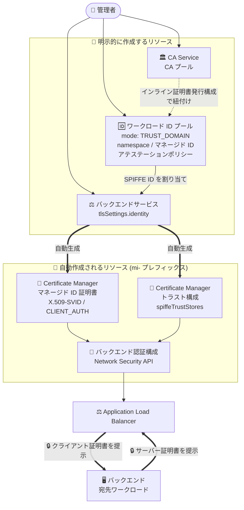
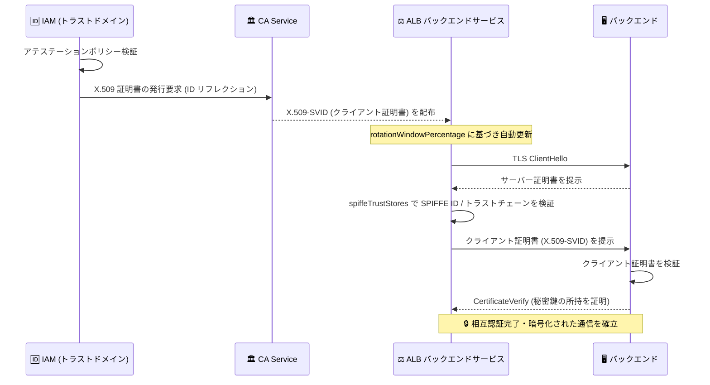

# Cloud Load Balancing: バックエンド mTLS のマネージドワークロード ID 対応が GA

**リリース日**: 2026-09-18

**サービス**: Cloud Load Balancing (Application Load Balancer)

**機能**: バックエンド mTLS のマネージドワークロード ID (Managed workload identity for backend mTLS)

**ステータス**: GA (一般提供)

📊 [このアップデートのインフォグラフィックを見る](https://takech9203.github.io/google-cloud-news-summary/20260918-cloud-load-balancing-backend-mtls-managed-workload-identity.html)

## 概要

Application Load Balancer とそのバックエンド間の相互 TLS 認証 (mTLS) を、マネージドワークロード ID (managed workload identity) で実現する機能が GA になりました。対象となるロードバランサは、グローバル外部 Application Load Balancer、リージョン外部 Application Load Balancer、クロスリージョン内部 Application Load Balancer、リージョン内部 Application Load Balancer の 4 種類です。

この機能の中核は、ロードバランサのバックエンドサービスに対して SPIFFE ID で表現されるマネージド ID を割り当てるという点です。マネージド ID を割り当てると、Certificate Authority Service (CA Service) が SPIFFE ID に対応する X.509 証明書 (X.509-SVID: SPIFFE Verifiable Identity Document) を自動的に発行し、mTLS に必要なクライアント証明書・トラスト構成・バックエンド認証構成が自動生成されます。バックエンドサービスは「ソースワークロード」として、バックエンドは「宛先ワークロード」として、それぞれの SVID を用いて相互認証を行います。

主な対象ユーザーは、ゼロトラストや分散サービス間の相互認証を求められる環境で Application Load Balancer を運用しているセキュリティチーム・プラットフォームチームです。SPIFFE という業界標準に準拠しているため、マイクロサービスアーキテクチャにおける ID 基盤として他環境との相互運用も想定されています。

**アップデート前の課題**

- マネージドワークロード ID を使わないバックエンド mTLS では、クライアント証明書、トラスト構成 (trust config)、バックエンド認証構成 (backend authentication config) といった複数のリソースを個別に構成する必要があった
- 秘密鍵のプロビジョニングと維持を手動で行う必要があり、証明書のローテーションが運用上のボトルネックとなっていた
- 手動の証明書管理はエラーが発生しやすいプロセスであり、証明書の失効・期限切れによる障害リスクを抱えていた
- 分散したサービス間の通信に対して、ID を軸とした一元的なガバナンスを適用する仕組みが乏しかった

**アップデート後の改善**

- バックエンドサービスにマネージド ID を割り当てるだけで、mTLS に必要なクライアント証明書・トラスト構成・バックエンド認証構成が自動作成されるようになった
- ワークロード ID プールのインライン証明書発行構成 (inline certificate issuance config) に基づき、証明書が自動的にローテーションされるようになった (`rotationWindowPercentage` で更新タイミングを制御)
- CA Service および Certificate Manager とネイティブに統合され、証明書のライフサイクル管理が Google Cloud 側に委譲されるようになった
- アテステーションポリシー (attestation policy) により、どのワークロードが証明書を受け取れるかを中央で統制できるようになった

## アーキテクチャ図



管理者が CA プール・ワークロード ID プール・バックエンドサービス (`tlsSettings.identity`) の 3 つを明示的に作成すると、マネージドワークロード ID がマネージド ID 証明書・トラスト構成・バックエンド認証構成を自動生成し、ロードバランサとバックエンドが mTLS で相互認証します。

## サービスアップデートの詳細

### 主要機能

1. **SPIFFE ID ベースのマネージド ID をバックエンドサービスに割り当て**
   - `backendService.tlsSettings.identity` フィールドにマネージド ID を指定する
   - マネージド ID の形式: `spiffe://WORKLOAD_IDENTITY_POOL_ID.global.PROJECT_NUMBER.workload.id.goog/ns/NAMESPACE_ID/sa/MANAGED_IDENTITY_ID`
   - ただし `identity` フィールド自体には `spiffe` プレフィックスは付けず、`//WORKLOAD_IDENTITY_POOL_ID.global....` の形式で指定する (`spiffe` プレフィックスは X.509 証明書の SAN に URI として表現されるときに使われる)

2. **CA Service による X.509-SVID の自動プロビジョニング**
   - アテステーションポリシーの検証が成功すると、IAM が CA Service に対してマネージド ID 用の X.509 証明書を要求する
   - CA Service は ID リフレクション (identity reflection) を使って、設定された SPIFFE ID を X.509 証明書に反映させる
   - SPIFFE ID は証明書の SAN (Subject Alternative Name) フィールドに URI としてエンコードされる

3. **mTLS 関連リソースの自動作成 (mi- プレフィックス)**
   - **Certificate Manager マネージド ID 証明書**: ワークロード ID プールのインライン証明書発行構成に基づいて作成される。読み取り専用で、Certificate Manager API から直接編集・削除できない。スコープは `CLIENT_AUTH`
   - **Certificate Manager トラスト構成**: `spiffeTrustStores` フィールドにトラストドメインのトラストバンドルを保持する。直接編集・削除は不可
   - **バックエンド認証構成 (Network Security API)**: 上記 2 つが自動的にアタッチされる。読み取り専用
   - これらは同一プロジェクト内に作成され、そのプロジェクトの標準クォータを使用する

4. **証明書の自動ローテーション**
   - インライン証明書発行構成の `lifetime` と `rotationWindowPercentage` に基づいて自動更新される
   - 秘密鍵のプロビジョニングと維持が不要になる

5. **トラストドメインによる境界管理とクロスドメイン認証**
   - ワークロード ID プールがトラストドメイン (論理的なセキュリティ境界) として機能する
   - 同一トラストドメイン内のワークロードは、共通のルート証明書によりデフォルトで相互認証できる
   - 異なるトラストドメイン間で相互認証する場合は、インライントラスト構成 (inline trust config) の `additionalTrustBundles` にトラストアンカーを明示的に宣言する
   - ワークロード ID プールは紐付けた CA プールのルート証明書を自動的に信頼するため、同じ CA プールのルートを `additionalTrustBundles` に追加する必要はない

## 技術仕様

### mTLS ハンドシェイクの流れ



ロードバランサはバックエンドが提示したサーバー証明書から SPIFFE ID を抽出し、`spiffeTrustStores` マップから該当トラストドメインのトラストストアを引いてトラストチェーンを検証します。

### 構成コンポーネント

| コンポーネント | API | 作成方法 |
|---------------|-----|---------|
| CA プール (CA 階層) | Certificate Authority Service API | 明示的 |
| ワークロード ID プール (トラストドメイン) | IAM API | 明示的 |
| namespace / マネージド ID / アテステーションポリシー | IAM API | 明示的 |
| バックエンドサービス (`tlsSettings.identity`) | Compute Engine API | 明示的 |
| マネージド ID 証明書 (X.509-SVID) | Certificate Manager API | 自動 |
| トラスト構成 (`spiffeTrustStores`) | Certificate Manager API | 自動 |
| バックエンド認証構成 | Network Security API | 自動 |

### インライン証明書発行構成のパラメータ

| 項目 | 設定値 | 備考 |
|------|--------|------|
| `lifetime` | 24 時間 ～ 30 日 | 省略時のデフォルトは 24 時間 (任意) |
| `rotationWindowPercentage` | 50 ～ 80 | ライフタイムの何 % 経過時に更新をトリガーするか。デフォルトは 50 (任意) |
| `keyAlgorithm` | `ECDSA_P256` (デフォルト) / `ECDSA_P384` / `RSA_2048` / `RSA_3072` / `RSA_4096` | 秘密鍵生成に使うアルゴリズム (任意) |
| `caPools` | リージョンと CA プールのマッピング | 必須 |

```json
{
  "inlineCertificateIssuanceConfig": {
    "caPools": {
      "REGION": "projects/PROJECT_NUMBER/locations/REGION/caPools/ROOT_CA_POOL_ID"
    },
    "lifetime": "86400s",
    "rotationWindowPercentage": 50,
    "keyAlgorithm": "ECDSA_P256"
  }
}
```

### 証明書の要件

| 対象 | 要件 |
|------|------|
| 共通 | 鍵交換は RSA または ECDSA。ハッシュは SHA-256 以上 (MD4 / MD5 / SHA-1 は非対応) |
| バックエンドのリーフサーバー証明書 | basic constraints に `CA=true` を含まない、extended key usage に `serverAuth` を含む、`codeSigning` / `timeStamping` / `OCSPSigning` を含まない、有効期限内 |
| ロードバランサのリーフクライアント証明書 | 自動作成されるマネージド ID 証明書が要件を自動的に満たす (`clientAuth` を含む) |
| トラスト構成のルート / 中間証明書 | basic constraints に `CA=true`、key usage に `keyCertSign`、extended key usage に `serverAuth` を含む、有効期限内 |
| RSA 鍵長 | 2048 ～ 4096 ビット |
| 対応楕円曲線 | P-256、P-384 |

自己署名クライアント証明書は有効なトラストチェーンを構成できないため、常に拒否されます。

### 必要な IAM ロール

| 目的 | ロール |
|------|--------|
| マネージドワークロード ID の作成・構成 | `roles/iam.workloadIdentityPoolAdmin`、`roles/iam.serviceAccountAdmin` |
| CA プールの作成・構成 | `roles/privateca.admin` |
| ロードバランサリソース (TargetHTTPSProxy など) の作成 | `roles/compute.loadBalancerAdmin` |
| Certificate Manager リソースの利用 | `roles/certificatemanager.owner` |
| セキュリティ / ネットワークコンポーネントの作成 | `roles/compute.networkAdmin`、`roles/compute.securityAdmin` |

加えて、トラストドメイン (ワークロード ID プール) 自体に対して CA プール上で `roles/privateca.workloadCertificateRequester` (証明書要求用) と `roles/privateca.poolReader` (署名済み証明書チェーンのダウンロード用) を付与する必要があります。

## 設定方法

### 前提条件

1. IAM、Certificate Authority Service、Compute Engine、Certificate Manager、Network Security の各 API を有効化する
2. CA 階層 (ルート CA、必要に応じて下位 CA) を CA Service の CA プールとして構成する
3. 上記の IAM ロールを付与する
4. gcloud CLI の課金 / クォータプロジェクトを設定する

```bash
gcloud services enable iam.googleapis.com privateca.googleapis.com \
  compute.googleapis.com certificatemanager.googleapis.com \
  networksecurity.googleapis.com

gcloud config set billing/quota_project PROJECT_ID
```

### 手順

#### ステップ 1: ワークロード ID プールを TRUST_DOMAIN モードで作成

```bash
gcloud iam workload-identity-pools create WORKLOAD_IDENTITY_POOL_ID \
  --location="global" \
  --mode="TRUST_DOMAIN"
```

マネージドワークロード ID を作成するには、プールを `TRUST_DOMAIN` モードで作成する必要があります。プール ID は 4 ～ 32 文字で、小文字英数字とダッシュのみが使用でき、作成後は変更できません。

#### ステップ 2: namespace とマネージド ID を作成

```bash
gcloud iam workload-identity-pools namespaces create NAMESPACE_ID \
  --workload-identity-pool="WORKLOAD_IDENTITY_POOL_ID" \
  --location="global"

gcloud iam workload-identity-pools managed-identities create MANAGED_IDENTITY_ID \
  --namespace="NAMESPACE_ID" \
  --workload-identity-pool="WORKLOAD_IDENTITY_POOL_ID" \
  --location="global"
```

namespace ID とマネージド ID はいずれも 2 ～ 63 文字で、作成後に変更できません。

#### ステップ 3: アテステーションポリシーを作成

```bash
gcloud iam workload-identity-pools managed-identities add-attestation-rule MANAGED_IDENTITY_ID \
  --namespace=NAMESPACE_ID \
  --workload-identity-pool=WORKLOAD_IDENTITY_POOL_ID \
  --google-cloud-resource='//compute.googleapis.com/projects/PROJECT_NUMBER/type/BackendService/*' \
  --location=global
```

この例では、バックエンドサービスが特定のプロジェクトに属しているかどうかを検証するアテステーションルールを追加しています。検証が通ると、IAM が CA Service に証明書を要求します。

#### ステップ 4: インライン証明書発行構成でワークロード ID プールと CA プールを紐付け

```bash
gcloud iam workload-identity-pools update WORKLOAD_IDENTITY_POOL_ID \
  --location="global" \
  --inline-certificate-issuance-config-file=cic.json \
  --inline-trust-config-file=tc.json \
  --project=PROJECT_ID
```

`--inline-trust-config-file` は、異なるトラストドメイン間で認証する場合のみ必要です。同一トラストドメイン内で完結する場合は省略できます。

#### ステップ 5: トラストドメインに CA プールへのアクセス権を付与

```bash
gcloud privateca pools add-iam-policy-binding ROOT_CA_POOL_ID \
  --location=REGION \
  --role=roles/privateca.workloadCertificateRequester \
  --member="principal://iam.googleapis.com/projects/PROJECT_NUMBER/name/locations/global/workloadIdentityPools/WORKLOAD_IDENTITY_POOL_ID" \
  --project=PROJECT_ID

gcloud privateca pools add-iam-policy-binding ROOT_CA_POOL_ID \
  --location=REGION \
  --role=roles/privateca.poolReader \
  --member="principal://iam.googleapis.com/projects/PROJECT_NUMBER/name/locations/global/workloadIdentityPools/WORKLOAD_IDENTITY_POOL_ID" \
  --project=PROJECT_ID
```

#### ステップ 6: バックエンドサービス作成時にマネージド ID を割り当て

グローバル外部 / クロスリージョン内部 Application Load Balancer の場合:

```bash
gcloud compute backend-services create BACKEND_SERVICE_NAME \
  --load-balancing-scheme=EXTERNAL_MANAGED \
  --protocol=HTTPS \
  --health-checks=HEALTH_CHECK_NAME \
  --identity='//WORKLOAD_IDENTITY_POOL_ID.global.PROJECT_NUMBER.workload.id.goog/ns/NAMESPACE_ID/sa/MANAGED_IDENTITY_ID' \
  --global
```

リージョン外部 / リージョン内部 Application Load Balancer の場合は `--global` の代わりに `--region=REGION` を指定します。**マネージド ID はバックエンドサービスの作成時にのみ割り当て可能**なため、既存のバックエンドサービスに後から追加することはできません。

Google Cloud コンソールから設定する場合は、バックエンド構成の「詳細設定」セクションを展開し、「バックエンド認証」で「マネージド ID」オプションを選択します。

#### ステップ 7: 自動作成されたリソースを確認

```bash
# バックエンドサービスにバックエンド認証構成とマネージド ID がアタッチされたか確認
gcloud compute backend-services describe BACKEND_SERVICE_NAME --global

# バックエンド認証構成にクライアント証明書とトラスト構成がアタッチされたか確認
gcloud network-security backend-authentication-configs describe MI_BACKEND_AUTHENTICATION_CONFIG_ID \
  --location=global

# マネージド ID 証明書の詳細を確認
gcloud certificate-manager certificates describe MI_CLIENT_CERTIFICATE_ID
```

自動作成されたリソースは `mi` プレフィックスを持ちます (例: `mi-bac-...`、`mi-crt-...`、`mi-tc-...`)。マネージド ID 証明書の `state` が `FAILED` の場合は、アテステーションポリシーと IAM 権限の設定を確認します。

## メリット

### ビジネス面

- **運用コストの削減**: 秘密鍵のプロビジョニングと維持という手動作業のボトルネックが解消され、証明書管理にかかる運用工数を削減できる
- **障害リスクの低減**: 証明書の自動ローテーションにより、期限切れによるサービス停止リスクを抑えられる
- **ガバナンスの強化**: ワークロード ID プールが中央の統制ポイントとなり、管理者がトラストドメインとアテステーションポリシーを定義して、どのワークロードに証明書を発行するかを制御できる
- **可視性の向上**: 分散サービス間の通信を ID ベースで把握でき、環境をまたいだワークロードにガバナンスをプロアクティブに適用できる

### 技術面

- **セキュリティの向上**: ロードバランサとバックエンドが相互認証することで、認可されていないワークロードによるサービスアクセスを防止し、転送中のデータを暗号化する
- **相互運用可能な ID**: SPIFFE 標準に準拠しているため、マイクロサービスベースの分散システムにおける認証・認可基盤として標準的に扱える
- **構成の簡素化**: マネージドワークロード ID を使わない場合に必要だった複数リソースの個別構成が不要になり、`--identity` フラグ 1 つで済む
- **マルチトラストドメイン対応**: `spiffeTrustStores` が複数のトラストドメインのトラストストアを保持できるため、異なるセキュリティドメイン間の認証にも対応できる

## デメリット・制約事項

### 制限事項

- クラシック Application Load Balancer はバックエンド mTLS をサポートしない
- グローバルインターネット NEG バックエンドではバックエンド mTLS はサポートされない
- **マネージド ID はバックエンドサービスの作成時にのみ割り当て可能** (既存のバックエンドサービスには適用できない)
- **マネージド ID はイミュータブル**であり、バックエンドサービスに割り当てた後は更新も削除もできない
- マネージド ID を割り当てた場合、`backendService.tlsSettings` の以下のフィールドを手動設定できない
  - `tlsSettings.sni`
  - `tlsSettings.subjectAltNames`
  - `tlsSettings.authenticationConfig`
- 自動作成される Certificate Manager トラスト構成・マネージド ID 証明書・バックエンド認証構成は読み取り専用で、それぞれの API から直接編集・削除できない
- 自己署名クライアント証明書は常に拒否される
- サーバー証明書チェーンの中間証明書は 10 個まで、チェーンの最大深さは 10、検証時の最大反復回数は 100、証明書ペイロードは 16 KB まで

### 考慮すべき点

- マネージド ID がイミュータブルであるため、SPIFFE ID の設計 (プール ID / namespace / マネージド ID の命名規則) を事前に十分検討する必要がある。ID はいずれも作成後に変更できない
- 既存のバックエンドサービスを移行する場合は、バックエンドサービスの再作成が必要になる
- 自動作成されるリソースは同一プロジェクトの標準クォータを消費するため、Certificate Manager / Network Security のクォータを確認しておく
- 証明書ライフタイムを短くすると証明書発行回数が増え、CA Service の証明書発行料金と QPS クォータに影響する。CA Service の createCertificate は CA あたりの QPS 上限があるため、高スループットが必要な場合は CA プール内に複数の CA を配置する
- CA プールのティア選定が必要。DevOps ティアは高スループット・低コストだが証明書の追跡・失効ができず、顧客管理の Cloud KMS 鍵に対応しない。Enterprise ティアは失効や CMEK に対応するがスループットは低い
- サーバー証明書の検証失敗は Cloud Logging にエラーコード (`ssl_certificate_verification_failed`、`server_cert_trust_config_not_found`、`server_cert_not_provided` など) として記録されるため、ログベースのアラート設計を検討する

## ユースケース

### ユースケース 1: ゼロトラスト前提の外部公開 API

**シナリオ**: グローバル外部 Application Load Balancer 経由で公開している API のバックエンド (Compute Engine MIG) に対して、ロードバランサからの通信であることを暗号学的に証明したい。従来はバックエンド側でソース IP 制限のみを行っていたが、監査要件として相互認証が求められた。

**実装例**:
```bash
# バックエンドサービス作成時にマネージド ID を付与
gcloud compute backend-services create api-backend \
  --load-balancing-scheme=EXTERNAL_MANAGED \
  --protocol=HTTPS \
  --health-checks=api-hc \
  --identity='//prod-pool.global.123456789.workload.id.goog/ns/prod/sa/alb-api' \
  --global
```

**効果**: 認可されていないワークロードからバックエンドへのアクセスを防止し、転送中のデータを暗号化できる。証明書のローテーションは自動化されるため、監査要件を満たしながら運用負荷を増やさない。

### ユースケース 2: 複数トラストドメインをまたぐ内部サービス間通信

**シナリオ**: 事業部ごとに別プロジェクト・別ワークロード ID プールで運用しているマイクロサービス群を、クロスリージョン内部 Application Load Balancer 経由で連携させたい。異なるトラストドメインのワークロードを相互認証する必要がある。

**実装例**:
```bash
# インライントラスト構成で他トラストドメインのトラストアンカーを宣言
gcloud iam workload-identity-pools update WORKLOAD_IDENTITY_POOL_ID \
  --location="global" \
  --inline-trust-config-file=tc.json
```

`tc.json` の `additionalTrustBundles` に、相手トラストドメイン名をキーとして PEM エンコードされたルート CA 証明書を指定します。

**効果**: Certificate Manager トラスト構成の `spiffeTrustStores` がインライントラスト構成と同期され、ロードバランサが SPIFFE ID からトラストドメインを判別して適切なトラストストアでチェーン検証を行えるようになる。

### ユースケース 3: 手動 mTLS 構成からの移行

**シナリオ**: 既にバックエンド認証構成とトラスト構成を手動で作成してバックエンド mTLS を運用しているが、証明書ローテーションの運用負荷を解消したい。

**効果**: マネージドワークロード ID に移行することで、クライアント証明書・トラスト構成・バックエンド認証構成の管理を Google Cloud に委譲できる。ただしマネージド ID はバックエンドサービス作成時にのみ割り当て可能なため、バックエンドサービスの再作成を含む移行計画が必要。

## 料金

Cloud Load Balancing 側でこの機能に対する追加料金の記載は確認できませんでしたが、**Certificate Authority Service の料金が発生します**。CA Service の料金は「CA の月額料金」と「発行した証明書ごとの料金」の合算です。

| 項目 | DevOps SKU | Enterprise SKU |
|------|-----------|----------------|
| CA 月額料金 | $20 / CA / 月 | $200 / CA / 月 |
| 証明書料金 (0 - 50,000 枚) | $0.3 / 枚 | $0.5 / 枚 |
| 証明書料金 (50,001 - 100,000 枚) | $0.03 / 枚 | $0.05 / 枚 |
| 証明書料金 (100,001 枚以上) | $0.0009 / 枚 | $0.001 / 枚 |

証明書料金は発行ごとの 1 回限りの課金で、発行枚数が多いほど単価が下がる階層型です。100 万枚を超える場合はサブスクリプションモデルの検討が推奨されています。

### 料金例 (CA Service 公式の例)

| 構成 | 月間発行証明書数 | 月額合計 |
|------|-----------------|---------|
| CA 1 つ / DevOps ティア | 10,000 枚 | $3,020 (証明書 $3,000 + CA $20) |
| CA 1 つ / DevOps ティア | 90,000 枚 | $16,220 (証明書 $16,200 + CA $20) |
| CA 1 つ / DevOps ティア | 100 万枚 | $17,330 (証明書 $17,310 + CA $20) |
| CA 1 つ / Enterprise ティア | 100 万枚 | $36,700 (証明書 $36,500 + CA $200) |

マネージドワークロード ID では証明書が自動ローテーションされるため、証明書ライフタイム (`lifetime`) とローテーション割合 (`rotationWindowPercentage`) の設定が発行枚数、すなわちコストに直接影響します。ライフタイムを短くするほどセキュリティは向上しますが証明書発行回数は増えるため、コストとのバランスを検討してください。

Cloud Load Balancing 自体の料金 (転送ルール、処理データ量) は別途発生します。

## 利用可能リージョン

対応するロードバランサの種類は以下の 4 つです。

| ロードバランサ | 対応 |
|---------------|------|
| グローバル外部 Application Load Balancer | ✅ |
| リージョン外部 Application Load Balancer | ✅ |
| クロスリージョン内部 Application Load Balancer | ✅ |
| リージョン内部 Application Load Balancer | ✅ |
| クラシック Application Load Balancer | ❌ (バックエンド mTLS 非対応) |

ワークロード ID プール・namespace・マネージド ID はいずれも `global` ロケーションに作成します。CA プールはリージョンリソースであり、利用可能なリージョンは [CA Service のロケーション](https://docs.cloud.google.com/certificate-authority-service/docs/locations) を参照してください。

## 関連サービス・機能

- **Certificate Authority Service (CA Service)**: マネージド ID 用の X.509-SVID を発行する。ID リフレクションにより SPIFFE ID を証明書に反映させる。CA プールのティア (DevOps / Enterprise) 選定が運用とコストに影響する
- **Certificate Manager**: マネージド ID 証明書 (X.509-SVID) とトラスト構成 (`spiffeTrustStores`) を保持する。いずれも自動作成・読み取り専用
- **Identity and Access Management (IAM)**: ワークロード ID プールをトラストドメインとして管理し、アテステーションポリシーの検証と証明書要求を行う
- **Network Security API**: バックエンド認証構成 (backend authentication config) を管理する。マネージドワークロード ID 利用時は自動作成される
- **Compute Engine API**: バックエンドサービスの `tlsSettings.identity` フィールドでマネージド ID を指定する
- **Cloud Logging**: サーバー証明書の検証エラーが記録される。mTLS 検証失敗の監視・トラブルシューティングに使用する
- **Cloud KMS**: Enterprise ティアの CA プールで顧客管理の署名鍵 (CMEK) を使用する場合に利用する
- **バックエンド認証済み TLS / バックエンド mTLS (マネージドワークロード ID なし)**: 従来の手動構成による mTLS。マネージドワークロード ID を使わない場合の選択肢

## 参考リンク

- 📊 [インフォグラフィック](https://takech9203.github.io/google-cloud-news-summary/20260918-cloud-load-balancing-backend-mtls-managed-workload-identity.html)
- [公式リリースノート (September 18, 2026)](https://docs.cloud.google.com/release-notes#September_18_2026)
- [Backend mTLS with managed workload identity overview](https://docs.cloud.google.com/load-balancing/docs/managed-workload-identities-load-balancers-overview)
- [Set up backend mTLS using managed workload identity](https://docs.cloud.google.com/load-balancing/docs/set-up-backend-mtls-managed-identity)
- [Backend authenticated TLS and backend mTLS overview](https://docs.cloud.google.com/load-balancing/docs/backend-authenticated-tls-backend-mtls)
- [Managed workload identities overview (IAM)](https://docs.cloud.google.com/iam/docs/managed-workload-identity)
- [Certificate Authority Service ドキュメント](https://docs.cloud.google.com/certificate-authority-service)
- [Using identity reflection (CA Service)](https://docs.cloud.google.com/certificate-authority-service/docs/using-identity-reflection)
- [Overview of CA pools](https://docs.cloud.google.com/certificate-authority-service/docs/ca-pool)
- [SPIFFE Concepts](https://spiffe.io/docs/latest/spiffe-about/spiffe-concepts/)
- [Certificate Authority Service 料金ページ](https://cloud.google.com/certificate-authority-service/pricing)

## まとめ

Application Load Balancer とバックエンド間の mTLS が、SPIFFE 標準に基づくマネージドワークロード ID で構成できるようになり、証明書のプロビジョニングとローテーションが完全に自動化されました。手動での秘密鍵管理という最大の運用ボトルネックが解消されるため、ゼロトラスト要件のある環境では従来の手動 mTLS 構成に対する明確な改善となります。

一方で、マネージド ID はバックエンドサービス作成時にのみ割り当て可能でイミュータブルという強い制約があるため、SPIFFE ID の命名設計と既存バックエンドサービスの移行計画を事前に固めることが重要です。まずは CA プールのティア選定と証明書ライフタイム設計 (コストとセキュリティのバランス) を検討し、非本番環境で GA 構成を検証することを推奨します。

---

**タグ**: Cloud Load Balancing, Application Load Balancer, mTLS, マネージドワークロード ID, SPIFFE, Certificate Authority Service, Certificate Manager, IAM, ゼロトラスト, ネットワークセキュリティ, GA
