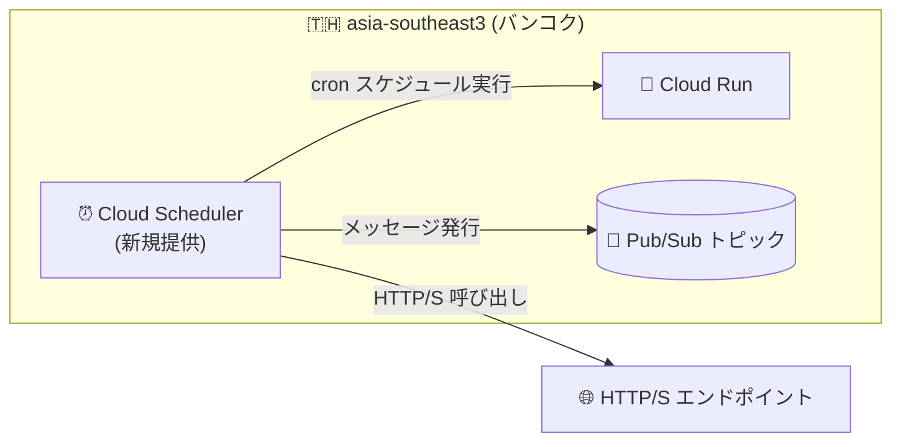

# Cloud Scheduler: asia-southeast3 (バンコク) リージョンで利用可能に

**リリース日**: 2026-09-18

**サービス**: Cloud Scheduler

**機能**: asia-southeast3 (バンコク、タイ) リージョンのサポート

**ステータス**: Changed (リージョン拡大)

📊 [このアップデートのインフォグラフィックを見る](https://takech9203.github.io/google-cloud-news-summary/20260918-cloud-scheduler-asia-southeast3.html)

## 概要

Cloud Scheduler が新たに asia-southeast3 (バンコク、タイ) リージョンで利用可能になりました。Cloud Scheduler はフルマネージドの cron ジョブスケジューラで、HTTP/S エンドポイント、Pub/Sub トピック、App Engine アプリケーションをターゲットとして、定期的なタスクを実行できます。

今回の拡大により、タイ国内やその周辺でワークロードを運用するユーザーは、スケジューラジョブをターゲットのコンピュートリソースと同一リージョンに配置できるようになり、ネットワークパフォーマンスの最適化とデータレジデンシー要件への対応が容易になります。アジア太平洋地域では、asia-east1 (台湾)、asia-east2 (香港)、asia-northeast1 (東京)、asia-northeast2 (大阪)、asia-northeast3 (ソウル)、asia-south1 (ムンバイ)、asia-southeast1 (シンガポール)、asia-southeast2 (ジャカルタ)、australia-southeast1 (シドニー) に続く提供リージョンとなります。

**アップデート前の課題**

- asia-southeast3 (バンコク) に Cloud Scheduler ジョブを作成できず、タイのワークロードは asia-southeast1 (シンガポール) や asia-southeast2 (ジャカルタ) など他リージョンのスケジューラを利用する必要があった
- スケジューラジョブとターゲットリソースを同一リージョンに配置できないため、リージョン内で完結する構成やデータレジデンシー要件への対応が難しかった

**アップデート後の改善**

- asia-southeast3 に Cloud Scheduler ジョブを直接作成できるようになった
- バンコクリージョンのターゲット (Cloud Run、Pub/Sub、HTTP/S エンドポイントなど) とスケジューラジョブを同一リージョンに集約でき、ネットワークパフォーマンスとデータレジデンシーの観点で構成を最適化できる

## アーキテクチャ図



バンコクリージョン内で Cloud Scheduler ジョブとターゲットリソースを同一リージョンに配置した構成例です。

## サービスアップデートの詳細

### 主要機能

1. **asia-southeast3 でのジョブ作成**
   - バンコクリージョンを指定して Cloud Scheduler ジョブを作成・実行できる
   - HTTP/S エンドポイント、Pub/Sub トピックをターゲットとするジョブは、Cloud Scheduler がサポートするすべてのリージョンで利用可能

2. **リージョン選択によるコロケーション**
   - ジョブをターゲットのコンピュートリソースと同一リージョンに配置することで、ネットワークパフォーマンスの最適化とデータレジデンシー基準の維持が可能

## 設定方法

### 手順

#### asia-southeast3 にジョブを作成する

```bash
gcloud scheduler jobs create http my-job \
  --location=asia-southeast3 \
  --schedule="0 9 * * *" \
  --uri="https://example.com/task" \
  --http-method=POST
```

`--location` フラグに `asia-southeast3` を指定することで、バンコクリージョンにジョブを作成できます。

## メリット

### ビジネス面

- **データレジデンシー対応**: タイ国内でのデータ処理・スケジューリング要件を持つ組織が、スケジューラを含めてリージョン内に構成を完結できる
- **東南アジアでの選択肢拡大**: シンガポール、ジャカルタに続き、東南アジアで 3 つ目の Cloud Scheduler 提供リージョンとなり、可用性設計の選択肢が広がる

### 技術面

- **ネットワークパフォーマンスの最適化**: スケジューラジョブとターゲットリソースのコロケーションにより、リージョン間通信を削減できる
- **構成の簡素化**: 他リージョンのスケジューラからクロスリージョンでターゲットを呼び出す構成が不要になる

## 考慮すべき点

- App Engine をターゲットとするジョブは、プロジェクトの App Engine リージョンでのみ作成可能 (HTTP/S・Pub/Sub ターゲットにはこの制約はない)
- Cloud Scheduler は「少なくとも 1 回 (at least once)」の実行を保証する設計のため、ターゲットは冪等に実装する必要がある (リージョンによらない一般的な考慮点)

## 料金

Cloud Scheduler の料金はジョブ数に基づく課金で、リージョン拡大による料金体系の変更はありません。詳細は[料金ページ](https://cloud.google.com/scheduler/pricing)を参照してください。

## 利用可能リージョン

今回追加されたリージョン:

| リージョン名 | 場所 |
|------|------|
| asia-southeast3 | バンコク、タイ |

提供リージョンの全一覧は [Cloud Scheduler locations](https://docs.cloud.google.com/scheduler/docs/locations) を参照してください。

## 関連サービス・機能

- **Cloud Run / Cloud Run functions**: Cloud Scheduler からの定期実行ターゲットとして代表的なサービス
- **Pub/Sub**: スケジュールに基づくメッセージ発行のターゲット
- **Cloud Tasks**: 非同期タスク実行を担う補完サービス

## 参考リンク

- 📊 [インフォグラフィック](https://takech9203.github.io/google-cloud-news-summary/20260918-cloud-scheduler-asia-southeast3.html)
- [公式リリースノート](https://docs.cloud.google.com/release-notes#September_18_2026)
- [Cloud Scheduler リリースノート](https://docs.cloud.google.com/scheduler/docs/release-notes)
- [Cloud Scheduler locations](https://docs.cloud.google.com/scheduler/docs/locations)
- [Cloud Scheduler 概要](https://docs.cloud.google.com/scheduler/docs/overview)
- [料金ページ](https://cloud.google.com/scheduler/pricing)

## まとめ

Cloud Scheduler が asia-southeast3 (バンコク) で利用可能になり、タイでワークロードを運用するユーザーはスケジューラジョブをターゲットと同一リージョンに配置できるようになりました。バンコクリージョンを利用中で定期実行ジョブを他リージョンに配置している場合は、コロケーションによるネットワーク最適化とデータレジデンシー対応の観点から、ジョブの asia-southeast3 への移行を検討することを推奨します。

---

**タグ**: Cloud Scheduler, リージョン拡大, asia-southeast3, バンコク, タイ, cron, スケジューリング
