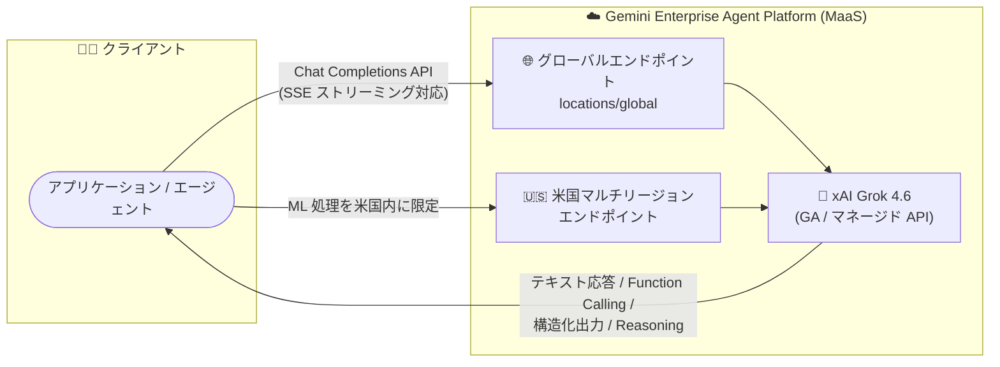

# Gemini Enterprise Agent Platform: xAI Grok 4.6 が一般提供 (GA) 開始

**リリース日**: 2026-09-18

**サービス**: Gemini Enterprise Agent Platform

**機能**: xAI Grok 4.6 の一般提供 (GA)

**ステータス**: GA (一般提供)

📊 [このアップデートのインフォグラフィックを見る](https://takech9203.github.io/google-cloud-news-summary/20260918-gemini-enterprise-agent-platform-grok-4-6-ga.html)

## 概要

xAI の高性能モデル **Grok 4.6** が Gemini Enterprise Agent Platform 上で一般提供 (GA) となり、**グローバルエンドポイント** および **米国マルチリージョンエンドポイント** で本番利用が可能になりました。Grok 4.6 は、コーディング、エージェントタスク、ナレッジワークに特化して構築された xAI の高性能 (high-capability) モデルです。

Grok 4.6 は 2026 年 8 月 21 日に Model Garden で Preview として公開されており、今回のアップデートで本番ワークロードでの利用が正式にサポートされました。xAI モデルは Gemini Enterprise Agent Platform 上でマネージド API (Model as a Service, MaaS) として提供されるため、ユーザーはインフラを管理することなく OpenAI 互換の Chat Completions API 経由でモデルを呼び出せます。Server-Sent Events (SSE) によるストリーミングレスポンスにも対応しています。

Google Cloud 上でマルチモデル戦略を採用するエンタープライズにとって、Gemini、Claude に加えて xAI の最新モデルを本番環境で選択できるようになった点が重要です。なお、xAI モデルは Google 製品ではなく、Service Specific Terms の「Separate Offerings」条項および各モデルカードの個別規約が適用されます。

**アップデート前の課題**

- Grok 4.6 は Preview (Pre-GA) 段階であり、Pre-GA Offerings Terms の下で「現状有姿 (as is)」での提供となり、サポートが限定される可能性があった
- Pre-GA 段階のモデルは本番ワークロードでの利用が推奨されなかった
- 本番利用可能な xAI モデルは Grok 4.20 (Reasoning / Non-reasoning) など旧世代に限られていた

**アップデート後の改善**

- Grok 4.6 が GA となり、本番環境 (production) での利用が正式にサポートされた
- グローバルエンドポイントに加え、米国マルチリージョンエンドポイントでも利用可能になり、ML 処理を米国内に限定したい要件にも対応できる
- コーディング・エージェントタスク向けの最新 xAI モデルを、SLA を含む GA 水準のサービスとして選択できるようになった

## アーキテクチャ図



アプリケーションはグローバルエンドポイントまたは米国マルチリージョンエンドポイント経由で、マネージド API として提供される Grok 4.6 を呼び出します。GA により両エンドポイントでの本番利用が正式サポートされました。

## サービスアップデートの詳細

### 主要機能

1. **Grok 4.6 の一般提供 (GA)**
   - コーディング、エージェントタスク、ナレッジワーク向けに構築された xAI の高性能モデル
   - 2026 年 8 月 21 日の Preview 公開を経て、本番利用が正式にサポートされた

2. **2 つのエンドポイントでの提供**
   - グローバルエンドポイント: リージョンを指定せずに利用可能
   - 米国マルチリージョンエンドポイント: ML 処理が米国内で実行されるため、データレジデンシー要件がある場合に有効

3. **マネージド API (MaaS) としての提供**
   - Model Garden のモデルカードからアクセスし、インフラ管理不要で利用可能
   - Server-Sent Events (SSE) によるストリーミングレスポンスに対応
   - Function Calling、構造化出力 (Structured Output)、Reasoning (思考モード) をサポート

## 技術仕様

### モデル仕様 (公式ドキュメントより)

| 項目 | 詳細 |
|------|------|
| モデル ID | `grok-4.6` |
| 提供元 | xAI (パートナーモデル) |
| 入力 | テキスト、画像 |
| 出力 | テキスト |
| コンテキスト長 | 524,288 トークン |
| サポート機能 | Function Calling、構造化出力、Reasoning |
| 非サポート機能 | バッチ予測 (Batch Prediction) |
| 利用形態 | 固定クォータ (Fixed quota) |
| 提供エンドポイント | グローバル、米国マルチリージョン |
| ML 処理 | 米国 (マルチリージョン) |

### クォータ (ドキュメント記載値)

Grok モデルにはグローバルクォータが適用されます。TPM は入力・出力トークンの両方を含みます。

| クォータ項目 | 値 |
|------|------|
| QPM (リクエスト/分) | 13 |
| 入力 TPM (トークン/分) | 188,000 |
| 出力 TPM (トークン/分) | 16,000 |

クォータはアカウントによって異なる場合があります。関連するクォータ名は以下のとおりです。

- `global_generate_content_requests_per_minute_per_project_per_base_model` (QPM)
- `global_generate_content_input_tokens_per_minute_per_base_model` (入力 TPM)
- `global_generate_content_output_tokens_per_minute_per_base_model` (出力 TPM)

## 設定方法

### 前提条件

1. Google Cloud プロジェクトで Gemini Enterprise Agent Platform (Model Garden) が利用可能であること
2. Model Garden の Grok 4.6 モデルカードでモデルへのアクセスを有効化していること
3. 呼び出しに必要な IAM 権限と、上記のクォータが利用可能であること

### 手順

#### ステップ 1: Model Garden でモデルカードを確認

Google Cloud コンソールの Model Garden から xAI の Grok 4.6 モデルカードを開き、利用規約を確認して有効化します。

```text
https://console.cloud.google.com/agent-platform/publishers/xai/model-garden/grok-4.6
```

#### ステップ 2: Chat Completions API で呼び出し

```bash
curl -X POST \
  -H "Authorization: Bearer $(gcloud auth print-access-token)" \
  -H "Content-Type: application/json" \
  "https://aiplatform.googleapis.com/v1/projects/YOUR_PROJECT/locations/global/endpoints/openapi/chat/completions" \
  -d '{
    "model": "xai/grok-4.6",
    "messages": [{ "role": "user", "content": "こんにちは" }],
    "stream": true
  }'
```

OpenAI 互換の Chat Completions エンドポイントに対して、モデル名 `grok-4.6` (パブリッシャー接頭辞付きで `xai/grok-4.6`) を指定して呼び出します。`stream: true` で SSE ストリーミングが有効になります。

## メリット

### ビジネス面

- **本番利用の正式サポート**: GA により Pre-GA Offerings Terms の制約がなくなり、エンタープライズの本番ワークロードに Grok 4.6 を採用できる
- **マルチモデル戦略の強化**: Gemini、Claude、Grok を単一プラットフォーム上で使い分けられ、ワークロードごとに最適なモデルを選択できる

### 技術面

- **長大なコンテキスト**: 524,288 トークンのコンテキスト長により、大規模なコードベースやドキュメントの処理に対応
- **エージェント向け機能**: Function Calling、構造化出力、Reasoning (思考モード) をサポートし、エージェントワークフローの構築に適する
- **データレジデンシー対応**: 米国マルチリージョンエンドポイントにより、ML 処理を米国内に限定可能

## デメリット・制約事項

### 制限事項

- バッチ予測 (Batch Prediction) はサポートされていない
- ドキュメント記載時点で、Standard の従量課金 (pay-as-you-go) および Provisioned Throughput は非サポートで、固定クォータ (Fixed quota) での利用となる
- ドキュメント記載のクォータは QPM 13、入力 TPM 188,000、出力 TPM 16,000 であり、大規模トラフィックにはクォータの確認・調整が必要

### 考慮すべき点

- xAI モデルは Google 製品ではなく、Service Specific Terms の「Separate Offerings」条項と各モデルカードの個別規約が適用される
- ML 処理は米国 (マルチリージョン) で実行されるため、米国外でのデータ処理が必要な要件には適合しない
- クォータはアカウントによって変動し、場合によってはアクセスが制限されることがある

## ユースケース

### ユースケース 1: コーディングエージェントのバックエンドモデル

**シナリオ**: 大規模コードベースを対象としたコード生成・レビューエージェントを構築し、モデルの比較評価のうえ本番投入したい。

**実装例**:
```bash
curl -X POST \
  -H "Authorization: Bearer $(gcloud auth print-access-token)" \
  -H "Content-Type: application/json" \
  "https://aiplatform.googleapis.com/v1/projects/YOUR_PROJECT/locations/global/endpoints/openapi/chat/completions" \
  -d '{
    "model": "xai/grok-4.6",
    "messages": [
      {"role": "system", "content": "あなたはコードレビューアシスタントです。"},
      {"role": "user", "content": "このプルリクエストの差分をレビューしてください: ..."}
    ]
  }'
```

**効果**: 524K トークンの長大なコンテキストと Reasoning 機能を活かし、GA 水準のサポートの下でコーディングエージェントを本番運用できる。

### ユースケース 2: 米国内データ処理が要件のナレッジワーク支援

**シナリオ**: 米国内でのデータ処理が求められる企業が、社内ドキュメントの要約・分析にエージェントを活用したい。

**効果**: 米国マルチリージョンエンドポイントを利用することで、ML 処理を米国内に限定しながら Grok 4.6 の能力を利用できる。

## 料金

Grok 4.6 の料金は Gemini Enterprise Agent Platform の生成 AI 料金ページに記載されています。トークンベースの課金体系であり、詳細な単価は料金ページを参照してください。

- [Gemini Enterprise Agent Platform 生成 AI 料金](https://cloud.google.com/gemini-enterprise-agent-platform/generative-ai/pricing)

## 利用可能リージョン

| エンドポイント | 提供状況 |
|--------|-----------------|
| グローバルエンドポイント (`global`) | 利用可能 (GA) |
| 米国マルチリージョンエンドポイント | 利用可能 (GA) |

ML 処理は米国 (マルチリージョン) で実行されます。

## 関連サービス・機能

- **Model Garden**: Grok 4.6 を含むパートナーモデル・オープンモデルのカタログ。モデルカードからアクセスを有効化する
- **Grok モデルファミリー**: Grok 4.3、Grok 4.20 (Reasoning / Non-reasoning) など、他の xAI モデルも同プラットフォームで提供されている
- **パートナーモデル (Claude など)**: Anthropic Claude シリーズなどもマネージド API として利用可能で、ワークロードに応じたモデル選択ができる
- **Cloud Quotas**: Google Cloud コンソールの「割り当てとシステム上限」ページでプロジェクトの QPM / TPM クォータを確認できる

## 参考リンク

- 📊 [インフォグラフィック](https://takech9203.github.io/google-cloud-news-summary/20260918-gemini-enterprise-agent-platform-grok-4-6-ga.html)
- [公式リリースノート](https://docs.cloud.google.com/release-notes#September_18_2026)
- [Grok 4.6 モデルページ](https://docs.cloud.google.com/gemini-enterprise-agent-platform/models/partner-models/grok/grok-4-6)
- [xAI Grok モデル (パートナーモデル) ドキュメント](https://docs.cloud.google.com/gemini-enterprise-agent-platform/models/partner-models/grok)
- [オープンモデル API の呼び出し方法](https://docs.cloud.google.com/gemini-enterprise-agent-platform/models/maas/call-open-model-apis)
- [料金ページ](https://cloud.google.com/gemini-enterprise-agent-platform/generative-ai/pricing)

## まとめ

xAI の Grok 4.6 が Gemini Enterprise Agent Platform で GA となり、グローバルおよび米国マルチリージョンエンドポイントで本番利用が可能になりました。コーディングやエージェントタスク向けの最新パートナーモデルを本番採用する選択肢が広がったため、マルチモデル戦略を検討中のチームは Model Garden のモデルカードでアクセスを有効化し、既存の Gemini / Claude ワークロードとの比較評価を行うことを推奨します。バッチ予測非対応や固定クォータなどの制約があるため、トラフィック要件とクォータの事前確認も重要です。

---

**タグ**: #GeminiEnterpriseAgentPlatform #Grok #xAI #ModelGarden #MaaS #GA #生成AI #パートナーモデル
