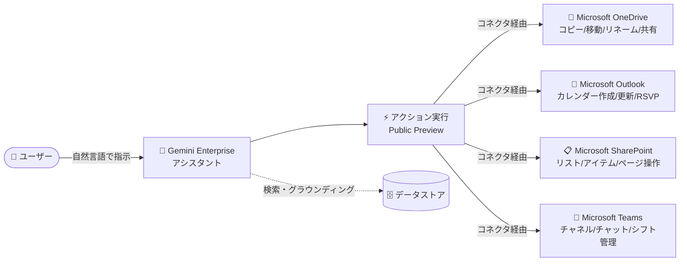

# Gemini Enterprise: Microsoft 系コネクタの新規アクション対応 (Public Preview)

**リリース日**: 2026-09-18

**サービス**: Gemini Enterprise

**機能**: Microsoft OneDrive / Outlook / SharePoint / Teams データストアコネクタの新規アクション対応 (Public Preview)

**ステータス**: Public Preview

📊 [このアップデートのインフォグラフィックを見る](https://takech9203.github.io/google-cloud-news-summary/20260918-gemini-enterprise-microsoft-connector-actions.html)

## 概要

Gemini Enterprise の Microsoft 系データストアコネクタ (Microsoft OneDrive、Microsoft Outlook、Microsoft SharePoint、Microsoft Teams) に、新しいアクションが Public Preview として追加されました。ユーザーは Gemini Enterprise のアシスタントから自然言語で指示するだけで、接続先の Microsoft サービス上でファイル操作、カレンダー操作、リスト操作、チャネル/チャット操作などを直接実行できるようになります。

Gemini Enterprise のアクション機能は、単なる検索・要約 (読み取り) にとどまらず、接続先アプリケーション内でのタスク実行 (書き込み) を可能にする仕組みです。今回のアップデートでは、既存の基本的なアクション (ファイルのアップロード/ダウンロード、イベント作成、メッセージ送信など) に加えて、フォルダのコピー/移動/リネーム、ファイル共有、カレンダーの作成/更新、SharePoint リストアイテムの CRUD 操作、Teams のチャネル/チャット管理やシフト (スケジュール・休暇) 管理など、より広範な業務操作がカバーされました。

Microsoft 365 を全社的に利用しながら Gemini Enterprise を AI アシスタント基盤として採用している組織にとって、AI エージェント経由で完結できる業務範囲が大幅に広がるアップデートです。

**アップデート前の課題**

- Microsoft 系コネクタで実行できるアクションは限定的で、OneDrive はファイルのアップロード/ダウンロード、フォルダ作成、ファイルコピー程度にとどまっていた (フォルダの移動・リネームや共有設定は不可)
- Outlook はイベントや連絡先の作成・更新が中心で、カレンダー自体の作成や招待への出欠回答 (RSVP) には対応していなかった
- SharePoint のリスト (構造化データ) に対するアイテム単位の作成・更新・取得や、ページの更新はアクションとして実行できなかった
- Teams はチャネル/チャットへのメッセージ送信のみで、チャネルやチャットの作成・更新、メンバー追加、シフト管理 (Shifts) の操作はできず、これらは Teams 側で手動操作する必要があった

**アップデート後の改善**

- **OneDrive**: フォルダのコピー/移動/リネーム、ファイルの移動/リネーム、ファイル・フォルダの共有、ファイルプロパティの更新が可能になった
- **Outlook**: カレンダーの作成/更新、イベントへの RSVP (出欠回答) が可能になった
- **SharePoint**: リストアイテムの作成/更新/取得、リストの一覧取得/更新、リストフィールドの取得、ドキュメントのチェックアウト破棄、リソース共有、ファイルプロパティ更新、ページ更新が可能になった
- **Teams**: チャネル/チャットの作成・更新、チャネルへのメンバー追加、チャネル/チャットメッセージの更新、スケジュール (シフト) 作成や休暇エントリの作成・更新が可能になった

## アーキテクチャ図



ユーザーが Gemini Enterprise アシスタントに自然言語で指示すると、データストアコネクタを経由して各 Microsoft サービス上でアクションが直接実行されます。従来の検索・グラウンディング (読み取り) に加え、書き込み操作の範囲が拡大しました。

## サービスアップデートの詳細

### 主要機能

1. **Microsoft OneDrive の新規アクション (7 種)**
   - フォルダのコピー (Copy folder)、ファイルの移動 (Move file)、フォルダの移動 (Move folder)
   - ファイルのリネーム (Rename file)、フォルダのリネーム (Rename folder)
   - ファイル・フォルダの共有 (Share file or folder)、ファイルプロパティの更新 (Update file properties)

2. **Microsoft Outlook の新規アクション (3 種)**
   - カレンダーの作成 (Create calendar)、カレンダーの更新 (Update calendar)
   - イベントへの RSVP (RSVP to event): 会議招待への出欠回答をアシスタント経由で実行可能

3. **Microsoft SharePoint の新規アクション (10 種)**
   - リストアイテムの作成/更新/取得 (Create/Update/Get list item)、リストの一覧取得 (List lists)、リストの更新 (Update list)、リストフィールドの取得 (Get list fields)
   - ドキュメントのチェックアウト破棄 (Discard check out document)、リソースの共有 (Share resource)
   - ファイルプロパティの更新 (Update file properties)、ページの更新 (Update page)

4. **Microsoft Teams の新規アクション (10 種)**
   - チャネルの作成/更新 (Create/Update channel)、チャネルへのメンバー追加 (Add member to channel)
   - チャットの作成/更新 (Create/Update chat)、チャネルメッセージ/チャットメッセージの更新 (Update channel/chat message)
   - スケジュール (シフト) の作成 (Create schedule)、休暇エントリの作成/更新 (Create/Update time off entry)

## 技術仕様

### 新規アクション一覧

| データストア | 新規アクション |
|------|------|
| Microsoft OneDrive | Copy folder, Move file, Move folder, Rename file, Rename folder, Share file or folder, Update file properties |
| Microsoft Outlook | Create calendar, RSVP to event, Update calendar |
| Microsoft SharePoint | Create list item, Discard check out document, Get list fields, Get list item, List lists, Share resource, Update file properties, Update list, Update list item, Update page |
| Microsoft Teams | Add member to channel, Create channel, Create chat, Create schedule, Create time off entry, Update channel, Update channel message, Update chat, Update chat message, Update time off entry |

### アクション機能の位置づけ

| 項目 | 詳細 |
|------|------|
| ローンチステージ | Public Preview (Pre-GA Offerings Terms が適用) |
| 実行方式 | データストアコネクタ経由で接続先アプリの API を呼び出し |
| 管理方法 | Google Cloud コンソールのデータストアの「Actions」ページで有効化/無効化 |
| 認証 | データストアごとに認証設定が必要 (Microsoft 系コネクタは Tenant ID などのパラメータ指定あり)、再認証 (Re-authenticate) も可能 |

## 設定方法

### 前提条件

1. Gemini Enterprise のサブスクリプションとライセンスが割り当てられていること
2. 対象の Microsoft データストア (OneDrive / Outlook / SharePoint / Teams) がデータストアとして接続済みであること
3. Microsoft テナントへの認証情報 (Tenant ID など) を用意していること

### 手順

#### ステップ 1: データストアの Actions ページを開く

```text
Google Cloud コンソール → Gemini Enterprise → Data Stores
→ 対象データストアを選択 → ナビゲーションメニューから「Actions」を選択
```

データストア作成時にアクションを追加していない場合は「Enable actions」をクリックします。

#### ステップ 2: アクションを有効化する

```text
1. 認証設定 (Authentication settings) を展開し、認証情報を入力
2. 「Login」をクリックしてデータストアにサインインし、アカウントを検証
3. 有効化したいアクションを一覧から選択
4. 「Enable actions」をクリック
```

Microsoft Outlook / SharePoint / OneDrive では「View/Edit parameters」から Tenant ID などのコネクタ固有パラメータを設定できます。有効化済みのアクションは同ページから無効化 (Disable actions) や再認証も可能です。

## メリット

### ビジネス面

- **業務の完結性向上**: 検索・要約した結果を受けて、そのままファイル整理、会議の出欠回答、タスクリストの更新まで AI アシスタント上で完結でき、アプリ間の往復が減る
- **フロントライン業務への拡張**: Teams のスケジュール (シフト) 作成や休暇エントリ管理に対応したことで、シフト勤務者のワークフォース管理業務にも AI アシスタントを適用できる

### 技術面

- **統一されたアクション管理**: データストアごとの「Actions」ページで有効化・無効化・再認証を一元管理でき、ガバナンスを保ちながら段階的に展開できる
- **権限ベースの実行**: アクションはユーザーの認証情報に基づいて実行されるため、接続先 (Microsoft 側) のアクセス制御が維持される

## デメリット・制約事項

### 制限事項

- 本機能は Public Preview であり、Pre-GA Offerings Terms が適用される (SLA 対象外、サポートが限定される可能性がある)
- アクションの実行には対象データストアごとの認証設定 (Microsoft 系は Tenant ID などのパラメータ) が必要

### 考慮すべき点

- 書き込み系アクション (ファイル共有、メンバー追加、リスト更新など) は影響範囲が大きいため、有効化するアクションを組織のポリシーに沿って選別することを推奨
- サードパーティ連携では、クエリが Microsoft API に送信され、送信後のデータは Microsoft 側の利用規約・プライバシーポリシーに従って扱われる点に留意が必要

## ユースケース

### ユースケース 1: ドキュメントライフサイクル管理の自動化

**シナリオ**: プロジェクト完了後、OneDrive 上の成果物フォルダをアーカイブ用パスに移動し、命名規則に沿ってリネームし、関係者に共有したい。

**実装例**:
```text
ユーザー → Gemini Enterprise:
「"ProjectX" フォルダを "Archive/2026" に移動して、
 "2026-ProjectX-Final" にリネームし、経理チームに共有して」
→ Move folder → Rename folder → Share file or folder が順に実行される
```

**効果**: これまで OneDrive の UI で手動実施していた複数ステップのファイル整理作業を、自然言語の 1 指示で完結できる。

### ユースケース 2: 会議調整とシフト管理の効率化

**シナリオ**: 受信した会議招待への出欠回答や、チームの新しいカレンダー作成、Teams でのシフト・休暇管理をアシスタント経由で行いたい。

**効果**: Outlook の RSVP・カレンダー作成/更新と Teams の Create schedule / Create time off entry を組み合わせることで、マネージャーはスケジュール調整・シフト作成・休暇登録までを Gemini Enterprise 上で完結できる。

## 料金

アクション機能自体の追加料金は Release Notes には記載されていません。Gemini Enterprise はエディションベースのサブスクリプション (Business / Standard / Plus / Frontline / Pay-as-you-go) で提供され、サードパーティコネクタの利用可否はエディションによって異なります (フルコネクタエコシステムは Standard 以上)。

詳細は以下を参照してください。

- [Gemini Enterprise エディション比較](https://docs.cloud.google.com/gemini/enterprise/docs/editions)
- [Gemini Enterprise 料金](https://cloud.google.com/gemini-enterprise/pricing)

## 利用可能リージョン

本アクション機能のリージョン別提供状況は Release Notes に明記されていません。データストア (コネクタ) 作成時にマルチリージョン (global / us / eu など) を選択します。詳細は[サードパーティデータソースの接続ドキュメント](https://docs.cloud.google.com/gemini/enterprise/docs/connectors/connect-third-party-data-source)を参照してください。

## 関連サービス・機能

- **Gemini Enterprise データストアコネクタ**: 本アクションの基盤となる仕組み。Microsoft 系のほか Jira、Confluence、Box、Slack、ServiceNow など多数のサードパーティソースに対応
- **Agent Designer**: ノーコードでカスタムエージェントを構築する機能。スケジュール実行と組み合わせることで、アクションを含む定型業務の自動化が可能
- **Microsoft Entra ID コネクタ**: Microsoft 環境の ID 連携に使用され、権限を考慮した検索・アクション実行を支える
- **Cloud KMS (CMEK)**: データストア作成時に顧客管理の暗号鍵を設定可能

## 参考リンク

- 📊 [インフォグラフィック](https://takech9203.github.io/google-cloud-news-summary/20260918-gemini-enterprise-microsoft-connector-actions.html)
- [公式リリースノート](https://docs.cloud.google.com/release-notes#September_18_2026)
- [サードパーティデータソースの接続 (Supported actions)](https://docs.cloud.google.com/gemini/enterprise/docs/connectors/connect-third-party-data-source)
- [アクションの表示と管理](https://docs.cloud.google.com/gemini/enterprise/docs/manage-actions)
- [Microsoft OneDrive コネクタ](https://docs.cloud.google.com/gemini/enterprise/docs/connectors/ms-onedrive)
- [Microsoft Outlook コネクタ](https://docs.cloud.google.com/gemini/enterprise/docs/connectors/ms-outlook)
- [Microsoft SharePoint コネクタ](https://docs.cloud.google.com/gemini/enterprise/docs/connectors/ms-sharepoint)
- [Microsoft Teams コネクタ](https://docs.cloud.google.com/gemini/enterprise/docs/connectors/ms-teams)
- [料金ページ](https://cloud.google.com/gemini-enterprise/pricing)

## まとめ

Gemini Enterprise の Microsoft 系コネクタに合計 30 種の新規アクションが Public Preview として追加され、AI アシスタント経由で完結できる Microsoft 365 業務の範囲が大幅に拡大しました。Microsoft 365 と Gemini Enterprise を併用している組織は、データストアの Actions ページから対象アクションを確認し、ガバナンスポリシーに沿って段階的に有効化することを推奨します。

---

**タグ**: #GeminiEnterprise #MicrosoftOneDrive #MicrosoftOutlook #MicrosoftSharePoint #MicrosoftTeams #Connector #Actions #PublicPreview #AIAssistant
