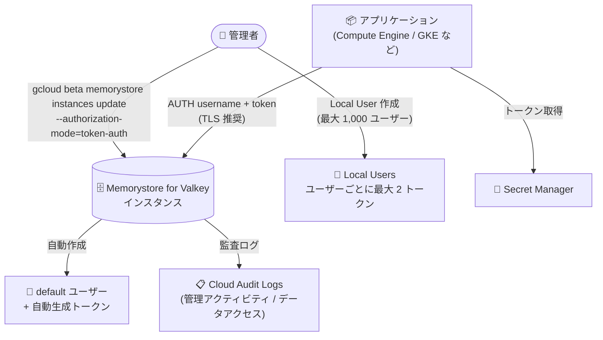

# Memorystore for Valkey: 基本トークンベース認証が一般提供 (GA) に

**リリース日**: 2026-09-18

**サービス**: Memorystore for Valkey

**機能**: 基本トークンベース認証 (Basic token-based authentication)

**ステータス**: GA (一般提供)

📊 [このアップデートのインフォグラフィックを見る](https://takech9203.github.io/google-cloud-news-summary/20260918-memorystore-valkey-basic-token-authentication-ga.html)

## 概要

Memorystore for Valkey の基本トークンベース認証 (basic token-based authentication) が一般提供 (GA) となりました。この機能は、IAM 認証に加えて利用できる軽量な認証方式で、クライアントがユーザー名と認証トークンを使用してインスタンスへのアクセスを認証します。リソース要件が最小限でオーバーヘッドが小さいことが特徴です。

基本トークンベース認証では、デフォルトユーザーはトークンのみで認証でき、それ以外のユーザーは標準的なユーザー名とトークンの組み合わせで認証します。1 インスタンスあたり最大 1,000 の Local User を管理でき、ユーザーごとに最大 2 つの認証トークンを保持できるため、アプリケーションを停止させることなくトークンをローテーションできます。

Memorystore for Redis やオンプレミス環境で既にパスワード (トークン) ベースの認証を使用しているワークロードにとって、Memorystore for Valkey への移行をスムーズにする互換性の高い選択肢となります。デフォルトのスーパーユーザーの権限も維持されるため、既存ワークロードとの後方互換性が確保されます。

**アップデート前の課題**

- 基本トークンベース認証は Preview として提供されており、GA の SLA を前提とする本番ワークロードでの採用が難しかった
- IAM 認証はアクセス トークンの有効期限 (デフォルト 1 時間) 管理やトークン取得の自動化が必要で、シンプルなパスワード認証を使う既存の Redis / オンプレミス ワークロードからの移行に追加の改修が必要だった
- IAM 認証は新規接続ごとに IAM での認証が必要なため、接続確立レートがスロットリングされる特性があった

**アップデート後の改善**

- 基本トークンベース認証が GA となり、本番環境で安心して利用できるようになった
- ユーザー名とトークンによる軽量でクライアント互換性の高い認証方式を、新規・既存インスタンスでいつでも有効化できる
- ユーザーごとに 2 つのトークンを保持できるため、ゼロダウンタイムでのトークン ローテーションが可能
- Memorystore for Redis からの移行時に、既存の AUTH ベースのアプリケーション実装をほぼそのまま活用できる

## アーキテクチャ図



管理者がインスタンスでトークン認証を有効化するとデフォルト ユーザーとトークンが自動作成され、アプリケーションは Secret Manager から取得したトークンで認証して接続します。トークン関連の操作は Cloud Audit Logs に記録されます。

## サービスアップデートの詳細

### 主要機能

1. **2 つの認証モード**
   - **シンプル認証**: デフォルト ユーザーがトークンのみを送信して認証するシンプルな方式
   - **マルチユーザー認証**: 複数の Local User を作成・管理し、ユーザー名とトークンでインスタンスへのアクセスを認証

2. **ゼロダウンタイムのトークン ローテーション**
   - ユーザーごとに最大 2 つの認証トークンを保持可能
   - 新しいトークンを追加 → アプリケーションを新トークンに更新 → 古いトークンを削除、という手順で無停止ローテーションを実現

3. **インスタンス / ユーザー / トークンのライフサイクル管理**
   - トークン認証を有効にしたインスタンスの作成、既存インスタンスでの有効化
   - Local User の作成・一覧表示・詳細確認・削除 (最大 1,000 ユーザー)
   - 認証トークンの作成・一覧表示・詳細確認・削除

4. **監査ログ対応**
   - 認証トークンおよびユーザーに関する操作について、管理アクティビティ監査ログとデータアクセス監査ログを生成

## 技術仕様

### 基本トークンベース認証の仕様

| 項目 | 詳細 |
|------|------|
| 認証方式 | ユーザー名 + 認証トークン (デフォルト ユーザーはトークンのみ) |
| Local User 数 | 最大 1,000 ユーザー / インスタンス |
| トークン数 | 最大 2 トークン / ユーザー (ローテーション用) |
| デフォルト ユーザー | 有効化時に自動作成、トークンも自動生成 |
| 認証モードの変更 | 一度有効化すると無効化・変更は不可 |
| 既存接続への影響 | 有効化時、既存接続は影響を受けない (新規接続から認証が必須) |
| 監査ログ | 管理アクティビティ / データアクセス監査ログを生成 |

## 設定方法

### 前提条件

1. Memorystore for Valkey インスタンスを作成できる権限があること
2. gcloud CLI がインストール済みであること (トークン認証関連コマンドは `gcloud beta` を使用)

### 手順

#### ステップ 1: トークン認証を有効にしたインスタンスの作成 (または既存インスタンスで有効化)

```bash
# 新規インスタンスをトークン認証付きで作成
gcloud beta memorystore instances create INSTANCE_ID \
  --location=REGION \
  --authorization-mode=token-auth

# 既存インスタンスでトークン認証を有効化
gcloud beta memorystore instances update INSTANCE_ID \
  --location=REGION \
  --authorization-mode=token-auth
```

有効化すると、Memorystore for Valkey がデフォルト ユーザーを作成し、認証トークンを自動生成します。

#### ステップ 2: トークンのローテーション (ゼロダウンタイム)

```bash
# ユーザーに 2 つ目のトークンを追加
gcloud beta memorystore instances token-auth-users create-auth-token USERNAME \
  --instance=INSTANCE_ID \
  --location=REGION

# トークンの一覧を確認
gcloud beta memorystore instances token-auth-users auth-tokens list \
  --token-auth-user=USERNAME \
  --instance=INSTANCE_ID \
  --location=REGION
```

新しいトークンをアプリケーションに反映した後、古いトークンを削除することで無停止でローテーションできます。

#### ステップ 3: インスタンスへの接続

```bash
# URI 文字列で接続
valkey-cli -u redis://USERNAME:TOKEN@IP_ADDRESS:PORT

# フラグで接続
valkey-cli --user USERNAME -a TOKEN -h IP_ADDRESS -p PORT
```

## メリット

### ビジネス面

- **移行の容易さ**: Memorystore for Redis やオンプレミスで基本認証を使う既存ワークロードを、大きな改修なしに Memorystore for Valkey へ移行できる
- **GA による本番適用**: 一般提供となったことで、本番環境のセキュリティ要件を満たす認証方式として正式に採用できる

### 技術面

- **軽量・低オーバーヘッド**: リソース要件が最小限で、IAM 認証のようなトークン有効期限管理の仕組みをアプリケーション側に実装する必要がない
- **ゼロダウンタイム ローテーション**: ユーザーあたり 2 トークンの仕組みにより、アプリケーションを停止せずに認証情報を更新できる
- **柔軟な有効化**: 新規・既存どちらのインスタンスでも、任意のタイミングで有効化できる (既存接続には影響なし)
- **監査性**: トークンとユーザーに関する操作が Cloud Audit Logs に記録され、コンプライアンス対応に活用できる

## デメリット・制約事項

### 制限事項

- 一度基本トークンベース認証を有効化すると、この認証モードを無効化・変更することはできない
- Local User は 1 インスタンスあたり最大 1,000 ユーザーまで
- 認証トークンはユーザーあたり最大 2 つまで (3 つ目を作成するには既存トークンの削除が必要)
- Google Cloud コンソールによる基本トークンベース認証の管理は、同日の Release Notes で Preview として案内されている

### 考慮すべき点

- 有効化後の新規接続には認証が必須となるため、アプリケーションの接続処理を更新するまで新規接続がダウンタイムとなる可能性がある (既存接続は影響なし)
- ユーザー名とトークンが平文でネットワークを流れないよう、in-transit encryption (TLS) との併用が推奨される
- トークンをアプリケーション コードにハードコードせず、Secret Manager に保管してランタイムに取得することが推奨される
- IAM ベースの集中的なアクセス制御が必要な場合は、引き続き IAM 認証の利用を検討する

## ユースケース

### ユースケース 1: Memorystore for Redis から Memorystore for Valkey への移行

**シナリオ**: Memorystore for Redis で AUTH (パスワード認証) を使用している既存アプリケーションを Memorystore for Valkey に移行したい。

**実装例**:
```bash
gcloud beta memorystore instances create valkey-prod \
  --location=asia-northeast1 \
  --authorization-mode=token-auth
```

**効果**: 既存のパスワード認証ベースの接続実装をほぼそのまま流用でき、IAM トークン取得の自動化などの追加改修なしで移行できる。デフォルト スーパーユーザーの権限も維持されるため後方互換性が高い。

### ユースケース 2: マルチユーザー環境でのアクセス管理とトークン ローテーション

**シナリオ**: 複数のアプリケーション / チームが 1 つの Valkey インスタンスを共有しており、それぞれに個別の認証情報を発行し、定期的にローテーションしたい。

**効果**: アプリケーションごとに Local User を作成して認証情報を分離でき、2 トークン方式によりアプリケーションを停止せずに定期ローテーション ポリシーを運用できる。操作は監査ログに記録されるため、コンプライアンス要件にも対応しやすい。

## 料金

基本トークンベース認証機能自体の追加料金に関する情報は Release Notes およびドキュメントに記載されていません。Memorystore for Valkey インスタンスの料金については、料金ページを参照してください。

- [Memorystore for Valkey の料金](https://cloud.google.com/memorystore/docs/valkey/pricing)

## 関連サービス・機能

- **IAM 認証 (Memorystore for Valkey)**: IAM ポリシーで集中的にアクセス管理する認証方式。基本トークンベース認証はこれに対する軽量な代替手段
- **Secret Manager**: 認証トークンの安全な保管と取得に推奨。IAM によるアクセス制御と自動監査ログを提供
- **In-transit encryption (TLS)**: ユーザー名・トークンの平文送信を防ぐため、基本トークンベース認証との併用が推奨される
- **Cloud Audit Logs**: トークンとユーザーの操作に関する管理アクティビティ / データアクセス監査ログを記録
- **Memorystore for Redis Cluster**: 同日の Release Notes で、コンソールによる基本トークンベース認証の設定が Preview として発表されている

## 参考リンク

- 📊 [インフォグラフィック](https://takech9203.github.io/google-cloud-news-summary/20260918-memorystore-valkey-basic-token-authentication-ga.html)
- [公式リリースノート](https://docs.cloud.google.com/release-notes#September_18_2026)
- [基本トークンベース認証の管理 (ドキュメント)](https://docs.cloud.google.com/memorystore/docs/valkey/manage-basic-auth)
- [IAM 認証について (ドキュメント)](https://docs.cloud.google.com/memorystore/docs/valkey/about-iam-auth)
- [料金ページ](https://cloud.google.com/memorystore/docs/valkey/pricing)

## まとめ

Memorystore for Valkey の基本トークンベース認証が GA となり、軽量で互換性の高い認証方式を本番環境で正式に利用できるようになりました。特に Memorystore for Redis やオンプレミスからの移行を検討しているチームにとって、移行障壁を大きく下げるアップデートです。採用にあたっては、認証モードが有効化後に変更できない点を踏まえ、TLS と Secret Manager を併用したセキュアな構成での導入を推奨します。

---

**タグ**: #Memorystore #Valkey #認証 #セキュリティ #GA
