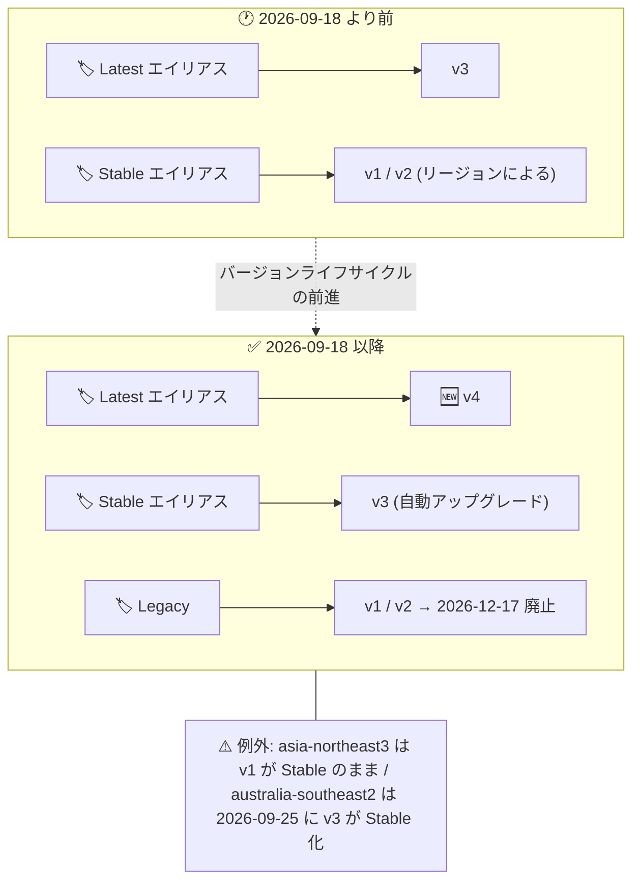

# Model Armor: フィルタバージョン v4 リリースと v3 の Stable 昇格

**リリース日**: 2026-09-18

**サービス**: Model Armor

**機能**: フィルタバージョン v4 の提供開始 (Latest エイリアス) および v3 の Stable エイリアス昇格

**ステータス**: 一般提供 (Feature)

📊 [このアップデートのインフォグラフィックを見る](https://takech9203.github.io/google-cloud-news-summary/20260918-model-armor-filter-version-v4.html)

## 概要

Model Armor の新しいフィルタバージョン **v4** が利用可能になり、**Latest エイリアスのデフォルト**として設定されました。同時に、フィルタバージョン **v3 が Stable エイリアスに昇格**しました。Stable への昇格はサポート対象の全リージョンで実施されますが、asia-northeast3 (ソウル) では v1 が引き続き Stable のままとなり、australia-southeast2 (メルボルン) では 2026 年 9 月 25 日に v3 が Stable になります。

Model Armor はフィルタを使用して、LLM のプロンプトとレスポンスに含まれる有害コンテンツ、機密データ、悪意のある URL、プロンプトインジェクション攻撃を検出・ブロックするサービスです。フィルタバージョンはテンプレートレベルで設定され、`Latest` / `Stable` / `Legacy` / `Retired` というライフサイクルエイリアスで管理されます。テンプレートで Stable エイリアスを使用している場合、そのリージョンで v3 が Stable になった時点で自動的に v3 にアップグレードされます。

重要な注意点として、フィルタバージョン **v1** (asia-northeast3 を除く。australia-southeast2 では 2026 年 9 月 25 日以降) と **v2** は Legacy ステータスに移行し、**2026 年 12 月 17 日に廃止 (Retire)** されます。テンプレートで v1 または v2 を明示的に指定している場合は、廃止日までに v3 または Stable エイリアスへの移行が必要です。

**アップデート前の課題**

- Latest エイリアスは v3 を指しており、v3 リリース (2026 年 5 月 25 日) 以降の最新の検出モデルを利用する手段がなかった
- Stable エイリアスは多くのリージョンで v1 (2025 年 1 月 30 日リリース) または v2 (2025 年 6 月 19 日リリース) を指しており、本番環境向けの安定版としては古い検出モデルのままだった
- v3 では、プロンプトインジェクション / ジェイルブレイク検出フィルタの誤検知 (false positive) の大幅削減や検出精度向上が図られていたが、Stable 利用者はその恩恵を受けられなかった

**アップデート後の改善**

- 新フィルタバージョン v4 が Latest エイリアスのデフォルトとなり、最新の脅威検出モデルをテスト・ステージング環境などで利用可能になった
- v3 が Stable に昇格したことで、Stable エイリアスを使用する本番環境のテンプレートは自動的に v3 (誤検知削減・検出精度向上済みのモデル) にアップグレードされる
- バージョンライフサイクルが前進し、v1 / v2 の廃止日 (2026 年 12 月 17 日) が明確化された (2026 年 9 月 2 日のリリースノートでは 2026 年 11 月 29 日廃止と案内されていたが、今回のリリースノートで 12 月 17 日に更新)

## アーキテクチャ図



今回のアップデートによるエイリアスとフィルタバージョンの対応関係の変化を示しています。Stable エイリアスを使うテンプレートは自動的に v3 に移行し、v1 / v2 を明示指定しているテンプレートは 2026 年 12 月 17 日までに移行が必要です。

## サービスアップデートの詳細

### 主要機能

1. **フィルタバージョン v4 の提供開始 (Latest エイリアスのデフォルト)**
   - 2026 年 9 月 18 日リリース。Latest エイリアスを指定したテンプレートは v4 を使用する
   - Latest エイリアスは最新のモデルと保護機能を備え、新たな脅威に対して頻繁に更新される。テストやステージング、最新の検出モデルを優先するワークロードに適する
   - v4 のサポートリージョン: asia-northeast1、asia-south1、asia-southeast1、eu、europe-southwest1、europe-west1、europe-west2、europe-west3、europe-west4、europe-west9、northamerica-northeast2、us、us-central1、us-east1、us-east4、us-west1

2. **v3 の Stable エイリアス昇格**
   - サポート対象の全リージョンで v3 が Stable に昇格 (例外: asia-northeast3 では v1 が Stable のまま、australia-southeast2 では 2026 年 9 月 25 日に v3 が Stable 化)
   - Stable エイリアスを使用するテンプレートは、そのリージョンで v3 が Stable になった時点で自動的に v3 にアップグレードされる (テンプレートの変更は不要)
   - v3 は 2026 年 5 月 25 日のリリース以降、プロンプトインジェクション / ジェイルブレイク検出フィルタと責任ある AI (Responsible AI) フィルタの更新が段階的に行われており、誤検知の大幅削減、検出精度の向上、多様な攻撃ベクトルへの緩和強化が図られている (最新の更新は 2026 年 9 月 18 日の誤検知対応)

3. **v1 / v2 の Legacy 移行と廃止スケジュール**
   - v1 (asia-northeast3 を除く。australia-southeast2 では 2026 年 9 月 25 日以降) と v2 は Legacy ステータスに移行
   - **2026 年 12 月 17 日に廃止 (Retire)**。Legacy 状態のリージョンで v1 / v2 を明示的に指定しているテンプレートは、それまでに v3 または Stable エイリアスへの移行が必須
   - Retired になったバージョンを使い続けるテンプレートへの sanitize 呼び出しには、Stable バージョンが適用される

## 技術仕様

### バージョンリリースタイムライン

| バージョン | エイリアス | リリース日 | 廃止日 |
|-----------|-----------|-----------|--------|
| v1 | Legacy (asia-northeast3 では Stable、australia-southeast2 では 2026-09-25 から Legacy) | 2025-01-30 | 2026-12-17 |
| v2 | Legacy | 2025-06-19 | 2026-12-17 |
| v3 | Stable (australia-southeast2 では 2026-09-25 から Stable) | 2026-05-25 | — |
| v4 | Latest | 2026-09-18 | — |

### バージョンエイリアスの仕様

| エイリアス | 説明 |
|-----------|------|
| Latest | 最新のモデルと保護機能。頻繁に更新され、安定性はバージョンにより変動しうる。テスト・ステージング向け |
| Stable | デフォルトのエイリアス。一貫した検出ロジックを提供し、本番環境向け。新バージョンが Stable になると自動的に切り替わる |
| Legacy | 旧 Stable バージョン。新 Stable リリース後 90 日間利用可能。Legacy バージョンで新規テンプレートは作成不可 |
| Retired | Legacy 期間 (90 日) を超えて利用不可になったバージョン。Retired バージョンを使うテンプレートには Stable が適用される |

補足事項:

- フィルタバージョンはテンプレート単位で 1 つ設定する。フィルタごとに異なるバージョンは指定できない
- バージョン未指定のテンプレートは Stable バージョンがデフォルトで適用される
- フィルタバージョン設定は、Sensitive Data Protection フィルタと悪意のある URL フィルタには影響しない
- バージョンのライフサイクル変更 (Legacy 化や廃止予定日) は、sanitize API のレスポンスで通知される

### テンプレートでのバージョン指定例

```bash
export TEMPLATE_CONFIG='{
  "filterConfig": {
    "piAndJailbreakFilterSettings": {
      "filterEnforcement": "ENABLED"
    }
  },
  "templateMetadata": {
    "filterVersionSelector": {
      "alias": "FILTER_VERSION_ALIAS"
    }
  }
}'

curl -X POST \
  -H "Authorization: Bearer $(gcloud auth print-access-token)" \
  -H "Content-Type: application/json" \
  -d "$TEMPLATE_CONFIG" \
  "https://modelarmor.LOCATION.rep.googleapis.com/v1/projects/PROJECT_ID/locations/LOCATION/templates?template_id=TEMPLATE_ID"
```

`FILTER_VERSION_ALIAS` には `FILTER_VERSION_ALIAS_STABLE` または `FILTER_VERSION_ALIAS_LATEST` を指定します。

## 設定方法

### 前提条件

1. Model Armor が有効化された Google Cloud プロジェクト
2. Model Armor テンプレートの作成・更新権限

### 手順

#### ステップ 1: 既存テンプレートのバージョン設定を確認

テンプレートで v1 / v2 を明示的に指定していないか確認します。Legacy 状態のリージョンで v1 / v2 を明示指定している場合は移行対象です。sanitize API のレスポンスにもバージョンのライフサイクル通知 (Legacy 化・廃止予定日) が含まれるため、あわせて確認します。

#### ステップ 2: v3 または Stable エイリアスへ移行

v1 / v2 を明示指定しているテンプレートは、2026 年 12 月 17 日までに v3 または Stable エイリアスに更新します。Stable エイリアスを使用すれば、今後の Stable 昇格時にも自動的に新バージョンへ移行されます。

#### ステップ 3: v4 (Latest) の評価 (任意)

最新の検出モデルを評価したい場合は、テスト・ステージング環境のテンプレートで Latest エイリアスを指定し、v4 の検出挙動を本番導入前に確認します。

## メリット

### ビジネス面

- **本番環境の保護強化**: Stable エイリアス利用者は、誤検知削減と検出精度向上が図られた v3 に自動アップグレードされ、運用負荷なしで AI アプリケーションの保護品質が向上する
- **計画的な移行が可能**: v1 / v2 の廃止日 (2026 年 12 月 17 日) が明示されており、移行計画を立てやすい

### 技術面

- **エイリアスによる自動バージョン管理**: Stable エイリアスを使用していればテンプレート変更なしで新バージョンに追従でき、バージョン管理の手間が削減される
- **最新脅威への対応**: Latest エイリアス (v4) により、新たな脅威に対する最新の検出モデルをいち早く利用できる

## デメリット・制約事項

### 制限事項

- asia-northeast3 (ソウル) では v1 が引き続き Stable であり、v3 / v4 は利用できない
- australia-southeast2 (メルボルン) で v3 が Stable になるのは 2026 年 9 月 25 日
- フィルタバージョンはテンプレート単位の設定であり、フィルタごとに異なるバージョンは指定できない
- Legacy バージョンでは新規テンプレートを作成できない

### 考慮すべき点

- **移行期限**: v1 / v2 を明示指定しているテンプレートは 2026 年 12 月 17 日までに v3 または Stable への移行が必須。放置すると Retired 後は Stable バージョンで sanitize が実行される
- **自動アップグレードによる挙動変化**: Stable エイリアス利用時は v3 への自動アップグレードで検出挙動 (誤検知/検出率) が変わる可能性があるため、フィルタ結果のモニタリングを推奨
- **Latest の安定性**: Latest (v4) は頻繁に更新されるため、一貫したフィルタ挙動が求められる本番ワークロードには Stable の利用が適する

## ユースケース

### ユースケース 1: 本番テンプレートの v1 / v2 からの計画的移行

**シナリオ**: 本番の生成 AI アプリケーションで Model Armor テンプレートに v1 を明示指定しているが、2026 年 12 月 17 日の廃止が迫っている。

**実装例**:
```json
{
  "templateMetadata": {
    "filterVersionSelector": {
      "alias": "FILTER_VERSION_ALIAS_STABLE"
    }
  }
}
```

**効果**: Stable エイリアスへの切り替えにより、v3 (誤検知削減済みモデル) へ移行しつつ、今後の Stable 昇格にも自動追従できる。廃止期限のたびに手動移行する必要がなくなる。

### ユースケース 2: ステージング環境での v4 (Latest) の先行評価

**シナリオ**: セキュリティチームが、最新の検出モデル v4 の検出率・誤検知率を本番導入前に評価したい。

**効果**: ステージング環境のテンプレートで Latest エイリアスを指定して v4 の挙動を検証し、将来 v4 が Stable に昇格した際の本番への影響を事前に把握できる。

## 料金

Model Armor はスタンドアロンのサービスとして、または Security Command Center の一部として利用できます。料金は AI プロンプトとレスポンスに含まれるトークンの合計数に基づいて計算されます。フィルタバージョンの選択自体による追加料金の記載はありません。詳細は以下の公式料金ページを参照してください。

- [Model Armor の料金](https://cloud.google.com/security/products/model-armor#pricing)
- [Security Command Center における Model Armor の料金](https://cloud.google.com/security-command-center/pricing#model-armor-in-security-command-center)

## 利用可能リージョン

v4 (Latest) のサポートリージョン:

- asia-northeast1、asia-south1、asia-southeast1
- australia-southeast2 は対象外 (2026 年 9 月 25 日に v3 が Stable 化)
- eu (マルチリージョン)、europe-southwest1、europe-west1、europe-west2、europe-west3、europe-west4、europe-west9
- northamerica-northeast2
- us (マルチリージョン)、us-central1、us-east1、us-east4、us-west1

v3 (Stable) のサポートリージョンは上記に加えて australia-southeast2 (2026 年 9 月 25 日から Stable)。asia-northeast3 では v1 が Stable のままです。

## 関連サービス・機能

- **Sensitive Data Protection**: Model Armor の機密データ検出フィルタとして統合されているが、フィルタバージョン設定の影響を受けない
- **Security Command Center**: Model Armor を統合機能として利用でき、料金体系も SCC 経由の選択肢がある
- **Gemini Enterprise Agent Platform / Agent Gateway**: Model Armor と統合されており、フロア設定はデフォルトで Stable フィルタバージョンを使用する (テンプレート指定で上書き可能)
- **Cloud Logging**: フィルタの検出イベントのロギング先。バージョン移行時の挙動変化のモニタリングに活用できる

## 参考リンク

- 📊 [インフォグラフィック](https://takech9203.github.io/google-cloud-news-summary/20260918-model-armor-filter-version-v4.html)
- [公式リリースノート](https://docs.cloud.google.com/release-notes#September_18_2026)
- [Model Armor リリースノート](https://docs.cloud.google.com/model-armor/release-notes)
- [フィルタバージョンの設定 (バージョンリリースタイムライン)](https://docs.cloud.google.com/model-armor/set-filter-version#release-timeline)
- [Model Armor フィルタバージョン履歴](https://docs.cloud.google.com/model-armor/version-history#release-history)
- [Model Armor 概要](https://docs.cloud.google.com/model-armor/overview)
- [料金ページ](https://cloud.google.com/security/products/model-armor#pricing)

## まとめ

Model Armor のフィルタバージョンライフサイクルが前進し、v4 が Latest、v3 が Stable となりました。Stable エイリアス利用者は自動的に誤検知削減済みの v3 へ移行されますが、v1 / v2 を明示指定しているテンプレートは 2026 年 12 月 17 日の廃止までに v3 または Stable エイリアスへの移行が必須です。まずは既存テンプレートのバージョン設定を棚卸しし、移行計画を立てることを推奨します。

---

**タグ**: #ModelArmor #セキュリティ #生成AI #プロンプトインジェクション #フィルタバージョン #LLMセキュリティ
