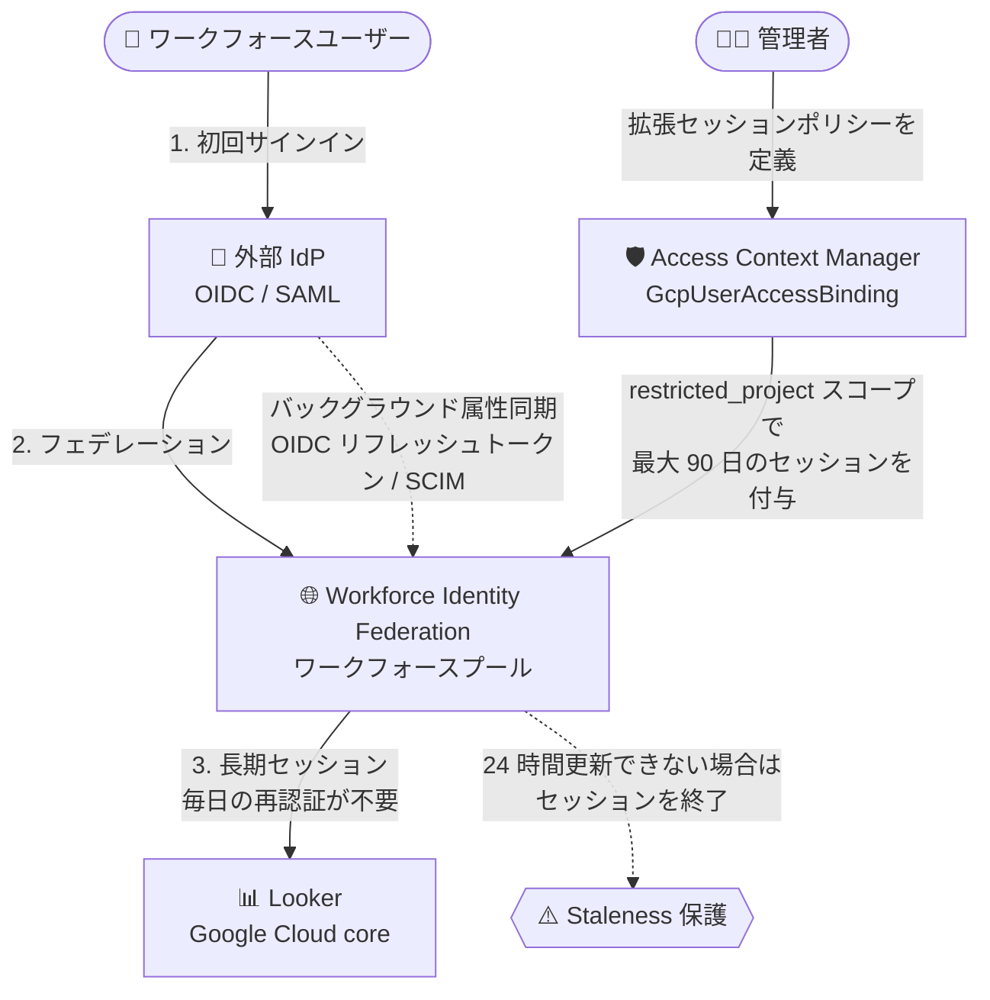

# Access Context Manager: Workforce Identity Federation の拡張セッション長 (Preview)

**リリース日**: 2026-09-21

**サービス**: Access Context Manager

**機能**: Workforce Identity Federation 向け拡張セッション長 (Extended Session Length)

**ステータス**: Preview (Looker (Google Cloud core) のお客様向け)

📊 [このアップデートのインフォグラフィックを見る](https://takech9203.github.io/google-cloud-news-summary/20260921-access-context-manager-extended-session-length-wif.html)

## 概要

Access Context Manager が、Workforce Identity Federation の拡張セッション長 (Extended Session Length) をサポートしました。本機能は Looker (Google Cloud core) のお客様向けに Preview として提供されます。

Workforce Identity Federation のセッションはデフォルトで最大 12 時間に制限されていますが、拡張セッション長を利用すると、Looker (Google Cloud core) 向けに最大 90 日間の長期セッションを構成できます。これにより、外部 ID プロバイダ (IdP) に対する毎日の再認証を行うことなく、ワークフォースユーザーが Looker (Google Cloud core) への接続を中断なく維持できます。Looker (Google Cloud core) 内でのユーザー操作は、引き続き Looker (Google Cloud core) 側のセッション長設定によって管理されます。

長期セッション中のセキュリティを維持するため、Google Cloud はバックグラウンドで外部 IdP からユーザー属性とグループメンバーシップを定期的に同期します。24 時間以内に属性を更新できない場合 (IdP 側でユーザーが削除された、認証情報が失効した、など) は、セッションが自動的に無効化されます。

**アップデート前の課題**

- Workforce Identity Federation のセッションは最大 12 時間に制限されており、Looker (Google Cloud core) を利用するワークフォースユーザーは毎日外部 IdP に対して再認証する必要があった
- 長時間のダッシュボード利用や継続的な分析業務において、セッション切れによる作業の中断が発生していた

**アップデート後の改善**

- Access Context Manager の Google Cloud アクセスバインディング (`GcpUserAccessBinding`) を使用して、最大 90 日間 (最小 1 時間) の拡張セッションを構成できるようになった
- `restricted_project` スコープにより、指定したプロジェクトが所有する Looker (Google Cloud core) インスタンスのみにポリシーを適用でき、他のアプリケーションには影響を与えない
- バックグラウンド属性同期 (OIDC リフレッシュトークンまたは SCIM プロビジョニング) と 24 時間の staleness 保護により、長期セッションでもセキュリティを維持できる

## アーキテクチャ図



管理者が Access Context Manager でプロジェクトスコープ付きの拡張セッションポリシーを定義すると、対象プロジェクトの Looker (Google Cloud core) に対して最大 90 日のセッションが有効になります。セキュリティ維持のため、外部 IdP からの属性同期がバックグラウンドで継続され、24 時間更新できない場合はセッションが終了します。

## サービスアップデートの詳細

### 主要機能

1. **Google Cloud アクセスバインディングによる拡張セッション構成**
   - 管理者は Access Context Manager を使用して、組織内のすべてのワークフォースプールに組織全体で適用されるセッション長ポリシーを定義する
   - `restricted_project` クライアントスコープを使用することで、指定プロジェクトが所有する Looker (Google Cloud core) インスタンスのみに最大 90 日の拡張セッションを付与できる
   - 他のアプリケーション (および他プロジェクトが所有する Looker (Google Cloud core)) はポリシーの影響を受けない

2. **バックグラウンド属性同期**
   - OIDC: `offline_access` スコープ付きの Authorization Code フロー (リフレッシュトークンを使用して外部 IdP からユーザー属性とグループメンバーシップをバックグラウンドで定期更新)、または SCIM プロビジョニングをサポート
   - SAML: SCIM プロビジョニングによりユーザー属性とグループメンバーシップを最新に維持

3. **Staleness 保護 (属性の陳腐化対策)**
   - 24 時間以内に外部 IdP からユーザー属性を更新できない場合 (ユーザーのデプロビジョニングや認証情報の失効など)、Google Cloud がセッションを終了する
   - 固定の 24 時間しきい値が適用され、再認証が必要になる

## 技術仕様

### セッション設定の要件

| 項目 | 詳細 |
|------|------|
| 対象アプリケーション | Looker (Google Cloud core) のみ |
| セッション長の範囲 | 最小 1 時間 (`3600s`) 〜 最大 90 日 (`7776000s`) |
| `session_length_enabled` | `true` に設定必須 |
| `session_reauth_method` | 未設定または `LOGIN` |
| `use_oidc_max_age` | 未設定または `false` |
| `max_inactivity` | 未設定 (デフォルト `0s`)。`restricted_project` バインディングではアイドルタイムアウト非サポート |
| スコープ | `scopedAccessSettings` 内の `restricted_project` クライアントスコープが必須 (`projects/{PROJECT_NUMBER}`) |
| 属性の staleness しきい値 | 固定 24 時間。超過するとセッション無効化・再認証が必要 |

### サポートされる ID プロバイダ

| プロトコル | 要件 |
|-----------|------|
| OIDC | Authorization Code フロー + `offline_access` スコープ (リフレッシュトークン発行)、または SCIM プロビジョニング |
| SAML 2.0 | ワークフォースプールプロバイダで SCIM プロビジョニングが有効であること |

### Access Context Manager の制約

- **組織あたり単一バインディング**: ワークフォースプール向けの拡張セッション長バインディングは、組織の「すべてのワークフォースプール」プリンシパル (`principalSet://cloudresourcemanager.googleapis.com/organizations/{ORG_ID}/type/WorkforcePool`) を対象とする必要があり、組織ごとに 1 つのみ作成可能
- 複数の Looker (Google Cloud core) プロジェクトを対象にする場合は、単一バインディングの `scopedAccessSettings` リストに複数の `restricted_project` スコープブロックを含める
- ワークフォースプールバインディングではアクセスレベル (`access_levels`、`dry_run_access_levels`) は非サポート
- `GcpUserAccessBinding` 直下のトップレベル `sessionSettings` は非サポート。設定は `scopedAccessSettings.activeSettings.sessionSettings` 内に定義する必要がある

## 設定方法

### 前提条件

1. 必要な IAM ロールの付与
   - ワークフォースプールプロバイダの構成: Workforce Pool Admin (`roles/iam.workforcePoolAdmin`) — ワークフォースプールまたは組織に対して
   - アクセスバインディングの管理: Cloud Access Binding Admin (`roles/accesscontextmanager.gcpAccessAdmin`) — 組織レベルで
2. Access Context Manager API と IAM API の有効化

```bash
gcloud services enable \
    accesscontextmanager.googleapis.com \
    iam.googleapis.com
```

### 手順

#### ステップ 1: ワークフォースプールプロバイダの構成

OIDC プロバイダでリフレッシュトークンベースの属性更新を使用する場合、外部 IdP 側で Authorization Code フローと Offline Access を有効にした上で、Google Cloud 側のプロバイダに `offline_access` スコープを追加します。

```bash
gcloud iam workforce-pools providers update-oidc PROVIDER_ID \
    --workforce-pool=WORKFORCE_POOL_NAME \
    --location=global \
    --web-sso-additional-scopes="offline_access[,EXISTING_ADDITIONAL_SCOPES]"
```

**注意**: 拡張セッション長ポリシーを意図どおりに機能させるには、組織内のすべてのワークフォースアイデンティティプールで offline access を構成する必要があります。構成されていないプールに属するフェデレーションユーザーは、ポリシーで指定した期間より早くログアウトされる可能性があります。

SAML プロバイダの場合は、ワークフォースプールプロバイダの SCIM テナントをセットアップし、SAML IdP から SCIM エンドポイントへのユーザー・グループプロビジョニングを構成します。

#### ステップ 2: 拡張セッションポリシーの定義とバインディング作成

ポリシーを YAML ファイル (`esl-binding.yaml`) に定義します。

```yaml
scopedAccessSettings:
- scope:
    clientScope:
      restrictedProject:
        name: projects/PROJECT_NUMBER
  activeSettings:
    sessionSettings:
      sessionLength: 7776000s
      sessionLengthEnabled: true
      sessionReauthMethod: LOGIN
```

アクセスバインディングを作成します。

```bash
gcloud access-context-manager cloud-bindings create \
    --organization=ORG_ID \
    --federated-principal="principalSet://cloudresourcemanager.googleapis.com/organizations/ORG_ID/type/WorkforcePool" \
    --binding-file="esl-binding.yaml"
```

`PROJECT_NUMBER` は対象の Looker (Google Cloud core) インスタンスを所有するプロジェクト番号、`7776000s` は 90 日のセッション長を表します。

#### ステップ 3: バインディングの管理

```bash
# バインディングの一覧表示
gcloud access-context-manager cloud-bindings list \
    --organization=ORG_ID \
    --filter="principal:federatedPrincipal"

# バインディングの更新 (既存スコープに追加する場合は --append)
gcloud access-context-manager cloud-bindings update \
    --binding=BINDING_NAME \
    --binding-file="updated-esl-binding.yaml" \
    --append

# バインディングの削除 (組織内すべてのワークフォースプールで拡張セッション長が無効化される)
gcloud access-context-manager cloud-bindings delete \
    --binding=BINDING_NAME
```

## メリット

### ビジネス面

- **ユーザー体験の向上**: Looker (Google Cloud core) を日常的に利用するアナリストやビジネスユーザーが、毎日の再認証なしで最大 90 日間業務を継続でき、生産性が向上する
- **段階的な適用**: プロジェクト単位でポリシーを適用できるため、特定の Looker (Google Cloud core) インスタンスから限定的に導入し、影響範囲をコントロールできる

### 技術面

- **セキュリティを維持した長期セッション**: バックグラウンドでの属性・グループメンバーシップ同期と 24 時間の staleness 保護により、IdP 側でのユーザー削除や権限変更が長期セッション中にも反映される
- **スコープの厳密な制御**: `restricted_project` スコープにより、拡張セッションが Looker (Google Cloud core) 以外のアプリケーションや他プロジェクトに波及しない
- **既存の WIF 構成との統合**: 既存のワークフォースプール・プロバイダ構成に `offline_access` スコープや SCIM プロビジョニングを追加するだけで利用を開始できる

## デメリット・制約事項

### 制限事項

- Preview 段階の機能であり、対象は Looker (Google Cloud core) のみ。他のアプリケーションには適用されない
- 組織ごとに 1 つのワークフォースプール向けバインディングしか作成できない (複数プロジェクトは単一バインディング内の複数スコープで対応)
- `restricted_project` バインディングではアイドルセッションタイムアウト (`max_inactivity`) が非サポート
- ワークフォースプールバインディングではアクセスレベルが非サポート

### 考慮すべき点

- 組織内のすべてのワークフォースプールで offline access (OIDC) または SCIM (SAML) を構成しないと、一部ユーザーがポリシーの指定より早くログアウトされる可能性がある
- 長期セッションはトークン盗難などのリスクを増加させ得るため、Workforce Identity Federation のベストプラクティスでは一般にセッション長を短く保つことが推奨されている。90 日などの長期設定を行う場合は、SCIM/リフレッシュトークンによる属性同期と監査ログ (Security Token Service API のデータアクセスログなど) の有効化を組み合わせて運用することが望ましい
- IdP 側で JIT (Just-in-Time) グループなどを利用している場合、セッション長とメンバーシップ反映のタイミングの関係に注意が必要

## ユースケース

### ユースケース 1: 経営ダッシュボードの常時表示

**シナリオ**: 経営層やオペレーションチームが、Looker (Google Cloud core) のダッシュボードをオフィスの大型ディスプレイや業務端末で常時表示している。従来は Workforce Identity Federation のセッションが最大 12 時間で切れるため、毎日外部 IdP への再認証が必要だった。

**実装例**:
```yaml
scopedAccessSettings:
- scope:
    clientScope:
      restrictedProject:
        name: projects/987654321098   # ダッシュボード用 Looker を所有するプロジェクト
  activeSettings:
    sessionSettings:
      sessionLength: 7776000s          # 90 日
      sessionLengthEnabled: true
      sessionReauthMethod: LOGIN
```

**効果**: 再認証によるダッシュボードの中断がなくなり、IdP 側でユーザーを無効化すれば 24 時間以内にセッションが終了するため、セキュリティも担保される。

### ユースケース 2: 複数の Looker (Google Cloud core) プロジェクトへの段階的な適用

**シナリオ**: 部門ごとに Looker (Google Cloud core) インスタンスを別プロジェクトで運用している組織が、分析部門のプロジェクトのみ 30 日の拡張セッションを先行導入し、その後他部門に展開したい。

**効果**: 単一の組織バインディングに `restricted_project` スコープブロックを追加していく (`--append`) ことで、部門単位・プロジェクト単位で拡張セッションの適用範囲とセッション長 (例: `2592000s` = 30 日) を個別に制御できる。

## 料金

このアップデートに固有の料金情報は Release Notes およびドキュメントに記載されていません。本機能は Looker (Google Cloud core) のお客様向けの機能です。詳細は各サービスの料金ページを参照してください。

- [Looker (Google Cloud core) の料金](https://cloud.google.com/looker/pricing)

## 関連サービス・機能

- **Workforce Identity Federation (Cloud IAM)**: 外部 IdP のワークフォースユーザーを Google Cloud にフェデレーションする基盤。本機能はそのセッション長を Access Context Manager 経由で拡張する
- **Looker (Google Cloud core)**: 本 Preview の唯一の対象アプリケーション。Looker 内のユーザー操作は Looker 側のセッション長設定で管理される
- **SCIM プロビジョニング (Workforce Identity Federation)**: SAML プロバイダ (および OIDC の代替手段) でのバックグラウンド属性同期に必要
- **Cloud Audit Logs / Security Token Service API**: サインイン・トークン交換アクティビティの監査。長期セッション運用時の監視に推奨

## 参考リンク

- 📊 [インフォグラフィック](https://takech9203.github.io/google-cloud-news-summary/20260921-access-context-manager-extended-session-length-wif.html)
- [公式リリースノート](https://docs.cloud.google.com/release-notes#September_21_2026)
- [ドキュメント: Configure extended session length for Workforce Identity Federation](https://docs.cloud.google.com/access-context-manager/docs/extended-session-length-for-workforce-identity-federation)
- [Workforce Identity Federation の概要](https://docs.cloud.google.com/iam/docs/workforce-identity-federation)
- [Workforce Identity Federation のベストプラクティス](https://docs.cloud.google.com/iam/docs/best-practices-workforce-identity-federation)

## まとめ

Workforce Identity Federation の 12 時間というセッション上限は、Looker (Google Cloud core) を常用するユーザーにとって日次再認証の負担となっていましたが、本 Preview により最大 90 日の長期セッションをプロジェクトスコープで安全に構成できるようになりました。バックグラウンド属性同期と 24 時間の staleness 保護が組み込まれているため、利便性とセキュリティを両立できます。Looker (Google Cloud core) を Workforce Identity Federation で利用している組織は、まず全ワークフォースプールでの offline_access / SCIM 構成を確認した上で、対象プロジェクトを限定した検証から始めることを推奨します。

---

**タグ**: #AccessContextManager #WorkforceIdentityFederation #Looker #IAM #セキュリティ #Preview
