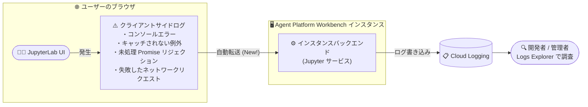

# Agent Platform Workbench: JupyterLab クライアントサイドログの Cloud Logging 転送

**リリース日**: 2026-09-21

**サービス**: Agent Platform Workbench

**機能**: JupyterLab クライアントサイドログの Cloud Logging 転送 (20260920.00_p0 リリース)

**ステータス**: リリース済み (Feature)

📊 [このアップデートのインフォグラフィックを見る](https://takech9203.github.io/google-cloud-news-summary/20260921-agent-platform-workbench-jupyterlab-client-log-forwarding.html)

## 概要

Agent Platform Workbench (Gemini Enterprise Agent Platform のノートブックコンポーネント、旧 Vertex AI Workbench) のインスタンスイメージリリース 20260920.00_p0 が公開された。このリリースでは、JupyterLab がクライアントサイド (ブラウザ側) で発生するログをインスタンスのバックエンドに転送し、Cloud Logging に表示する機能が追加された。

転送対象となるのは、コンソールエラー、キャッチされない例外 (uncaught exceptions)、未処理の Promise リジェクション (unhandled promise rejections)、失敗したネットワークリクエストの 4 種類である。これまでブラウザの開発者ツールでしか確認できなかったフロントエンド起因の問題を、Cloud Logging 上でサーバーサイドのログと合わせて調査できるようになり、ノートブック環境のデバッグとトラブルシューティングが容易になる。

なお、本リリースには「上流依存パッケージの最新化 (Installed latest packages from upstream dependencies)」も含まれているが、これは定常的なパッケージ更新である。本レポートではログ転送機能を中心に解説する。

**アップデート前の課題**

- JupyterLab の UI で発生するコンソールエラーやキャッチされない例外は、エンドユーザーのブラウザ内でのみ発生するため、管理者やサポート担当者が直接確認できなかった
- フロントエンド起因の問題 (画面が固まる、拡張機能のエラー、ネットワークリクエストの失敗など) の調査では、ユーザーに問題を再現してもらいブラウザの開発者ツールの出力を共有してもらう必要があった
- インスタンス側のログ収集手段 (SSH 接続による `journalctl -u jupyter.service` の確認や診断ツールの実行) では、サーバーサイドのログしか取得できず、クライアントサイドの事象と突き合わせることが難しかった

**アップデート後の改善**

- コンソールエラー、キャッチされない例外、未処理の Promise リジェクション、失敗したネットワークリクエストが自動的にインスタンスバックエンドへ転送され、Cloud Logging に表示されるようになった
- ブラウザ側の事象を Cloud Logging 上でサーバーサイドのログと同じ場所から調査できるようになり、問題の切り分けが容易になった
- ユーザーのブラウザに依存せずクライアントサイドの障害情報を収集できるため、再現手順の依頼や開発者ツールの出力共有といった手間が削減される

## アーキテクチャ図



これまでブラウザ内に閉じていた JupyterLab のクライアントサイドログが、インスタンスバックエンド経由で Cloud Logging に集約され、Logs Explorer から調査できるようになる。

## サービスアップデートの詳細

### 主要機能

1. **クライアントサイドログの自動転送**
   - JupyterLab のフロントエンドで発生したログをインスタンスバックエンドへ転送する
   - 転送されたログは Cloud Logging に表示され、Logs Explorer などから検索・調査できる

2. **転送対象のログ種別**
   - コンソールエラー (console errors)
   - キャッチされない例外 (uncaught exceptions)
   - 未処理の Promise リジェクション (unhandled promise rejections)
   - 失敗したネットワークリクエスト (failed network requests)

3. **上流依存パッケージの最新化 (Change)**
   - 20260920.00_p0 リリースには、上流依存パッケージの最新版へのアップデートも含まれる

## 技術仕様

| 項目 | 詳細 |
|------|------|
| 対象サービス | Agent Platform Workbench インスタンス (Gemini Enterprise Agent Platform) |
| 対象リリース | 20260920.00_p0 (2026-09-21 公開) |
| 転送対象 | コンソールエラー、キャッチされない例外、未処理 Promise リジェクション、失敗したネットワークリクエスト |
| ログの転送先 | インスタンスバックエンド経由で Cloud Logging |
| ログ書き込みに必要な権限 | インスタンスのサービスアカウントに `logging.logEntries.create` 権限 (Logs Writer ロール `roles/logging.logWriter` に含まれる) |

Cloud Logging へのログ書き込みには、Workbench インスタンスが使用するサービスアカウントに `logging.logEntries.create` 権限が必要である。権限が不足している場合、ログの送信は `PERMISSION_DENIED` で失敗する。

## 設定方法

### 前提条件

1. Agent Platform Workbench インスタンスが 20260920.00_p0 以降のイメージリリースを使用していること (新規作成またはアップグレード)
2. インスタンスのサービスアカウントに Logs Writer ロール (`roles/logging.logWriter`) 相当の権限が付与されていること

### 手順

#### ステップ 1: インスタンスのイメージを最新化する

新規インスタンスを作成するか、既存インスタンスをアップグレードして 20260920.00_p0 以降のリリースを適用する。

```bash
# 新規インスタンスの作成例
gcloud workbench instances create INSTANCE_NAME \
  --location=ZONE \
  --machine-type=MACHINE_TYPE
```

#### ステップ 2: Cloud Logging でログを確認する

Google Cloud コンソールの Logs Explorer を開き、対象インスタンスのログを検索する。JupyterLab のクライアントサイドで発生したエラーがインスタンスのログとして表示される。

## メリット

### ビジネス面

- **サポート対応の効率化**: ユーザーからの「ノートブックが動かない」といった問い合わせに対し、ブラウザの開発者ツールの出力を依頼することなく、Cloud Logging から直接クライアントサイドの事象を確認できる
- **問題解決までの時間短縮**: フロントエンドとバックエンドのログを 1 か所で突き合わせられるため、原因の切り分けが速くなる

### 技術面

- **可観測性の向上**: これまで欠落していたクライアントサイドの障害情報 (例外、Promise リジェクション、ネットワークエラー) が観測可能になる
- **既存のログ基盤との統合**: Cloud Logging に集約されるため、ログベースの指標やアラートなど既存の運用フローに組み込める
- **追加設定が不要**: イメージリリースに含まれる機能であり、JupyterLab 側での個別のセットアップなしに利用できる

## デメリット・制約事項

### 考慮すべき点

- 本機能は 20260920.00_p0 リリース以降のイメージで提供されるため、古いイメージのまま運用しているインスタンスでは利用できない
- Cloud Logging へのログ取り込みは Cloud Logging の料金体系 (無料枠超過分の取り込み課金) の対象となるため、ログ量の増加に留意する
- インスタンスのサービスアカウントに Cloud Logging への書き込み権限がない場合、ログは記録されない

## ユースケース

### ユースケース 1: JupyterLab UI の不具合調査

**シナリオ**: データサイエンティストから「ノートブックのセル実行結果が表示されない」「UI が固まる」といった報告を受けた管理者が原因を調査する。

**実装例**: Logs Explorer で対象インスタンスのログをフィルタリングし、報告時刻付近のコンソールエラーやキャッチされない例外を確認する。

**効果**: ユーザーのブラウザ環境に立ち入ることなく、クライアントサイドで発生した例外やエラーを特定できる。

### ユースケース 2: ネットワーク起因の障害切り分け

**シナリオ**: プロキシや VPC 構成の変更後、JupyterLab から特定の API 呼び出しが失敗するようになった。

**効果**: 失敗したネットワークリクエストが Cloud Logging に記録されるため、どのリクエストがいつ失敗したかを時系列で確認でき、ネットワーク設定起因かアプリケーション起因かの切り分けが容易になる。

## 料金

本機能自体に追加料金はないが、以下の課金要素に留意する。

- **Agent Platform Workbench**: インスタンスの管理手数料に加え、基盤となる Compute Engine リソースの料金が発生する
- **Cloud Logging**: 転送されたログの取り込みは Cloud Logging の料金体系に従う (無料枠を超えた取り込み分が課金対象)

詳細は以下の料金ページを参照。

- [Agent Platform Workbench の料金](https://cloud.google.com/gemini-enterprise-agent-platform/generative-ai/pricing#notebooks)
- [Cloud Logging の料金](https://cloud.google.com/stackdriver/pricing)

## 利用可能リージョン

Agent Platform Workbench が利用可能なリージョンについては、[Workbench のロケーション](https://docs.cloud.google.com/gemini-enterprise-agent-platform/machine-learning/general/locations#workbench-locations) を参照。

## 関連サービス・機能

- **Cloud Logging**: 転送されたクライアントサイドログの保存・検索先。Logs Explorer での調査やログベースのアラート設定に利用できる
- **Cloud Monitoring**: Workbench インスタンスはシステム / アプリケーション指標の収集 (Cloud Monitoring エージェントのインストール) や、Jupyter サービスの状態・カーネル数などのカスタム指標のレポート (`report-notebook-metrics`) に対応しており、ログと指標を組み合わせた監視が可能
- **診断ツール (diagnostic tool)**: インスタンスに組み込まれた診断ツールで、コアサービスの状態確認や `/var/log/` 配下のログ収集ができる。今回の機能はこれを補完し、クライアントサイドの情報を追加する

## 参考リンク

- 📊 [インフォグラフィック](https://takech9203.github.io/google-cloud-news-summary/20260921-agent-platform-workbench-jupyterlab-client-log-forwarding.html)
- [公式リリースノート](https://docs.cloud.google.com/release-notes#September_21_2026)
- [Agent Platform Workbench リリースノート](https://docs.cloud.google.com/gemini-enterprise-agent-platform/notebooks/workbench/release-notes)
- [ドキュメント: ヘルスステータスのモニタリング](https://docs.cloud.google.com/gemini-enterprise-agent-platform/notebooks/workbench/instances/monitor-health)
- [ドキュメント: Workbench インスタンスのトラブルシューティング](https://docs.cloud.google.com/gemini-enterprise-agent-platform/machine-learning/general/troubleshooting-workbench)
- [料金ページ](https://cloud.google.com/gemini-enterprise-agent-platform/generative-ai/pricing#notebooks)

## まとめ

JupyterLab のクライアントサイドログが Cloud Logging に自動転送されるようになり、これまで観測が難しかったブラウザ側の障害情報をサーバーサイドログと同じ基盤で調査できるようになった。Workbench インスタンスを運用しているチームは、イメージを 20260920.00_p0 以降に更新し、インスタンスのサービスアカウントに Logs Writer 権限があることを確認した上で、トラブルシューティングフローに Cloud Logging でのクライアントサイドログ確認を組み込むことを推奨する。

---

**タグ**: `Agent Platform Workbench`, `JupyterLab`, `Cloud Logging`, `可観測性`, `デバッグ`, `Gemini Enterprise Agent Platform`
