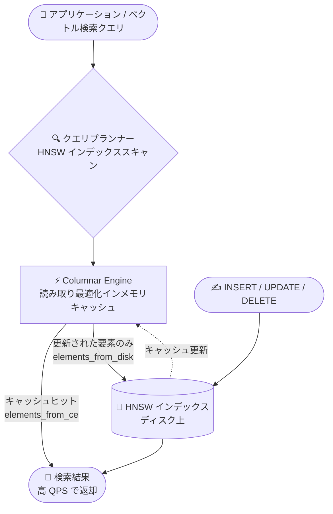

# AlloyDB for PostgreSQL: Columnar Engine による HNSW ベクトルインデックスのインメモリキャッシュが GA

**リリース日**: 2026-09-21

**サービス**: AlloyDB for PostgreSQL

**機能**: Columnar Engine による HNSW ベクトルインデックスの読み取り最適化インメモリキャッシュ

**ステータス**: GA (一般提供)

📊 [このアップデートのインフォグラフィックを見る](https://takech9203.github.io/google-cloud-news-summary/20260921-alloydb-columnar-engine-hnsw-vector-index-cache-ga.html)

## 概要

AlloyDB for PostgreSQL で、Columnar Engine (カラムナエンジン) を HNSW (Hierarchical Navigable Small World) ベクトルインデックスの読み取り最適化インメモリキャッシュとして使用する機能が一般提供 (GA) になりました。Columnar Engine にキャッシュされたインデックスは、読み取りに最適化されたインメモリ表現から直接クエリを処理するため、ベクトル検索のパフォーマンスが向上し、ベクトルワークロードで処理可能な QPS (クエリ/秒) が増加します。

pgvector 互換の HNSW インデックスは、RAG (Retrieval-Augmented Generation) やセマンティック検索などの生成 AI アプリケーションで広く使われている標準的なベクトルインデックスです。今回の GA により、既存の HNSW インデックスをそのまま活用しながら、SQL 関数を 1 つ実行するだけでインメモリキャッシュによる高速化を本番環境で利用できるようになりました。なお、ScaNN インデックスに対する Columnar Engine の高速化は引き続き Preview です。

対象ユーザーは、AlloyDB 上で高スループットのベクトル検索を必要とする生成 AI アプリケーションやセマンティック検索基盤の開発者・DBA です。

**アップデート前の課題**

- HNSW インデックスに対する Columnar Engine のキャッシュ機能は GA ではなく、本番ワークロードでの利用にはサポート面・SLA 面の制約があった
- HNSW インデックスの探索はバッファキャッシュとディスク I/O に依存しており、高 QPS のベクトル検索ワークロードではスループットが頭打ちになりやすかった
- QPS を上げるにはリードプールノードの追加などリソース増強に頼る必要があった

**アップデート後の改善**

- HNSW インデックスを Columnar Engine の読み取り最適化インメモリキャッシュから直接提供できるようになり、ベクトル検索のパフォーマンスと QPS が向上した
- `google_columnar_engine_add_index()` を実行するだけで既存の HNSW インデックスをキャッシュに追加でき、以降そのインデックスを使うクエリは自動的に高速化される
- `EXPLAIN (ANALYZE, COLUMNAR_ENGINE)` でキャッシュからの取得比率 (`elements_from_ce` / `elements_from_disk`) を確認でき、効果を定量的に検証できるようになった

## アーキテクチャ図



ベクトル検索クエリは Columnar Engine 上のインメモリキャッシュから HNSW インデックスの要素を直接読み取り、DML で更新された要素のみディスクから取得するハイブリッド方式で、精度と性能を両立します。

## サービスアップデートの詳細

### 主要機能

1. **HNSW インデックスの読み取り最適化インメモリキャッシュ (GA)**
   - Columnar Engine が HNSW ベクトルインデックスの読み取り最適化されたインメモリ表現を保持し、クエリを直接メモリから処理
   - ベクトル検索ワークロードで処理可能な QPS が向上
   - ScaNN インデックスのキャッシュは引き続き Preview

2. **SQL 関数によるシンプルなキャッシュ追加**
   - `SELECT google_columnar_engine_add_index('INDEX_NAME');` で既存インデックスをキャッシュに追加
   - 追加後は、そのインデックスを使用するすべてのクエリが自動的に高速化される (アプリケーション変更不要)

3. **DML に対するハイブリッド読み取り**
   - INSERT / UPDATE / DELETE でキャッシュエントリが無効化されると、有効なベクトルはメモリから、変更・追加されたベクトルのみディスクから読み取る
   - 大量のデータ変更時は、キャッシュが更新されるまで一時的に `elements_from_disk` が増加し性能が低下する場合がある

4. **実行計画によるキャッシュ利用の可視化**
   - `EXPLAIN (ANALYZE, COLUMNAR_ENGINE)` の出力に `Columnar Engine HNSW Info` セクションが表示される
   - `index found=true`、`elements_from_ce`、`elements_from_disk` でキャッシュの利用状況を確認可能

## 技術仕様

### 要件と主要フラグ

| 項目 | 詳細 |
|------|------|
| 対象インデックス | HNSW (GA)、ScaNN (Preview) |
| PostgreSQL バージョン | HNSW のキャッシュは PostgreSQL 17 以降の AlloyDB クラスタのみ (ScaNN には制限なし) |
| 有効化フラグ | `google_columnar_engine.enabled=on`、`google_columnar_engine.enable_index_caching=on` |
| キャッシュ追加関数 | `google_columnar_engine_add_index('INDEX_NAME')` |
| メモリ割り当て | デフォルトでインスタンスメモリの 30% を Columnar Engine に割り当て (推奨最大 50%、上限 70%)。`google_columnar_engine.memory_size_in_mb` フラグで固定サイズも指定可能 |
| 効果の確認方法 | `EXPLAIN (ANALYZE, COLUMNAR_ENGINE)` |

## 設定方法

### 前提条件

1. PostgreSQL 17 以降の AlloyDB クラスタ (HNSW でキャッシュを使う場合)
2. データベースに HNSW インデックスが作成済みであること

### 手順

#### ステップ 1: Columnar Engine とインデックスキャッシュを有効化

```bash
gcloud alloydb instances update INSTANCE_ID \
  --database-flags google_columnar_engine.enabled=on,google_columnar_engine.enable_index_caching=on \
  --region=REGION \
  --cluster=CLUSTER_ID \
  --project=PROJECT_ID
```

`google_columnar_engine.enabled` を設定するとインスタンスは自動的に再起動されます。

#### ステップ 2: HNSW インデックスをキャッシュに追加

```sql
SELECT google_columnar_engine_add_index('hnsw_idx');
```

インデックスのサイズによっては長時間の処理になるため、AlloyDB Studio でタイムアウトする場合は psql クライアントからの実行が推奨されます。

#### ステップ 3: キャッシュの利用を確認

```sql
EXPLAIN (ANALYZE, COLUMNAR_ENGINE)
SELECT * FROM documents
ORDER BY embedding <=> '[0.1, 0.2, 0.3, 0.4, 0.5]'::vector
LIMIT 5;
-- 出力例:
-- Columnar Engine HNSW Info: (index found=true elements_from_ce=385 elements_from_disk=0)
```

`elements_from_ce` が大きく `elements_from_disk` が小さいほど、キャッシュが効果的に利用されています。

## メリット

### ビジネス面

- **GA による本番利用**: 一般提供となったことで、本番の生成 AI アプリケーションに安心して適用できる
- **コスト効率の向上**: 同一インスタンスでより高い QPS を処理できるため、スケールアウトによるコスト増を抑えられる可能性がある

### 技術面

- **アプリケーション変更不要**: キャッシュに追加するだけで、既存の HNSW インデックスを使うクエリが自動的に高速化される
- **pgvector 互換性の維持**: 標準的な HNSW インデックスをそのまま使えるため、他の PostgreSQL 環境からの移行が容易
- **可観測性**: 実行計画でキャッシュヒット状況を定量的に確認でき、チューニングの判断材料になる

## デメリット・制約事項

### 制限事項

- HNSW インデックスのキャッシュは PostgreSQL 17 以降の AlloyDB クラスタでのみ利用可能
- ScaNN インデックスに対する Columnar Engine の高速化は引き続き Preview
- インデックスのキャッシュ追加はインデックスサイズによって長時間かかる場合がある

### 考慮すべき点

- Columnar Engine はインスタンスメモリの一部 (デフォルト 30%) を消費するため、他のワークロードとのメモリバランスを考慮する必要がある
- 大量の DML 実行直後は、キャッシュが更新されるまで `elements_from_disk` が増加し、一時的に性能が低下する可能性がある
- `google_columnar_engine.enabled` の設定変更時にインスタンスが再起動する点に注意が必要

## ユースケース

### ユースケース 1: RAG アプリケーションの検索スループット向上

**シナリオ**: ドキュメント埋め込みを HNSW インデックスで検索する RAG アプリケーションで、同時ユーザー数の増加により QPS が不足している。

**実装例**:
```sql
-- 既存の HNSW インデックスをキャッシュに追加
SELECT google_columnar_engine_add_index('documents_embedding_hnsw_idx');

-- アプリケーションのクエリはそのまま
SELECT id, content FROM documents
ORDER BY embedding <=> $1
LIMIT 10;
```

**効果**: アプリケーションを変更せずにベクトル検索の QPS を向上でき、リードプールの増強を先送りできる。

### ユースケース 2: セマンティック検索 API の低レイテンシ化

**シナリオ**: EC サイトの商品セマンティック検索 API で、ピークタイムのレイテンシがディスク I/O に律速されている。

**効果**: HNSW インデックスの探索がインメモリで処理されるため、ピークタイムでも安定した低レイテンシと高スループットを実現できる。

## 料金

Columnar Engine 自体に追加料金はなく、インスタンスに割り当てたメモリの範囲内で動作します。AlloyDB の料金は vCPU (約 $0.06608/vCPU 時〜)、メモリ (約 $0.0112/GB 時〜)、ストレージ、ネットワークの従量課金です。キャッシュ容量を増やすためにインスタンスのメモリサイズを拡大する場合は、その分の料金が発生します。

詳細は [AlloyDB 料金ページ](https://cloud.google.com/alloydb/pricing) を参照してください。

## 利用可能リージョン

リージョン固有の制限はリリースノートに記載されていません。AlloyDB が利用可能なリージョンについては [AlloyDB のロケーション](https://cloud.google.com/alloydb/docs/locations) を参照してください。

## 関連サービス・機能

- **AlloyDB AI**: 埋め込み生成やモデル呼び出しをデータベース内で行う機能群。本機能と組み合わせて生成 AI アプリケーションを構築できる
- **ScaNN インデックス**: AlloyDB 独自の高性能ベクトルインデックス。Columnar Engine によるキャッシュは Preview で提供中
- **リードプールインスタンス**: Columnar Engine はプライマリとリードプールの両方で有効化でき、読み取りトラフィックの分散と併用可能
- **Cloud Monitoring**: Columnar Engine のメモリ使用状況のモニタリングに使用

## 参考リンク

- 📊 [インフォグラフィック](https://takech9203.github.io/google-cloud-news-summary/20260921-alloydb-columnar-engine-hnsw-vector-index-cache-ga.html)
- [公式リリースノート](https://docs.cloud.google.com/release-notes#September_21_2026)
- [ドキュメント: Accelerate queries with the Columnar Engine](https://docs.cloud.google.com/alloydb/docs/ai/accelerate-with-ce)
- [ドキュメント: About the AlloyDB columnar engine](https://docs.cloud.google.com/alloydb/docs/columnar-engine/about)
- [ドキュメント: Configure the columnar engine](https://docs.cloud.google.com/alloydb/docs/columnar-engine/configure)
- [料金ページ](https://cloud.google.com/alloydb/pricing)

## まとめ

HNSW ベクトルインデックスの Columnar Engine キャッシュが GA となり、pgvector 互換の標準的なベクトル検索を SQL 関数 1 つで高速化できるようになりました。AlloyDB 上で高 QPS のベクトル検索を運用しているチームは、PostgreSQL 17 以降のクラスタでインデックスキャッシュを有効化し、`EXPLAIN (ANALYZE, COLUMNAR_ENGINE)` で効果を検証することを推奨します。

---

**タグ**: AlloyDB, PostgreSQL, Columnar Engine, HNSW, ベクトル検索, 生成AI, GA
