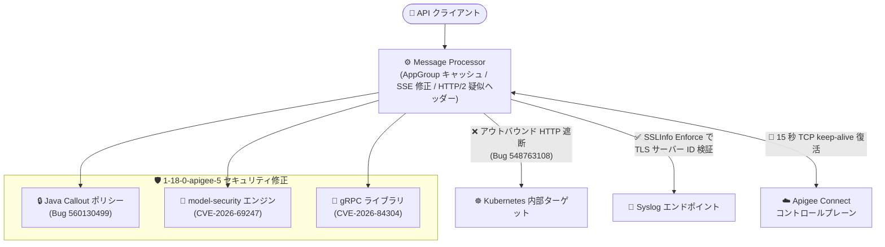

# Apigee X: セキュリティ修正を含む新バージョン 1-18-0-apigee-5 のリリース

**リリース日**: 2026-09-21

**サービス**: Apigee X

**機能**: Apigee ランタイム 1-18-0-apigee-5 (セキュリティ修正 + バグ修正)

**ステータス**: Announcement / Security / Fixed

📊 [このアップデートのインフォグラフィックを見る](https://takech9203.github.io/google-cloud-news-summary/20260921-apigee-x-1-18-0-apigee-5-security-release.html)

## 概要

2026 年 9 月 21 日、Google は Apigee の更新バージョン 1-18-0-apigee-5 をリリースしました。ロールアウトは同日に開始され、全 Google Cloud ゾーンへの展開完了まで 4 営業日以上かかる場合があります。ロールアウトが完了するまで、各インスタンスで本リリースの修正が利用できない可能性があります。

本リリースはセキュリティ修正を中心としたリリースで、Java Callout ポリシーのセキュリティ問題の修正、Apigee model-security エンジンが使用するサードパーティライブラリのアップグレードによる CVE-2026-69247 のパッチ、gRPC のアップグレードによる CVE-2026-84304 のパッチ、およびインフラストラクチャのセキュリティ修正が含まれます。あわせて、OAuth/VerifyAPIKey のレイテンシ改善、EventFlow (Server-Sent Events) のイベント欠落修正、HTTP/2 疑似ヘッダーの変更サポート、Apigee Connect コントロールプレーン接続の TCP keep-alive 復活など、運用上重要なバグ修正が多数含まれています。

なお、同日には「メンテナンスウィンドウ設定インスタンスの 1-18-0-apigee-4 への更新開始」も別途アナウンスされていますが、本レポートは新規リリースされた 1-18-0-apigee-5 (セキュリティ修正 + バグ修正) のみを対象とします。

**アップデート前の課題**

- Java Callout ポリシー、model-security エンジンのサードパーティライブラリ (CVE-2026-69247)、gRPC (CVE-2026-84304) にセキュリティ上の問題が存在していた
- AppGroup アプリの OAuth / VerifyAPIKey 処理で、AppGroup エンティティが Message Processor ランタイムにキャッシュされず、レイテンシの上昇と Cassandra の読み取り負荷増大が発生していた
- EventFlow (Server-Sent Events) で、負荷時に 16 KB を超える大きなイベントの後続イベントが欠落・切り詰められることがあった
- Apigee Connect のコントロールプレーン接続が無通知で切断された場合、復旧までに約 2 時間かかることがあった
- HTTP/2 使用時にポリシーからリクエスト疑似ヘッダー (`:path`、`:authority` など) を変更できなかった
- Syslog エンドポイントの SSLInfo で `<Enforce>true</Enforce>` 要素が実装されておらず、Syslog ターゲットの TLS サーバー ID が検証されなかった

**アップデート後の改善**

- 2 件の CVE (CVE-2026-69247、CVE-2026-84304) を含むセキュリティ問題が修正され、既知の脆弱性への露出が解消された
- AppGroup エンティティが Message Processor ランタイムにキャッシュされ (Developer アプリと同等の動作)、OAuth / VerifyAPIKey のレイテンシと Cassandra 読み取り負荷が改善された
- EventFlow (SSE) の大きなイベント後のイベント欠落・切り詰めが修正され、ストリーミング API の信頼性が向上した
- Apigee Connect コントロールプレーン接続に 15 秒の TCP keep-alive が復活し、無通知切断からの復旧が約 2 時間から数秒に短縮された
- Message Processor から Kubernetes 内部ターゲットへのアウトバウンド HTTP が遮断され、セキュリティ境界が強化された
- MCP の tools/list メソッドが、承認済みのすべての API プロダクトを横断してツールを集約するようになった

## アーキテクチャ図



1-18-0-apigee-5 で修正されたセキュリティ境界と主要コンポーネントの関係を示しています。ランタイム内部のセキュリティ修正 (Java Callout / model-security エンジン / gRPC) に加え、Kubernetes 内部への通信遮断、Syslog の TLS 検証、コントロールプレーン接続の keep-alive 復活によって、境界の内外両面が強化されました。

## サービスアップデートの詳細

### セキュリティ修正

| Bug ID | 内容 |
|--------|------|
| 560130499 | Java Callout ポリシーのセキュリティ問題を修正 |
| 547681234 | Apigee model-security エンジンが使用するサードパーティライブラリをアップグレードし、[CVE-2026-69247](https://nvd.nist.gov/vuln/detail/CVE-2026-69247) をパッチ |
| 556568593 | gRPC をアップグレードし、[CVE-2026-84304](https://nvd.nist.gov/vuln/detail/CVE-2026-84304) をパッチ |
| N/A | Apigee インフラストラクチャのセキュリティ修正 |

### バグ修正

| Bug ID | 内容 |
|--------|------|
| 559009293 | AppGroup エンティティを Message Processor ランタイムにキャッシュすることで、AppGroup アプリにおける OAuth / VerifyAPIKey のレイテンシ上昇と Cassandra 読み取り負荷を修正 (Developer アプリと同等の動作に統一) |
| 558888960 | 分散トレーシングで、すべてのシナリオにおいてターゲット URL がスパン属性として含まれるように修正 |
| 556750755 | http-adaptor データパス上の EventFlow (Server-Sent Events) で、負荷時に 16 KB を超える大きなイベントの後続イベントが欠落・切り詰められる問題を修正 |
| 553931019 | MCP の tools/list メソッドが、承認済みのすべての API プロダクトを横断してツールを集約するように修正 |
| 531783017 | Syslog エンドポイントの SSLInfo に `<Enforce>true</Enforce>` 要素を実装し、Syslog ターゲットの TLS サーバー ID を検証できるように修正 |
| 554114419 | HTTP/2 使用時に、ポリシーからリクエスト疑似ヘッダー (例: `:path`、`:authority`) を変更できるように修正 |
| 548763108 | Message Processor から Kubernetes 内部ターゲットへのアウトバウンド HTTP を遮断 |
| 513032450 | Apigee Connect コントロールプレーン接続に 15 秒の TCP keep-alive を復活させ、無通知で切断された接続が約 2 時間ではなく数秒で復旧するように修正 |
| N/A | インフラストラクチャおよびライブラリの更新 |

## 技術仕様

### リリース情報

| 項目 | 詳細 |
|------|------|
| バージョン | 1-18-0-apigee-5 (メジャー 1、マイナー 18、パッチ 0 のリビジョン 5) |
| リリース日 | 2026 年 9 月 21 日 |
| ロールアウト | 同日開始。全 Google Cloud ゾーンへの完了まで 4 営業日以上かかる場合がある |
| 対象 | Apigee (X) インスタンス。ロールアウト完了までは修正が反映されない場合がある |
| リリースモデル | Apigee は継続的リリースモデルを採用しており、約 2 週間ごとにリリースされる |

### 影響を受ける主なポリシー・コンポーネント

| コンポーネント | 修正内容 |
|----------------|----------|
| Java Callout ポリシー | セキュリティ問題の修正 (Bug 560130499) |
| model-security エンジン | サードパーティライブラリのアップグレード (CVE-2026-69247) |
| gRPC | ライブラリのアップグレード (CVE-2026-84304) |
| OAuth / VerifyAPIKey ポリシー | AppGroup エンティティのキャッシュによるレイテンシ改善 |
| MessageLogging (Syslog) | SSLInfo の `<Enforce>true</Enforce>` による TLS サーバー ID 検証 |
| EventFlow (SSE) | 大きなイベント後のイベント欠落・切り詰めの修正 |
| Apigee Connect | コントロールプレーン接続の 15 秒 TCP keep-alive 復活 |

### Syslog エンドポイントの TLS サーバー ID 検証の設定例

```xml
<MessageLogging name="LogToSyslog">
  <Syslog>
    <Message>[tag="{organization.name}.{apiproxy.name}.{environment.name}"] ...</Message>
    <Host>syslog.example.com</Host>
    <Port>6514</Port>
    <Protocol>TCP</Protocol>
    <SSLInfo>
      <Enabled>true</Enabled>
      <Enforce>true</Enforce>
    </SSLInfo>
  </Syslog>
  <logLevel>INFO</logLevel>
</MessageLogging>
```

1-18-0-apigee-5 では、Syslog エンドポイントの SSLInfo で `<Enforce>true</Enforce>` が実装され、Syslog ターゲットの TLS サーバー ID が検証されるようになりました。

## 設定方法

本リリースは Google 管理のロールアウトで自動適用されるため、ユーザー側での適用作業は不要です。以下の手順でインスタンスのバージョンとロールアウト状況を確認できます。

### 前提条件

1. Apigee (X) の組織・インスタンスを運用していること
2. `apigee.instances.get` 権限を含むロール (例: `roles/apigee.readOnlyAdmin`) を持っていること

### 手順

#### ステップ 1: インスタンスの現在のランタイムバージョンを確認する

```bash
AUTH="Authorization: Bearer $(gcloud auth print-access-token)"
curl -H "$AUTH" \
  "https://apigee.googleapis.com/v1/organizations/ORGANIZATION_ID/instances/INSTANCE_ID"
```

レスポンスの `runtimeVersion` フィールドで、インスタンスに適用されているバージョン (例: `1-18-0-apigee-5`) を確認できます。ロールアウトは 4 営業日以上かかる場合があるため、リリース直後は旧バージョンのままの場合があります。

#### ステップ 2: リリースノートの更新を購読する

```bash
# Apigee リリースノートの RSS フィードを購読して最新リリースを追跡
# https://docs.cloud.google.com/apigee/docs/release-notes
```

Apigee リリースノートページの RSS フィードを購読することで、今後のリリース (セキュリティ修正を含む) をいち早く把握できます。

## メリット

### ビジネス面

- **セキュリティリスクの低減**: 2 件の CVE (CVE-2026-69247、CVE-2026-84304) を含む複数のセキュリティ問題が修正され、コンプライアンス要件への対応と脆弱性への露出期間の短縮につながる
- **運用負荷の軽減**: Google 管理のロールアウトで自動適用されるため、ユーザー側のパッチ適用作業が不要

### 技術面

- **API 認証パフォーマンスの向上**: AppGroup アプリの OAuth / VerifyAPIKey レイテンシと Cassandra 読み取り負荷が改善され、AppGroup を利用する大規模組織での認証スループットが向上する
- **ストリーミング API の信頼性向上**: EventFlow (SSE) の大きなイベント後の欠落・切り詰めが修正され、LLM ストリーミング応答などの SSE ベースの API が安定する
- **障害復旧の高速化**: Apigee Connect コントロールプレーン接続の 15 秒 TCP keep-alive により、無通知切断からの復旧が約 2 時間から数秒に短縮される
- **セキュリティ境界の強化**: Message Processor から Kubernetes 内部ターゲットへのアウトバウンド HTTP 遮断、Syslog の TLS サーバー ID 検証により、内部・外部両方向の通信が強化される
- **HTTP/2 の柔軟性向上**: ポリシーからリクエスト疑似ヘッダー (`:path`、`:authority`) を変更できるようになり、HTTP/2 ターゲットへのルーティング制御が可能になる

## デメリット・制約事項

### 制限事項

- ロールアウトは全 Google Cloud ゾーンへの完了まで 4 営業日以上かかる場合があり、完了までは修正が利用できない
- ロールアウトの適用タイミングをユーザーが個別に制御することはできない (メンテナンスウィンドウを設定している場合は、その設定に従って適用される)

### 考慮すべき点

- Message Processor から Kubernetes 内部ターゲットへのアウトバウンド HTTP が遮断されるため、万一 Kubernetes 内部アドレスをターゲットにしている構成 (本来非推奨) がある場合は影響を確認する必要がある
- HTTP/2 疑似ヘッダーの変更が可能になったことで、既存のプロキシでヘッダー操作ポリシーの挙動が変わる可能性があるため、HTTP/2 を使用しているプロキシは動作確認を推奨
- Syslog の TLS サーバー ID 検証 (`<Enforce>true</Enforce>`) を有効にする場合、Syslog サーバーの証明書がホスト名と一致していることを事前に確認する

## ユースケース

### ユースケース 1: AppGroup を利用する大規模 API 基盤のレイテンシ改善

**シナリオ**: 多数のパートナー企業を AppGroup で管理し、OAuth トークン検証や API キー検証を高頻度で実行している API 基盤で、認証レイテンシと Cassandra 負荷が課題になっている。

**実装例**:
```bash
# ロールアウト後にインスタンスのバージョンを確認
AUTH="Authorization: Bearer $(gcloud auth print-access-token)"
curl -H "$AUTH" \
  "https://apigee.googleapis.com/v1/organizations/ORGANIZATION_ID/instances/INSTANCE_ID" \
  | grep runtimeVersion

# Cloud Monitoring で OAuth/VerifyAPIKey のレイテンシ指標を前後比較
```

**効果**: AppGroup エンティティが Message Processor ランタイムにキャッシュされることで、追加の設定なしに認証レイテンシと Cassandra 読み取り負荷が低減される。

### ユースケース 2: SSE ベースの LLM ストリーミング API の安定化

**シナリオ**: Apigee の EventFlow を使って LLM のストリーミング応答 (Server-Sent Events) をプロキシしており、大きな応答チャンクの後にイベントが欠落する事象が報告されている。

**効果**: 16 KB を超えるイベントの後続イベントが負荷時に欠落・切り詰められる問題が修正され、ストリーミング応答の完全性が保証される。model-security エンジンのライブラリ更新 (CVE-2026-69247) とあわせて、AI/LLM ワークロードのセキュリティと信頼性が向上する。

### ユースケース 3: Syslog ログ転送経路のセキュリティ強化

**シナリオ**: MessageLogging ポリシーで外部 SIEM の Syslog エンドポイントに監査ログを TLS 転送しているが、これまでサーバー ID 検証が行われず、中間者攻撃のリスクが残っていた。

**実装例**: 上記「技術仕様」の SSLInfo 設定例のとおり、`<Enforce>true</Enforce>` を追加する。

**効果**: Syslog ターゲットの TLS サーバー ID が検証され、ログ転送経路のなりすましリスクを排除できる。

## 料金

本リリースはセキュリティ修正およびバグ修正であり、料金体系への変更はありません。Apigee の料金の詳細は [Apigee 料金ページ](https://cloud.google.com/apigee/pricing) を参照してください。

## 利用可能リージョン

すべての Google Cloud ゾーンの Apigee インスタンスに順次ロールアウトされます (2026 年 9 月 21 日開始、完了まで 4 営業日以上かかる場合があります)。

## 関連サービス・機能

- **Apigee Advanced API Security / model-security エンジン**: CVE-2026-69247 のパッチ対象。AI モデル保護機能を利用している場合に関係する
- **Apigee Connect**: コントロールプレーンとランタイムプレーン間の接続。15 秒 TCP keep-alive の復活により、無通知切断からの復旧が高速化された
- **Cloud Trace (分散トレーシング)**: すべてのシナリオでターゲット URL がスパン属性に含まれるようになり、トレースによるターゲット分析が容易になった
- **Cloud Monitoring / Cloud Logging**: ロールアウト前後の OAuth/VerifyAPIKey レイテンシや Cassandra 負荷の変化を確認する際に使用する
- **MCP (Model Context Protocol)**: tools/list メソッドが承認済みのすべての API プロダクトを横断してツールを集約するようになり、AI エージェント連携時のツール発見性が向上した

## 参考リンク

- 📊 [インフォグラフィック](https://takech9203.github.io/google-cloud-news-summary/20260921-apigee-x-1-18-0-apigee-5-security-release.html)
- [公式リリースノート (Google Cloud Release Notes: September 21, 2026)](https://docs.cloud.google.com/release-notes#September_21_2026)
- [Apigee リリースノート](https://docs.cloud.google.com/apigee/docs/release-notes)
- [Apigee リリースプロセス](https://docs.cloud.google.com/apigee/docs/release/apigee-release-process)
- [CVE-2026-69247 (NVD)](https://nvd.nist.gov/vuln/detail/CVE-2026-69247)
- [CVE-2026-84304 (NVD)](https://nvd.nist.gov/vuln/detail/CVE-2026-84304)
- [Java Callout ポリシー](https://docs.cloud.google.com/apigee/docs/api-platform/reference/policies/java-callout-policy)
- [MessageLogging ポリシー](https://docs.cloud.google.com/apigee/docs/api-platform/reference/policies/message-logging-policy)
- [Apigee 料金ページ](https://cloud.google.com/apigee/pricing)

## まとめ

1-18-0-apigee-5 は、2 件の CVE を含むセキュリティ修正と、認証レイテンシ・SSE ストリーミング・コントロールプレーン接続の復旧など運用に直結するバグ修正を多数含む重要なリリースです。ロールアウトは自動で行われるため適用作業は不要ですが、`runtimeVersion` の確認によるロールアウト状況の把握と、HTTP/2 疑似ヘッダー変更や Kubernetes 内部ターゲット遮断など動作変更を伴う修正の影響確認を推奨します。あわせて、Syslog エンドポイントを利用している場合は `<Enforce>true</Enforce>` による TLS サーバー ID 検証の有効化を検討してください。

---

**タグ**: #ApigeeX #セキュリティ #CVE #JavaCallout #gRPC #API管理 #バグ修正
