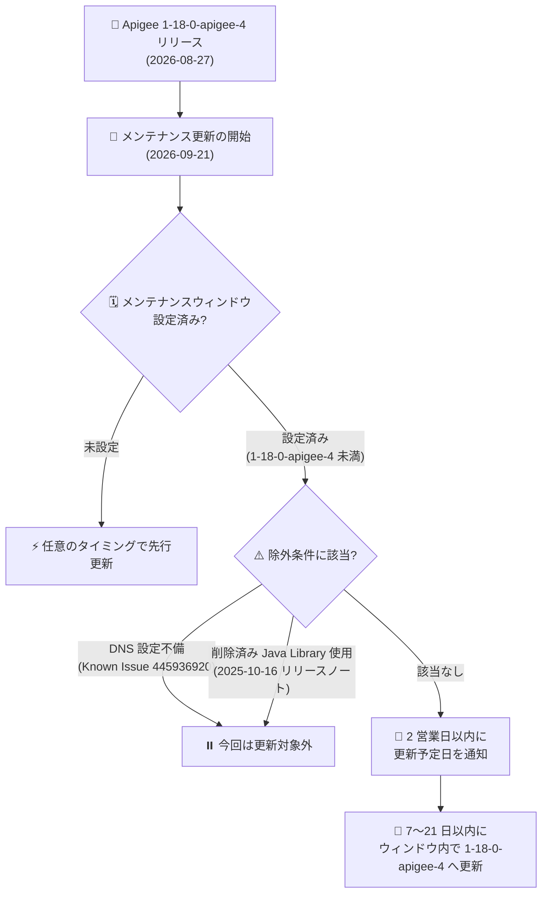

# Apigee X: メンテナンスウィンドウ設定インスタンスの 1-18-0-apigee-4 への更新開始

**リリース日**: 2026-09-21

**サービス**: Apigee X

**機能**: メンテナンスウィンドウ設定インスタンスのメンテナンス更新 (1-18-0-apigee-4)

**ステータス**: Announcement (メンテナンス)

📊 [このアップデートのインフォグラフィックを見る](https://takech9203.github.io/google-cloud-news-summary/20260921-apigee-x-maintenance-1-18-0-apigee-4.html)

## 概要

2026 年 9 月 21 日より、Google Cloud はメンテナンスウィンドウを設定している Apigee インスタンスに対するメンテナンス更新を開始しました。インスタンスに希望するメンテナンスウィンドウを設定しており、かつインスタンスのバージョンが 1-18-0-apigee-4 未満の場合、今後 7〜21 日以内に 1-18-0-apigee-4 へ更新されます。更新予定日を含む通知は、今後 2 営業日以内に送信されます。

更新先バージョンの 1-18-0-apigee-4 は 2026 年 8 月 27 日にリリースされたもので、Apigee ランタイムの JDK 17 への移行 (JDK 11 との後方互換性を維持)、JSONThreatProtection ポリシーへの重複 JSON キー拒否オプションの追加、PythonScript ポリシーのセキュリティ修正などが含まれています。

なお、以下のいずれかに該当するインスタンスは今回の更新対象外です。

1. DNS 設定に不備がある ([Known Issue 445936920](https://docs.cloud.google.com/apigee/docs/release/known-issues))
2. 削除済みの Apigee Java Library を使用している ([2025 年 10 月 16 日付 Apigee リリースノート](https://docs.cloud.google.com/apigee/docs/release/release-notes#October_16_2025) 参照)

**アップデート前の課題**

- メンテナンスウィンドウを設定したインスタンスは、設定していないインスタンスより後に更新されるため、1-18-0-apigee-4 未満のバージョンのまま運用されており、同バージョンに含まれる修正 (JDK 17 化、PythonScript ポリシーのセキュリティ修正など) が未適用だった
- 更新の適用タイミングが確定しておらず、運用チームは具体的な更新予定日を把握できていなかった

**アップデート後の改善**

- メンテナンスウィンドウを設定した 1-18-0-apigee-4 未満のインスタンスが、7〜21 日以内に指定のウィンドウ内で 1-18-0-apigee-4 へ順次更新される
- 更新予定日を含む通知が 2 営業日以内に送信され、運用チームが事前に更新日を把握して準備できる
- 更新完了後は、JDK 17 ランタイム、JSONThreatProtection の `<RejectDuplicateKeys>` オプション、SemanticCacheLookup ポリシーの改善などが利用可能になる

## アーキテクチャ図



メンテナンスウィンドウを設定したインスタンスに対する今回の更新フローです。除外条件に該当しないインスタンスには更新予定日の通知が送信され、指定したウィンドウ内で順次更新が実施されます。

## サービスアップデートの詳細

### 主要なポイント

1. **更新スケジュール**
   - 2026 年 9 月 21 日にメンテナンス更新を開始
   - 対象: メンテナンスウィンドウを設定しており、バージョンが 1-18-0-apigee-4 未満のインスタンス
   - 更新は今後 7〜21 日以内に実施され、更新予定日の通知が 2 営業日以内に送信される

2. **更新先バージョン 1-18-0-apigee-4 の主な内容** (2026 年 8 月 27 日リリース、9 月 9 日・10 日の補遺を含む)
   - Apigee ランタイムを JDK 17 で実行するようアップグレード (JDK 11 との後方互換性を維持) (Bug ID: 507878328)
   - ターゲットが完全に利用不能な場合の Message Processor の過剰な CPU 消費を防ぐ、オプトイン方式の接続失敗バックオフ (CWC プロパティ `HTTPClient.backoff.enabled`、デフォルト false) を追加 (Bug ID: 530965355)
   - API プロダクトで `payloadOperationGroup` と REST または `llmOperationGroup` を組み合わせると REST/LLM トラフィックが 401 で拒否されるバグを修正 (Bug ID: 532793298)
   - JSONThreatProtection ポリシーに、同一オブジェクト内の重複 JSON キーを含むリクエストボディを拒否するオプション要素 `<RejectDuplicateKeys>` を追加 (デフォルト false で既存動作を維持) (Bug ID: 534420582)
   - PythonScript ポリシーのセキュリティ問題を修正 (Bug ID: 544570126)
   - SemanticCacheLookup ポリシーが Vector Search の非デフォルト距離尺度 (`COSINE_DISTANCE`、`SQUARED_L2_DISTANCE`、`L1_DISTANCE`) をサポート (9 月 9 日付リリースノート)
   - SemanticCacheLookup ポリシーが Vertex AI Vector Search の Private Service Connect (PSC) エンドポイントと互換性がなかった問題を修正 (Bug ID: 502540992、9 月 10 日付補遺)

3. **更新対象外となる条件**
   - **DNS 設定不備 (Known Issue 445936920)**: Apigee は 1-16-0-apigee-2 にあった自動 DNS フォールバック機能を削除しており、これまで検出されなかった DNS 設定の問題が DNS エラーを引き起こす可能性がある。ランタイムログで DNS 解決エラーを確認できる
   - **削除済み Apigee Java Library の使用**: 2025 年 10 月 16 日付の Apigee リリースノートに記載された、削除済みの Apigee Java Library を使用しているインスタンス

## 技術仕様

### メンテナンスウィンドウの仕組み

| 項目 | 詳細 |
|------|------|
| メンテナンスウィンドウ | メンテナンスを開始する曜日と時刻 (UTC) を指定。1 インスタンスにつき 1 つのみ設定可能 |
| 更新順序 (Order of update) | Week 1 または Week 2 を指定。Week 2 のインスタンスは、同一リージョン・同一ウィンドウの Week 1 インスタンスの 1 週間後に更新される |
| 通知リードタイム | Week 1 は少なくとも 1 週間前、Week 2 は少なくとも 2 週間前に通知 (通知のオプトインが必要) |
| 複数インスタンスの設定 | 同一組織内で複数インスタンスにウィンドウを設定する場合、メンテナンス操作の重複を避けるため各ウィンドウの間に最低 12 時間空けることを推奨 |
| 必要な権限 | 設定変更には `roles/apigee.admin` または `apigee.instances.update` 権限、参照には `apigee.instances.get` 権限 |
| 所要時間 | 構成により異なるが、通常は数時間程度 |

### メンテナンス中に実行できない操作

- 新しいインスタンスの作成
- インスタンスへの環境のアタッチ
- エンドポイントアタッチメントの作成
- 一部のスケーリング操作

なお、すでにメンテナンスが予定されているイベントに対しては、ウィンドウ設定の変更 (曜日/時刻の変更、更新順序の変更、設定のクリア) は適用されず、変更は将来のメンテナンスロールアウトにのみ反映されます。また、Apigee はメンテナンスウィンドウの尊重に最善を尽くしますが、フリート全体の互換性とセキュリティ維持のため、希望時間外に更新が行われる場合があります。

## 設定方法

### 前提条件

1. Apigee (Apigee hybrid は対象外) のインスタンスを運用していること
2. `roles/apigee.admin` ロール、または `apigee.instances.update` 権限を含むロールを持っていること

### 手順

#### ステップ 1: 現在のメンテナンス設定と更新スケジュールを確認する

```bash
AUTH="Authorization: Bearer $(gcloud auth print-access-token)"
curl -H "$AUTH" \
  "https://apigee.googleapis.com/v1/organizations/ORGANIZATION_ID/instances/INSTANCE_ID"
```

レスポンスの `maintenanceUpdatePolicy` フィールドで現在の設定を、`scheduledMaintenance` フィールドで予定されているメンテナンスの開始時刻を確認できます。

#### ステップ 2: メンテナンスウィンドウを設定・変更する

```bash
AUTH="Authorization: Bearer $(gcloud auth print-access-token)"
curl -X PATCH \
  -H "$AUTH" \
  -H "Content-Type: application/json" \
  -d '{
    "maintenanceUpdatePolicy": {
      "maintenanceWindows": [
        { "day": "SUNDAY", "startTime": { "hours": 23 } }
      ],
      "maintenanceChannel": "WEEK1"
    }
  }' \
  "https://apigee.googleapis.com/v1/organizations/ORGANIZATION_ID/instances/INSTANCE_ID?updateMask=maintenanceUpdatePolicy.maintenanceWindows,maintenanceUpdatePolicy.maintenanceChannel"
```

`startTime` は UTC で指定します。`maintenanceChannel` には `WEEK1` または `WEEK2` を指定します。

#### ステップ 3: メンテナンス通知にオプトインする

1. Google Cloud コンソールで **User preferences > Communication** ページに移動
2. **Apigee** の行の **Maintenance window** で、**Email** のラジオボタンを **On** にする

通知を受け取る必要があるユーザーごとに、個別にオプトインが必要です。通知は Google アカウントに関連付けられたメールアドレスに送信され、カスタムのメールエイリアスは設定できません。

## メリット

### ビジネス面

- **計画的な運用**: 更新予定日が事前に通知されるため、ピーク時間帯を避けたメンテナンス計画を立てられ、ビジネスへの影響を最小化できる
- **セキュリティリスクの低減**: PythonScript ポリシーのセキュリティ修正を含む最新バージョンへ更新されることで、既知の脆弱性への露出期間が短縮される

### 技術面

- **最新ランタイムの適用**: JDK 17 ベースのランタイムや、JSONThreatProtection の重複キー拒否、SemanticCacheLookup の改善など、1-18-0-apigee-4 の修正・機能が利用可能になる
- **段階的なロールアウト**: ウィンドウ未設定のインスタンス (非本番環境推奨) が先に更新されるため、本番適用前に非本番環境で更新内容を検証できる

## デメリット・制約事項

### 制限事項

- 以下に該当するインスタンスは今回の更新対象外となる
  - DNS 設定に不備がある (Known Issue 445936920)
  - 削除済みの Apigee Java Library を使用している (2025 年 10 月 16 日付リリースノート参照)
- すでにスケジュール済みのメンテナンスイベントには、ウィンドウ設定の変更が適用されない
- Apigee はメンテナンスウィンドウを尊重するよう最善を尽くすが、互換性・セキュリティ維持のため希望時間外に更新される場合がある

### 考慮すべき点

- メンテナンスの正確な所要時間は構成により異なる (通常は数時間程度)
- メンテナンス中はインスタンス作成、環境のアタッチ、エンドポイントアタッチメント作成、一部のスケーリング操作が実行できない
- 通知を受け取るには、メンテナンスウィンドウの設定と通知へのオプトインの両方が必要

## ユースケース

### ユースケース 1: 本番インスタンスの更新日を事前に把握して準備する

**シナリオ**: 本番環境の Apigee インスタンスにメンテナンスウィンドウを設定している運用チームが、今回の 1-18-0-apigee-4 への更新に備える。

**実装例**:
```bash
# 更新スケジュールの確認
AUTH="Authorization: Bearer $(gcloud auth print-access-token)"
curl -H "$AUTH" \
  "https://apigee.googleapis.com/v1/organizations/ORGANIZATION_ID/instances/INSTANCE_ID" \
  | grep -A 3 scheduledMaintenance
```

**効果**: 2 営業日以内に届く通知と API の `scheduledMaintenance` フィールドで更新予定日を把握し、監視強化や関係者への周知など事前準備ができる。

### ユースケース 2: 非本番環境で更新内容を先行検証する

**シナリオ**: 非本番インスタンスにはメンテナンスウィンドウを設定せず (先行更新)、ステージングを Week 1、本番を Week 2 に設定することで、段階的に更新を検証する。

**効果**: 非本番環境で 1-18-0-apigee-4 の動作を先に確認でき、問題があれば本番への更新前に診断・対処する時間を確保できる。公式ドキュメントでも、本番インスタンスのみにメンテナンスウィンドウを設定するベストプラクティスが推奨されている。

## 関連サービス・機能

- **Cloud Logging**: DNS 設定不備 (Known Issue 445936920) の影響有無は、ランタイムログの DNS 解決エラーで確認できる。インスタンス更新ログもメンテナンス実施時に生成される
- **IAM**: メンテナンスウィンドウの設定・変更には `roles/apigee.admin` ロールまたは `apigee.instances.update` 権限が必要
- **Vertex AI Vector Search**: 1-18-0-apigee-4 には SemanticCacheLookup ポリシーの距離尺度サポート追加や PSC エンドポイント互換性の修正が含まれ、Vector Search と連携するセマンティックキャッシュ構成に影響する

## 参考リンク

- 📊 [インフォグラフィック](https://takech9203.github.io/google-cloud-news-summary/20260921-apigee-x-maintenance-1-18-0-apigee-4.html)
- [公式リリースノート (Google Cloud Release Notes: September 21, 2026)](https://docs.cloud.google.com/release-notes#September_21_2026)
- [Apigee リリースノート (1-18-0-apigee-4: August 27, 2026)](https://docs.cloud.google.com/apigee/docs/release/release-notes#August_27_2026)
- [Maintenance overview (メンテナンスの概要)](https://docs.cloud.google.com/apigee/docs/api-platform/system-administration/maintenance)
- [Manage Apigee instance maintenance windows (メンテナンスウィンドウの管理)](https://docs.cloud.google.com/apigee/docs/api-platform/system-administration/maintenance-windows)
- [Apigee Known Issues (Known Issue 445936920)](https://docs.cloud.google.com/apigee/docs/release/known-issues)
- [Apigee リリースノート (October 16, 2025: 削除された Java Library)](https://docs.cloud.google.com/apigee/docs/release/release-notes#October_16_2025)

## まとめ

メンテナンスウィンドウを設定した 1-18-0-apigee-4 未満の Apigee インスタンスは、今後 7〜21 日以内に順次更新されます。運用チームは 2 営業日以内に届く更新予定日の通知を確認し、DNS 設定不備 (Known Issue 445936920) や削除済み Java Library の使用有無をチェックして、対象外とならないよう事前に対処することを推奨します。あわせて、JDK 17 化や JSONThreatProtection の新オプションなど 1-18-0-apigee-4 の変更点を非本番環境で検証しておくと安心です。

---

**タグ**: #ApigeeX #メンテナンス #メンテナンスウィンドウ #API管理 #セキュリティ
