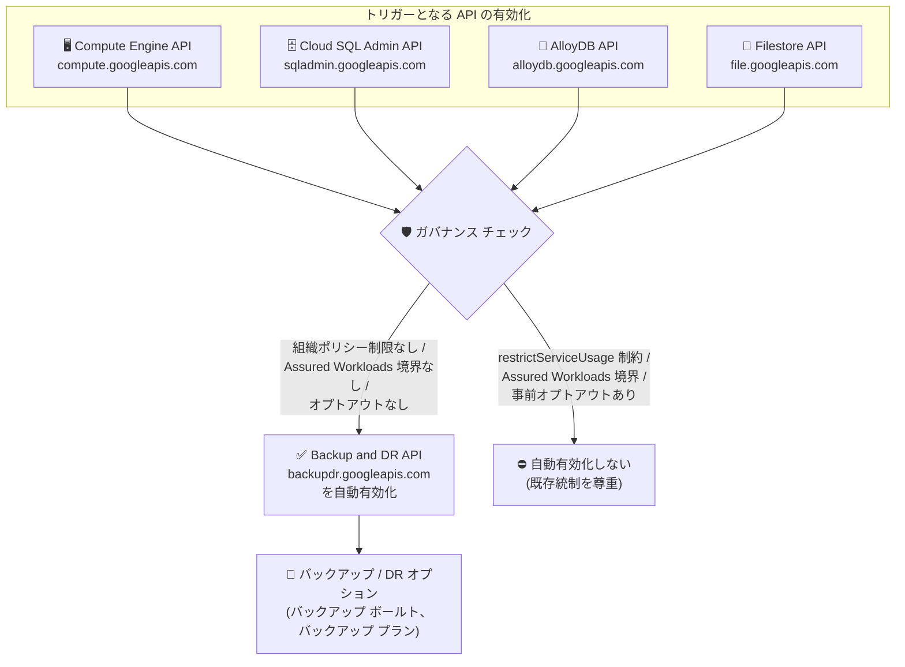

# Backup and DR: 主要 API 有効化時の Backup and DR API 自動有効化

**リリース日**: 2026-09-21

**サービス**: Backup and DR

**機能**: Backup and DR API (backupdr.googleapis.com) の自動有効化

**ステータス**: Announcement (発表)

📊 [このアップデートのインフォグラフィックを見る](https://takech9203.github.io/google-cloud-news-summary/20260921-backup-and-dr-api-auto-enablement.html)

## 概要

2026 年 9 月 21 日以降、プロジェクトで以下のいずれかの API を有効化すると、Backup and DR API (`backupdr.googleapis.com`) が自動的に有効化されるようになりました。

- Compute Engine API (`compute.googleapis.com`)
- Cloud SQL Admin API (`sqladmin.googleapis.com`)
- AlloyDB for PostgreSQL API (`alloydb.googleapis.com`)
- Filestore API (`file.googleapis.com`)

この変更により、Compute Engine インスタンス、Cloud SQL インスタンス、AlloyDB クラスタ、Filestore インスタンスといった主要なワークロードを扱うプロジェクトで、バックアップ ボールト (イミュータブルなバックアップ ストレージ) や強化バックアップ (enhanced backups) などの高度なバックアップ・災害復旧 (DR) オプションに、追加の API 有効化作業なしでシームレスにアクセスできるようになります。オンボーディングの手間 (friction) を削減することが目的です。

一方で、API を意図的に無効のまま維持している環境や厳格なガバナンスが求められる環境との競合を避けるため、自動有効化は既存の統制メカニズム (組織ポリシー、Assured Workloads のサービス境界、事前のオプトアウト申請) を尊重します。

**アップデート前の課題**

- Backup and DR の機能 (バックアップ ボールト、バックアップ プランなど) を利用するには、対象ワークロードの API とは別に `backupdr.googleapis.com` を明示的に有効化する必要があった
- Compute Engine や Cloud SQL などを利用するチームが、バックアップ・DR オプションの存在に気づかず、有効化のひと手間がオンボーディングの障壁になっていた

**アップデート後の改善**

- 対象 4 API のいずれかを有効化すると Backup and DR API が自動的に有効化され、追加の有効化作業が不要になった
- 強化されたバックアップ・災害復旧オプションへシームレスにアクセスできるようになり、データ保護機能の導入までのステップが短縮された
- 組織ポリシー (`constraints/gcp.restrictServiceUsage`)、Assured Workloads のサービス境界制限、事前のオプトアウト申請は引き続き尊重されるため、ガバナンス統制との整合性が保たれる

## アーキテクチャ図



対象 4 API のいずれかが有効化されると、既存のガバナンス統制 (組織ポリシー、Assured Workloads、オプトアウト) をチェックした上で、制限がない場合に限り Backup and DR API が自動的に有効化されます。

## サービスアップデートの詳細

### 主要機能

1. **Backup and DR API の自動有効化**
   - 2026 年 9 月 21 日以降、対象 4 API (Compute Engine、Cloud SQL Admin、AlloyDB for PostgreSQL、Filestore) のいずれかをプロジェクトで有効化すると、`backupdr.googleapis.com` が自動的に有効化される
   - バックアップ・災害復旧オプションへのシームレスなアクセスを提供し、オンボーディングの手間を削減する

2. **既存ガバナンス統制の尊重**
   - `constraints/gcp.restrictServiceUsage` 組織ポリシー制約でリソース使用制限が構成されている場合、自動有効化の対象外となる
   - サービス境界制限が構成された Assured Workloads フォルダも対象外
   - ローンチ日 (2026 年 9 月 21 日) より前に提出されたプロジェクト レベルまたは組織レベルのオプトアウト申請も尊重される

3. **保護対象ワークロードとの整合**
   - トリガーとなる 4 API は、いずれも Backup and DR がバックアップ ボールトで保護をサポートする主要ワークロード (Compute Engine インスタンス / Persistent Disk、Cloud SQL、AlloyDB、Filestore) に対応している

## 技術仕様

### 自動有効化のトリガーと統制

| 項目 | 詳細 |
|------|------|
| 自動有効化される API | `backupdr.googleapis.com` (Backup and DR API) |
| トリガー API (1) | `compute.googleapis.com` (Compute Engine API) |
| トリガー API (2) | `sqladmin.googleapis.com` (Cloud SQL Admin API) |
| トリガー API (3) | `alloydb.googleapis.com` (AlloyDB for PostgreSQL API) |
| トリガー API (4) | `file.googleapis.com` (Filestore API) |
| 適用開始日 | 2026 年 9 月 21 日 |
| 除外条件 (1) | `constraints/gcp.restrictServiceUsage` 組織ポリシー制約による制限 |
| 除外条件 (2) | サービス境界制限が構成された Assured Workloads フォルダ |
| 除外条件 (3) | ローンチ日前に提出されたプロジェクト / 組織レベルのオプトアウト申請 |

### 組織ポリシーによる制限例

自動有効化を含め、Backup and DR API の使用を組織ポリシーで拒否する場合の設定例:

```yaml
name: organizations/ORGANIZATION_ID/policies/gcp.restrictServiceUsage
spec:
  rules:
    - values:
        deniedValues:
          - backupdr.googleapis.com
```

```bash
gcloud org-policies set-policy /tmp/policy.yaml
```

## 設定方法

このアップデートはユーザー側の作業を必要とせず、対象 API の有効化時に自動的に適用されます。以下は状態確認と制御の手順です。

### 前提条件

1. プロジェクトの API 有効化状態を確認するには `serviceusage.services.list` 権限が必要
2. 組織ポリシーを設定・変更するには Organization Policy Administrator ロールが必要

### 手順

#### ステップ 1: API の有効化状態を確認する

```bash
gcloud services list --enabled --project=PROJECT_ID \
  --filter="config.name=backupdr.googleapis.com"
```

対象 4 API のいずれかを有効化した後、Backup and DR API が有効になっているかを確認できます。

#### ステップ 2: (必要な場合) 自動有効化を制限する

```bash
# 組織ポリシーで backupdr.googleapis.com を拒否リストに追加
gcloud org-policies set-policy policy.yaml
```

API を意図的に無効に保ちたい環境では、`constraints/gcp.restrictServiceUsage` 制約の拒否リストに `backupdr.googleapis.com` を追加することで自動有効化を防げます。

#### ステップ 3: (任意) 不要な場合は API を無効化する

```bash
gcloud services disable backupdr.googleapis.com --project=PROJECT_ID
```

自動有効化された API が不要な場合、手動で無効化することも可能です。

## メリット

### ビジネス面

- **オンボーディング時間の短縮**: バックアップ・DR 機能の利用開始に必要なステップが減り、データ保護施策の展開が速くなる
- **データ保護の裾野拡大**: 主要ワークロードを利用するすべてのプロジェクトで Backup and DR オプションがすぐに利用可能になり、保護漏れのリスク低減につながる

### 技術面

- **API 有効化の手間の排除**: Terraform やスクリプトで `backupdr.googleapis.com` を個別に有効化する手順が不要になる
- **ガバナンスとの両立**: 組織ポリシー、Assured Workloads、オプトアウトといった既存統制がそのまま機能するため、厳格な環境でも意図しない有効化を防止できる

## デメリット・制約事項

### 制限事項

- 自動有効化を回避するオプトアウト申請は、ローンチ日 (2026 年 9 月 21 日) より前に提出されたものが対象
- `constraints/gcp.restrictServiceUsage` 制約は、IAM、Cloud Logging、Cloud Monitoring など一部の基盤サービスには適用できない (Backup and DR API は制限可能)

### 考慮すべき点

- API の有効化自体には料金は発生しないが、Backup and DR の機能 (バックアップ ボールトへの保存など) を実際に利用すると標準料金が発生する
- 有効化された API の棚卸しを行っている組織では、`backupdr.googleapis.com` が新たに有効化されたプロジェクトが増える点をインベントリ管理・監査プロセスに反映する必要がある
- 許可リスト (Allowlist) 方式で `gcp.restrictServiceUsage` を運用している場合、Backup and DR を利用したいプロジェクトでは `backupdr.googleapis.com` を許可リストに含める必要がある

## ユースケース

### ユースケース 1: 新規プロジェクトでのデータ保護の迅速な導入

**シナリオ**: 新しいアプリケーション プロジェクトで Compute Engine と Cloud SQL を利用開始する。データ保護要件としてイミュータブルなバックアップが求められている。

**実装例**:
```bash
# Compute Engine API を有効化 (Backup and DR API も自動有効化される)
gcloud services enable compute.googleapis.com --project=PROJECT_ID

# そのままバックアップ ボールトの作成に進める
gcloud backup-dr backup-vaults create my-vault \
  --project=PROJECT_ID --location=asia-northeast1 \
  --backup-min-enforced-retention=30d
```

**効果**: API 有効化の手順を意識することなく、バックアップ ボールトやバックアップ プランの構成にすぐ着手できる。

### ユースケース 2: 厳格なガバナンス環境での統制維持

**シナリオ**: 金融機関などで、利用可能なサービスを組織ポリシーの許可リストで厳密に管理しており、承認されていないサービスの自動有効化を防ぎたい。

**効果**: `constraints/gcp.restrictServiceUsage` 制約や Assured Workloads のサービス境界が構成されていれば自動有効化は行われず、既存のガバナンス統制が維持される。

## 料金

Backup and DR API が自動有効化されること自体による追加料金はありません。Backup and DR の機能 (バックアップ管理、バックアップ ボールトのストレージなど) を実際に利用した場合に、標準の Backup and DR 料金が適用されます。

なお、Backup and DR には 30 日間の無料トライアルがあり、トライアル期間中はバックアップ管理とバックアップ ボールトのストレージに課金されません (リージョン間データ転送などは課金対象)。

詳細は [Backup and DR 料金ページ](https://cloud.google.com/backup-disaster-recovery/pricing) を参照してください。

## 関連サービス・機能

- **Compute Engine / Cloud SQL / AlloyDB for PostgreSQL / Filestore**: 自動有効化のトリガーとなる API であり、いずれも Backup and DR のバックアップ ボールトで保護できる主要ワークロード
- **Organization Policy Service (`gcp.restrictServiceUsage`)**: サービス使用を組織・フォルダ・プロジェクト単位で制限する仕組み。自動有効化はこの制約を尊重する
- **Assured Workloads**: コンプライアンス要件に基づくサービス境界を提供。境界制限が構成されたフォルダは自動有効化の対象外
- **バックアップ ボールト / バックアップ プラン**: Backup and DR API 経由で利用できる、イミュータブル・削除不可のバックアップ ストレージとスケジュール管理機能

## 参考リンク

- 📊 [インフォグラフィック](https://takech9203.github.io/google-cloud-news-summary/20260921-backup-and-dr-api-auto-enablement.html)
- [公式リリースノート](https://docs.cloud.google.com/release-notes#September_21_2026)
- [Backup and DR リリースノート](https://docs.cloud.google.com/backup-disaster-recovery/docs/release-notes)
- [Backup and DR 概要](https://docs.cloud.google.com/backup-disaster-recovery/docs/concepts/backup-dr)
- [Restrict Resource Service Usage 組織ポリシー](https://docs.cloud.google.com/organization-policy/restrict-services)
- [料金ページ](https://cloud.google.com/backup-disaster-recovery/pricing)

## まとめ

Compute Engine、Cloud SQL、AlloyDB、Filestore を利用するプロジェクトで Backup and DR API が自動有効化され、バックアップ・DR オプションへの導入障壁が下がりました。組織ポリシーや Assured Workloads による統制は引き続き尊重されるため、一般的な環境ではメリットが大きい変更です。ガバナンスを厳格に管理している組織は、`gcp.restrictServiceUsage` 制約の設定と API インベントリ管理プロセスへの影響を確認することを推奨します。

---

**タグ**: Backup and DR, Compute Engine, Cloud SQL, AlloyDB, Filestore, API, 組織ポリシー, Assured Workloads, 災害復旧, Announcement
