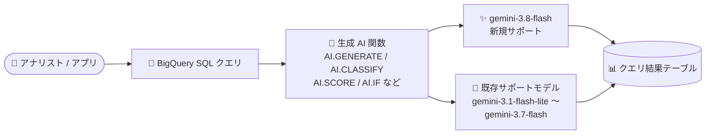

# BigQuery: 生成 AI 関数が gemini-3.8-flash Gemini モデルをサポート

**リリース日**: 2026-09-21

**サービス**: BigQuery

**機能**: 生成 AI 関数における gemini-3.8-flash モデルのサポート

**ステータス**: リリース済み (Feature)

📊 [このアップデートのインフォグラフィックを見る](https://takech9203.github.io/google-cloud-news-summary/20260921-bigquery-generative-ai-gemini-3-8-flash.html)

## 概要

BigQuery の生成 AI 関数で、新たに `gemini-3.8-flash` モデルが利用可能になりました。

BigQuery の生成 AI 関数は、SQL クエリの中からリモートモデル経由で Gemini などの事前学習済みモデルを直接呼び出し、テキスト生成、分類、スコアリング、要約、構造化データ抽出などを実行できる機能です。Gemini 3.8 Flash は、公式ドキュメントで「最もインテリジェントなワークホースモデル」と位置付けられる Flash 系の最新世代 (2026 年 9 月 2 日 GA) で、ソフトウェアエンジニアリング、エージェントタスク、専門ドメインでの多段推論において Gemini 3.7 Flash から大幅な性能向上を実現し、より高コストなフロンティアモデルに迫る性能を発揮するとされています。

2026 年 9 月 9 日のアップデート ([関連レポート](2026-09-09-bigquery-generative-ai-new-gemini-models.md)) で `gemini-3.5-flash-lite` / `gemini-3.6-flash` / `gemini-3.7-flash` が追加されたのに続き、今回 Flash 系の最新モデルが SQL から直接利用できるようになりました。データウェアハウス上のデータに対して高精度な LLM 推論をバッチ実行したいデータアナリスト、データエンジニアにとって重要なアップデートです。

**アップデート前の課題**

- BigQuery の生成 AI 関数で利用できる Gemini モデルは `gemini-3.7-flash` までであり、最新世代の Gemini 3.8 Flash を SQL から直接利用できなかった
- Gemini 3.8 Flash を使いたい場合は、BigQuery の外部で Vertex AI API を直接呼び出すパイプラインを別途構築する必要があった

**アップデート後の改善**

- `gemini-3.8-flash` を BigQuery 生成 AI 関数のエンドポイントとして指定できるようになった
- 複雑な多段推論や専門ドメインのタスクを、より高精度なモデルで SQL ベースのバッチ推論として実行できるようになった
- 既存の Flash / Flash-Lite 系モデルと合わせて、品質・レイテンシ・コスト要件に応じたモデル選択の幅がさらに広がった

## アーキテクチャ図



BigQuery の SQL クエリから生成 AI 関数を呼び出すと、リモートモデル経由で Gemini モデルに推論リクエストが送信され、結果がクエリ結果として返ります。今回のアップデートで、この推論先として最新の `gemini-3.8-flash` を指定できるようになりました。

## サービスアップデートの詳細

### 主要機能

1. **gemini-3.8-flash のサポート追加**
   - BigQuery の生成 AI 関数のエンドポイントとして `gemini-3.8-flash` を指定できるようになった
   - Gemini 3.8 Flash は 2026 年 9 月 2 日に GA となった Flash 系の最新モデルで、Gemini 3.7 Flash と比べてソフトウェアエンジニアリング、エージェントタスク、多段推論で大幅な性能向上を実現

2. **BigQuery の生成 AI 関数群で利用可能**
   - **汎用 AI 関数**: `AI.GENERATE`、`AI.GENERATE_TEXT`、`AI.GENERATE_TABLE` / `AI.GENERATE_BOOL` / `AI.GENERATE_DOUBLE` / `AI.GENERATE_INT` (構造化出力)
   - **マネージド AI 関数**: `AI.IF` (自然言語条件でのフィルタ)、`AI.SCORE` (スコアリング)、`AI.CLASSIFY` (分類)、`AI.AGG` (集約・要約)
   - **ユーティリティ関数**: `AI.COUNT_TOKENS` (クエリ実行前の入力トークン数見積もり)

3. **マルチモーダル入力に対応**
   - Gemini 3.8 Flash はテキストに加えて画像、音声、動画の入力に対応 (出力はテキスト)
   - BigQuery の生成 AI 関数はテキスト、画像、音声、動画、PDF データの分析に利用できる

## 技術仕様

### Gemini 3.8 Flash モデル仕様

| 項目 | 詳細 |
|------|------|
| モデル ID | `gemini-3.8-flash` |
| ローンチステージ | GA (リリース日: 2026 年 9 月 2 日) |
| 入力モダリティ | テキスト、画像、音声、動画 |
| 出力モダリティ | テキスト |
| コンテキストウィンドウ | 1,048,576 トークン |
| 最大出力トークン | 65,536 トークン |
| Thinking レベル | `LOW` / `MEDIUM` (デフォルト) / `HIGH` (`MINIMAL` は非サポート) |
| 利用可能ロケーション | Global (`global`)、マルチリージョン (`us` / `eu`) |
| 消費オプション | Standard / Flex / Priority PayGo、Provisioned Throughput、バッチ推論 |
| セキュリティコントロール | データレジデンシー、CMEK、VPC-SC、AXT |

### Gemini 3.7 Flash とのベンチマーク比較

公式ドキュメントに記載されている開発者向け評価ベンチマークの比較は以下のとおりです。

| ベンチマーク | Gemini 3.8 Flash | Gemini 3.7 Flash |
|------|------|------|
| Terminal-bench 2.1 | 90.8% | 81.6% |
| SWE-Bench Pro | 61.6% | 60.4% |
| SWE-Atlas | 51.9% | 48.0% |
| τ³-bench Banking | 38.1% | 30.9% |
| CharXiv (マルチモーダル) | 86.2% | 84.5% |
| Humanity's Last Exam (HLE) | 45.4% | 45.7% |

### エンドポイントの指定と選択ルール

BigQuery がサポートする Gemini モデルは、Vertex AI 側でマルチリージョンエンドポイントのみをサポートします (リージョナルエンドポイントは非サポート)。リージョンを省略した短いエンドポイント名を指定した場合、BigQuery は以下のルールでエンドポイントを選択します。

| クエリの実行ロケーション | 使用されるエンドポイント |
|------|------|
| `us` マルチリージョン、または US 内の単一リージョン | `us` エンドポイント |
| `eu` マルチリージョン、または EU 内の単一リージョン (`europe-west2`、`europe-west6` を除く) | `eu` エンドポイント |
| その他のロケーション (`europe-west2`、`europe-west6` を含む) | `global` エンドポイント |

特定のエンドポイントを明示的に指定する場合は、以下の形式の完全修飾名を使用します。

```
https://aiplatform.us.rep.googleapis.com/v1/projects/PROJECT_ID/locations/us/publishers/google/models/MODEL_ID
https://aiplatform.eu.rep.googleapis.com/v1/projects/PROJECT_ID/locations/eu/publishers/google/models/MODEL_ID
https://aiplatform.googleapis.com/v1/projects/PROJECT_ID/locations/global/publishers/google/models/MODEL_ID
```

なお、`asia-south1` リージョンでクエリを実行する場合は、完全修飾の global エンドポイント名の使用が必須です。

## メリット

### ビジネス面

- **高精度な分析の内製化**: フロンティアモデルに迫る性能を持つ最新 Flash モデルを、SQL だけでデータウェアハウス上のデータに適用でき、別途 ML パイプラインを構築するコストを削減できる
- **段階的なモデル移行**: 既存のリモートモデル定義のエンドポイントを変更するだけで新モデルを試せるため、品質・コストを比較しながら段階的に移行できる

### 技術面

- **推論品質の向上**: エージェントタスクや専門ドメインの多段推論で Gemini 3.7 Flash から大幅な性能向上が公式ベンチマークで示されている
- **Thinking レベルによる制御**: `LOW` / `MEDIUM` / `HIGH` の thinking レベルでトークン消費と推論品質のバランスを調整できる
- **大規模コンテキスト**: 100 万トークンのコンテキストウィンドウと 65,536 トークンの最大出力により、長文ドキュメントや大きなレコードの処理に対応

## デメリット・制約事項

### 制限事項

- Gemini 3.8 Flash では thinking レベル `MINIMAL` がサポートされない (明示的に指定すると API バリデーションエラーになる)
- Vertex AI のマルチリージョンエンドポイント (`us` / `eu` / `global`) のみをサポートし、リージョナルエンドポイントは利用できない
- 生成 AI 関数は、参照するリモートモデルと同じリージョンまたはマルチリージョンで実行する必要がある
- VPC Service Controls の境界内では、委任アクセス (delegated access) を使う `ObjectRef` 値を AI 関数で処理できない。代わりに `OBJ.MAKE_REF(uri)` による直接アクセスを使用する

### 考慮すべき点

- Gemini 3.8 Flash は性能を最大化するために、特に高い thinking レベルではより多くのトークンを消費することがある。コンピュート効率が最優先の場合は、低い thinking レベルを使うか、Gemini 3.7 Flash の利用が公式に推奨されている
- 大規模なバッチ推論では Vertex AI 側のクォータ超過により一部の行にエラーが返ることがあるため、`AI.COUNT_TOKENS` による事前見積もりとクォータ管理を推奨
- モデル切り替え時は、既存ワークロードでの出力品質とトークンコストの再評価を推奨

## ユースケース

### ユースケース 1: 複雑な非構造化データの構造化抽出

**シナリオ**: 契約書やサポートチケットなど、多段の読解・推論が必要な非構造化テキストから構造化データを抽出する。

**実装例**:
```sql
SELECT
  ticket_id,
  AI.GENERATE(
    ('このサポートチケットから根本原因と推奨アクションを抽出してください: ', ticket_body),
    connection_id => 'us.my_connection',
    endpoint => 'gemini-3.8-flash'
  ).result AS analysis
FROM my_dataset.support_tickets;
```

**効果**: 従来モデルでは精度が不足していた多段推論を要する抽出タスクを、SQL のみで高精度に実行できる。

### ユースケース 2: 既存の生成 AI 関数ワークロードのモデルアップグレード

**シナリオ**: `gemini-3.7-flash` を使った既存の分類・要約バッチを、より高精度な最新モデルへ移行する。

**効果**: リモートモデルのエンドポイント指定を `gemini-3.8-flash` に変更するだけで移行でき、少量データでの検証クエリと `AI.COUNT_TOKENS` による見積もりで品質・コストを比較しながら安全にアップグレードできる。

## 料金

BigQuery の生成 AI 関数は、クエリ実行に使用する BigQuery のコンピュートリソースに対する課金に加えて、リモートモデル経由で Vertex AI のモデルを呼び出すため Vertex AI 側の課金 (トークン数ベース) も発生します。

- クエリ実行前に `AI.COUNT_TOKENS` 関数で入力トークン数を見積もり可能
- Gemini 3.8 Flash は高い thinking レベルでトークン消費が増える傾向があるため、コスト見積もり時に考慮が必要
- Gemini 3.8 Flash は Provisioned Throughput にも対応しており、安定した高スループットが必要な場合に利用可能

詳細は [BigQuery ML の料金ページ](https://cloud.google.com/bigquery/pricing#bqml) および [Vertex AI 生成 AI の料金ページ](https://cloud.google.com/gemini-enterprise-agent-platform/generative-ai/pricing) を参照してください。

## 利用可能リージョン

Gemini 3.8 Flash は Global (`global`) およびマルチリージョン (`us` / `eu`) エンドポイントで利用できます。BigQuery 側のサポートロケーションはモデルのタイプとバージョンによって異なります。詳細は公式ドキュメントの [Locations セクション](https://docs.cloud.google.com/bigquery/docs/generative-ai-overview#locations) を参照してください。

## 関連サービス・機能

- **Vertex AI (Gemini Enterprise Agent Platform)**: 生成 AI 関数はリモートモデル経由で Vertex AI 上の Gemini モデルを呼び出す。Gemini 3.8 Flash は Provisioned Throughput、バッチ推論、CMEK / VPC-SC などのセキュリティコントロールに対応
- **BigQuery ML リモートモデル**: `CREATE MODEL` で作成するリモートモデルが、SQL と Gemini エンドポイントを橋渡しする
- **Cloud Billing**: ジョブラベル (`bigquery_job_id_prefix`) による生成 AI 関数のコスト追跡に使用

## 参考リンク

- 📊 [インフォグラフィック](https://takech9203.github.io/google-cloud-news-summary/20260921-bigquery-generative-ai-gemini-3-8-flash.html)
- [公式リリースノート](https://docs.cloud.google.com/release-notes#September_21_2026)
- [ドキュメント: BigQuery 生成 AI 概要](https://docs.cloud.google.com/bigquery/docs/generative-ai-overview)
- [ドキュメント: Gemini 3.8 Flash モデルページ](https://docs.cloud.google.com/gemini-enterprise-agent-platform/models/gemini/3-8-flash)
- [ドキュメント: Gemini 3.8 Flash デベロッパーガイド](https://docs.cloud.google.com/gemini-enterprise-agent-platform/models/guides/gemini-3-8-flash)
- [料金ページ: BigQuery ML](https://cloud.google.com/bigquery/pricing#bqml)
- [料金ページ: Vertex AI 生成 AI](https://cloud.google.com/gemini-enterprise-agent-platform/generative-ai/pricing)
- [関連レポート: 2026-09-09 BigQuery 生成 AI 関数の新規 Gemini モデルサポート](2026-09-09-bigquery-generative-ai-new-gemini-models.md)

## まとめ

BigQuery の生成 AI 関数から Flash 系最新世代の Gemini 3.8 Flash を直接利用できるようになり、SQL ベースの LLM 推論で最新モデルの推論性能を活用できるようになりました。既存ワークロードで生成 AI 関数を利用している場合は、`AI.COUNT_TOKENS` や少量データでの検証クエリで新モデルの出力品質とトークンコスト (thinking レベルの影響を含む) を評価し、要件に合ったモデルへの移行を検討することを推奨します。

---

**タグ**: BigQuery, Gemini, gemini-3.8-flash, 生成AI, BigQuery ML, AI.GENERATE, Vertex AI
