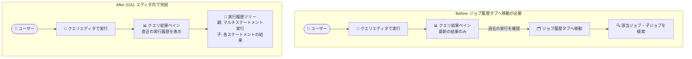

# BigQuery: クエリ結果ペインでのクエリ実行履歴表示が GA

**リリース日**: 2026-09-21

**サービス**: BigQuery

**機能**: BigQuery Studio クエリエディタの「クエリ結果」ペインにおける直近実行履歴の表示

**ステータス**: GA (一般提供)

📊 [このアップデートのインフォグラフィックを見る](https://takech9203.github.io/google-cloud-news-summary/20260921-bigquery-query-results-run-history-ga.html)

## 概要

BigQuery Studio のクエリエディタにある「クエリ結果 (Query results)」ペインで、そのクエリの直近の実行履歴 (short history of recent runs) を表示できる機能が一般提供 (GA) になりました。マルチステートメントクエリ (複数の SQL 文をセミコロンで区切って実行するクエリ) にも対応しており、「ジョブ履歴 (Job history)」タブに移動することなく、エディタ上で過去の実行結果を確認できます。

マルチステートメントクエリを実行した場合、クエリ結果ペインには各ステートメントの結果が階層的な実行履歴ツリーとして表示されます。マルチステートメントクエリの実行全体が親ノードとして表示され、その配下に各ステートメント (子ジョブ) がサブノードとして並びます。サブノードをクリックすると、エディタから離れることなく、その部分のクエリが返したデータを個別に確認できます。

このアップデートは、BigQuery Studio で日常的にクエリの試行錯誤を行うデータアナリスト、データエンジニア、SQL 開発者にとって、コンテキストスイッチを減らし反復的な開発を高速化する改善です。

**アップデート前の課題**

- クエリの過去の実行結果を確認するには、エディタを離れて「ジョブ履歴」タブに移動し、対象のジョブを探す必要があった
- マルチステートメントクエリでは、各ステートメント (子ジョブ) の結果を個別に確認する際に、ジョブ履歴から該当する子ジョブを辿る手間があった
- クエリを修正しながら実行を繰り返す際、直前の実行結果との比較にエディタと履歴画面の往復が必要だった

**アップデート後の改善**

- クエリ結果ペイン内で、そのクエリの直近の実行履歴を直接参照できるようになった
- マルチステートメントクエリの実行が親ノード、各ステートメントがサブノードとして階層ツリー表示され、クリックだけで各部分の結果データを確認できるようになった
- エディタから移動せずに過去の実行結果へアクセスできるため、クエリの反復的な開発・デバッグのワークフローが効率化された

## アーキテクチャ図



アップデート前はエディタとジョブ履歴タブの往復が必要でしたが、GA 後はクエリ結果ペイン内の実行履歴ツリーから直近の実行結果と各ステートメントの結果に直接アクセスできます。

## サービスアップデートの詳細

### 主要機能

1. **クエリ結果ペインでの直近実行履歴の表示**
   - クエリエディタの「クエリ結果」ペインで、そのクエリの直近の実行 (recent runs) の履歴を確認できる
   - 「ジョブ履歴」タブへのナビゲーションが不要になり、エディタ内で作業が完結する

2. **マルチステートメントクエリの階層的な実行履歴ツリー**
   - マルチステートメントクエリの実行全体が親ノードとして表示される
   - クエリ内の個々のステートメント (子ジョブ) がサブノードとして表示される
   - サブノードをクリックすると、そのステートメントが返したデータを個別に表示できる

3. **一般提供 (GA)**
   - 本機能は GA となり、本番環境での利用に適したサポートレベルで提供される

## 技術仕様

| 項目 | 詳細 |
|------|------|
| 対象 UI | BigQuery Studio (Google Cloud コンソール) のクエリエディタ |
| 表示場所 | クエリ結果 (Query results) ペイン |
| 対応クエリ | 通常のクエリおよびマルチステートメントクエリ |
| 表示形式 | 階層的な実行履歴ツリー (親: マルチステートメント実行、子: 各ステートメントのジョブ) |
| 履歴の範囲 | 対象クエリの直近の実行 (short history of recent runs) |
| ステータス | GA (一般提供) |

## 設定方法

### 前提条件

1. Google Cloud プロジェクトで BigQuery API が有効であること
2. クエリを実行できる IAM 権限 (例: `roles/bigquery.jobUser` など) を持っていること

### 手順

#### ステップ 1: BigQuery Studio でクエリを実行する

Google Cloud コンソールで BigQuery ページを開き、クエリエディタに SQL を入力して実行します。マルチステートメントクエリの例:

```sql
DECLARE day INT64;
SET day = (SELECT EXTRACT(DAYOFWEEK FROM CURRENT_DATE));
IF day = 1 OR day = 7 THEN
  SELECT 'Weekend';
ELSE
  SELECT 'Weekday';
END IF;
```

#### ステップ 2: クエリ結果ペインで実行履歴を確認する

クエリ結果ペインに表示される実行履歴ツリーで、親ノード (マルチステートメントクエリの実行) を展開し、サブノード (各ステートメント) をクリックすると、それぞれのステートメントが返したデータをエディタから離れずに確認できます。追加の設定は不要で、コンソール上で自動的に利用できます。

## メリット

### ビジネス面

- **開発生産性の向上**: クエリの試行錯誤やデバッグ時の画面遷移が減り、データ分析・開発サイクルが短縮される
- **追加コストなしの改善**: コンソール UI の機能強化であり、利用にあたって追加の設定やコストは発生しない

### 技術面

- **コンテキストスイッチの削減**: エディタとジョブ履歴タブの往復が不要になり、クエリの文脈を保ったまま結果を比較できる
- **マルチステートメントクエリの可視性向上**: 親ジョブと子ジョブの関係がツリーで可視化され、各ステートメントの結果に直接アクセスできる

## デメリット・制約事項

### 制限事項

- 表示されるのは対象クエリの「直近の実行」の短い履歴であり、全期間のジョブ履歴の代替ではない
- プロジェクト全体のジョブの監査や、他のユーザーのジョブの確認には、引き続き「ジョブ履歴」タブ (個人履歴 / プロジェクト履歴) や `INFORMATION_SCHEMA.JOBS` が必要

### 考慮すべき点

- 本機能は BigQuery Studio (Google Cloud コンソール) の UI 機能であり、bq コマンドラインツールやクライアントライブラリからの実行には適用されない
- ジョブメタデータの長期的な分析・監視が必要な場合は、`INFORMATION_SCHEMA.JOBS` ビューや Cloud Logging の活用を検討する

## ユースケース

### ユースケース 1: マルチステートメントクエリのデバッグ

**シナリオ**: データエンジニアが、一時テーブルの作成、変換、集計を含むマルチステートメントクエリを開発している。途中のステートメントの出力を確認しながらロジックを修正したい。

**実装例**:
```sql
-- 2017 年の上位 100 の名前を一時テーブルに格納
CREATE TEMP TABLE top_names(name STRING) AS
SELECT name
FROM `bigquery-public-data`.usa_names.usa_1910_current
WHERE year = 2017
ORDER BY number DESC
LIMIT 100;

-- シェイクスピアの作品に登場する名前を抽出
SELECT name AS shakespeare_name
FROM top_names
WHERE name IN (
  SELECT word FROM `bigquery-public-data`.samples.shakespeare
);
```

**効果**: クエリ結果ペインの実行履歴ツリーで各ステートメント (子ジョブ) のサブノードをクリックするだけで、中間結果と最終結果をエディタ内で確認でき、デバッグの往復作業が不要になる。

### ユースケース 2: クエリチューニング時の実行結果の比較

**シナリオ**: データアナリストが WHERE 句や集計条件を変えながら同じクエリを繰り返し実行し、結果の変化を確認している。

**効果**: 直近の実行履歴がクエリ結果ペインに残るため、ジョブ履歴タブに移動することなく修正前後の実行結果を素早く見比べられ、分析の反復サイクルが短縮される。

## 料金

本機能は BigQuery Studio (Google Cloud コンソール) の UI 機能であり、この機能自体に対する追加料金はありません。クエリの実行自体には通常の BigQuery の料金 (オンデマンドのスキャン量課金、またはエディションのスロット課金) が適用されます。

詳細は [BigQuery の料金ページ](https://cloud.google.com/bigquery/pricing) を参照してください。

## 利用可能リージョン

Google Cloud コンソール (BigQuery Studio) の UI 機能として提供されます。リージョン固有の制約はリリースノートに記載されていません。

## 関連サービス・機能

- **BigQuery ジョブ履歴 (Job history)**: Explorer ペインからアクセスできる個人履歴 / プロジェクト履歴。全期間・プロジェクト横断のジョブ確認には引き続きこちらを使用する
- **マルチステートメントクエリ / プロシージャル言語**: 変数宣言や制御フロー (IF、WHILE など) を含む複数 SQL 文の実行。本機能により各ステートメントの結果確認が容易になる
- **一時テーブル (TEMP TABLE)**: マルチステートメントクエリ内で中間結果を保持する仕組み。実行履歴ツリーと組み合わせて中間結果の確認に活用できる
- **INFORMATION_SCHEMA.JOBS**: ジョブメタデータを SQL で分析するためのビュー。監査や長期的なジョブ分析に適する

## 参考リンク

- 📊 [インフォグラフィック](https://takech9203.github.io/google-cloud-news-summary/20260921-bigquery-query-results-run-history-ga.html)
- [公式リリースノート](https://docs.cloud.google.com/release-notes#September_21_2026)
- [ドキュメント: マルチステートメントクエリの結果を表示する](https://docs.cloud.google.com/bigquery/docs/multi-statement-queries#view_multi_statement_query_results)
- [料金ページ](https://cloud.google.com/bigquery/pricing)

## まとめ

BigQuery Studio のクエリ結果ペインで直近のクエリ実行履歴を確認できる機能が GA となり、マルチステートメントクエリの各ステートメントの結果もエディタ内の階層ツリーから直接参照できるようになりました。追加設定なしで利用できる UI 改善のため、BigQuery Studio でクエリ開発を行うチームは、ジョブ履歴タブへの往復を減らすワークフローとしてすぐに活用することをおすすめします。

---

**タグ**: BigQuery, BigQuery Studio, クエリエディタ, マルチステートメントクエリ, 実行履歴, GA, 開発者体験
