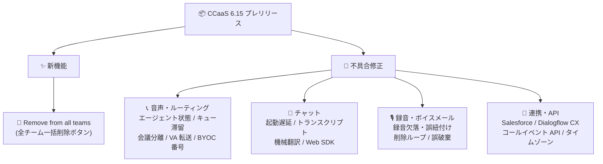

# Google Cloud CCaaS: バージョン 6.15 プレリリースノート (全チーム一括削除機能と多数の不具合修正)

**リリース日**: 2026-09-21

**サービス**: Google Cloud Contact Center as a Service (CCaaS) / Contact Center AI Platform

**機能**: バージョン 6.15 プレリリースノート — ユーザーの全チーム一括削除機能、および音声・チャット・連携に関する広範な不具合修正

**ステータス**: Announcement (プレリリースノート)

📊 [このアップデートのインフォグラフィックを見る](https://takech9203.github.io/google-cloud-news-summary/20260921-ccaas-6-15-prerelease-notes.html)

## 概要

Google Cloud CCaaS (Contact Center AI Platform) の次期バージョンとして予定されている 6.15 のプレリリースノートが公開されました。プレリリースノートは、次回リリースで提供が見込まれる新機能と修正内容を事前に知らせるもので、実際にリリースされるバージョン番号は 6.15 より大きくなる可能性があります。

新機能としては、管理者向けの「Remove from all teams」ボタンが追加されます。ユーザー編集ダイアログの Teams セクションからワンクリックで、そのユーザーを所属するすべてのチームから一括削除できるようになります。大規模なコンタクトセンターで組織変更や退職処理を行う管理者の運用負荷を軽減する機能です。

また、このリリースでは音声ルーティング、チャット、録音・ボイスメール、CRM・仮想エージェント連携など広範な領域にわたる 20 件超の不具合修正が含まれており、コンタクトセンターの安定運用に直結する内容となっています。

**アップデート前の課題**

- ユーザーを複数のチームから削除するには、チームごとに個別に削除操作を行う必要があった
- エージェントが呼び出しを受けているにもかかわらず誤って Unresponsive 状態に降格され、ルーティングプールから除外される問題があった
- キュー内の通話がルーティングもコールバック提供もされない、仮想エージェントから人間のエージェントキューへ転送できないなど、通話フローに影響する不具合が存在した
- チャットセッションの起動遅延、構造化メッセージを含むセッションのトランスクリプト未生成、Salesforce へのカスタムチャットデータ未記録など、チャット・連携面の問題があった

**アップデート後の改善**

- 「Remove from all teams」ボタンにより、ユーザーの全チームからの削除が一括で行えるようになる
- エージェントのステータス管理と通話ルーティングに関する複数の不具合が解消され、着信・コールバック・転送の信頼性が向上する
- チャットの起動性能、トランスクリプト生成、機械翻訳の適用、CRM へのデータ記録が正常化する
- 録音の欠落・誤紐付け、録音削除タスクの無限ループ、ボイスメールの誤破棄などデータ保全に関わる問題が修正される

## アーキテクチャ図

バージョン 6.15 は新機能 1 件 (全チーム一括削除) と、音声ルーティング・チャット・録音・外部連携の 4 領域にまたがる広範な不具合修正で構成されています。

## サービスアップデートの詳細

### 主要機能

1. **Remove from all teams (全チームからの一括削除)**
   - ユーザー編集 (Edit User) ダイアログの Teams セクションに、新しい「Remove from all teams」ボタンが追加される
   - ユーザーが所属するすべてのチームから一度の操作で削除できる
   - 従来はチームごとに削除操作が必要で、多数のチームに所属するユーザーの整理に手間がかかっていた

### 不具合修正 (カテゴリ別サマリー)

2. **音声ルーティング・通話処理の修正**
   - エージェントが呼び出しを受けているにもかかわらず誤って Unresponsive 状態に降格され、ルーティングプールから除外される問題を修正
   - キュー内の通話がルーティングもコールバック提供もされない問題を修正
   - 仮想エージェントが人間のエージェントキューへ通話を転送できない問題を修正
   - Nexmo 経由の DCR 通話が応答されなかった場合に、再キューイングされずに切断される問題を修正
   - エージェントとエンドユーザーが別々の会議 (カンファレンス) に参加してしまい、音声が通じない問題を修正
   - キャリアの保留失敗後にコールアダプターが通話を保留中と誤表示する問題を修正
   - キャリアからの切断理由がない通話が「顧客による放棄 (customer abandoned)」と誤分類される問題を修正
   - Twilio BYOC の SIP インバウンド通話でダイヤル番号に余分な桁が付加される問題を修正

3. **チャット・Web SDK の修正**
   - モバイルおよび Web チャットセッションの起動遅延・起動エラーの増加を修正
   - 構造化メッセージコンテンツを含むセッションでチャットトランスクリプトが生成されない問題を修正
   - 仮想エージェントから非英語キューへ転送されたチャットで機械翻訳が有効化されない問題を修正
   - ホスト URL 末尾のスラッシュにより、Web SDK が無効化済みの機能を再度有効化してしまう問題を修正

4. **録音・ボイスメール・メディアの修正**
   - 仮想エージェントによるデフレクション後、エージェントの通話録音が欠落する、または誤った通話レコードに紐付く問題を修正
   - 通話録音の削除タスクが無限ループに陥る問題を修正
   - 再生エラー時にボイスメールが自動的に破棄される問題を修正
   - メディアダウンロードの失敗が予期しないサービス再起動を引き起こす問題を修正

5. **連携・API・設定の修正**
   - カスタムチャットデータが Salesforce に記録されない問題を修正
   - IVR 音声通話でカスタムラップアップイベントが Dialogflow CX に送信されない問題を修正
   - DCR 通話のコールイベント API ペイロードに誤った仮想エージェントパラメータが含まれる問題を修正
   - キュー固有のラップアップ・ディスポジション設定がグローバルデフォルトにリセットされる問題を修正
   - Generative Knowledge Assist の回答内で長い URL が途中で切れる問題を修正
   - メキシコのタイムゾーンに夏時間 (DST) が誤って適用される問題を修正

## 技術仕様

### プレリリースノートの位置付け

| 項目 | 詳細 |
|------|------|
| 発表種別 | Announcement (プレリリースノート) |
| 対象バージョン | 6.15 (実際のリリース番号は 6.15 より大きくなる可能性あり) |
| 適用タイミング | インスタンスへの適用時期は選択しているデプロイメントスケジュールに依存 |
| 新機能 | Remove from all teams ボタン (Edit User ダイアログの Teams セクション) |
| 修正件数 | 20 件超 (音声・チャット・録音・連携の各領域) |

## メリット

### ビジネス面

- **運用管理の効率化**: 全チーム一括削除により、組織変更や退職に伴うユーザー管理の作業時間を短縮できる
- **顧客体験の改善**: キュー滞留・音声不通・チャット起動遅延といった顧客に直接影響する不具合が解消され、応対品質が向上する
- **レポーティング精度の向上**: 通話の誤分類 (customer abandoned) やラップアップ設定のリセット問題が修正され、KPI 分析の信頼性が高まる

### 技術面

- **ルーティングの信頼性向上**: エージェントの誤った Unresponsive 降格や会議分離の修正により、着信配分が安定する
- **データ保全性の向上**: 録音の欠落・誤紐付け、削除タスクの無限ループ、ボイスメール誤破棄の修正により、コンプライアンス上重要な通話データが確実に保持される
- **連携品質の向上**: Salesforce、Dialogflow CX、コールイベント API との連携における欠損・誤データが解消される

## デメリット・制約事項

### 考慮すべき点

- プレリリースノートであり、実際のリリース時に内容やバージョン番号 (6.15 より大きくなる可能性) が変わる場合がある
- インスタンスへの適用時期はデプロイメントスケジュールに依存するため、修正の反映タイミングは環境ごとに異なる
- Twilio BYOC、Nexmo、Salesforce など特定の構成に依存する修正が多いため、自環境で該当する構成を利用しているか確認が必要

## ユースケース

### ユースケース 1: 組織変更に伴うユーザーの一括整理

**シナリオ**: 数十のチームで構成される大規模コンタクトセンターで、異動するエージェントを現在の所属チームすべてから外し、新しいチームに再アサインする。

**効果**: 従来はチームごとに削除操作が必要だったが、「Remove from all teams」ボタンで一括削除できるため、管理者の作業ミスと工数を削減できる。

### ユースケース 2: Salesforce 連携環境での修正適用確認

**シナリオ**: Salesforce と統合した CCaaS 環境で、チャットのカスタムデータが CRM に記録されない事象が発生していた。

**効果**: 6.15 適用後にカスタムチャットデータが正しく Salesforce に記録されるようになり、顧客コンテキストを活用した応対とレポーティングが正常化する。

## 料金

このアップデートによる料金体系の変更はありません。CCaaS の課金はインスタンス単位の月額課金 (同時エージェント数、ネームドエージェント数、または利用分数のいずれかのモデル) で、テレフォニー費用は従量課金です。詳細は公式ドキュメントを参照してください。

- [CCAI Platform の開始方法 (課金モデル)](https://docs.cloud.google.com/contact-center/ccai-platform/docs/get-started)

## 利用可能リージョン

CCaaS が利用可能な国と Google Cloud リージョンについては、[ロケーションのページ](https://docs.cloud.google.com/contact-center/ccai-platform/docs/localities)を参照してください。

## 関連サービス・機能

- **Dialogflow CX / CX Agent Studio**: 仮想エージェントの構築基盤。本リリースでは IVR 通話からのカスタムラップアップイベント送信や仮想エージェント転送に関する修正が含まれる
- **Salesforce / CRM 連携**: CCaaS はエージェントアダプターを CRM に組み込んで利用する。カスタムチャットデータの記録に関する修正が含まれる
- **Twilio BYOC / Nexmo**: キャリア持ち込み (BYOC) 構成のテレフォニー連携。SIP インバウンドの番号フォーマットや DCR 通話の再キューイングに関する修正が含まれる
- **Generative Knowledge Assist**: エージェント支援 AI 機能。回答内の長い URL が切れる問題の修正が含まれる

## 参考リンク

- 📊 [インフォグラフィック](https://takech9203.github.io/google-cloud-news-summary/20260921-ccaas-6-15-prerelease-notes.html)
- [公式リリースノート](https://docs.cloud.google.com/release-notes#September_21_2026)
- [CCAI Platform リリースノート](https://docs.cloud.google.com/contact-center/ccai-platform/docs/release-notes)
- [CCAI Platform ドキュメント](https://docs.cloud.google.com/contact-center/ccai-platform/docs)
- [チームの追加と構成](https://docs.cloud.google.com/contact-center/ccai-platform/docs/add-configure-teams)
- [デプロイメントスケジュール](https://cloud.google.com/contact-center/ccai-platform/docs/deployment-schedules)

## まとめ

CCaaS 6.15 プレリリースノートは、ユーザー管理を効率化する「全チーム一括削除」機能に加え、音声ルーティング・チャット・録音・外部連携にまたがる 20 件超の不具合修正を予告するものです。特にエージェントの誤降格やキュー滞留、録音欠落などは運用に直結する修正のため、CCaaS 利用者は自環境のデプロイメントスケジュールを確認し、該当する不具合の解消時期を把握しておくことを推奨します。

---

**タグ**: #GoogleCloud #CCaaS #CCAIPlatform #ContactCenter #リリースノート #不具合修正
